## 前言

之前意识到自己对五险一金了解的还比较浅薄，不知道它的重要性，也不知道它的缴纳比例，也不知道该怎么用，所以趁着现在还是在空窗期，把这一块内容搞清楚、搞明白，而不至于错过很多原本属于自己的权益。

在找资料的时候发现 [五险一金有什么用？最全正经科普文](https://zhuanlan.zhihu.com/p/109276901) 写地特别清楚，就一字不拉地复制到这篇笔记中吧。

## 正文

> 每月工资发下来，总是瘦了一大圈，  
仔细一看工资条，五险一金咋扣这么多？

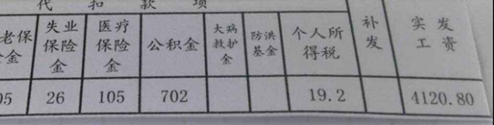

这可能是大家对于五险一金最大的印象——我已经挣那么少了，还给我扣掉这么多！？

**五险一金到底有什么用？**

**有没有交的必要？**

公子打算借用这篇文章给大家正式科普一下。

不多说，上酸菜！

**文章结构如下：**

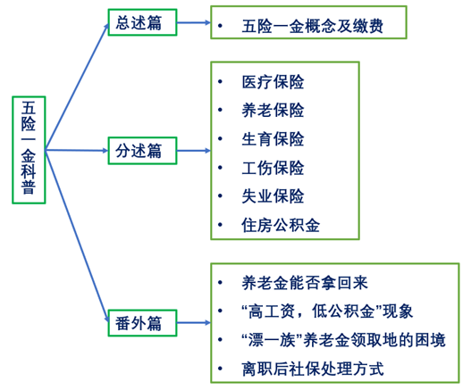

### 一、总述篇

#### 五险一金是什么

我们常说的五险一金，就是指**“养老保险、医疗保险、生育保险、工伤保险、失业保险和住房公积金”，**

有的人会说社保，但社保是社保保险，不包括一金。

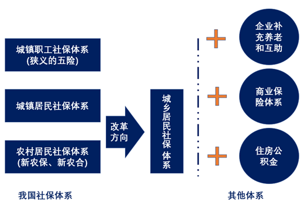

**此文仅讨论五险一金。**

#### 五险一金覆盖人群

我们这里讨论的五险一金是有工作的人交的，因此上班族、自由职业者都可以参与。

自由职业者可以自己选择缴费基数，但公司纳的一部分也要承担。

没有工作的人，比如家庭主妇，儿童及学生只能参加养老保险和医疗保险。

其中，没有进城务工的农民参加的是**新农保**（新型农村养老保险）、**城乡医保**（城乡居民医疗保险）。

其他城镇居民则参加**城居保**（城镇居民养老保险）、**城乡医保，**大学生参加就读当地的城乡医保。

#### 五险一金交多少钱

五险一金分为公司缴费和个人缴费，公司缴费进入统筹账户，个人缴费进入个人账户（社保卡/医保卡）。

五险一金交多少取决于两个因素：**缴费基数和缴费比率**

$$
社保缴费数额 = 基数 * 比率
$$

**缴费基数**是你**上个年度月均工资**，但不能超过当地平均工资的**三倍**，也不会低于当地平均工资的**60%**。

**缴费比率**全国各统筹地规定不同，但一般如下：

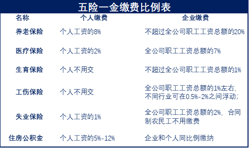

五险一金费用交下来，**个人缴费**占到你工资的**11%**左右，**公司缴费**占到你工资的**25%**左右。

##### 例子

**首先确定工资基数：**

工资基数是按照国家统计局规定的统计口径来的，只包括计时工资、计件工资、奖金、津贴和补贴、加班加点工资和特殊情况下支付的工资六部分，**假设月工资是8000。**

**其次确定缴费比率：**

这里按照上海标准计算：

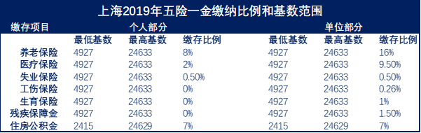

则个人缴纳为

公司缴纳为

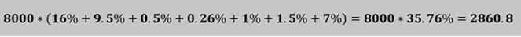

所以，8000的工资交完五险一金再扣掉税，到手6552元。

如果你不清楚你所在城市的具体缴费比率，

也可以直接在百度上搜索**“XX市 20XX年五险一金计算器**”，输入你的工资就可以算了。

从计算结果来看，个人工资的确瘦了一大圈，

所以很多人觉得五险一金就是个亏货，不想交。

但其实公司也跟着承担双倍的费用，尤其是公积金，

公司交的部分直接进入你的账户，可以用来买房、租房、还房贷。

并且实际上五险一金的好处远比我们想象的要多！

#### 五险一金好处的概述

**总的来说：五险一金让我们能在大城市安家落户：**

大城市意味着机会、资源、福利、越来越多的人涌到大城市工作并安家，

大量人群的蜂拥而入导致物价房价飞涨，各大城市的地方政府也对外来人口的安家落户做出各种各样的限制。

以上海为例：

想要在上海安个家，如果你是普通人员来沪工作，你得拿到居住证7年并且7年内都要参加上海社保缴纳。

要安家总得需要一套房子，但是上海要你在买房前先连续缴纳五年社会保险。

非沪籍购房条件：

- 购房人必须已婚；
- 购房家庭在上海没有商品住房；
- 连续五年及以上在本市缴纳社会保险。

并且，买房贷款的时候，你在上海交了公积金，就可以走公积金贷款买房，利率就会下降一大截。

社保缴纳年限已经成为了很多大城市积分落户政策的大杀伤力标准之一，

全国有钱的人很多，但你的社保比别人缴纳得好，你就超越了绝大部分人。

**分开来说：五险一金能在我们养老和生病，生孩子买房子这些事情上带给我们保障。**

下面一个个讲。

### 二、分述篇

#### 医疗保险

之所以先说医疗保险，是因为它是五险一金中最有用的一个，人人可投保，大病小病都可以报销一部分钱。

**第一：医疗保险能报销多少钱？**

具体来说，医保报销限定在“**两定点，三目录**”内——**定点医院**、**定点药费**和国家规定的医保可以报销的**药品目录、诊疗项目目录、服务设施目录。**

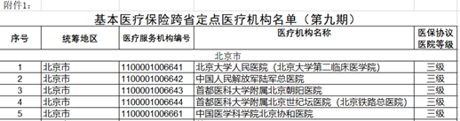

在“两定点、三目录”内，还设置了**起付线和封顶线**，在两线之间，不同等级的医院，不同的人群，报销比率不一样：

医保报销分为门急诊报销和住院报销，

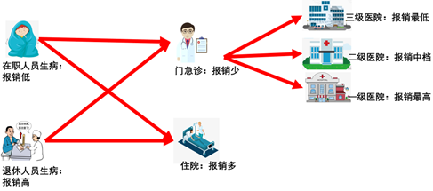

门急诊报销少，住院报销多；医院等级越低报销越多，反之报销越少；在职人员报销少，退休人员报销多。

至于具体的报销比率，各统筹地有自己的规定。

拿上海举例：

上海在职人员走医保门急诊，刷完医保卡当年计入账户部分后，自掏1500元便可开始报销，几万块的门诊费用医保能报销50%-65%。

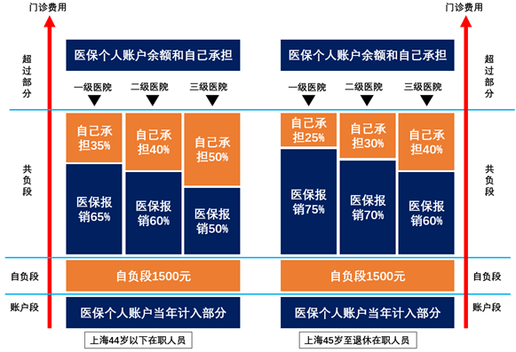

如果是住院报销，先用医保卡刷掉1500元以后，在53万元以下的住院费用都可以报销85%，超过53万元的附加基金再报销80%。

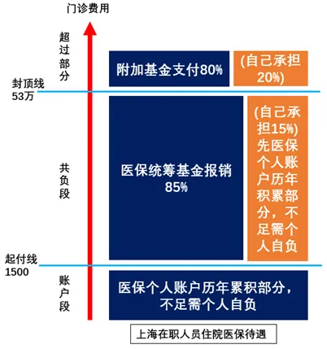

**我举个门急诊报销的例子：**

**5万块的支付顺序是：**

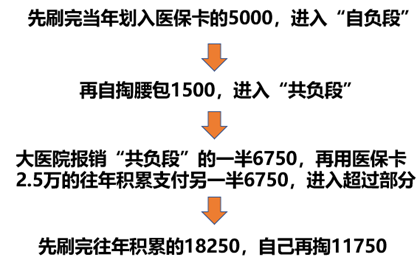

**于是这次生病，**

**5万元的支付结构为：**

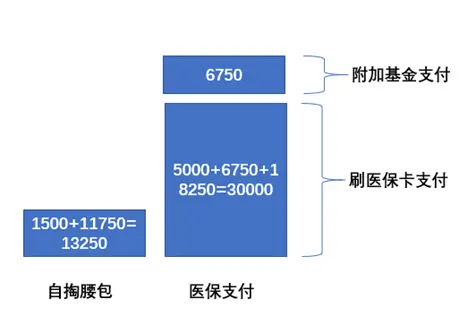

生病花了5万，自己只掏了13250元，算下来医保报销了73.5%！

为患者减轻了很大的负担。

但现实中一些人的医保卡额度积攒得并不多，再加上报销上限只有两万块，

一旦遭遇大点的疾病或手术，一下子花个十几二十万，

还有很多能极大提高治愈率的技术不在报销范围内，比如癌症的质子重离子技术。

医保的作用就只能算是铺底了，真正能扛住大病风险的还是百万医疗险和重疾险。

**第二：医疗保险待遇享受标准？**

一般来说，医保今天交，**次月**就可以用**统筹账户**报销，**半年**或**一年后**可以用**个人账户**刷卡报销。

在退休前**男性交满25-30年**，**女性退休前交满20-25年**，退休后可以免费享受。

如果退休时缴费年限不够，可以一次性补缴剩余费用，然后才可以免费享受。

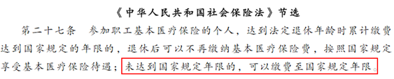

此外，也有不能享受的标准，主要为以下四方面：

**应该由工伤保险基金支付的，比如尘肺病；**

**境外就医的；**

**应该由第三人（单位和个人）负担的，比如车祸；**

**应该由公共卫生负担的，比如新冠肺炎。**

**第三：异地就医医保如何报销？**

医保不是全国通，是各省各地统筹，各统筹地的政策不一样，如果跨统筹地就医，就涉及到异地就医医保如何报销的问题。

在进行异地医保报销前，可以到先到**[国家社会保险公共服务平台](https://link.zhihu.com/?target=http%3A//si.12333.gov.cn/120692.jhtml)**查询**支持异地医保直接结算**的医保定点医院，再去就诊。

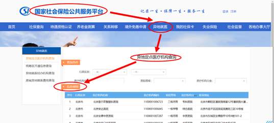

异地就医，分三种情况：

- **长期异地就诊**——如在上海参保，但却在北京长期居住，居住期间生病就医；
- **临时异地转院**——如在上海参保，但上海治不了转到北京去医治；
- **临时异地就诊**——如在上海参保，但去北京旅游，出差，见亲人等生病就医。

**三种情况处理方式不同**，具体参见下图：

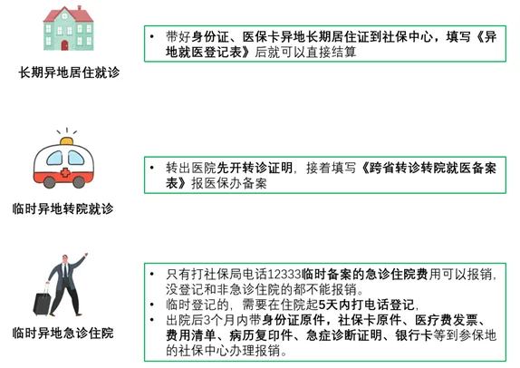

**异地医保报销需要特别注意的三点：**

1. 医保卡异地**报销只限住院，门急诊部分城市才有。**；
2. 医保卡异地报销能**报销的范围取决于就诊地医保政策**，但能**报销多少钱取决于你的参保地政策**；
3. 如果你办理了异地就医备案，回到原参保地之后，医保报销资格可能被取消，也可能还能用，也有可能取消备案之后才能用，这需要你咨询参保地医保局。

所以，有什么问题一定不要忘记拨打**12333**的电话问清楚，因为各地的规定都不相同。

关于更详细的医保报销操作细节，也可以参考我这篇按照就医看病过程写的医保报销指南：https://zhuanlan.zhihu.com/p/109081716

#### 养老保险

养老保险简单理解就像我们每个月往银行存一笔钱一样，退休之后每个月往外取钱用。不同的地方是这钱存到了养老保险基金那里，由国家指派的专家组进行运作保值增值。

**第一：养老保险能领到多少钱?**

养老金能拿到多少跟个人**累计缴费年限、缴费工资、当地职工平均工资、个人账户金额、城镇人口平均预期寿命**等因素有关，但一定是**“长缴多得，多缴多得”。**

**公司交的钱进入基础账户，个人交的钱进入个人账户**，退休后，两个账户都可以拿钱。

个人账户简单，就是每个月你存起来的钱，按照8%左右的年利增长（当年缴入按单利，历年累计按复利）。最后假设你60岁退休就将累积的这笔钱分成139个月发给你。

基础账户能拿到的钱由一个复杂的公式确定，计算比较复杂，，但可以肯定的是，你退休前的工资越高，当地工资越高，交的年限越久，你能从统筹账户拿到的退休工资就越多。

举个例子：王华，23岁，上海工作，2020年工资8600，从今年交社保交37年后60岁在上海退休，未来他的工资假设如下：

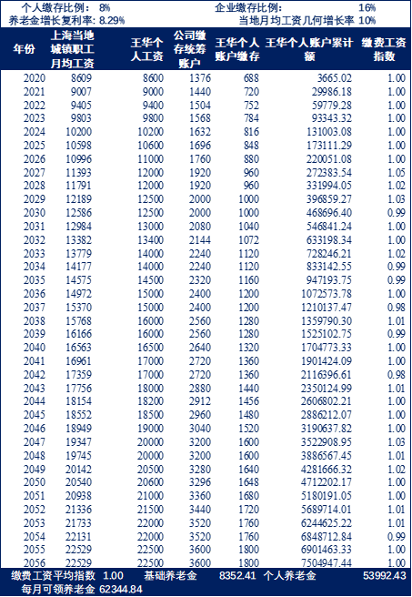

**个人账户：**

个人账户按照8.25%的年利增长，37年后累积的金额为7504947元，并被分成139份发给王华，每月可领53992元。

**基础账户：**

则他从基础账户每月能够拿到的钱计算如下：

其中：

22529是王华退休那年上海上一年度的社会平均工资；1是王华缴费工资平均指数的平均值，此值是用王华个人工资除以社会平均工资的比值再用缴纳年数求平均得到；37%则是取社保缴纳年数为百分数来平衡领取到的养老金，平衡之后每月可领8352元。

这样算下来，王华37年后退休每月可领62344元的退休金。

虽然我们国家有一个养老金目标替代率，最后实际拿到的养老金会在当时社会平均工资的6成左右（13517元），但这已经足够满足我们退休后的养老生活了。

**第二：养老金领取资格**

领取养老金要满足三个条件：

- **至少缴满15年；**
- **第二必须到退休年龄；**
- **办理完退休证明。**

退休时还没有交满15年的**必须补满15年才能领，**

但按照上面的公式，如果我们只交15年养老金就不交的话，**最后只能拿到社会平均工资的15%**，这是非常少的。

如果是工伤导致退休，这笔钱由企业补满，自然退休则是自己补满。

退休年龄为国家规定的退休年龄，如下表：

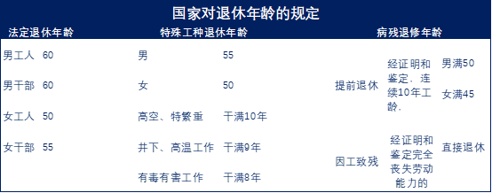

其他关于养老金断缴，领取地以及是否能拿回来的问题，参见后面**番外篇详述部分**。

#### 生育保险

生育保险也是五险一金中非常重要的一个，待遇丰厚，与其他四险一金绑定在一起缴纳。

而且是企业为我们缴纳，职工不用缴纳。

**第一：生育险的待遇有哪些？**

生育保险的待遇有三项：**产假、生育津贴、生育医疗费用报销。**

参保的女职工不仅能修超长产假，在休假期间还有生育津贴（产假工资），生孩子的医疗费也可以报销一部分。

**产假**：分为**基本产假、产前检查、产前工间休息、授乳时间。**

基本产假如下表：

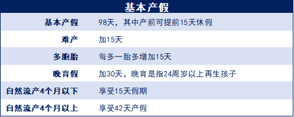

其他与产假相关的假期各地规定不一，具体参考当地女职工劳动保护办法。

以上海为例：

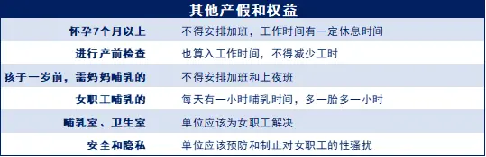

另外，女职工还可以因为生育而请的假如下：

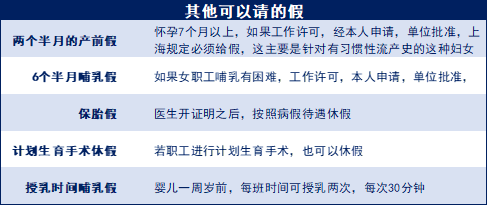

**生育津贴：**

生育津贴又叫产假工资，由生育保险基金支付，可以自己去社保网点领取，也可以拨给公司，由公司代付。

发放生育津贴的时间主要是**产假期间**和计划**生育手术休假期间**，计算如下：

举个例子：

花花生孩子时休息了98天，后来去上环又休息了15天，她单位上年度月均工资是6500，则她可以领到（6500/30）*（98+15）=24483元。

**特别注意：**如果公司的缴费基数高于职工的缴费基数，**不足的部分由公司补足。**

**生育医疗费用报销：**

生育医疗费用报销的项目有：因怀孕、生育而发生的**检查费、接生费、手术费、住院费、药费、计划生育医疗费用**。

至于报销限额，**各地规定不一样**，以上海市为例：

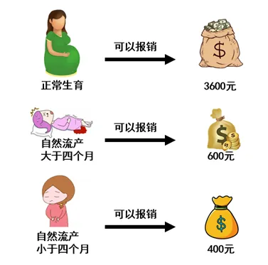

上海市采取固定额度报销的方法（有的地方是按比率报销）。

只要符合生育金缴纳标准，正常生育报销3600，

自然流产的，大于4个月的报销600，小于4个月的报销400，超出的地方自费。

**第二：生育险待遇领取的标准**

各地规定不一，以上海市为例：

要么是某公司为职工**连续缴纳至少9个月，**或者不同公司已经为职工**累计缴纳至少12个月。**

**生育期间千万别断交，不然报不了。**

  

如果是**未婚先孕**，则**不能享受**生育险待遇，因为不符合计划生育政策，

只能先跟另一位把证领了才能报销。

关于生育险的细节内容，可以看我这篇：https://zhuanlan.zhihu.com/p/108005378

#### 工伤保险

工伤保险是用来在职工因为工作相关的事情受伤或者罹患职业病之后给职工提供医疗和补偿的，用以保障职工往后的生活，待遇非常丰厚，由企业为职工缴纳，职工不用掏一分钱。

**第一：工伤保险有哪些待遇？**

工伤保险赔付丰厚，既报销，又给钱。

具体包括：

**医疗费、住院伙食补助费、交通费、食宿费、康复治疗费、辅助器具费**，这些都**报销**；**停工留薪、护理费、伤残待遇、工亡待遇**，这些都**给钱**。

其中最重要的是**医疗费、停工留薪、伤残待遇和工亡待遇。**

- **医疗费：**遭遇工伤或者职业病时治疗所必须的医疗费**全部报销**；
- **停工留薪：**遭遇工伤或者职业病时不能工作期间的工资和福利由工伤基金按照正常上班的标准给付；
- **伤残待遇：**遭遇工伤或者职业病造成不同程度的残疾，工伤基金按照不同伤残等级(1-10级)给付伤残待遇；
- **工亡待遇：**遭遇工伤或者职业病之后死亡了，工伤基金会赔给你的家人**一笔钱**，还有**丧葬补贴**等。

具体规定见下表：

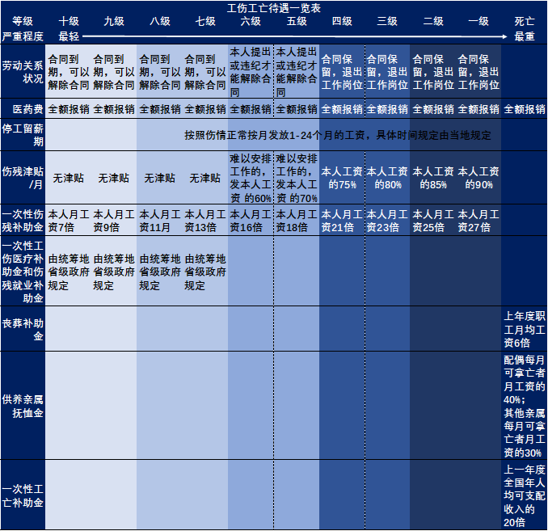

**第二：如何进行工伤认定？**

当我们不幸在工作中出现事故，导致伤残时，我们就成了弱势群体，这个时候必须得保持**头脑清醒**，**主动维权。**

##### 工伤认定流程

大致描述一下情形，当我们因为工作出事故后，会经历的过程如下：

**紧急送医→企业为员工申请认定工伤→进行工伤认定→伤残者进行伤残等级鉴定（劳动能力鉴定）→死亡者发死亡补助**

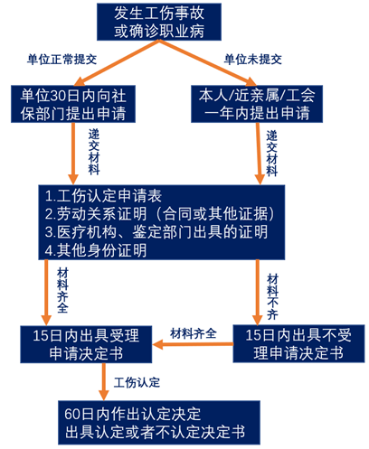

我们需要注意到的是：**工伤认定属于行政行为，不申请，不认定**。

如果企业不给我们认定，我们**一定要自己或者叫近亲属或者找工会帮忙认定**。

并且，**超过一年，不予认定。**

##### 可以认定工伤的情形

两种情况，一个是**得病**，一个就是**受伤**。

**得病，指的是得了法定的职业病­**——即劳动者在职业活动中因**接触粉尘**、**放射性物质**、和**其他有毒有害物质**因素而引起的疾病，包括十大类，具体如下表：

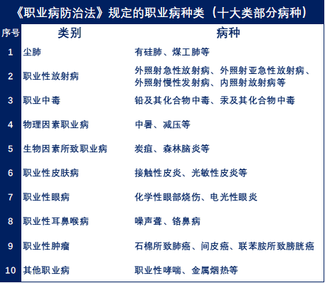

可以看到，职业病主要时跟有毒有害的物质有关，而**“996”加班**，**积劳成疾的码农等，每日空调、WiFi、零食相伴，就算累成狗累出心脏病也不算职业病。**

**受伤，就是受到身体伤害或者是暴力伤害**，具体可以认定为工伤的情形如下：

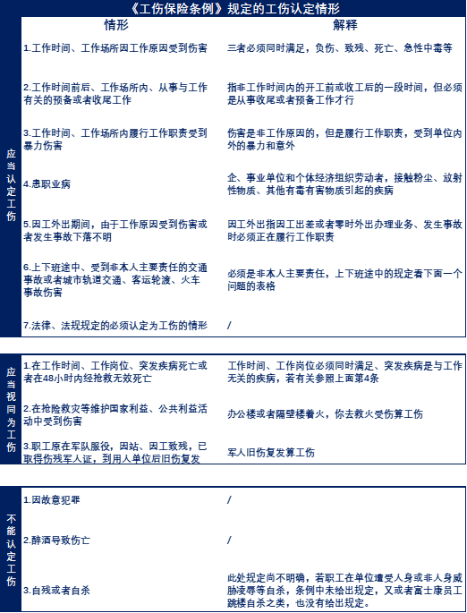

特别需要注意的是：

**上班期间救火等负伤也算工伤，还有当兵回来旧伤复发的也算工伤。**

**还有，上班期间收到暴力伤害，也算工伤，比如执行本职工作时被人打击报复受伤，可以认定为工伤。**

**第三：如何进行工伤等级鉴定（劳动能力鉴定）？**

工伤认定和工伤等级鉴定是有区别的，

小伤小病进行工伤认定之后，如果医治一段时间还没有好，并且影响工作和生活自理，就需要申请工伤等级鉴定。

但工伤等级鉴定需要满足一定的**医疗期规定**，具体如下表：

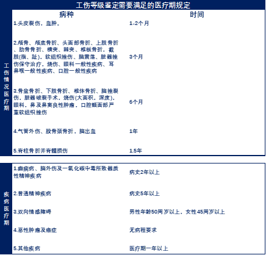

##### 工伤等级鉴定流程

工伤等级鉴定的大致流程如下图所示：

1. （单位、本人、近亲属）提出申请；
2. 审核受理；
3. 专家鉴定（随机抽取 3~ 5 个专家）；
4. 结论送达。

##### 工伤等级鉴定需要准备的材料

工伤等级鉴定需要准备的材料如下表：

1. 《劳动能力鉴定申请表》;
2. 工伤认定决定书原件及复印件；
3. 本人身份证原件及复印件；
4. 提供连续的病历材料。

特别需要注意的是，**进行工伤等级鉴定前，需要先进行工伤认定**，只有工伤认定书出来后才能进行工伤等级鉴定。

**第四：工伤鉴定中“上下班途中”是如何规定的？**

《工伤保险条例》中规定，**上下班途中遇到自己非主责的交通意外可以认定工伤。**

**但什么才叫上下班途中？**几点到几点？还是从哪儿到哪儿？

最高院在《最高人民法院关于审理工伤保险 行政案件若干问题的规定》中，对“上下班途中”进行了明确的定义：

**第五：工伤保险待遇的领取标准**

企业给你交，只要交上，当月就可以报销，

但也不能断，断了的话可以走仲裁，仲裁不过走司法程序。

记住这句话就行了。

#### 失业保险

失业保险，顾名思义，就是在我们失业的时候给我们补贴和培训，帮助我们尽快上岗的保险。

其中，失业是指被辞退，一定企业方解除合同，并不是我们主动辞职。

**第一：失业保险都有哪些待遇？**

参保失业保险的人，失业了可以拿到的补助有**失业保险金**、**医疗补助金**、**死亡后的丧葬补助金**和**抚恤金**，

还有一定的**职业培训和工作介绍**。

一般而言，失业保险金**只能拿到当地最低工资的一部分，缴纳时间越长，可领时间也越长。**

但**只能领取12-24个月**。具体能领多少个月，由当地**省级政府规定**。

以上海市为例：

**缴纳期限**

**领取标准**

在上海，**非本地户口也不能领取**，

如果失业了，**只能把失业保险账户转到户籍地去按照户籍地的标准领**。

**第二：失业保险待遇的领取标准**

至少缴满**一年**才能领取。

如果连续两次失业，第二次领取失业金时，之前的缴费年限清零计算，所以两次失业必须间隔一年以上才能领取。

但你之前如果没领满12个月，可以累加到下一次，两次累加不能超过24个月。

小时候，我妈常对我说“**晴带雨伞，饱带饥粮**”，做人一定要有危机感，不能躺在功劳簿上睡大觉，止步不前。

活得太过安逸，为人所耻，在国家给的失业保险金上面就能看得出来。

#### 住房公积金

住房公积金就是国家强制你和企业每个月拿出一点钱，存到一个账户里，然后把所有人的账户里的钱汇集到一起形成一个基金，以后你买房子就可以从这个基金里面贷款，拿到的利率全国最低，没有之一。

公子从我们贷款买房者的角度去讲讲最需要关注的这几个点：

**第一：住房公积金的利率有多低？**

公积金存贷利率都由国家统一规定，各地一样，普遍比商业贷款利率低。

目前是5年以上按3.25%年利算，5年（含5年）以下按2.75%年利算，贷一年的话不分期，一年以后连本带利一起还。

同期商贷1年是4.35%，2-5年是4.75%，5年以上4.9%。

这个利率是非常低了，

工商银行5年期定期存款利率也才正好是2.75%。

和公积金贷款5年以下的一样，5年以上的和它相比，利差只有0.5%，

公子曾听过某些专给小微企业贷款的融资租赁平台，实际贷款利率高达20%多，连我们常见的支付宝借呗年利都是18.25%。

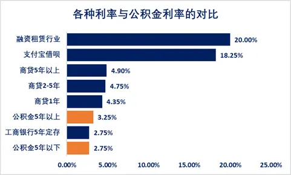

**第二：住房公积金能贷多久？**

最长不能超过30年，以夫妻双方年龄大的为准，男性贷款年龄加上房贷时间不能超过65岁，女性不能超过60岁。

与楼龄也有关系,砖混结构的楼龄加上贷款年限不能超过47,钢混结构的楼龄加上贷款年限不能超过57。

**第三：住房公积金能贷多少？**

额度计算比较复杂，有四种计算额度的方法，取**四种方法里面最低的结果**作为我们**可以拿到的贷款额度**。

举个例子：

王华，工资8000，

单位和个人按照7%的比例缴纳住房公积金，交了10年，目前无负债。

现在看中一套90平的房子，付完3成首付还要再贷款100万才能买下来，他打算贷款30年。

**问：王华用公积金贷款能贷多少钱？**

##### 按还款能力计算公积金贷款额度

计算公式为：

还款能力系数是扣掉当地最低消费水平后收入剩余部分占总收入的比重。

按公式计算王华的可贷额度为：

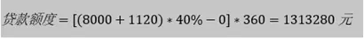

如果夫妻一起贷，并且妻子跟王华财务状况一样，那么贷款额度可以翻倍——**男女结婚后共同努力可以住更大的房子！**

##### 按房屋价格可贷比计算公积金贷款额度

计算公式为：

$$
贷款额度 = 房屋价格 * 可贷比例
$$

上海的政策来说，90平以下的首套房，首付20%，可贷比率为80%，

90平以上的首付30%，可贷比例为70%。

前面王华已经付了三成首付，想要贷款的100万已经是70%了。

所以额度就只有100万。

##### 按当地可贷限额计算公积金贷款额度

各地对住房公积金购房贷款额度有限制，上海的政策如下：

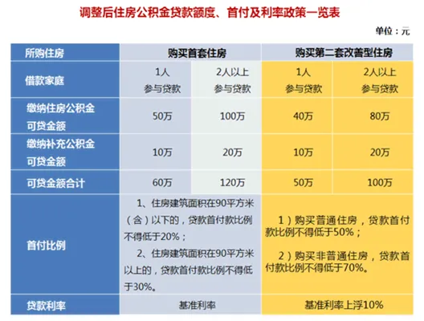

那么，如果王华**一个人买**，**最高只能**用公积金贷款**50万**，**夫妻一起买，最高可以用公积金贷款100万。**

##### 按公积金存储额倍数计算公积金贷款额度

此方法是指公积金贷款额度最高不能超过个人公积金账户存储额的n倍，这里的n，各地规定不一，上海目前是15倍。

每年进入王华公积金账户的钱，当年的按照0.35%年利按月复利计息，

往年留存下来的本息和按照1.35%的年利按一年期定存计息。

最后计算出来王华10年后公积金账户余额为14.3万，余额的15倍为214.7万。

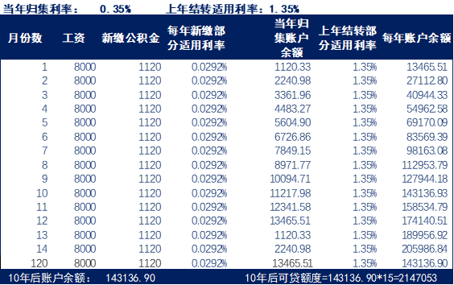

四种方法比较下来，**最高贷款限额算法 < 还款能力算法 < 可贷比例算法 < 账户存储额倍数算法**

那么，如果此次买房，王华一个人用公积金贷款的话，只能贷款50万，夫妻可贷100万。

**第四：住房公积金该不该取出来？**

大家都知道，公积金可以取出来，

但如果取出太多，可能账户余额的15倍会低于上海贷款最高限额。

所以，如果王华要取出来公积金，也得保证余额的15倍至少高于当地最高限额50万。

剩下的，能取就取出来吧。

**第五：住房公积金和商贷比例控制在多少比较合适？**

当公积金贷款不能满足我们时，我们一般都选择商贷和公积金组合贷。但是比例控制在多少比较合适呢？

一张图说明白：

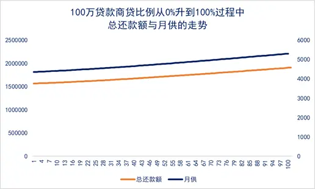

可以看出，商贷用得越多，总还款额越多，月供也越多，所以能全用公积金贷款的额度就用公积金贷款的额度，不够再用商贷。

**第六：住房公积金贷多少年比较合适？**

公积金最长贷30年，也可以不贷那么多年。

具体贷多少年，由个人的资金状况和还款计划决定，从纯金融的角度来说，存在一个合理的答案如下：

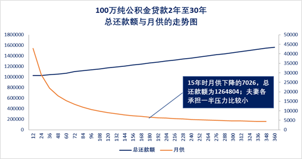

### 三、番外篇

#### 养老金能否拿回来

我们国家养老金实行的是“现收现付”制，现在的年轻人交钱给现在的老年人用，但老龄化越来越严重，年轻人养老负担越来越大。

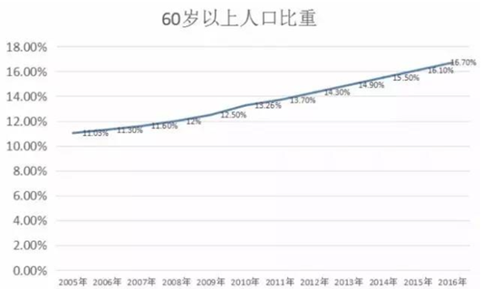

个人账户养老金的利率也从原来的2/3%一下子提高到现在的8%左右，前面王华的养老金也计算到了6万多，远比他退休前的工资要高很多。

于是有的人就担心，老年人那么多，我交这么多年，**轮到我的时候还能领得了养老金吗？**

**公子可以告诉你，肯定能领到，只是没有我们计算的那么多。**因为国家采用了几大措施用来保障大家退休之后能够拿到因该得的养老金：

**第一个措施：控制养老金替代率**

养老金替代率就是我们领到的养老金占退休时当地平均工资的比例，越高越能保障我们的晚年生活。

根据劳动和社会保障部《关于完善企业职工基本养老保险制度宣传提纲》的总体思路，未来基本养老金目标替代率为59.2%。

所以，我们不会领到6万多的养老金，也不会领到过低的养老金，而是在当地工资的6成左右。

**第二个措施：养老金记账利率盯住工资增长率**

很多人都抱怨养老金个人账户收益率太低。

确实，原来的养老金的利率普遍在2/3%左右，但是工资水平却每年以10%左右的水平增长，如此增长下去，几十年以后养老金相比于工资就会少得可怜。

于是国家将养老金记账利率调高到8%，远远超过很多市场上的理财产品收益。

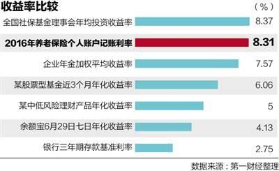

用来盯住工资增长率，换句话说，也就是养老金增长跟随通胀走，这样才能保证以后我们拿到的养老金能够扛住通胀，不会贬值幅度过大。

**第三个措施：多方筹款，保证有钱给大家养老**

工资水平年年在涨，养老金水平也每个月都在增加。

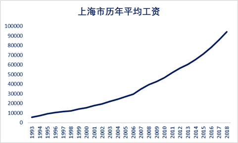

再加上公务员养老和职工养老并轨，全部参保人员的养老金计息一下子提高了很多，这样养老金基金的负债压力越来越大，已经产生了巨大的缺口。

于是国家**采取多方筹款**的方式用来解决现在老人的养老金支付问题：

**第一是成立全国社保基金用来在老龄化高峰之时弥补和调剂养老金统筹基金的缺口。**全国社保基金的资金来源于**中央财政预算拨款，国有资产划转，个人账户基金并入、地方政府委托基金**。2018年末，社保基金资产总额22,353.78亿元，并且社保基金自成立以来的年均投资收益率7.82％，累计投资收益额9,552.16亿元。

**第二就是全国企业缴纳的基本养老金统筹基金，企业缴纳本人工资的16%用来支付养老金。**2018年末，基本养老保险基金资产总额7,032.82亿元。自2016年12月受托运营以来，累计投资收益额186.83亿元，实现的收益率在4%左右。

所以，国家通过各种方式筹集资金，为我们的养老大事做足准备，虽然压力很大，年年都有窟窿，但只要国家在的一天，我们就有养老的一天。

只是，养老金的水平要照顾到目标替代率和工资上涨速度，可能未来会增长趋缓，最坏的情况也就是下降到目标替代率。

**因此，养老金肯定能拿回来，只是不像我们计算的那样多。**

#### 高工资低公积金现象

很多人都会发现，为什么自己每个月到手一两万，但是住房公积金怎么只有几百块？相比别人，为什么他的工资才五六千，公积金每个月都有一两千？

实际上，不仅是公积金，整个社保都一样，我们缴费多少，取决于两个因素：**缴费基数和缴费比率，**

本质上来说，缴费比率国家已经定死了，可以自由选择的那一两个百分点在基数相同的情况下差别不大，真正导致缴费差别大的是缴费基数——**有的公司会偷偷给你把缴费基数降低！**

公子见过的手段主要有两种：

**一是公司用好几张银行卡给你发工资**

**二是公司给你的工资底薪很低，绩效很高。**

如何操作呢？

比如王华的工资是10000，但是公司要求他用四张银行卡来发工资，于是王华提交了他自己、姐姐、妹妹、老婆的银行卡。然后公司将10000块分成四份转到四张卡里，只有王华的2500走的是工资账户，其他三张则是网转。这样王华的账上工资一下子变成了2500，那自然同样的缴费比率，10000和2500相比，差了好几级。

或者是公司将王华的10000工资分成5000的工资和5000的绩效，每次就只按照5000的工资来缴纳社保，5000绩效则通过网络转账的方式。

但实际上，我们前面说了，社保缴纳基数也包括绩效工资，奖金，等等，所以，公司这样做是违法的，如果你想告，一告一个准。

虽然，到手的工资高了，但是几十年下来，这么一大个福利你就拿得少了，公司少给你缴纳的社保也是多发给你工资的几倍，最终吃亏的是你自己。

#### 漂一族养老金领取地的困境

对于北上广深的“漂一族”来说，去往大城市就业，机会多，资源多，福利好。

但总有一个问题避免不开，那就是在哪里退休的问题——养老保险对与退休金的领取地有特别的规定：

国家规定：养老金的领取，遵循**“户籍地优先，从长从后”**的原则。

用王华举例子：

王华**户籍在湖南**老家，在**湖南交**的养老保险，最后也在**湖南退休**，退休后养老保险肯定在湖南老家**按照湖南**老家的标准领取。

王华**户籍在湖南**，但**在上海缴了**至少**10年**的社保，最后在**上海退休**，退休后养老金**按照上海标准**发放。

王华**户籍在湖南**，**在上海缴满了十年**的养老保险，然后他**转到北京**工作，**缴纳五年**社保后退休（退休地不满十年），那王华的养老保险**关系**将会被**转回上海**，然后**按照上海的标准**领取养老保险金。

王华**户籍在湖南**，在**上海**干了**5年**，在**北京**干了**7年**，在**深圳**干了**6年**，然后**退休**（退休前每个地方**都没有缴满十年**），那王华的养老保险账户将被**转到湖南老家**，**按照湖南的标准**领取养老金。

王华**户籍在湖南**，全国各地转来转去，最后**退休了**，但是养老保险**还没缴满15年**，可以按照规定确定一个补缴地，**在补缴地缴满并领取**养老金。

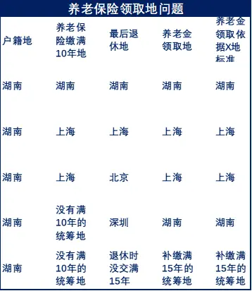

从上面的政策规定，我们最好的选择是在上海缴纳满10年，或者在上海退休又或者有上海户籍，才能拿到上海的养老金。

但假设王华从23岁毕业来上海，

缴满10年的话，到33岁了，这个时候应该是结婚的年龄了，（有数据显示，大城市结婚年龄普遍在31岁左右）。

假设王华10年内工资平均下来每月1.3万。

那么，在上海郊区买一套普普通通的商住楼，需要不吃不喝**89个月（7.5年），**

如果节省得好，每个月剩下来4000攒首付，需要**290个月（24年），况且这24年中房价得涨到多高？**

**年龄已经快要被剩下了，但首付还没攒到一半。**

面对买不起的房子和娶不起的新娘，我相信很多人都会撑不到10年就离开了。

那我们就再也没希望拿到上海的养老金了。

如果你不是实力非凡，其实大部分人在北上广呆个几年就各回各家了。

这点从上海常住总人口的增长就可以看出来。

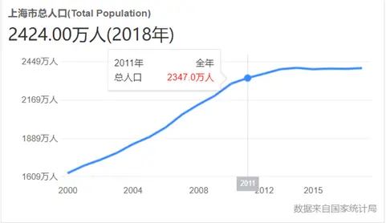

这几年，上海总人口不仅没有增长，还大有负增长的趋势。

可悲的是“**融不进的城市，买不起的房，拿不了的户口，娶不起的新娘**”是当代绝大部分“漂一族”的真实状况；

但更可悲的是，年轻人在大城市工作的那么些年，缴纳的五险一金有80%的人群公司都没有给他们足额缴纳；

但更更可悲的是，就算企业为你正常缴纳社保，你也不一定能用上。

**企业给你交得再多，也不过是养那些有当地户口，在当地买房的人罢了。**

#### 离职后社保处理方式

**第一：社保断缴后的影响？**

不管什么原因，我相信大家离职一定有大家的道理，离职后社保就会断缴，但社保一旦断缴，损失惨重。

**1.买房落户、买车拍牌等会受影响**。

以上海为例：

想拿到上海户籍，在社保缴纳方面每正常缴纳满一年积累3分，中间断缴后再补缴的部分不能计入积分。

想要在上海买房，社保方面需要**连续**缴纳满5年，中间断缴，或再补缴都不行。

想要拿到沪牌竞拍资格，需要本市户籍或者有居住证的前提下还要已经**连续**缴满3年社会保险，断缴或者补缴都不行。

**2.医保待遇会受到影响。**

以上海为例：

断缴之后，有3个月缓冲期，缓冲期内不享受医保。如果断缴超过3个月，缴费年限直接清零重算，

而上海医保必须至少要缴满15年，退休之后才能享受免费的医保待遇。所以一旦断缴超过3个月，之前的年限就浪费了。

**3.生孩子报销也会受到影响。**

根据规定，生育保险只有单位**连续**为你缴纳9个月或者累计缴纳12个月才可以享受生育保险。

就算累计缴纳12个月了，一旦不缴纳，次月一日起就不能享受生育保险了。

**4.对养老金的影响。**

国家规定至少缴满15年，退休之后才能领取养老金。

如果中间有断缴的，断缴时间不能计入缴费年限，只有员工足额补齐所欠保费和利息之后，才开始继续计算缴费年限。并且，存在中断养老金缴费情况的人，退休后领取养老金数额要比没有断缴的人一个月少几十块。

**第二：社保断缴后怎么处理？**

社保断缴有好几种原因：

**第一个，公司故意不给你缴。**

这个简单，留好证据，举报就行。如果我们**不知道具体的怎么搜集证据、怎么在进行维权等事宜**，我们可以**打电话询问的机构**是：**人力资源和社会保障局咨询服务中心——**承担劳动保障监察、医疗保险、人事人才等电话举报的受理工作。

我们可以进行举报投诉的机构是：**劳动保障监察总队——**受理举报投诉和平日里监督各用人单位是否遵守劳动保障法律法规的。

**第二个：离职后断缴。**

第一个方法就是尽快找到下家，在15号上家公司交完社保后再离职，在下一个15号前找到下家入职就行。

第二个方法也可以跟上家或者开公司的朋友谈一谈，把自己的社保挂在别人的公司上缴纳，但成功率由个人决定。

第三个方法就是花点钱（平均50-60一个月）找一家靠谱的社保代缴机构帮你缴纳。

如果已经断了，要赶快打电话（12333）问社保机构该怎么补缴，失业险影响不大，但养老和医保影响巨大，一定要赶快行动。

**第三：换工作城市社保怎么转移？**

如果在同一个统筹区内换工作，比如王华在上海换到上海，唯一需要做的就是把社保账号和公积金账号记住，交给下一加的人事部门就可以了，你可以登录当地社保局和住房公积金管理中心查到你的账号。

如果从上海换到北京，那就跨了统筹区，

这个时候，个人账户里的全部储蓄额都将转走，而统筹账户则按照你缴纳工资总额的12%进行转移。

但跨区转移有年龄限制：

如果王华从上海转回湖南老家，多大年龄都可以转，

如果王华从上海转到北京，50岁以下（女性40岁以下）可以转；50岁以上则只能办理临时账户缴纳社保，社保关系还保留在上海。

文章到此也就结束了，感谢您的阅读，费尽心力撰此长文，惟愿每个人都不会在这个伴随我们一辈子的国家福利上走弯路，犯糊涂。如果大家有不懂的，可以私信或者留言区问我。

## 参考

[(41 封私信 / 80 条消息) 什么是五险一金？「社保」怎么使用最划算？ - 知乎 (zhihu.com)](https://www.zhihu.com/question/24908926)

[五险一金有什么用？最全正经科普文 - 知乎 (zhihu.com)](https://zhuanlan.zhihu.com/p/109276901)