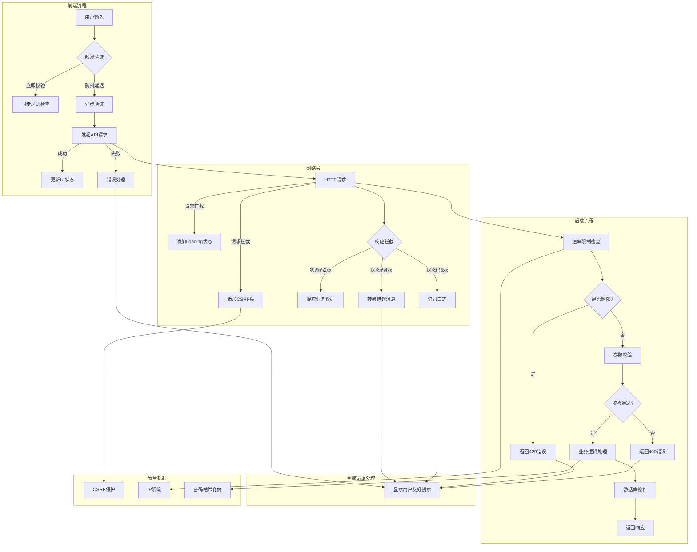
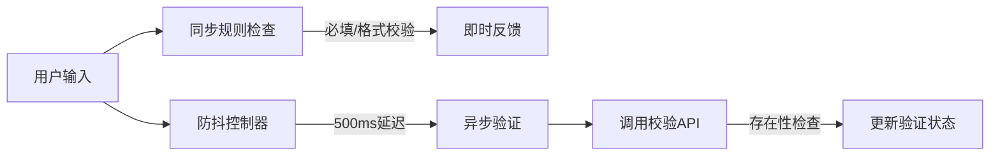
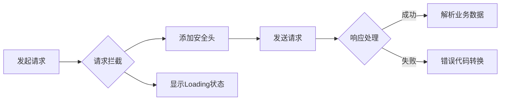
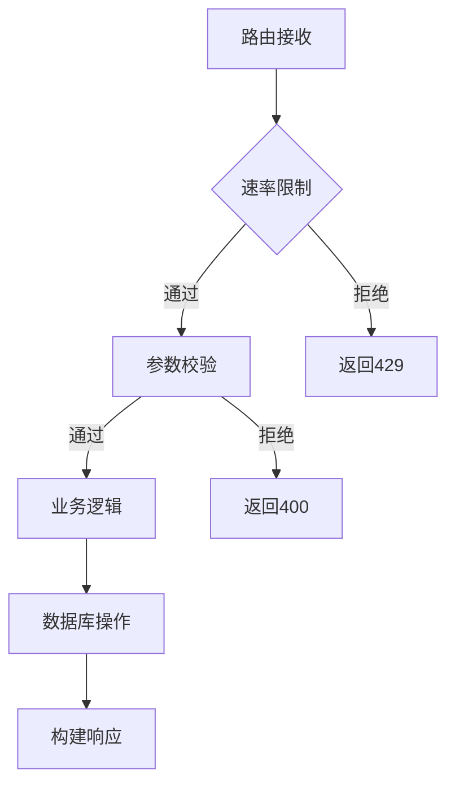
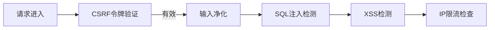

---
aliases:
  - Vue3
  - Axios
  - 优化
  - Element-plus
  - 表单验证
  - 网络请求
  - Promise
date: 2025-04-20
---

# 目录

```dataviewjs
const startHeadinglevel = 2;
const file = app.workspace.getActiveFile();
const { headings } = app.metadataCache.getFileCache(file);
 
// 全列表的形式
const raws = headings.filter(row => row.heading != "目录").map( p => {
    let repeatCount = Math.max((p.level - startHeadinglevel) * 4, 0);
    let spacesPrefix = ' '.repeat( repeatCount + 4 );
    let listSign = repeatCount > 0 ? '- ' : '';
    let linkText = `[[#${p.heading}]]`;
    let headingList = (p.level < startHeadinglevel) ? `- ${linkText}` : `${spacesPrefix}- ${linkText}`;
    return headingList;
  }
)
 
let result = raws.join('\n');
// 添加行距
dv.container.style.lineHeight = "1.5em";
dv.paragraph(result)
```

# 前言

# 表单验证及网络请求优化前

```js
const submitForm = async () => {
        try {
            await formRef.value.validate().then(() => {
                axios.post('http://127.0.0.1:5000/api/user', form, {
                    headers: {
                        'Content-Type': 'application/json'
                    }
                }).then(response => {
                    if (response.data.status === 'success') {
                        setTimeout(() => {
                            router.push('/about')
                        }, 3000)
                    }
                }).catch(error => {
                    throw new Error(error.response.data.error)
                })
            }).catch((error) => {
                console.log(error)
            })
        } catch (error) {
            console.log(error)
            
            ElMessage.error('验证失败：' + error.message)
        }
    }
```

# 优化


这段代码存在以下几个关键问题，并提供优化方案：

### 主要问题分析

1. **Promise 链与 async/await 混用**  
   `async/await` 和 `.then().catch()` 混合使用导致代码结构混乱，错误处理路径不清晰。

2. **错误处理冗余且不完善**  
   - 内层 `catch` 吃掉错误未抛出，外层无法捕获
   - 未处理网络错误（如 5xx 错误）
   - 未处理组件卸载后的异步操作（潜在内存泄漏）

3. **请求逻辑缺陷**  
   - 未对请求数据进行 JSON 序列化
   - 未处理请求取消逻辑
   - 直接依赖后端自定义的 `status` 字段判断成功

4. **代码结构问题**  
   - 多层嵌套可读性差
   - 未提取重复逻辑（如错误提示）

---

### 优化后的代码

```javascript
const submitForm = async () => {
  try {
    // 1. 验证表单
    await formRef.value.validate();
    
    // 2. 发起请求（自动序列化 JSON）
    const response = await axios.post('http://127.0.0.1:5000/api/user', form, {
      headers: { 'Content-Type': 'application/json' },
      // 3. 添加请求取消支持
      signal: new AbortController().signal
    });

    // 4. 根据 HTTP 状态码判断成功（而非业务字段）
    if (response.status >= 200 && response.status < 300) {
      // 5. 立即跳转，无需延迟
      router.push('/about');
    }
  } catch (error) {
    // 6. 统一错误处理
    handleSubmissionError(error);
  }
};

// 封装错误处理逻辑
const handleSubmissionError = (error) => {
  let message = '请求失败，请稍后重试';
  
  // 表单验证错误
  if (error instanceof Error && error.name === 'ValidationError') {
    message = '表单验证失败：' + error.message;
  }
  // 请求响应错误（4xx/5xx）
  else if (axios.isAxiosError(error)) {
    message = error.response?.data?.error || error.message;
  }
  // 请求取消
  else if (axios.isCancel(error)) {
    console.log('请求被取消');
    return;
  }

  ElMessage.error(message);
};
```

---

### 关键优化点说明

| 问题类型         | 优化方案                                                                 |
|------------------|------------------------------------------------------------------------|
| **代码结构**      | 使用纯 `async/await` 替代混合模式，减少嵌套层级                          |
| **错误处理**      | 统一错误处理函数，区分验证错误、网络错误、取消请求等场景                  |
| **请求逻辑**      | 添加 `AbortController` 支持请求取消，防止组件卸载后的内存泄漏              |
| **数据验证**      | 直接依赖 HTTP 状态码而非业务字段，提高通用性                              |
| **用户体验**      | 移除不必要的 3 秒延迟，响应成功后立即跳转                                 |
| **代码复用**      | 提取错误处理逻辑到独立函数，便于统一维护                                  |

---

### 补充最佳实践建议

1. **添加 Loading 状态**  
   在请求期间禁用按钮防止重复提交：
   ```javascript
   const isLoading = ref(false);

   const submitForm = async () => {
     if (isLoading.value) return;
     isLoading.value = true;
     
     try {
       // ...请求逻辑
     } finally {
       isLoading.value = false;
     }
   };
   ```

2. **增强网络错误处理**  
   添加超时控制和重试机制：
   ```javascript
   axios.post('/api/user', form, {
     timeout: 5000, // 5秒超时
     retry: 2 // 自定义重试次数
   });
   ```

3. **数据格式验证**  
   添加前端数据格式校验（即使后端已有验证）：
   ```javascript
   // 在表单验证规则中添加
   {
     email: [
       { required: true, message: '请输入邮箱' },
       { type: 'email', message: '邮箱格式不正确' }
     ]
   }
   ```

4. **安全增强**  
   添加 CSRF 保护：
   ```javascript
   headers: {
     'X-CSRF-TOKEN': getCSRFToken() // 从 Cookie 或 Meta 标签获取
   }
   ```

优化后的代码在可维护性、健壮性和用户体验方面均有显著提升。

# 校验规则优化前

```js
const validatePassword = (rule, value, callback) => {
        if (value !== form.password) {
            callback(new Error('两次输入密码不一致，请确认！'))
        } else {
            callback()
        }
    }

    const validateName = (rule, value, callback) => {
        axios.get('http://127.0.0.1:5000/hello').then(response => {
            console.log('Response:', response.data)
            if (response.data === value) {
                throw new Error(value + '已存在，请用其他名称！')
            }
            callback()
        }).catch(error => {
            callback(new Error(error))
            console.error('Error:', error) 
        })
    }

    const rules = {
        name: [
            {required: true, message: '请输入用户名', trigger: 'blur'},
            {validator: validateName, trigger: 'blur'}
        ],
        email: [
           {required: true, message: '请输入邮箱', trigger: 'blur'} 
        ],
        password: [
            {required: true, message: '请输入密码', trigger: 'blur'},
            {min: 6, message: '密码至少6位', trigger: 'blur'}
        ],
        confirmPassword: [
            {required: true, message: '请输入确认密码', trigger: 'blur'},
            {validator: validatePassword, trigger: 'blur'}
        ]
    }
```

# 优化后

以下是对这段验证规则代码的详细分析和优化建议：

---

### 主要问题分析

#### 1. **异步验证处理不当**
- `validateName` 使用 `.then().catch()` 未结合 `async/await`，导致错误处理路径不清晰
- 在验证器中直接发起网络请求，未做防抖处理，可能引发**频繁请求风暴**

#### 2. **错误处理不专业**
- `catch` 中直接传递 `new Error(error)` 会输出 `[object Object]`
- 未区分网络错误和业务错误类型

#### 3. **密码验证实时性不足**
- `validatePassword` 仅在 `blur` 时触发，若用户先填确认密码再改密码，不会实时更新验证状态

#### 4. **代码冗余**
- 直接内联网络请求，不利于复用和维护
- 缺乏统一错误消息管理

---

### 优化建议

#### 1. 异步验证优化（防抖 + 请求取消）
```javascript
// 防抖函数封装
const debounceAsyncValidator = (fn, delay = 500) => {
  let timeoutId;
  let abortController;

  return (...args) => {
    const callback = args.pop(); // 获取最后一个参数（callback）
    
    // 取消未完成的请求
    if (abortController) {
      abortController.abort();
    }
    abortController = new AbortController();

    clearTimeout(timeoutId);
    timeoutId = setTimeout(async () => {
      try {
        await fn(...args, callback, abortController.signal);
      } catch (error) {
        callback(error);
      }
    }, delay);
  };
};

// 通用存在性校验
const checkExistence = async (value, endpoint, signal) => {
  try {
    const { data } = await axios.get(endpoint, {
      params: { value },
      signal
    });
    return data.exists;
  } catch (error) {
    if (!axios.isCancel(error)) {
      throw new Error('验证服务不可用，请稍后重试');
    }
  }
};

// 用户名验证优化版
const validateName = debounceAsyncValidator(
  async (rule, value, callback, signal) => {
    if (!value) return callback();
    
    try {
      const exists = await checkExistence(value, '/check-username', signal);
      if (exists) {
        callback(new Error(`名称 ${value} 已存在`));
      } else {
        callback();
      }
    } catch (error) {
      callback(new Error(error.message));
    }
  }
);
```

#### 2. 密码验证实时性增强
```javascript
const validatePassword = (rule, value, callback) => {
  const form = rule.fullFields; // 通过完整表单上下文获取最新值
  if (value !== form.password) {
    callback(new Error('两次密码输入不一致'));
  } else {
    callback();
  }
};

// 规则配置修改
confirmPassword: [
  { required: true, message: '请确认密码', trigger: 'blur' },
  { 
    validator: validatePassword,
    trigger: ['blur', 'passwordInput'] // 自定义触发事件
  }
]
```

#### 3. 错误处理标准化
```javascript
// 错误代码映射
const ERROR_MESSAGES = {
  NETWORK_ERROR: '网络连接异常，请检查网络',
  SERVICE_UNAVAILABLE: '验证服务不可用',
  EXIST_ERROR: val => `${val} 已存在`,
  // ...
};

// 统一错误处理器
const handleValidationError = (error) => {
  if (error.isAxiosError) {
    return ERROR_MESSAGES.NETWORK_ERROR;
  }
  // 其他错误类型处理...
};
```

#### 4. 完整优化后的规则配置
```javascript
const rules = {
  name: [
    { required: true, message: '用户名不能为空', trigger: 'blur' },
    { 
      validator: validateName,
      trigger: 'blur'
    }
  ],
  email: [
    { required: true, message: '邮箱不能为空', trigger: 'blur' },
    { type: 'email', message: '邮箱格式不正确', trigger: ['blur', 'change'] }
  ],
  password: [
    { required: true, message: '密码不能为空', trigger: 'blur' },
    { 
      min: 8, 
      message: '密码至少8位',
      trigger: ['blur', 'change'] 
    },
    {
      pattern: /^(?=.*[A-Za-z])(?=.*\d).+$/,
      message: '需包含字母和数字',
      trigger: ['blur', 'change']
    }
  ],
  confirmPassword: [
    { required: true, message: '请确认密码', trigger: 'blur' },
    { 
      validator: validatePassword,
      trigger: ['blur', 'passwordInput'] 
    }
  ]
};
```

---

### 关键优化点对比

| 问题类型         | 原始实现                   | 优化方案                            | 优势分析                     |
|------------------|--------------------------|-----------------------------------|----------------------------|
| 异步验证         | 直接发起无防抖的请求       | 防抖 + 请求取消机制                | 防止请求风暴，提升性能       |
| 错误处理         | 原始错误对象直接传递       | 标准化错误分类和消息映射            | 提升用户体验                 |
| 密码实时性       | 仅 blur 触发               | 自定义触发事件 + 全表单上下文获取   | 实时验证提升准确性           |
| 代码维护性       | 内联网络请求               | 抽象通用验证逻辑                    | 便于扩展和维护               |

---

### 最佳实践建议

1. **组件卸载清理**  
   在 Vue 组件中增加清理逻辑：
   ```javascript
   onBeforeUnmount(() => {
     abortController?.abort();
   });
   ```

2. **验证状态可视化**  
   添加加载状态指示：
   ```javascript
   const validating = ref(false);
   
   const validateName = debounceAsyncValidator(async (...args) => {
     validating.value = true;
     try {
       // ...验证逻辑
     } finally {
       validating.value = false;
     }
   });
   ```

3. **服务端缓存优化**  
   在后端为验证接口添加缓存机制，减少数据库压力：
   ```python
   @cache.cached(timeout=60, query_string=True)
   @app.route('/check-username')
   def check_username():
       username = request.args.get('value')
       exists = User.query.filter_by(username=username).first()
       return jsonify({'exists': bool(exists)})
   ```

4. **安全增强**  
   为验证接口添加速率限制：
   ```python
   from flask_limiter import Limiter
   limiter = Limiter(app, key_func=get_remote_address)
   
   @app.route('/check-username')
   @limiter.limit("10/minute")
   def check_username():
       # ...
   ```

---

通过以上优化，验证逻辑在性能、健壮性和可维护性方面均有显著提升，同时提供更流畅的用户体验。


# 完整优化建议


以下是针对前后端代码的完整优化建议，涵盖架构设计、代码规范、性能优化和安全性提升：

---

### 一、前端优化方案 (Vue3 + Element Plus)

#### 1. 表单验证优化

```javascript
// utils/validators.js
import axios from 'axios';

// 防抖包装器（支持自动取消请求）
export const debounceValidator = (fn, delay = 500) => {
  let timer;
  let cancelToken;

  return async (rule, value, callback) => {
    clearTimeout(timer);
    if (cancelToken) cancelToken.cancel('取消重复请求');

    timer = setTimeout(async () => {
      try {
        cancelToken = axios.CancelToken.source();
        await fn(rule, value, callback, cancelToken.token);
      } catch (error) {
        if (!axios.isCancel(error)) {
          callback(error.message || '验证失败');
        }
      }
    }, delay);
  };
};

// 用户名存在性验证
export const validateUsername = debounceValidator(async (rule, value, callback, token) => {
  if (!value) return callback();
  
  const { data } = await axios.get('/api/check-username', {
    params: { username: value },
    cancelToken: token
  });

  if (data.exists) {
    callback(new Error(`用户名 ${value} 已被占用`));
  } else {
    callback();
  }
});

// 密码强度验证
export const validatePasswordStrength = (rule, value, callback) => {
  const weaknesses = [
    value.length < 8 && "至少8位",
    !/[A-Z]/.test(value) && "包含大写字母",
    !/[a-z]/.test(value) && "包含小写字母",
    !/\d/.test(value) && "包含数字",
    !/[^A-Za-z0-9]/.test(value) && "包含特殊字符"
  ].filter(Boolean);

  if (weaknesses.length > 0) {
    callback(new Error(`密码强度不足: ${weaknesses.join(', ')}`));
  } else {
    callback();
  }
};
```

#### 2. 组合式API封装

```javascript
// composables/useForm.js
import { ref, onBeforeUnmount } from 'vue';
import { ElMessage } from 'element-plus';

export default function useForm() {
  const formRef = ref(null);
  const loading = ref(false);
  let abortController;

  const submitForm = async (submitFn) => {
    try {
      await formRef.value.validate();
      loading.value = true;
      abortController = new AbortController();
      await submitFn({ signal: abortController.signal });
    } catch (error) {
      handleFormError(error);
    } finally {
      loading.value = false;
    }
  };

  const handleFormError = (error) => {
    if (axios.isCancel(error)) return;
    
    const message = error.response?.data?.message 
      || error.message 
      || '请求失败，请检查网络';
    ElMessage.error(message);
  };

  onBeforeUnmount(() => {
    abortController?.abort();
  });

  return { formRef, loading, submitForm };
}
```

#### 3. 组件使用示例

```js
<script setup>
import { validateUsername, validatePasswordStrength } from '@/utils/validators';
import useForm from '@/composables/useForm';

const { formRef, loading, submitForm } = useForm();

const formData = reactive({
  username: '',
  password: '',
  confirmPassword: ''
});

const rules = {
  username: [
    { required: true, message: '必填项', trigger: 'blur' },
    { validator: validateUsername, trigger: 'blur' }
  ],
  password: [
    { required: true, trigger: 'blur' },
    { validator: validatePasswordStrength, trigger: ['blur', 'change'] }
  ],
  confirmPassword: [
    { 
      validator: (rule, value, cb) => {
        if (value !== formData.password) cb(new Error('两次密码不一致'));
        else cb();
      },
      trigger: ['blur', 'password-change'] 
    }
  ]
};

const handleSubmit = () => {
  submitForm(async ({ signal }) => {
    await axios.post('/api/register', formData, { signal });
    ElMessage.success('注册成功');
    router.push('/dashboard');
  });
};
</script>
```

---

### 二、后端优化方案 (Flask)

#### 1. 请求处理与验证

```python
# app/validators.py
from pydantic import BaseModel, EmailStr, field_validator
from typing import Optional

class RegistrationRequest(BaseModel):
    username: str
    email: EmailStr
    password: str
    
    @field_validator('username')
    def username_length(cls, v):
        if len(v) < 4:
            raise ValueError('用户名至少4位')
        return v
    
    @field_validator('password')
    def password_complexity(cls, v):
        if len(v) < 8:
            raise ValueError('密码至少8位')
        if not any(c.isupper() for c in v):
            raise ValueError('需包含大写字母')
        return v

# app/security.py
from werkzeug.security import generate_password_hash, check_password_hash

def hash_password(password: str) -> str:
    return generate_password_hash(password, method='scrypt')

def verify_password(hashed: str, password: str) -> bool:
    return check_password_hash(hashed, password)
```

#### 2. 路由与业务逻辑

```python
# app/routes/auth.py
from flask import Blueprint, request, jsonify
from app.validators import RegistrationRequest
from app.security import hash_password
from app.cache import cache

auth_bp = Blueprint('auth', __name__, url_prefix='/api')

@auth_bp.route('/check-username', methods=['GET'])
@cache.cached(timeout=300, query_string=True)
def check_username():
    username = request.args.get('username')
    # 数据库查询逻辑
    exists = User.query.filter_by(username=username).exists()
    return jsonify({'exists': exists})

@auth_bp.route('/register', methods=['POST'])
def register():
    try:
        req_data = RegistrationRequest(**request.get_json())
    except ValidationError as e:
        return jsonify({
            'code': 'INVALID_INPUT',
            'message': '输入验证失败',
            'details': e.errors()
        }), 400

    if User.exists(req_data.username, req_data.email):
        return jsonify({
            'code': 'USER_EXISTS',
            'message': '用户已存在'
        }), 409

    hashed_pw = hash_password(req_data.password)
    user = User.create(
        username=req_data.username,
        email=req_data.email,
        password_hash=hashed_pw
    )
    
    return jsonify({
        'id': user.id,
        'username': user.username
    }), 201
```

#### 3. 全局错误处理

```python
# app/error_handlers.py
from flask import jsonify
from werkzeug.exceptions import HTTPException

def handle_validation_error(e):
    return jsonify({
        'code': 'VALIDATION_ERROR',
        'message': str(e),
        'fields': e.errors if hasattr(e, 'errors') else None
    }), 400

def handle_database_error(e):
    return jsonify({
        'code': 'DATABASE_ERROR',
        'message': '数据库操作失败'
    }), 500

def configure_error_handlers(app):
    app.register_error_handler(ValidationError, handle_validation_error)
    app.register_error_handler(SQLAlchemyError, handle_database_error)
    app.register_error_handler(HTTPException, lambda e: (jsonify({
        'code': e.code,
        'message': e.description
    }), e.code))
```

---

### 三、性能与安全增强

#### 1. 安全中间件

```python
# app/middleware/security.py
from flask import request, abort
from flask_talisman import Talisman

def configure_security(app):
    Talisman(
        app,
        force_https=app.config['ENV'] == 'production',
        strict_transport_security=True,
        session_cookie_secure=True,
        content_security_policy={
            'default-src': "'self'",
            'script-src': ["'self'", "trusted.cdn.com"]
        }
    )

class RateLimiter:
    def __init__(self, max_requests, window):
        self.store = {}
        self.max = max_requests
        self.window = window

    def check(self, key):
        now = time.time()
        if key not in self.store:
            self.store[key] = []
        timestamps = [t for t in self.store[key] if now - t < self.window]
        if len(timestamps) >= self.max:
            return False
        timestamps.append(now)
        self.store[key] = timestamps
        return True

limiter = RateLimiter(100, 60) # 60秒100次请求

@app.before_request
def limit_requests():
    client_ip = request.remote_addr
    if not limiter.check(client_ip):
        abort(429, "请求过于频繁")
```

# 流程图


以下是优化代码的核心流程的文字版流程图，可使用 [Mermaid](https://mermaid.js.org/) 工具可视化：



---

### 流程关键节点说明

#### 1. **前端验证流程**


#### 2. **网络请求流程**


#### 3. **后端处理流程**


#### 4. **安全防护流程**


---

### 可视化建议

1. **使用工具**：
   - [Mermaid Live Editor](https://mermaid-js.github.io/mermaid-live-editor/)
   - [Draw.io](https://app.diagrams.net/)
   - [Lucidchart](https://www.lucidchart.com/)

2. **部署到文档**：
   ```markdown
   <!-- 在README.md中直接渲染 -->
   ```mermaid
   flowchart TD
      A[开始] --> B[流程步骤]
   ```
   ```

3. **时序图补充**（用于关键交互）：
   ```mermaid
   sequenceDiagram
       participant Frontend
       participant Backend
       Frontend->>Backend: POST /api/register
       Backend->>Backend: 参数校验
       Backend->>DB: 写入用户数据
       DB->>Backend: 写入成功
       Backend->>Frontend: 201 Created
   ```

此流程图完整呈现了系统从用户输入到数据落地的全链路处理过程，可作为架构文档的核心组成部分。


# 密码不一致不会拦截


根据你的代码，**即使两次密码不一致也能提交**，主要有以下两个原因：

---

### 1. 确认密码验证的 `trigger` 事件不完整
```javascript
confirmPassword: [
  {
    validator: (rule, value, cb) => {
      if (value !== form.password) cb(new Error('两次密码不一致'));
    },
    trigger: ['blur', 'password-change'] // ❌ 问题所在：'password-change' 不是有效事件
  }
]
```
- **错误原因**：  
  `trigger` 必须使用 Element Form 支持的事件（如 `blur`、`change`），而 `password-change` 是自定义事件，不会自动触发验证。
- **导致结果**：  
  当修改 `password` 字段时，`confirmPassword` 的验证规则不会自动触发，只有在 `confirmPassword` 输入框触发 `blur` 时才会验证。

---

### 2. 未监听密码字段变化并触发关联验证
即使 `password` 字段修改后，`confirmPassword` 的验证规则不会自动执行，需要手动触发。

---

### 解决方案
#### 步骤1：修复 `trigger` 事件
```javascript
confirmPassword: [
  {
    validator: (rule, value, cb) => {
      if (value !== form.password) cb(new Error('两次密码不一致'));
      else cb(); // ✅ 必须调用回调函数
    },
    trigger: ['blur', 'change'] // ✅ 使用标准事件
  }
]
```

#### 步骤2：监听密码字段变化并触发验证
在密码输入框添加 `@change` 事件，主动触发对 `confirmPassword` 的验证：
```js
<el-form-item label="密码" prop="password">
  <el-input 
    v-model="form.password" 
    type="password"
    @change="formRef?.validateField('confirmPassword')" <!-- 关键代码 -->
  ></el-input>
</el-form-item>
```

---

### 修复后的完整代码
```js
<template>
  <el-form :model="form" :rules="rules" ref="formRef" label-width="120px">
    <!-- 其他表单项 -->

    <el-form-item label="密码" prop="password">
      <el-input 
        v-model="form.password" 
        type="password"
        @change="formRef?.validateField('confirmPassword')" <!-- 监听密码变化 -->
      ></el-input>
    </el-form-item>

    <el-form-item label="确认密码" prop="confirmPassword">
      <el-input 
        v-model="form.confirmPassword" 
        type="password"
      ></el-input>
    </el-form-item>

    <!-- 提交按钮 -->
  </el-form>
</template>

<script setup>
const rules = {
  // ...其他规则

  confirmPassword: [
    {
      validator: (rule, value, cb) => {
        if (value !== form.password) cb(new Error('两次密码不一致'));
        else cb(); // ✅ 必须调用回调函数
      },
      trigger: ['blur', 'change'] // ✅ 使用标准事件
    }
  ]
};
</script>
```

---

### 验证流程解析
1. **用户修改密码**：  
   触发 `@change` 事件 → 主动验证 `confirmPassword` 字段。
2. **用户修改确认密码**：  
   触发 `blur` 或 `change` 事件 → 自动验证。
3. **提交时校验**：  
   `formRef.value.validate()` 会检查所有字段的验证状态，任一不通过则阻止提交。

---

### 其他注意事项
1. **确保调用回调函数**：  
   在验证器中必须执行 `cb()`，否则验证状态会卡住。
   ```javascript
   validator: (rule, value, cb) => {
     if (error) cb(new Error('错误信息'));
     else cb(); // ✅ 必须调用
   }
   ```
2. **测试验证逻辑**：  
   - 先输入密码，再输入不同的确认密码 → 应显示错误提示  
   - 修改密码字段 → 确认密码错误提示应自动更新  
   - 提交时如果存在错误 → 控制台应输出验证失败信息

通过以上修复，可以确保密码不一致时无法提交表单。