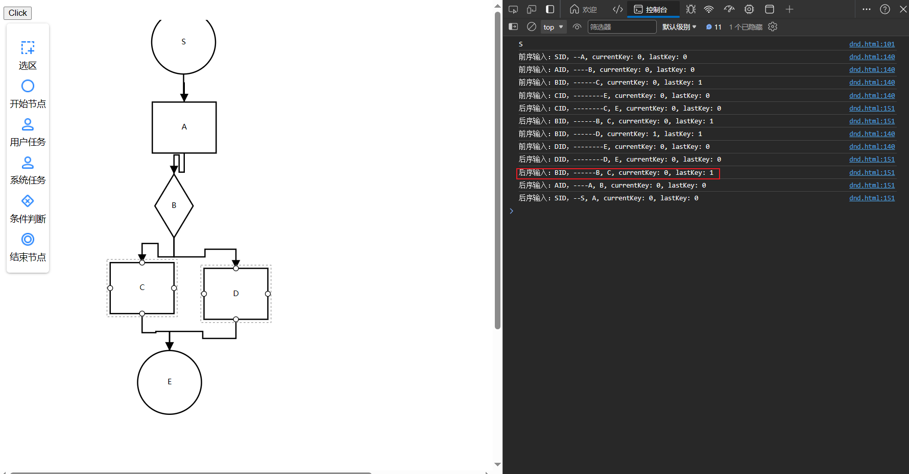
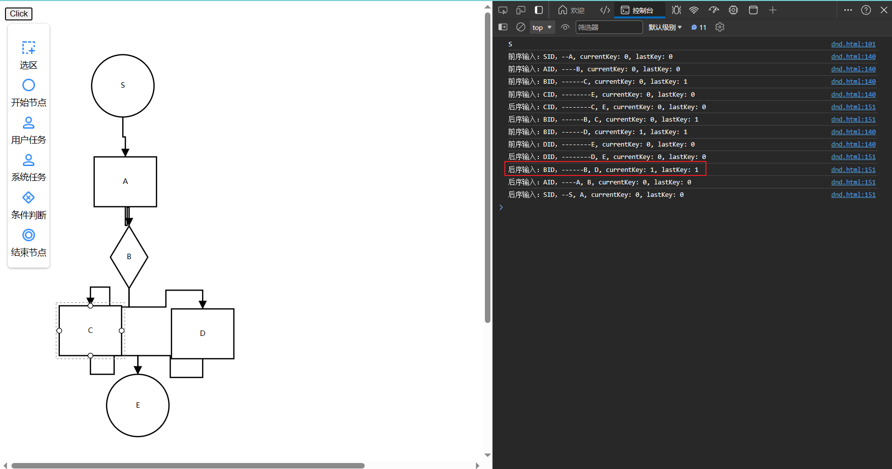

[关于OA流程相关数据表的设计 - kingeric - 博客园 (cnblogs.com)](https://www.cnblogs.com/kingeric/p/11638940.html)
[流程图存储的方案设计及数据结构设计_流程图 数据结构-CSDN博客](https://blog.csdn.net/qq_36657997/article/details/129425170)
[设计思想 - 工作流表结构的设计 - 个人文章 - SegmentFault 思否](https://segmentfault.com/a/1190000019161083)
[流程图的导出与导入：实现流程图的持久化存储-CSDN博客](https://blog.csdn.net/universsky2015/article/details/136010710)
[可拖拽流程图的实现+代码按流程图执行-腾讯云开发者社区-腾讯云 (tencent.com)](https://cloud.tencent.com/developer/article/1410551)
[前端流程图插件对比选型 - 掘金 (juejin.cn)](https://juejin.cn/post/7251835247595110457)
[介绍 (logic-flow.cn)](https://docs.logic-flow.cn/docs/#/zh/guide/start)
[边上插入节点 InsertNodeInPolyline (logic-flow.cn)](https://docs.logic-flow.cn/docs/#/zh/guide/extension/extension-insert-node-in-polyline)
[拖拽创建节点 Dnd (logic-flow.cn)](https://docs.logic-flow.cn/docs/#/zh/guide/basic/dnd)
[Excel 流程图|极客笔记 (deepinout.com)](https://deepinout.com/excel/excel-top-articles/1694621266_j_flow-chart-excel.html)


## 原生js用npm引入其他包

[HTML 如何在HTML中以普通的JavaScript使用NPM包|极客笔记 (deepinout.com)](https://deepinout.com/html/html-questions/97_html_how_to_use_npm_package_as_normal_javascript_in_html.html)


## 引用问题

Failed to resolve module specifier "@logicflow/core". Relative references must start with either "/", "./", or "../"、

[Failed to resolve module specifier. Relative references must start with either | bobbyhadz](https://bobbyhadz.com/blog/failed-to-resolve-module-specifier-javascript)


[LogicFlow 在HTML中的引入与使用 - 简书 (jianshu.com)](https://www.jianshu.com/p/98cd767b985b)


## 引入NPM包

[HTML 如何在HTML中以普通的JavaScript使用NPM包|极客笔记 (deepinout.com)](https://deepinout.com/html/html-questions/97_html_how_to_use_npm_package_as_normal_javascript_in_html.html)


## “Error: 请检查 container 参数是否有效”

[按照官方快速上手教程使用失败，提示“Error: 请检查 container 参数是否有效” · Issue #197 · didi/LogicFlow (github.com)](https://github.com/didi/LogicFlow/issues/197)

因为渲染LogicFlow的时候，container传入的节点还没有被渲染到dom上吧，你setTimeout延迟1秒渲染LogicFlow试试。

其实不是上面的问题，而是自己没有写 id 为 container 的div盒子，继续看[LogicFlow实例 (logic-flow.cn)](https://docs.logic-flow.cn/docs/#/zh/guide/basic/logic-flow)就知道了。


```HTML
<!DOCTYPE html>

<html lang="en">

<head>

    <meta charset="UTF-8">

    <meta name="viewport" content="width=device-width, initial-scale=1.0">

    <title>Document</title>

    <link href="node_modules/@logicflow/core/dist/style/index.css" rel="stylesheet">

    <link rel="stylesheet" href="node_modules/@logicflow/extension/lib/style/index.css"/>

    <style>

        #container {

          width: 1000px;

          height: 500px;

        }

      </style>

</head>

<body>

  

    <div id="container"></div>

  

    <script src="node_modules/@logicflow/core/dist/logic-flow.js"></script>

    <script src="node_modules/@logicflow/core/dist/logic-flow.min.js"></script>

    <!--LogicFlow的插件支持单个引入，这里以菜单插件为例-->

    <script src="node_modules/@logicflow/extension/lib/Menu.js"></script>

  

    <script>

  

        let delay = 1000;

        function test () {

            LogicFlow.use(Menu);

            const lf = new LogicFlow({

                container: document.querySelector("#container"),

            });

  

            lf.render({

                nodes: [

                    {

                    id: "1",

                    type: "rect",

                    x: 100,

                    y: 100,

                    text: "节点1",

                    },

                    {

                    id: "2",

                    type: "circle",

                    x: 300,

                    y: 200,

                    text: "节点2",

                    },

                ],

                edges: [

                    {

                    sourceNodeId: "1",

                    targetNodeId: "2",

                    type: "polyline",

                    text: "连线",

                    },

                ],

            });

        }

        setTimeout(test, delay);

    </script>

</body>

</html>
```

## 拖拽

[LogicFlow 自定义可分组拖拽面板 - 前端小鑫同学 - 博客园 (cnblogs.com)](https://www.cnblogs.com/ospoon/p/18152810)

## 获取所有下一节点

```JS
let graphModel = lf.graphModel;

        // console.log(graphModel.nodesMap);

        let nodesMap = graphModel.nodesMap;

        // console.log(typeof nodesMap); // object

        for (nodeId in nodesMap) {

            var firstNodeId = nodeId;

            break;

        }

        console.log(firstNodeId);

        // 获取所有下一节点

        var outcomingNodes = graphModel.getNodeOutgoingNode(firstNodeId);

        console.log(typeof outcomingNodes); // object

        for (key in outcomingNodes) {

            console.log(outcomingNodes[key].id);

            console.log(outcomingNodes[key].text.value);

        }
```

如果当前节点没有下一节点，返回的是一个对象，但不是空的。不能用下面的方式判断：

```JS
    let data = {};
    let data1 = {
        name: "大帅哥",
        age: "18"
    }
   console.log(JSON.stringify(data) === '{}') // true
   console.log(JSON.stringify(data1) === '{}') // false
```

可以根据返回的对象中的 length 属性来判断：

```JS
function isNoOutgoingNodes(data) {
        return data.length === 0;
    }
```

```JS
    function traverse (graphModel, nodeId) {

        var outgoingNodes = graphModel.getNodeOutgoingNode(nodeId);

        if (isNoOutgoingNodes(outgoingNodes)) {

            return;

        }

        for (key in outgoingNodes) {

            console.log(outgoingNodes[key].text.value);

            traverse(graphModel, outgoingNodes[key].id);

        }

    }
```

## 变量作用域问题

递归完后都会多一个根节点，经过一步步排查后才发现是是变量域的问题，即 for in 循环里面，key 前面要加一个 let

### 有 bug 的代码

```JS
function traverse (graphModel, nodeId, depth) {

        var outgoingNodes = graphModel.getNodeOutgoingNode(nodeId);

        if (isNoOutgoingNodes(outgoingNodes)) {

            return;

        }

        for (key in outgoingNodes) {

            var depthStr = generateDepthString(depth);

            console.log('前序输入：' + graphModel.getNodeModelById(nodeId).text.value + 'ID，' +  depthStr + outgoingNodes[key].text.value + ', ' + 'currentKey: ' + key + ', lastKey: '+getLastKey(outgoingNodes));

  

            traverse(graphModel, outgoingNodes[key].id, depth + 1);

            // console.log(key);

            // console.log(getLastKey(outgoingNodes));

            // console.log(key !== getLastKey(outgoingNodes));

            // if (outgoingNodes.length > 1 && key !== getLastKey(outgoingNodes)) {

                // console.log(key);

                // console.log(getLastKey(outgoingNodes));

                // console.log('--+++ outgoingNodes[key].text.value');

                var parentNode = graphModel.getNodeModelById(nodeId);

                console.log('后序输入：' + graphModel.getNodeModelById(nodeId).text.value + 'ID，' + depthStr + parentNode.text.value + ', ' + outgoingNodes[key].text.value + ', ' + 'currentKey: ' + key + ', lastKey: '+getLastKey(outgoingNodes));

            // }

        }

    }
```



### 排除 bug 后的代码

```JS
function traverse (graphModel, nodeId, depth) {

        var outgoingNodes = graphModel.getNodeOutgoingNode(nodeId);

        if (isNoOutgoingNodes(outgoingNodes)) {

            return;

        }

        for (let key in outgoingNodes) {

            var depthStr = generateDepthString(depth);

            console.log('前序输入：' + graphModel.getNodeModelById(nodeId).text.value + 'ID，' +  depthStr + outgoingNodes[key].text.value + ', ' + 'currentKey: ' + key + ', lastKey: '+getLastKey(outgoingNodes));

  

            traverse(graphModel, outgoingNodes[key].id, depth + 1);

            // console.log(key);

            // console.log(getLastKey(outgoingNodes));

            // console.log(key !== getLastKey(outgoingNodes));

            // if (outgoingNodes.length > 1 && key !== getLastKey(outgoingNodes)) {

                // console.log(key);

                // console.log(getLastKey(outgoingNodes));

                // console.log('--+++ outgoingNodes[key].text.value');

                var parentNode = graphModel.getNodeModelById(nodeId);

                console.log('后序输入：' + graphModel.getNodeModelById(nodeId).text.value + 'ID，' + depthStr + parentNode.text.value + ', ' + outgoingNodes[key].text.value + ', ' + 'currentKey: ' + key + ', lastKey: '+getLastKey(outgoingNodes));

            // }

        }

    }
```



## 初版

```JS
function traverse (graphModel, nodeId, depth) {

        var outgoingNodes = graphModel.getNodeOutgoingNode(nodeId);

        if (isNoOutgoingNodes(outgoingNodes)) {

            return;

        }

        for (let key in outgoingNodes) {

            // var depthStr = generateDepthString(depth);

            // console.log('前序输入：' + graphModel.getNodeModelById(nodeId).text.value + 'ID，' +  depthStr + outgoingNodes[key].text.value + ', ' + 'currentKey: ' + key + ', lastKey: '+getLastKey(outgoingNodes));

  

            // console.log(outgoingNodes[key].text.value);

  

            console.log('当前节点：'+graphModel.getNodeModelById(nodeId).text.value +', '+'下一节点：'+outgoingNodes[key].text.value);

  

            var incomingNodes = graphModel.getNodeIncomingNode(outgoingNodes[key].id);

  

            if (incomingNodes.length > 1) {

                for (let k in incomingNodes) {

                    if (incomingNodes[k].id != nodeId) {

                        console.log('当前节点：'+incomingNodes[k].text.value +', '+'下一节点：'+outgoingNodes[key].text.value);

                    }

                }

            }

  

            traverse(graphModel, outgoingNodes[key].id, depth + 1);

            // console.log(key);

            // console.log(getLastKey(outgoingNodes));

            // console.log(key !== getLastKey(outgoingNodes));

            if (outgoingNodes.length > 1 && key !== getLastKey(outgoingNodes)) {

                // console.log(key);

                // console.log(getLastKey(outgoingNodes));

                // console.log('--+++ outgoingNodes[key].text.value');

                var parentNode = graphModel.getNodeModelById(nodeId);

                // console.log('后序输入：' + graphModel.getNodeModelById(nodeId).text.value + 'ID，' + depthStr + parentNode.text.value + ', ' + outgoingNodes[key].text.value + ', ' + 'currentKey: ' + key + ', lastKey: '+getLastKey(outgoingNodes));

                // console.log(parentNode.text.value);

            }

        }

    }

  

    function getLastKey (obj) {

        return Object.keys(obj).pop();

    }

  

    function isNoOutgoingNodes(data) {

        return data.length === 0;

    }

  

    function generateDepthString(depth) {

        var depthStr = "";

        for (var i = 0; i <  depth; i++) {

            depthStr += "--";

        }

        return depthStr;

    }
```

## excel

[概述 | SheetJS 中文网 (nodejs.cn)](https://xlsx.nodejs.cn/docs/)
[SheetJS，一款小巧的 JavaScript 表格处理库 - 知乎 (zhihu.com)](https://zhuanlan.zhihu.com/p/670977272)

```JS
<!DOCTYPE html>

<html lang="en">

<head>

    <meta charset="UTF-8">

    <meta name="viewport" content="width=device-width, initial-scale=1.0">

    <title>Document</title>

  

    <link href="node_modules/@logicflow/core/dist/style/index.css" rel="stylesheet">

    <link rel="stylesheet" href="node_modules/@logicflow/extension/lib/style/index.css"/>

    <style>

        #container {

          width: 1000px;

          height: 1000px;

        }

      </style>

</head>

<body>

    <button onclick="flowChartToTable()">Click</button>

    <div id="container"></div>

  

    <script src="node_modules/@logicflow/core/dist/logic-flow.js"></script>

    <script src="node_modules/@logicflow/core/dist/logic-flow.min.js"></script>

    <!--LogicFlow的插件支持单个引入，这里以菜单插件为例-->

    <script src="node_modules/@logicflow/extension/lib/Menu.js"></script>

    <script src="node_modules/@logicflow/extension/lib/DndPanel.js"></script>

    <script src="node_modules/@logicflow/extension/lib/SelectionSelect.js"></script>

    <script src="node_modules/xlsx/dist/xlsx.full.min.js"></script>

  

    <script>

        LogicFlow.use(DndPanel);

        LogicFlow.use(Menu);

        LogicFlow.use(SelectionSelect);

        const lf = new LogicFlow({

            container: document.querySelector('#container')

        });

  

        lf.extension.dndPanel.setPatternItems([

        {

            label: '选区',

            icon: 'data:image/png;base64,iVBORw0KGgoAAAANSUhEUgAAABQAAAAUCAYAAAH6ji2bAAAABGdBTUEAALGPC/xhBQAAAOVJREFUOBGtVMENwzAIjKP++2026ETdpv10iy7WFbqFyyW6GBywLCv5gI+Dw2Bluj1znuSjhb99Gkn6QILDY2imo60p8nsnc9bEo3+QJ+AKHfMdZHnl78wyTnyHZD53Zzx73MRSgYvnqgCUHj6gwdck7Zsp1VOrz0Uz8NbKunzAW+Gu4fYW28bUYutYlzSa7B84Fh7d1kjLwhcSdYAYrdkMQVpsBr5XgDGuXwQfQr0y9zwLda+DUYXLaGKdd2ZTtvbolaO87pdo24hP7ov16N0zArH1ur3iwJpXxm+v7oAJNR4JEP8DoAuSFEkYH7cAAAAASUVORK5CYII=',

            callback: () => {

            lf.extension.selectionSelect.openSelectionSelect();

            lf.once('selection:selected', () => {

                lf.extension.selectionSelect.closeSelectionSelect();

            });

            }

        },

        {

            type: 'circle',

            text: '开始',

            label: '开始节点',

            icon: 'data:image/png;base64,iVBORw0KGgoAAAANSUhEUgAAABQAAAAUCAYAAAH6ji2bAAAABGdBTUEAALGPC/xhBQAAAnBJREFUOBGdVL1rU1EcPfdGBddmaZLiEhdx1MHZQXApraCzQ7GKLgoRBxMfcRELuihWKcXFRcEWF8HBf0DdDCKYRZpnl7p0svLe9Zzbd29eQhTbC8nv+9zf130AT63jvooOGS8Vf9Nt5zxba7sXQwODfkWpkbjTQfCGUd9gIp3uuPP8bZ946g56dYQvnBg+b1HB8VIQmMFrazKcKSvFW2dQTxJnJdQ77urmXWOMBCmXM2Rke4S7UAW+/8ywwFoewmBps2tu7mbTdp8VMOkIRAkKfrVawalJTtIliclFbaOBqa0M2xImHeVIfd/nKAfVq/LGnPss5Kh00VEdSzfwnBXPUpmykNss4lUI9C1ga+8PNrBD5YeqRY2Zz8PhjooIbfJXjowvQJBqkmEkVnktWhwu2SM7SMx7Cj0N9IC0oQXRo8xwAGzQms+xrB/nNSUWVveI48ayrFGyC2+E2C+aWrZHXvOuz+CiV6iycWe1Rd1Q6+QUG07nb5SbPrL4426d+9E1axKjY3AoRrlEeSQo2Eu0T6BWAAr6COhTcWjRaYfKG5csnvytvUr/WY4rrPMB53Uo7jZRjXaG6/CFfNMaXEu75nG47X+oepU7PKJvvzGDY1YLSKHJrK7vFUwXKkaxwhCW3u+sDFMVrIju54RYYbFKpALZAo7sB6wcKyyrd+aBMryMT2gPyD6GsQoRFkGHr14TthZni9ck0z+Pnmee460mHXbRAypKNy3nuMdrWgVKj8YVV8E7PSzp1BZ9SJnJAsXdryw/h5ctboUVi4AFiCd+lQaYMw5z3LGTBKjLQOeUF35k89f58Vv/tGh+l+PE/wG0rgfIUbZK5AAAAABJRU5ErkJggg==',

        },

        {

            type: 'rect',

            label: '用户任务',

            icon: 'data:image/png;base64,iVBORw0KGgoAAAANSUhEUgAAABMAAAATCAYAAAEFVwZaAAAABGdBTUEAALGPC/xhBQAAAqlJREFUOBF9VM9rE0EUfrMJNUKLihGbpLGtaCOIR8VjQMGDePCgCCIiCNqzCAp2MyYUCXhUtF5E0D+g1t48qAd7CCLqQUQKEWkStcEfVGlLdp/fm3aW2QQdyLzf33zz5m2IsAZ9XhDpyaaIZkTS4ASzK41TFao88GuJ3hsr2pAbipHxuSYyKRugagICGANkfFnNh3HeE2N0b3nN2cgnpcictw5veJIzxmDamSlxxQZicq/mflxhbaH8BLRbuRwNtZp0JAhoplVRUdzmCe/vO27wFuuA3S5qXruGdboy5/PRGFsbFGKo/haRtQHIrM83bVeTrOgNhZReWaYGnE4aUQgTJNvijJFF4jQ8BxJE5xfKatZWmZcTQ+BVgh7s8SgPlCkcec4mGTmieTP4xd7PcpIEg1TX6gdeLW8rTVMVLVvb7ctXoH0Cydl2QOPJBG21STE5OsnbweVYzAnD3A7PVILuY0yiiyDwSm2g441r6rMSgp6iK42yqroI2QoXeJVeA+YeZSa47gZdXaZWQKTrG93rukk/l2Al6Kzh5AZEl7dDQy+JjgFahQjRopSxPbrbvK7GRe9ePWBo1wcU7sYrFZtavXALwGw/7Dnc50urrHJuTPSoO2IMV3gUQGNg87IbSOIY9BpiT9HV7FCZ94nPXb3MSnwHn/FFFE1vG6DTby+r31KAkUktB3Qf6ikUPWxW1BkXSPQeMHHiW0+HAd2GelJsZz1OJegCxqzl+CLVHa/IibuHeJ1HAKzhuDR+ymNaRFM+4jU6UWKXorRmbyqkq/D76FffevwdCp+jN3UAN/C9JRVTDuOxC/oh+EdMnqIOrlYteKSfadVRGLJFJPSB/ti/6K8f0CNymg/iH2gO/f0DwE0yjAFO6l8JaR5j0VPwPwfaYHqOqrCI319WzwhwzNW/aQAAAABJRU5ErkJggg==',

            className: 'important-node'

        },

        {

            type: 'rect',

            label: '系统任务',

            icon: 'data:image/png;base64,iVBORw0KGgoAAAANSUhEUgAAABMAAAATCAYAAAEFVwZaAAAABGdBTUEAALGPC/xhBQAAAqlJREFUOBF9VM9rE0EUfrMJNUKLihGbpLGtaCOIR8VjQMGDePCgCCIiCNqzCAp2MyYUCXhUtF5E0D+g1t48qAd7CCLqQUQKEWkStcEfVGlLdp/fm3aW2QQdyLzf33zz5m2IsAZ9XhDpyaaIZkTS4ASzK41TFao88GuJ3hsr2pAbipHxuSYyKRugagICGANkfFnNh3HeE2N0b3nN2cgnpcictw5veJIzxmDamSlxxQZicq/mflxhbaH8BLRbuRwNtZp0JAhoplVRUdzmCe/vO27wFuuA3S5qXruGdboy5/PRGFsbFGKo/haRtQHIrM83bVeTrOgNhZReWaYGnE4aUQgTJNvijJFF4jQ8BxJE5xfKatZWmZcTQ+BVgh7s8SgPlCkcec4mGTmieTP4xd7PcpIEg1TX6gdeLW8rTVMVLVvb7ctXoH0Cydl2QOPJBG21STE5OsnbweVYzAnD3A7PVILuY0yiiyDwSm2g441r6rMSgp6iK42yqroI2QoXeJVeA+YeZSa47gZdXaZWQKTrG93rukk/l2Al6Kzh5AZEl7dDQy+JjgFahQjRopSxPbrbvK7GRe9ePWBo1wcU7sYrFZtavXALwGw/7Dnc50urrHJuTPSoO2IMV3gUQGNg87IbSOIY9BpiT9HV7FCZ94nPXb3MSnwHn/FFFE1vG6DTby+r31KAkUktB3Qf6ikUPWxW1BkXSPQeMHHiW0+HAd2GelJsZz1OJegCxqzl+CLVHa/IibuHeJ1HAKzhuDR+ymNaRFM+4jU6UWKXorRmbyqkq/D76FffevwdCp+jN3UAN/C9JRVTDuOxC/oh+EdMnqIOrlYteKSfadVRGLJFJPSB/ti/6K8f0CNymg/iH2gO/f0DwE0yjAFO6l8JaR5j0VPwPwfaYHqOqrCI319WzwhwzNW/aQAAAABJRU5ErkJggg==',

            className: 'import_icon'

        },

        {

            type: 'diamond',

            label: '条件判断',

            icon: 'data:image/png;base64,iVBORw0KGgoAAAANSUhEUgAAABUAAAAVCAYAAAHeEJUAAAAABGdBTUEAALGPC/xhBQAAAvVJREFUOBGNVEFrE0EU/mY3bQoiFlOkaUJrQUQoWMGePLX24EH0IIoHKQiCV0G8iE1covgLiqA/QTzVm1JPogc9tIJYFaQtlhQxqYjSpunu+L7JvmUTU3AgmTfvffPNN++9WSA1DO182f6xwILzD5btfAoQmwL5KJEwiQyVbSVZ0IgRyV6PTpIJ81E5ZvqfHQR0HUOBHW4L5Et2kQ6Zf7iAOhTFAA8s0pEP7AXO1uAA52SbqGk6h/6J45LaLhO64ByfcUzM39V7ZiAdS2yCePPEIQYvTUHqM/n7dgQNfBKWPjpF4ISk8q3J4nB11qw6X8l+FsF3EhlkEMfrjIer3wJTLwS2aCNcj4DbGxXTw00JmAuO+Ni6bBxVUCvS5d9aa04+so4pHW5jLTywuXAL7jJ+D06sl82Sgl2JuVBQn498zkc2bGKxULHjCnSMadBKYDYYHAtsby1EQ5lNGrQd4Y3v4Zo0XdGEmDno46yCM9Tk+RiJmUYHS/aXHPNTcjxcbTFna000PFJHIVZ5lFRqRpJWk9/+QtlOUYJj9HG5pVFEU7zqIYDVsw2s+AJaD8wTd2umgSCCyUxgGsS1Y6TBwXQQTFuZaHcd8gAGioE90hlsY+wMcs30RduYtxanjMGal8H5dMW67dmT1JFtYUEe8LiQLRsPZ6IIc7A4J5tqco3T0pnv/4u0kyzrYUq7gASuEyI8VXKvB9Odytv6jS/PNaZBln0nioJG/AVQRZvApOdhjj3Jt8QC8Im09SafwdBdvIpztpxWxpeKCC+EsFdS8DCyuCn2munFpL7ctHKp+Xc5cMybeIyMAN33SPL3ZR9QV1XVwLyzHm6Iv0/yeUuUb7PPlZC4D4HZkeu6dpF4v9j9MreGtMbxMMRLIcjJic9yHi7WQ3yVKzZVWUr5UrViJvn1FfUlwe/KYVfYyWRLSGNu16hR01U9IacajXPei0wx/5BqgInvJN+MMNtNme7ReU9SBbgntovn0kKHpFg7UogZvaZiOue/q1SBo9ktHzQAAAAASUVORK5CYII=',

        },

        {

            type: 'circle',

            text: '结束',

            label: '结束节点',

            icon: 'data:image/png;base64,iVBORw0KGgoAAAANSUhEUgAAABQAAAAUCAYAAAH6ji2bAAAABGdBTUEAALGPC/xhBQAAA1BJREFUOBFtVE1IVUEYPXOf+tq40Y3vPcmFIdSjIorWoRG0ERWUgnb5FwVhYQSl72oUoZAboxKNFtWiwKRN0M+jpfSzqJAQclHo001tKkjl3emc8V69igP3znzfnO/M9zcDcKT67azmjYWTwl9Vn7Vumeqzj1DVb6cleQY4oAVnIOPb+mKAGxQmKI5CWNJ2aLPatxWa3aB9K7/fB+/Z0jUF6TmMlFLQqrkECWQzOZxYGjTlOl8eeKaIY5yHnFn486xBustDjWT6dG7pmjHOJd+33t0iitTPkK6tEvjxq4h2MozQ6WFSX/LkDUGfFwfhEZj1Auz/U4pyAi5Sznd7uKzznXeVHlI/Aywmk6j7fsUsEuCGADrWARXXwjxWQsUbIupDHJI7kF5dRktg0eN81IbiZXiTESic50iwS+t1oJgL83jAiBupLDCQqwziaWSoAFSeIR3P5Xv5az00wyIn35QRYTwdSYbz8pH8fxUUAtxnFvYmEmgI0wYXUXcCCSpeEVpXlsRhBnCEATxWylL9+EKCAYhe1NGstUa6356kS9NVvt3DU2fd+Wtbm/+lSbylJqsqkSm9CRhvoJVlvKPvF1RKY/FcPn5j4UfIMLn8D4UYb54BNsilTDXKnF4CfTobA0FpoW/LSp306wkXM+XaOJhZaFkcNM82ASNAWMrhrUbRfmyeI1FvRBTpN06WKxa9BK0o2E4Pd3zfBBEwPsv9sQBnmLVbLEIZ/Xe9LYwJu/Er17W6HYVBc7vmuk0xUQ+pqxdom5Fnp55SiytXLPYoMXNM4u4SNSCFWnrVIzKG3EGyMXo6n/BQOe+bX3FClY4PwydVhthOZ9NnS+ntiLh0fxtlUJHAuGaFoVmttpVMeum0p3WEXbcll94l1wM/gZ0Ccczop77VvN2I7TlsZCsuXf1WHvWEhjO8DPtyOVg2/mvK9QqboEth+7pD6NUQC1HN/TwvydGBARi9MZSzLE4b8Ru3XhX2PBxf8E1er2A6516o0w4sIA+lwURhAON82Kwe2iDAC1Watq4XHaGQ7skLcFOtI5lDxuM2gZe6WFIotPAhbaeYlU4to5cuarF1QrcZ/lwrLaCJl66JBocYZnrNlvm2+MBCTmUymPrYZVbjdlr/BxlMjmNmNI3SAAAAAElFTkSuQmCC',

        }

    ]);

        lf.render();

  

    // 测试事件

    // const { eventCenter } = lf.graphModel;

  

    // eventCenter.on("node:click", (args) => {

    // console.log("node:click", args.position);

    // });

    // eventCenter.on("element:click", (args) => {

    // console.log("element:click", args.e.target);

    // });

  

    // 外部拖入节点添加时触发

    // eventCenter.on("node:dnd-add", (args) => {

    // console.log("node:dnd-add", args.e.target);

    // });

  

    function flowChartToTable () {

        let graphModel = lf.graphModel;

        // console.log(graphModel.nodesMap);

        let nodesMap = graphModel.nodesMap;

        // console.log(typeof nodesMap); // object

        for (nodeId in nodesMap) {

            var firstNodeId = nodeId;

            // console.log(nodesMap[nodeId].model.text.value);

            break;

        }

        var data = [

            ['当前节点', '下一节点']

        ];

        traverse(graphModel, firstNodeId, 1, data);

        console.log(data);

        // 将二维数组转换为工作表对象

        const ws = XLSX.utils.aoa_to_sheet(data)

        // 创建一个新的工作簿对象

        const wb = XLSX.utils.book_new()

        // 将工作表对象添加到工作簿中，'Sheet1'为工作表的名称

        XLSX.utils.book_append_sheet(wb, ws, 'Sheet1')

        // 将工作簿数据写入文件，'exported_data.xlsx'为导出文件的名称

        XLSX.writeFile(wb, 'mytest.xlsx')

        return;

        console.log(firstNodeId);

        // 获取所有下一节点

        var outcomingNodes = graphModel.getNodeOutgoingNode(firstNodeId);

        console.log(typeof outcomingNodes); // object

        for (key in outcomingNodes) {

            console.log(outcomingNodes[key].id);

            console.log(outcomingNodes[key].text.value);

            var oNodes = graphModel.getNodeOutgoingNode(outcomingNodes[key].id);

            console.log(isNoOutgoingNodes(oNodes));

            // console.log(typeof oNodes);

            console.log(oNodes);

            console.log(oNodes.length);

            for (k in oNodes) {

                console.log(oNodes[k].id);

            }

            // console.log(outcomingNodes[key].id);

            // console.log(outcomingNodes[key].text.value);

            // console.log(outcomingNode.id);

        }

        // let rectNodes = graphModel.getModel("rect");

        // console.log(typeof rectNodes);

        // console.log(rectNodes.getData());

        // for (node in rectNodes) {

        //     console.log(node.getData());

        // }

    }

  

    function traverse (graphModel, nodeId, depth, data) {

        var outgoingNodes = graphModel.getNodeOutgoingNode(nodeId);

        if (isNoOutgoingNodes(outgoingNodes)) {

            return;

        }

        for (let key in outgoingNodes) {

            // var depthStr = generateDepthString(depth);

            // console.log('前序输入：' + graphModel.getNodeModelById(nodeId).text.value + 'ID，' +  depthStr + outgoingNodes[key].text.value + ', ' + 'currentKey: ' + key + ', lastKey: '+getLastKey(outgoingNodes));

  

            // console.log(outgoingNodes[key].text.value);

  

            console.log('当前节点：'+graphModel.getNodeModelById(nodeId).text.value +', '+'下一节点：'+outgoingNodes[key].text.value);

            data.push([graphModel.getNodeModelById(nodeId).text.value, outgoingNodes[key].text.value]);

  

            // var incomingNodes = graphModel.getNodeIncomingNode(outgoingNodes[key].id);

  

            // if (incomingNodes.length > 1) {

            //     for (let k in incomingNodes) {

            //         if (incomingNodes[k].id != nodeId) {

            //             console.log('当前节点：'+incomingNodes[k].text.value +', '+'下一节点：'+outgoingNodes[key].text.value);

            //         }

            //     }

            // }

  

            traverse(graphModel, outgoingNodes[key].id, depth + 1, data);

            // console.log(key);

            // console.log(getLastKey(outgoingNodes));

            // console.log(key !== getLastKey(outgoingNodes));

            if (outgoingNodes.length > 1 && key !== getLastKey(outgoingNodes)) {

                // console.log(key);

                // console.log(getLastKey(outgoingNodes));

                // console.log('--+++ outgoingNodes[key].text.value');

                var parentNode = graphModel.getNodeModelById(nodeId);

                // console.log('后序输入：' + graphModel.getNodeModelById(nodeId).text.value + 'ID，' + depthStr + parentNode.text.value + ', ' + outgoingNodes[key].text.value + ', ' + 'currentKey: ' + key + ', lastKey: '+getLastKey(outgoingNodes));

                // console.log(parentNode.text.value);

            }

        }

    }

  

    function getLastKey (obj) {

        return Object.keys(obj).pop();

    }

  

    function isNoOutgoingNodes(data) {

        return data.length === 0;

    }

  

    function generateDepthString(depth) {

        var depthStr = "";

        for (var i = 0; i <  depth; i++) {

            depthStr += "--";

        }

        return depthStr;

    }

    </script>

</body>

</html>
```

广度优先

```JS
function bfs (graphModel, rootNodeId, data) {

        var queue = [rootNodeId];

        // var len = queue.length;

        while (queue.length != 0) {

            for (var i = 0; i < queue.length; i ++) {

                var curNodeId = queue.shift();

                var outgoingNodes = graphModel.getNodeOutgoingNode(curNodeId);

                if (isNoOutgoingNodes(outgoingNodes)) {

                    continue;

                }

                for (let key in outgoingNodes) {

                    queue.push(outgoingNodes[key].id);

                    // console.log('当前节点：'+graphModel.getNodeModelById(curNodeId).text.value +', '+'下一节点：'+outgoingNodes[key].text.value);

                    data.push([graphModel.getNodeModelById(curNodeId).text.value, outgoingNodes[key].text.value]);

                }

            }

        }

    }
```