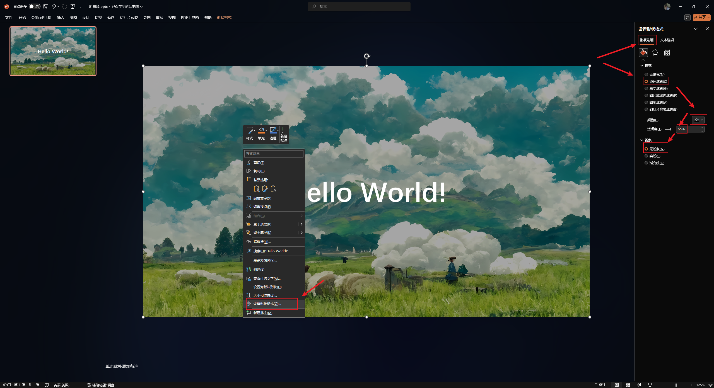

---
aliases:
  - PPT 技巧
date: 2024-11-04
---

# 对比

> [!note] 参考资料
> 1. [理解这两个字，我花了两年 | AboutPPT导航](https://www.aboutppt.com/10016.html)
> 2. [那些好看的 PPT 文字排版，都是这样做成的 - 少数派](https://sspai.com/post/51188)

# 对齐

> [!note] 参考资料
> 1. [同样都是PPT，为什么你做的这么丑！ | AboutPPT导航](https://www.aboutppt.com/79698.html)

# 核心

做 PPT 最重要的部分：

- 逻辑梳理
- 信息提炼

> [!note] 参考资料
> [原来这是做好PPT最关键的一步~ | AboutPPT导航](https://www.aboutppt.com/84357.html)
> [【新课】你真的会对文案信息进行提炼优化吗？ | AboutPPT导航](https://www.aboutppt.com/79778.html)

**我们首先要找到这一页PPT所表达的核心点是什么？只有准确的找出了核心，才能进入下一步的排版美化。**

# 蒙版

> [!note] 参考资料
> [(81 封私信 / 80 条消息) 如何给PPT添加一层图层蒙版？ - 知乎](https://www.zhihu.com/question/43613775)
> [4种PPT蒙版处理方法，惊艳领导！ - 知乎](https://zhuanlan.zhihu.com/p/581569155)
> [我是真没想到，这么多人用不好“PPT蒙版”！ | AboutPPT导航](https://www.aboutppt.com/88905.html)

## 是什么？

> 那就是找一张背景图片，然后在上面加一个黑色透明快，最后在上面加上文字等内容。

关键字：背景图片，黑色透明块

## 作用

### 弱化背景，突出文字

在PPT制作过程中，我们常常会用图片来增加页面的表现力，然而有时图片的亮度太高或者干扰元素较多时，图片很容易产生喧宾夺主的感觉。此时使用蒙版就可以弱化图片无关内容的影响，突出PPT的文字内容，让主题变的清晰。

### 遮盖图片清晰度低的缺陷

在PPT制作过程中，对于一些清晰度不高的图片放在PPT上是很影响美观的。既然图片本身就不清晰，那就让图片更加的虚化、不清楚。这个时候PPT蒙版的使用起到了遮丑的作用。

虚化、遮丑

### 制造空白区域

在制作PPT内页的时候，有时候会对产品或者创意进行介绍和阐述。这个时候用PPT蒙版的方法，勾勒出正方形或者其他异形的区域，会让PPT变的十分有层次感。

层次感

## 设置方式

- 找图（高清、色彩艳丽），铺满 PPT
- 插入-形状-矩形，让矩形铺满整个页面
- 设置矩形参数：设置形状格式 -> 纯色填充 -> 选择黑色 -> 透明度选择 50% -> 无线条
- 将主题输入在蒙版上层

# 遮罩

> [!note] 参考资料
> [简单到爆的全图型幻灯片“遮罩+动画”技巧 - 知乎](https://zhuanlan.zhihu.com/p/28862694)
> [ppt怎样制作遮罩-百度经验](https://jingyan.baidu.com/article/647f0115fd74477f2148a89f.html)

# 配色

> [!note] 参考资料
> [慕了！这家的PPT色彩教程学了就能用。 | AboutPPT导航](https://www.aboutppt.com/88122.html)
> [做职场PPT，不会配色，那就用取色大法~ | AboutPPT导航](https://www.aboutppt.com/88631.html)
> [来！看两个我常用的PPT配色法则 | AboutPPT导航](https://www.aboutppt.com/83657.html)

# 风格统一

> [!note] 参考资料
> [怎么保持每页PPT的风格统一？ | AboutPPT导航](https://www.aboutppt.com/84905.html)

# 审美

> [!note] 参考资料
> [给大家看点能提升审美的好东西 | AboutPPT导航](https://www.aboutppt.com/60539.html)

# 布尔运算

[这篇PPT布尔运算技巧，学会的人全都成了高手 | AboutPPT导航](https://www.aboutppt.com/78273.html)

# 偷懒

[总觉得PPT有点“空”，不知道缺啥？我偷偷告诉你个诀窍！ | AboutPPT导航](https://www.aboutppt.com/75605.html)

# 鱼骨图

[PPT“鱼骨”图，居然这么好用！ | AboutPPT导航](https://www.aboutppt.com/73973.html)

# 色块

[没想到小小的PPT色块竟然大有学问，有学到！ | AboutPPT导航](https://www.aboutppt.com/77737.html)