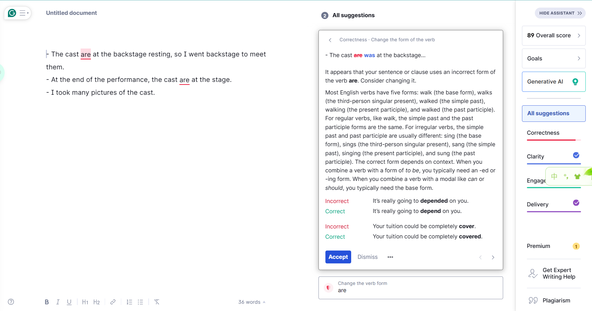

## 前言

之前在[[2024-03-25_星期一|反思了自己的学习方法存在的问题]]之后，意识到实践是学习过程中必不可少的环节。所以我现在也放慢了在多领国学习英语的脚步，学习完新的知识点后就去实践，没有像以前一样去学习下一个知识点。但是现在的问题是，我不知道该如何实践在多领国中所学到的知识点。每次打开[[使用省略]]这篇笔记想实践所学的内容时都很纠结，所以就想设计一个合理的工作流来完成所学内容的实践，减少纠结的时间。

当然现在也还在初步探索的阶段，先设计一个简单的工作流，在以后的实践中不断完善。

## 如何实践

实践的前提就是得知道自己在学什么，不同的内容实践方式也不一样。

之前我已经总结过[[基础学科/英语/语法/大纲|英语的学习大纲]]，主要包括词、基本句、谓语以及从句的学习。

多领国的每个单元有一个主题，学习的内容包括**围绕这个主题的单词以及一些句式**。例如我最近学的一个单元——[[使用省略]]，这个单元的主题就是教学生如何使用省略，背景是音乐节，新的单词和音乐节有关。

想明白了这一点，那么设计起来简单多了。实践分为两个部分，一是词的实践，二是句式的实践。

- 词的实践：记录下每个生词，为每个生词造三至五个句子；除此之外，还需要实践生词的发音；
- 句子的实践：记录每种句式的一至两个例句，并模仿此种句式造三至五个例句。

## 如何检查

光实践还不够，还差检查的步骤。不仅要执行，还得审视自己有没有做对。如果一直用错误的方式去实践，最终肯定也是错的。不仅如此，纠正错误可比从零开始学难多了。所以在造完句之后需要去检查自己造的句子有没有问题，如果存在问题，需要及时改正。

我目前还不知道该具体用什么样的方法去检查，但是我之前好像用过一个纠正语法的网站，到时候可以试试该网站。

刚刚试了一下 [Grammarly](https://app.grammarly.com/ddocs/2424635406) 这个网站，确实可行，以后就用这个网址去校验自己造的句子。

纠正的过程需要留痕，即需要把自己在最开始造句的时候放过的错误保留下来，在错误的基础上改正过来，这样就能避免以后再放类似的错误。目前我遇到过的错误的形式：

- 用错词，例如单复数、单词的时态没用对；
- 漏掉词，例如在句子中少了句子成分。

用错词，可以很好地留痕，即在错词的中间使用横线代表这个词用错了，例如：

> The cast ~~are~~ is at the backstage resting, so I went backstage to meet them.

在这个例句中，cast 是单数，谓语动词应该用 is  而不是 are。

漏掉词的情况有点复杂，不太好处理，因为 markdown 中没有与之对应的语法。既然如此，那就自己设计一种标识的方法。

如果要长久的使用下去，那就一定要简单明了，复杂的东西用不长久。

那么就用英文的括号，括号中的内容就是补充上的词，例如：

> We applauded (them) for their wonderful performance for two minutes.

在上述的例句中，applauded 后面少了 them，所以就在英文括号中加上了这个单词。