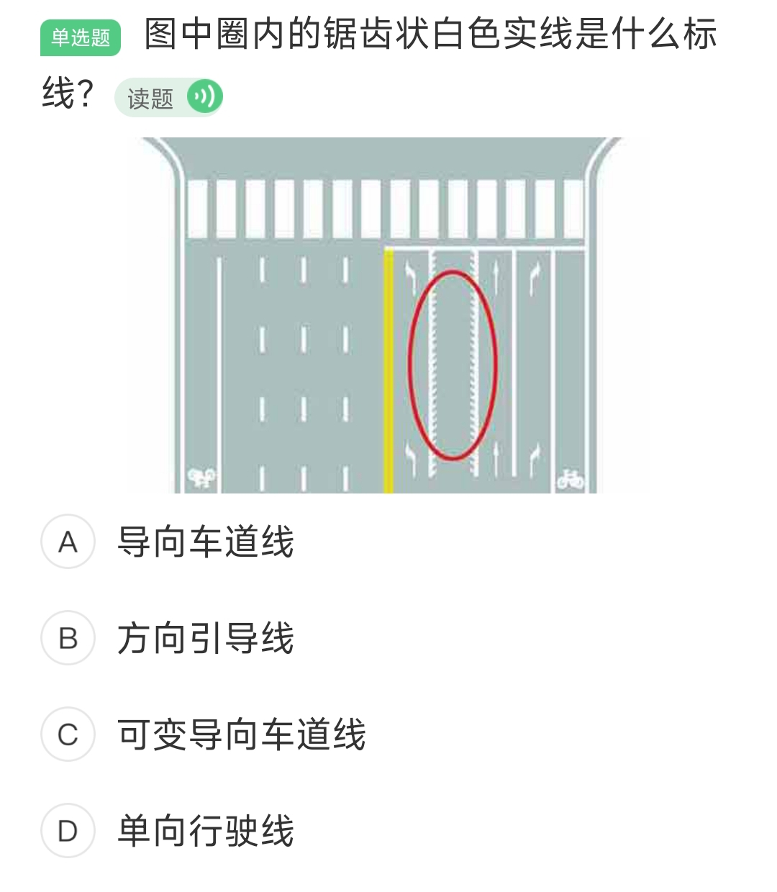
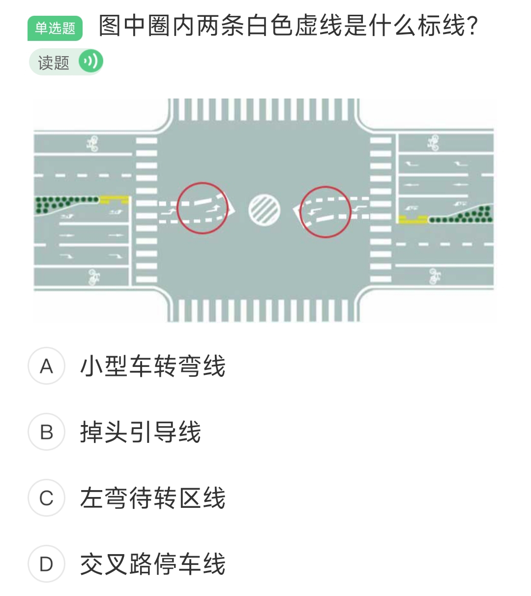
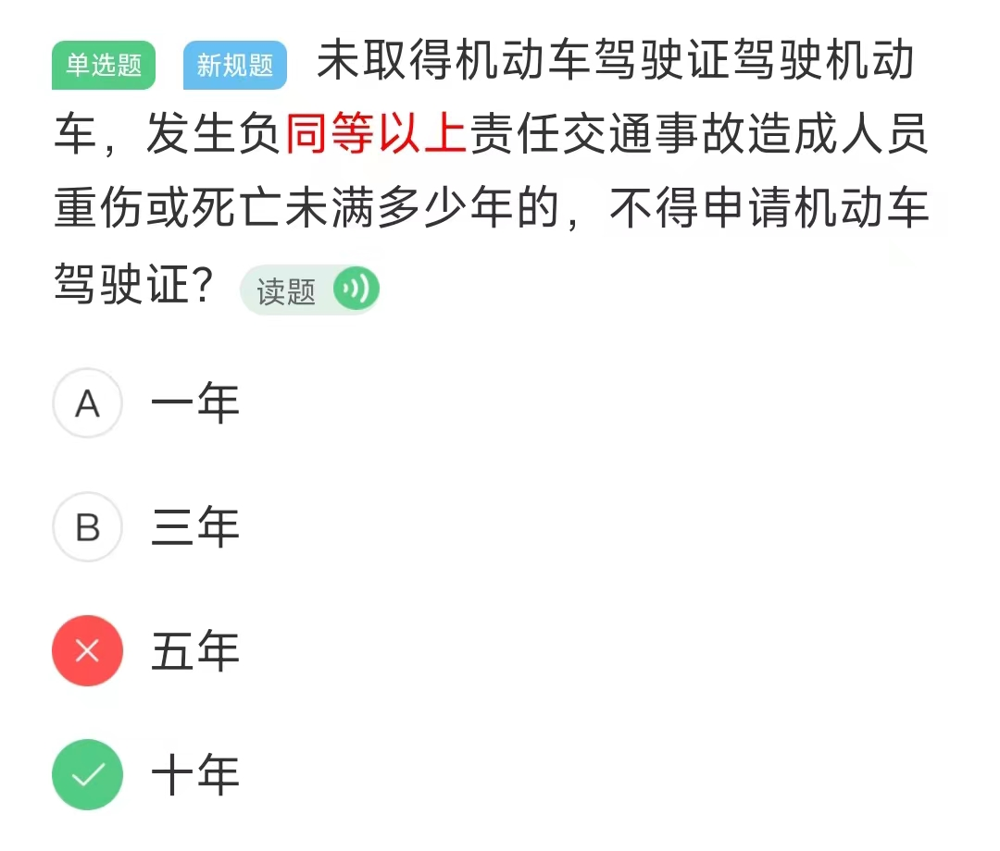

## 标线类

1、立面标志

2、接近障碍物标线

3、道路入口标线

4、可变导向车道线

5、车行道纵向减速标线

6、潮汐车道线

7、左弯待转区线

8、导流线

## 英文缩写

- 车道偏离预警系统：LDW
- 自适应巡航系统：ACC

## 车辆指示灯

1、驻车制动器及系统故障指示灯亮不能上路

点火开关装置：
- START：接通起动机电源
- ON：连通除启动机外的全部电源
- ACC：接通附件电源
- LOCK：切断电源，锁定方向盘

2、发动机水温过高

3、除霜器

4、冷却液不足

## 模考

### 第一次模考

吊销驾驶证 罚款 200~2000

货车超载 30~50 记 3 分

逃终身

发动机温度过高

手势，减速慢性

普车普路超速 50 % 扣 6 分

货车超载 30 记 1 分

### 第二次模考

追逐竞驶，处拘役并处罚金

运载超限不可解体物品，未按指定的时间、路线、速度行驶或未悬挂警示标志的

报废车辆 200~2000 吊销驾驶证

小型自动挡汽车是 C2，低速载货汽车是 C3，C2 不得驾驶 C3 准驾车型。

未取得机动车驾驶证 造成人员重伤或死亡 10年内不得申请机动车驾驶证

校中危超载小于20 6 分

车型代号：

- A1：大型客车；
- A2：重型牵引汽车；
- B1：中型客车；
- B2：大型货车。

### 第三次模考

驾驶证审验，大中型客货车驾驶证在每个记分周期结束都要在 30 日内进行审验，如果本记分周期没有扣分，则可以免于审验。

安全技术检验 1 分

夜间转弯关闭远光灯 30~100 米内

小型汽车驾驶证的驾驶人需要在有效期满换发驾驶证时接受审验

C1/C2 增驾轻型牵引挂车，需要获得 1 年以上的驾驶资格。

12分扣留驾驶证

交通肇事致一人重伤，负事故全部责任或主要责任：

- 酒后、注射毒品
- 无驾驶资格
- 明知是安全装置不全或者安全机件失灵的机动车辆
- 无牌或者已报废车辆
- 严重超载驾驶的
- 逃逸

3年内不得申请驾驶证

准驾车型：

- 20 周岁：中型客车、大型货车
- 22 周岁：大型客车、重型牵引牵挂车
-
初次只能申领大型货车，而**大型客车、中型客车、重型牵引挂车只能通过增驾获得**。

轻型牵引挂车只能通过增驾获得，即需要持有 C1/C2 1 年以上

驾驶人相关规定：
- 20 周岁：城市公交、轻型牵引挂车、中型客车、大型货车
- 大型客车、重型牵引挂车 22周岁到60周岁以下

饮酒驾车（20/100~80/100）处罚：

- 饮酒后驾驶机动车的，处暂扣六个月机动车驾驶证，并处一千元以上二千元以下罚款。
- 因饮酒后驾驶机动车被处罚，再次饮酒后驾驶机动车的，处十日以下拘留，并处一千元以上二千元以下罚款，吊销机动车驾驶证。
- 饮酒后**驾驶营运机动车**的，处十五日拘留，并处五千元罚款，吊销机动车驾驶证，五年内不得重新取得机动车驾驶证。

醉酒驾车（80/100）处罚：

- 醉酒驾驶机动车的，由公安机关交通管理部门约束至酒醒，吊销机动车驾驶证，依法追究刑事责任；五年内不得重新取得机动车驾驶证。
- 醉酒**驾驶营运机动车**的，由公安机关交通管理部门约束至酒醒，吊销机动车驾驶证，依法追究刑事责任；十年内不得重新取得机动车驾驶证，重新取得机动车驾驶证后，不得驾驶营运机动车。
- 饮酒后或者醉酒驾驶机动车发生重大交通事故，构成犯罪的，依法追究刑事责任，并由公安机关交通管理部门吊销机动车驾驶证，终生不得重新取得机动车驾驶证。

满分教育

> 机动车驾驶人在一个记分周期内累积记分达到12分及以上的，应当在15日内到机动车驾驶证核发地或者违法行为发生地所在省份任意地市公安机关交通管理部门参加为期7日的道路交通安全法律、法规和相关知识学习。完成教育学习后，参加道路交通安全法律、法规和相关知识考试。  
> 机动车驾驶人在一个记分周期内有两次以上达到12分或者累计记分达到24分以上的，需考科目一、科目三实际道路考试，具体考试流程以受理窗口告知为准。

审验教育：

> 持有大型客车、牵引车、城市公交车、中型客车、大型货车（以下简称大中型客货车）驾驶证在一个记分周期内有记分且尚未达到12分的；持有其他准驾车型驾驶证发生交通事故造成人员死亡承担同等以上责任未被吊销驾驶证的以及校车驾驶人，必须要参加审验教育。

 [学法减分_百度百科 (baidu.com)](https://baike.baidu.com/item/%E5%AD%A6%E6%B3%95%E5%87%8F%E5%88%86/49821491#:~:text=%E2%80%9C%E5%AD%A6%E6%B3%95%E5%87%8F%E5%88%86%E2%80%9D%E6%98%AF%E9%92%88%E5%AF%B9%E6%8C%81%E6%9C%89%20%E9%A9%BE%E9%A9%B6%E8%AF%81%20%E7%9A%84%E9%A9%BE%E9%A9%B6%E4%BA%BA%EF%BC%8C%E5%9B%A0%E4%BA%A4%E9%80%9A%20%E8%BF%9D%E6%B3%95%E8%A1%8C%E4%B8%BA%20%E8%A2%AB,%E8%AE%B0%E5%88%86%20%EF%BC%8C%E5%8F%82%E5%8A%A0%E7%BD%91%E4%B8%8A%E4%BA%A4%E9%80%9A%E5%AE%89%E5%85%A8%E5%AD%A6%E4%B9%A0%E5%B9%B6%E8%80%83%E8%AF%95%E5%90%88%E6%A0%BC%E5%90%8E%EF%BC%8C%E4%BA%88%E4%BB%A5%E5%87%8F%E5%85%8D%E8%AE%B0%E5%88%86%E7%9A%84%E6%8E%AA%E6%96%BD%E3%80%82%20%E2%80%9C%E5%AD%A6%E6%B3%95%E5%87%8F%E5%88%86%E2%80%9D%E6%98%AF%20%E5%85%AC%E5%AE%89%E9%83%A8%E4%BA%A4%E9%80%9A%E7%AE%A1%E7%90%86%E5%B1%80%20%E7%BB%9F%E4%B8%80%E9%83%A8%E7%BD%B2%E7%9A%84%E4%BA%A4%E7%AE%A1%E4%BE%BF%E6%B0%91%E6%8E%AA%E6%96%BD%20%E3%80%82)

> 机动车驾驶人处理完交通违法行为记录后累积记分未满12分，参加公安机关交通管理部门组织的交通安全教育并达到规定要求的，可以申请在机动车驾驶人现有累积记分分值中扣减记分。在一个记分周期内累计最高扣减6分。

机动车驾驶人申请接受交通安全教育扣减交通违法行为记分的，公安机关交通管理部门应当受理。但有以下情形之一的，不予受理：

- 在本记分周期内或者上一个记分周期内，机动车驾驶人有二次以上参加满分教育记录的；
- 在最近三个记分周期内，机动车驾驶人因造成交通事故后逃逸，或者饮酒后驾驶机动车，或者使用伪造、变造的机动车号牌、行驶证、驾驶证、校车标牌，或者使用其他机动车号牌、行驶证，或者买分卖分受到过处罚的；
- 机动车驾驶证在实习期内，或者机动车驾驶证逾期未审验，或者机动车驾驶证被扣留、暂扣期间的；
- 机动车驾驶人名下有安全技术检验超过有效期或者未按规定办理注销登记的机动车的；
- 在最近三个记分周期内，机动车驾驶人参加接受交通安全教育扣减交通违法行为记分或者机动车驾驶人满分教育、审验教育时，有弄虚作假、冒名顶替记录的。

 减免规则：

- 参加公安机关交通管理部门组织的道路交通安全法律、法规和相关知识网上学习三日内累计满三十分钟且考试合格的，一次扣减1分。
- 参加公安机关交通管理部门组织的道路交通安全法律、法规和相关知识现场学习满一小时且考试合格的，一次扣减2分。
- 参加公安机关交通管理部门组织的交通安全公益活动的，满一小时为一次，一次扣减1分。

网上满半减一；
现场满一减二；
公益满一减一；

扣留车辆：

- 行驶证
- 驾驶证

| 处罚                 | 行为                     |
| -------------------- | ------------------------ |
| **危及公共交通安全** | **干扰**公共交通正常驾驶 |
| 1年以下              | 公交驾驶人**擅离**职守   |

**2，扣留驾驶证**

①酒驾扣留驾驶证

②驾驶证扣留期间不补发

③驾驶证扣留期间不得开车，开车处15日以下拘留

①开车未带或伪造【2证2标1号牌】扣留车辆

2证：驾驶证、行驶证

2标：保险标志、检验合格标志

1号牌：机动车号牌

②未投保交强险扣留车辆，同时应缴纳保费的 2倍罚款

③需要收集证据的事故车，可依法扣留

[驾考科目一：判刑题最全技巧汇总，建议收藏（十三）_懂车帝 (dongchedi.com)](https://www.dongchedi.com/article/7212427836714680836)

