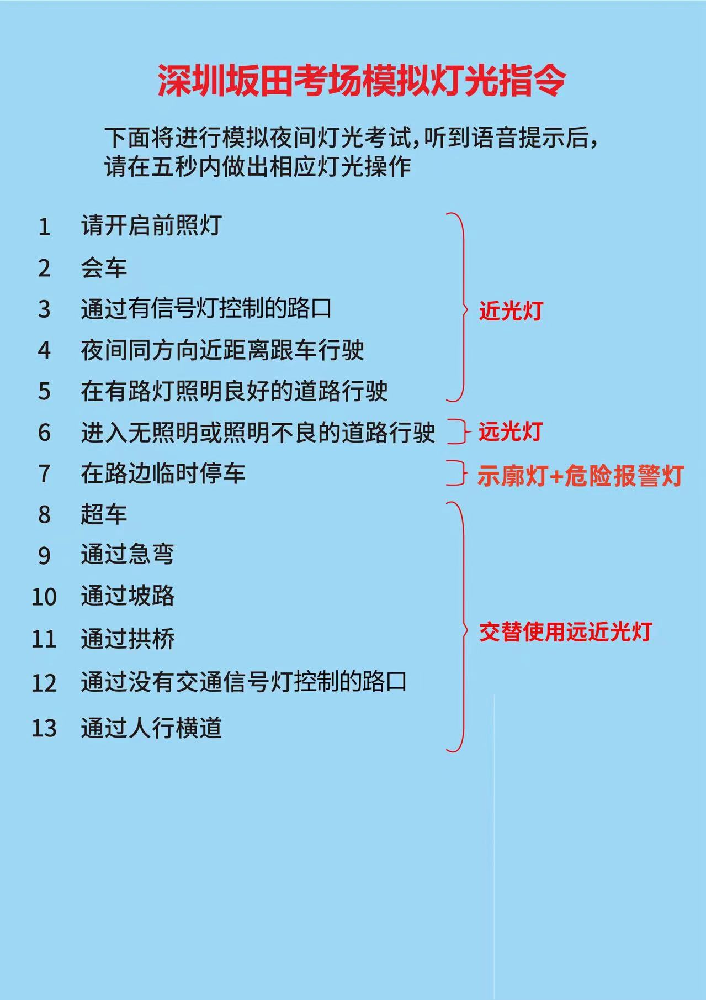

## 前言

今天九点二十五就出发前往下水径，十一点半左右抵达目的地。天气也是够离谱的，出门前还艳阳高照，刚到下水径公交站就下起了大雨！不过我随身带着雨伞，也没对我造成什么影响。

到了店里后，就开始打模拟学时，到了下午十四点，教练带我们去了一段比较偏的路段练车，主要教了我们灯光的使用，以及如何加减档。

## 模拟学时

## 灯光

### 近光灯

开启会更
有信路口
照明良好

### 远光灯

无照明或照明不良

### 示廊灯 + 危险报警灯

临时停车

### 远近交替

超急坡拱
无交路口
人行横道

## 加减档

### 不同档位

- 一档：左上；
- 二挡：在一档的基础上，从右往左带点力拍一下，随后往下下拉；
- 三挡：在二挡的基础上稍微推一下，回到空挡，马上往前推；
- 四挡：在三挡的基础上，直接往下拉到底；

### 实际操作

- 调座椅，离合、刹车踩到底，松手刹，挂一档；
- 右打转向灯，稍微右带一点方向盘，松离合，半联动状态，松刹车，一档起步；
- 起步后，慢慢把离合松到底，踩油门，将速度提升至 15 码左右；
- 离合踩到底，换二挡，松开离合（这个过程慢一点），踩油门，将速度提升至 25 码左右，换三挡。

### 注意

- 科目三控制速度是用油门，而不是离合；
- 换档位前一定要保证速度与档位想匹配，例如想要换二挡，就一定要先踩油门，将速度提升至 15 码左右，松油门，离合踩到底换档；
- 换档时，一定要把油门松开，不能同时踩离合和刹车；
- 踩刹车前，需要先把离合踩到底，再踩刹车，而且尽量不要一脚踩到底，也就是所谓的急刹；
- 等红灯时或者突发意外时需要停车，第一步是把档位回到一档（检查档位），因为起步时只能用一档，停下之后挂完一档，踩住刹车，保持半联动状态，等条件允许时再松刹车；
- 换挡不能低头看档位，车动起来的时候倒不会看，但是在停车后，回一档时，会不自觉地低头看有没有挂到一档，这是一个不好的习惯，下次练车的时候得纠正过来，其实本质上还是对档位不熟。

## 待办

路线 2 逐帧分析。