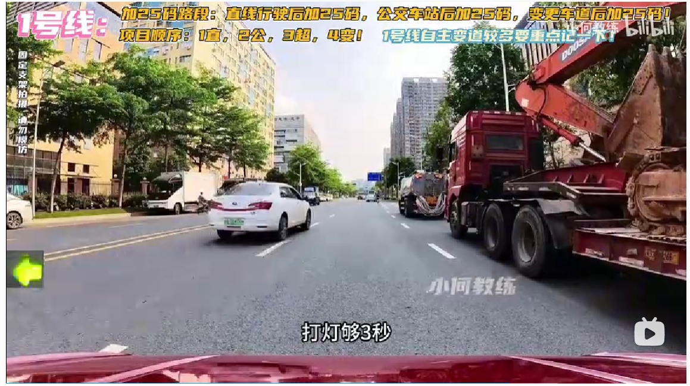

## 起步

听到==请起步==，打左转向灯，挂一档，松手刹，确认安全后，打灯够三秒后，再起步走。

三条线中，只有一号线起步需要连续变道两次

变道之后摆直，摆直之后再停车，打好左转向灯，间隔 10 秒之后再变第二次，确认安全后再起步走

变道之后，把车摆正，如果条件允许，可以上三档 25 码，刷里程

快到路口时会有语音提示前方路口直行，但实际上真正意义上的直行，而是带点左转弯，不用打灯，进入路口时注意不要踩两边实线

转过来之后差不多就要准备直线行驶的项目，系统会提示“请保持直线行驶”。听到语音后，我们就立马记住人的位置，例如你人在中间或中间偏左，你就保持那个位置走，只要人不离开那个位置，你的车就不会偏左偏右超 30，那你就是合格的，那你感觉你走路都走偏了，那就要调方向，只要感觉有点偏就调，不要让你人离开那位置，把自己当走路就好了，走路都歪了，那车肯定也歪了。在直线行驶过程中，万一有人有车是可以停车的。怎么停的怎么开起来就好了。

直线行驶项目结束后，会有语音播报前方路口直行，不管红灯绿灯都要停车

如果是绿灯，确认安全我们就接着起步走，如果是红灯就继续等候，绿灯亮起时确认安全后再起步。走起来之后，需要提速至三挡。自动挡特别容易出现 25 码一千米不够的现象，所以需要记住那些地方可以上三挡，该加速的地方就要加速。但是这个过程中需要主要，速到要保持在 20~29 码之间，不要像昨天一样[[学车/科目三/Day02#注意|忘记看速度了，三挡都快上三十码]]。低于 20 不算里程，超过三十，前面有个会车，直接挂科。

保持行驶一段时间后，会有语音播报与机动车会车，会车时速度不能超过 30 码。30 码以下直接通过。

会车结束后会有语音提示会车完毕，继续行驶，前面有一个路口，如果有人有车就及时停车，不要指望他们让你。

经过路口后会有一个蓝色指示牌，说明该处是学校区域，无语音提示，车速没有超过三十直接过。

需要注意的是，过完学习区域后会有一个急弯，这个弯是不能停车的。

过完弯之后的这段路适合上四挡，故在这里把四挡的任务结束掉。

语音提示前方路口直行，前面有个人行横道，但是没有红绿灯，只要遇到斑马线就要停车。

过了斑马线后要停车自主变道一次，等车身完全过斑马线后停车，打右转向灯，检查档位，观察右后视镜，确认安全后向右侧变道，一定要确保打灯超过三秒再变道：

变更车道后提速至三挡刷里程，要特别注意的是这段路是禁停区，不能停车，停车直接挂科。

继续行驶，语音会播报，前方路口右转，听到语音播报后不着急停，开到前面的箭头停车，停车后检查档位，打右转向灯，打灯够三秒，确认安全后变至右车道，车身摆正后把右转向灯补上。

右转，在人行横道前停车：

转弯之后，车身摆正后停车

自主向左变更一次车道，无语音播报

保持直线行驶，看到白色牌子后停车，通过公交车站，无语音播报

确认安全后起步走，只要有停就行，走之前一定要看一下后视镜有没有公交车靠站，有公交车靠站就让公交车先走。

通过公交车站后，直行即可：

语音提示，前方路口直行，在红绿灯前停车。（红绿灯路口中间是可以停车的，遇到危险停下来，确认安全后再走，但是斑马线上不能停）

绿灯起步后，加速上三挡刷里程。

一路跑，跑到斑马线前停车：

过完斑马线后就是超车项目，语音播报，请超越前方车辆，报超车就停车，检查档位，打左转向灯，观察左后视镜，确认安全后起步变道：

变道后继续往前行驶，听到已超越前方车辆后停车，检查档位，打右转向灯，观察右后视镜，确认安全后起步变道：

变回原车道后，把车身摆正后停车，检查档位，打左转向灯，观察左后视镜，确认安全后起步变道：

变道后，会有语音播报前方路口直行：

红绿灯前停车，过完红绿灯后上三挡刷里程：

语音播报，前方请选择合适地方掉头，语音报掉头，打好左转向灯

车头到达中间的虚线后停车，确认对面安全，左打满方向盘，掉头到中间的位车道：

继续往前行驶一段距离，语音播报，前方请变更车道，停车，检查档位，打左转向灯，观察左后视镜，确认安全后变道，路是弯的，两边后视镜都要看：

变更车道后，把车摆正，继续往前行驶，会有语音播报，前方路口直行，在红绿灯前停车：

过完红绿灯后，提速至三挡：

斑马线前停车，过斑马线后提速至三挡，继续刷里程：

语音播报，前方路口左转，打好左转向灯，在红灯前停车，绿灯亮起后，再起步，这里需要注意的是转弯让直行，现在亮绿灯，对面车也是可以走的，所以需要等对面车都通过后再走，如果有必要可以在路口停车：

转弯之后，走中间车道：

语音提示，请靠右停车，车身盖到提一条虚线后停车，打右转向灯，观察右后视镜，确认安全后向右变道：

变过去之后，摆正车身后停车，打右转向灯：

语音播报，靠边停车：

雨刷器的最左侧对准黄线的中间，30 秒内完成即可，停车后回空挡，拉手刹。

## 参考

[坂田科目三考场1号线最新自动挡高清视频详细讲解（考场路线没有任何变动原手动挡视频可以继续观看）_哔哩哔哩_bilibili](https://www.bilibili.com/video/BV1Dx4y1W7FT/?spm_id_from=333.337.search-card.all.click&vd_source=081641abeed94aff322f0473e2c1773d)