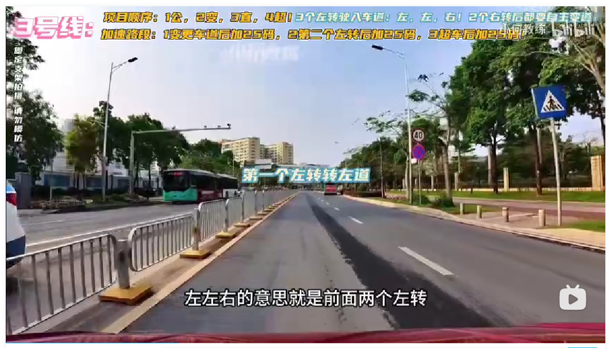
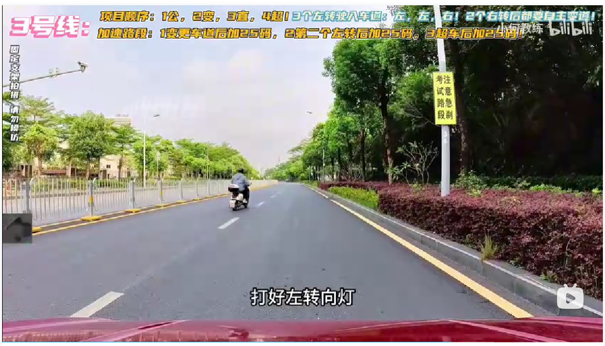

## 起步

语音播报，请起步，打左转向灯，挂一档，松手刹，确认安全后起步，起步后变道一次即可：

公交车站，无语音播报，车头对齐蓝色牌子后停车，停车后观察后视镜，如果有公交车入站就继续等待，没有就起步继续走，因为公交车站内不能停车！

语音播报，前方路口右转，听到语音后打右转向灯，开到直行箭头后停车，确保打灯够三秒，确认安全后变道过去，车身摆正，后继续把灯补上，继续往前行驶，到斑马线前停车，转弯怠速转即可，无需加油，转过去后摆正就停车，停车后需要自主向左变道一次（三号线有两次右转弯，都需要自主向左变道），变道过去之后，上二挡，无需太快，前面路况太复杂，有公交车站、有网格线，如果有公交车出站或者前面网格线有社会车辆出来，都必须在网格线前面等，一但停在网格线内就危险了，需要在 10 秒内起步，否则就挂科，所以能不停就不停：

过了网格线，语音播报，变更车道，听到变更车道后停车，打左转向灯，确认安全后起步变道，变道之后车身摆正就提速至三挡，这段弯有点急，需要注意不要压虚线，压虚线超过十秒也会挂科，菱形可以踩，这是鱼骨线，用于提示减速慢行，下坡，需要注意将车速控制在 25 码左右：

语音播报，前方路口左转，听到语音后就打左转向灯，离红绿灯有一段距离停车，并检查转向灯有没有掉，确认安全后起步，需要注意的是不需要变更至最左侧车道，转过去后，走最左侧车道，并尽快把车身摆正，为前方的直线行驶做准备：

语音播报，直线行驶，把开车当做走路，视线尽量看远点，偏了就调，只要左右不偏三十厘米就 OK：

语音播报，前方路口直行，这里的直行不是真正意义上的直行，意思是走同一条车道，有转弯，但是不需要打灯，在停止线前停车，确认安全后起步，等车头碰到斑马线时再打方向盘，打的早的会可能会碰到右边缘实线，转过去之后，上二挡行驶即可，为前面掉头做准备：

语音播报，前方请选择合适的地方掉头，语音报掉头就打好左转向灯，车头对齐中间的虚线前停车，观察路况，只要另一侧有车就不动，一直等到没车后再变道：

语音播报，前方路口右转，打好右转向灯，行驶至斑马线前停车，确认安全后起步走，过完弯之后停车，打左转向灯，确认安全后（因为路是弯的，左右两边的镜子都要看一下，不然会有盲区，万一有车转弯过来，如果一开始没看到，容易被安全员踩刹车）自主变道一次，变道之后，提速上二挡，不建议继续提速，因为路况比较复杂

语音播报，前方路口左转，打好左转向灯，离路口远一点停车，确认安全后起步，提速上二档，转到左边车道去，但是如果有车转不到左边的车道，可以转到右边的车都，随后在自主变道变至左车道，科目三需要灵活一点，车身摆正之后就提速上三挡：

语音播报，与机动车会车，车速不超过三十码直接过，行驶至斑马线前停车，走起来后继续提速上三挡：

语音播报，前方路口直行，行驶至红绿灯前停车，确认安全后起步，起步后继续提速上四挡：

语音播报，前方路口左转，听到播报后，打好左转向灯，斑马线前停车，转至右车道， #注意 这里一定得转到右车道，否则就直接挂科

如何左转弯，车身过了斑马线就打九十度，不够就加，多了就回。

语音播报，请超越前方车辆，听到超车停车，打好左转向灯，确认安全后变道，变道之后，听到已超越前方车辆后停车，打右转向灯，确认安全后向有变更车道，变道之后车身摆正，第三次加速

学校区域，时速不超过三十码直接过：

语音播报，前方路口直行，行驶至斑马线前停车，过完斑马线后继续提至三挡，刷里程，一直直行，过大弯

语音提示，靠右停车，沙井盖前停车，打右转向灯，起步对点位

语音播报，靠边停车，三十秒内停车，回空挡，拉手刹

 