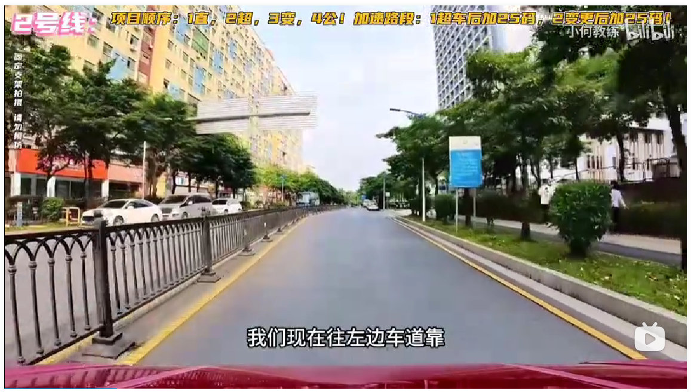
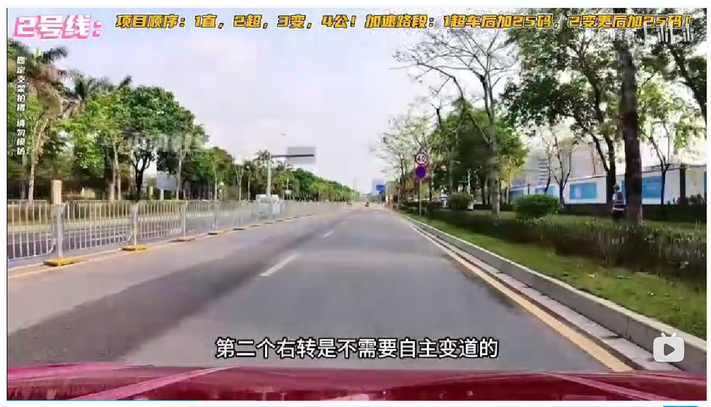
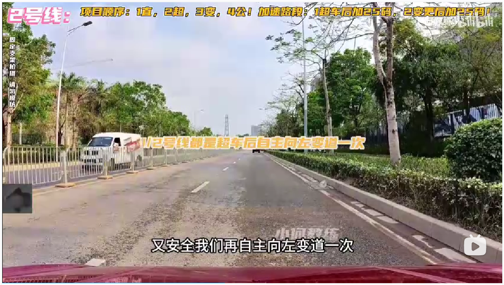
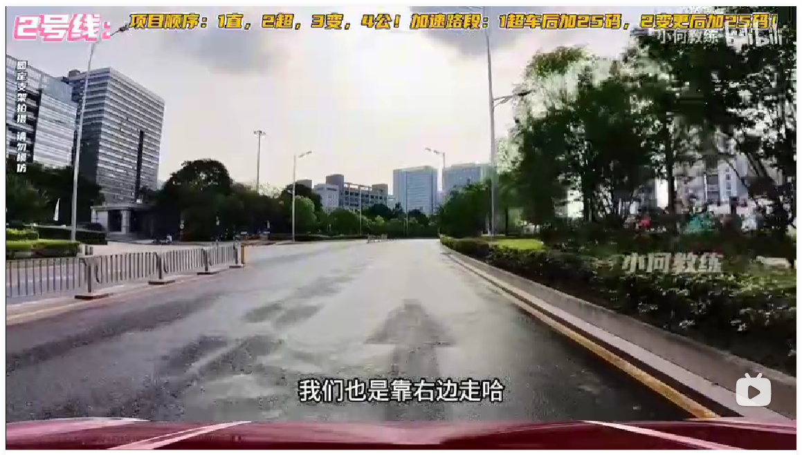

## 起步

语音播报，请起步，打灯，挂挡，松手刹

起步后自主变道一次

斑马线前停车

行驶一段路后，语音播报会提示前方路口右转，报完语音后就打上右转向灯，开到斑马线前停车

过了红绿灯之后，单车道变双车道，需要往左边的车道靠，无需打灯

前面的路口路况比较复杂，人多车多，遇到情况不对就停车，不要指望别人让你

这段路，不适合加速，右侧车道被社会车辆占用，双车道已经变成了单车道：

语音播报，前方路口右转

停车打右转向灯，自主向右变道一次

变道后，把车身摆正，并补好右转向灯：

斑马线前停车，确认安全后起步，需要注意的是这里路比较窄，不能压到实线：

转过去之后，不需要变道，直接走即可（三条线里面，只有二号线无需自主变道）

语音播报，直线行驶（人在哪个位置就往哪个位置走，没有一定要在路中间，报语音后车不能偏左或偏右超过30cm）

语音播报，前方路口直行

红绿灯前停车

过完红绿灯后语音播报，请超越前方车辆，听到超车就停下来，打灯够三秒，确认安全后起步

语音播报，已超越前方车辆，停车，打灯，确认安全，就变道过去

车身摆正之后，再自主变道一次（前面需要掉头）

车身摆正之后，提速上三挡（超车后加，变道后加，里程差不多就够了）

学校区域，速度不超过三十码直接通过

转弯之后，提速上四挡

语音播报，前方路口直行，并在斑马线前停车，走起来后继续刷里程

语音播报，前方请选择合适地方掉头，语音报掉头，就打好左转向灯

如果公厕这边有车的话就先别掉头，一直等到没车再掉头

掉头之后，摆正车身，语音播报，变更车道

车身摆正之后，提速上三挡

斑马线前停车，过完红绿灯后继续上三挡

一直往前开，过一个急弯，过弯之后语音播报，前方路口左转

红绿灯前停车，确认安全后起步左转

语音播报，与机动车会车，时速不超过三十直接过，会车完毕后靠右走

一直往前开，看到公交车站牌后行驶至车头与之对齐停车，确认没有公交车再起步

语音播报，靠右停车，听到语音后停车，打灯

语音播报，请靠边停车

三十秒内完成停车，停车之后回空挡，拉手刹

