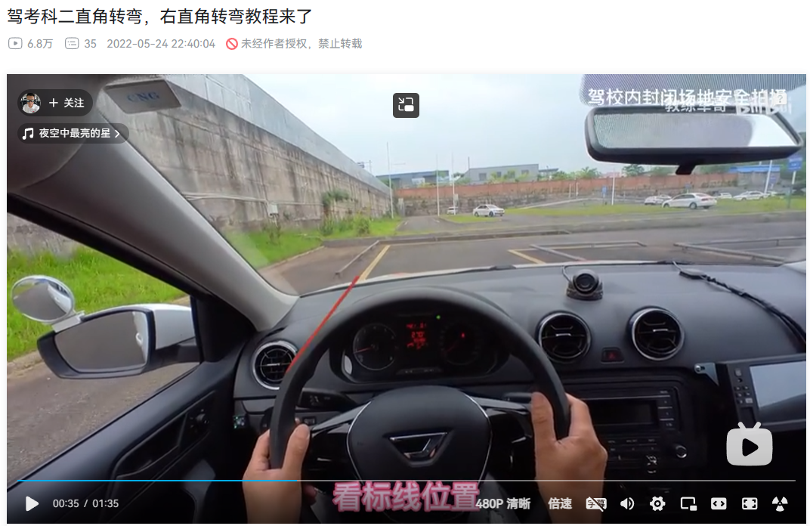

## 前言

今天下午下了很大的雨，可以说是瓢泼大雨 ，本来都不想去的，但是昨天约了教练，总不能放他鸽子，只要教练不说不练车，我就会去。

今天学了三个项目，曲线行驶、直角转弯、坡道定点。

## 曲线行驶

- 看不到左边的虚线时停车，右打满方向盘；
- 行驶到自己对准路中间的时候回正方向盘；

- 看左后视镜，当左后视镜的左边缘进入做虚线时，左打一圈方向盘，再稍微左打一点方向盘；

- 当左后视镜的镜脚 看不到左侧的实现时回正；

- 看右后视镜镜脚，一旦看到右边的黄线时，立马右打一圈加九十度方向盘；

- 继续行驶并继续观察右后视镜镜脚，一旦看不到右边的黄线时，左打九十度方向盘；

参考：

- [曲线行驶技巧，以学员视角教学，适合每一个_哔哩哔哩_bilibili](https://www.bilibili.com/video/BV1Aq4y177sh/?spm_id_from=333.337.search-card.all.click&vd_source=081641abeed94aff322f0473e2c1773d)
- [曲线行驶一把学会，满分通过技巧来了，记得点赞收藏_哔哩哔哩_bilibili](https://www.bilibili.com/video/BV1aN4y1w7XA/?spm_id_from=333.337.search-card.all.click&vd_source=081641abeed94aff322f0473e2c1773d) （☆☆☆）

## 直角转弯

过完曲线行驶后，会马上进入直角转弯，前面过完曲线行驶时方向盘保留了右打一圈的状态。

### 20240511 更新

今天才发现我之前找的视频不对，我考的是右直角转弯，而非左直角转弯，避免记混，把之前的截图都删了，重新再把这个过程梳理一遍。

- 继续行驶，直到仪表盘对准了白色水管，左打一圈方向盘回正；
- 方向盘回正后继续行驶，到差不多的位置后停车，右打满方向盘；
- 当车身回过来之后，停车，回正方向盘，打右转向灯；

- 松离合，一直往前走，右扭头观察，直到车门拉手尖角过了白黄实线，立马右打满方向盘；

车外视角：

- 继续行驶，直到仪表盘对准了第二列间隔的中心，回正方向盘；

参考：[驾考科二直角转弯，右直角转弯教程来了_哔哩哔哩_bilibili](https://www.bilibili.com/video/BV1GY4y1L7nz/?spm_id_from=333.337.search-card.all.click&vd_source=081641abeed94aff322f0473e2c1773d)

## 坡道定点

直角转弯之后就是坡道定点了。

- 慢慢松离合，并且不断调整方向盘，让仪表盘的中心对准第二列空格的中心；

- 直到左后视镜下沿超过中间实线的两指宽的位置，踩刹车，踩离合；

- 拉手刹、放手刹；

- 左打九十度方向盘；

- 踩住刹车，慢慢松离合，直到车身震动剧烈为止，松掉刹车；

- 等车身动起来之后，回正方向盘；
- 过了坡道之后，踩住离合，慢慢踩刹车；
- 等快下到坡底的时候，右打满方向盘，车身摆正之后回正方向盘。

参考：[手动挡科二必考项目坡道定点停车，详细点位教学，收藏了_哔哩哔哩_bilibili](https://www.bilibili.com/video/BV11d4y1C7Si/?spm_id_from=333.337.search-card.all.click&vd_source=081641abeed94aff322f0473e2c1773d)