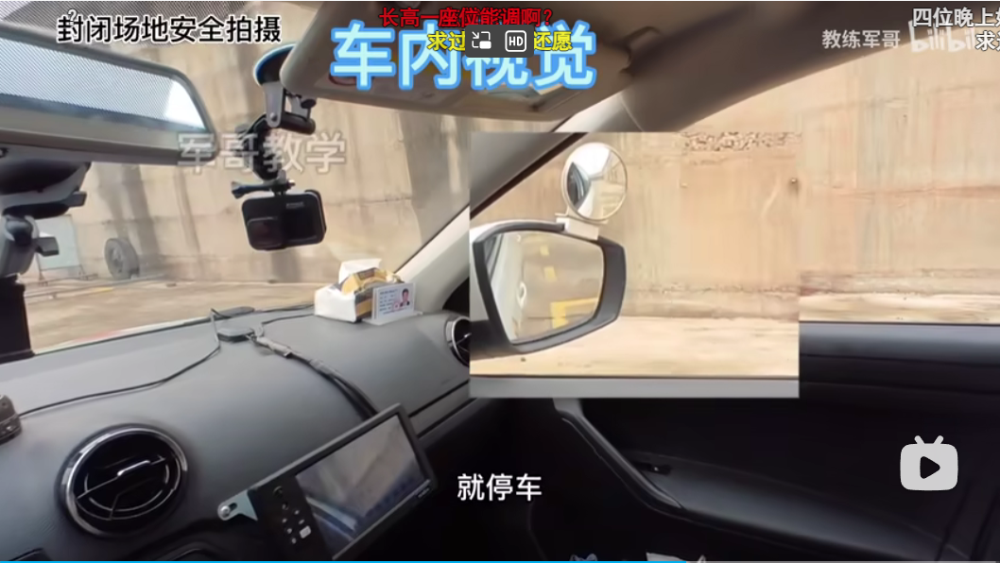
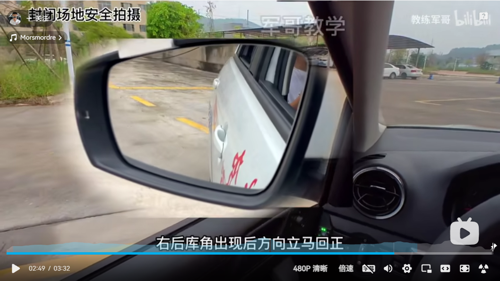
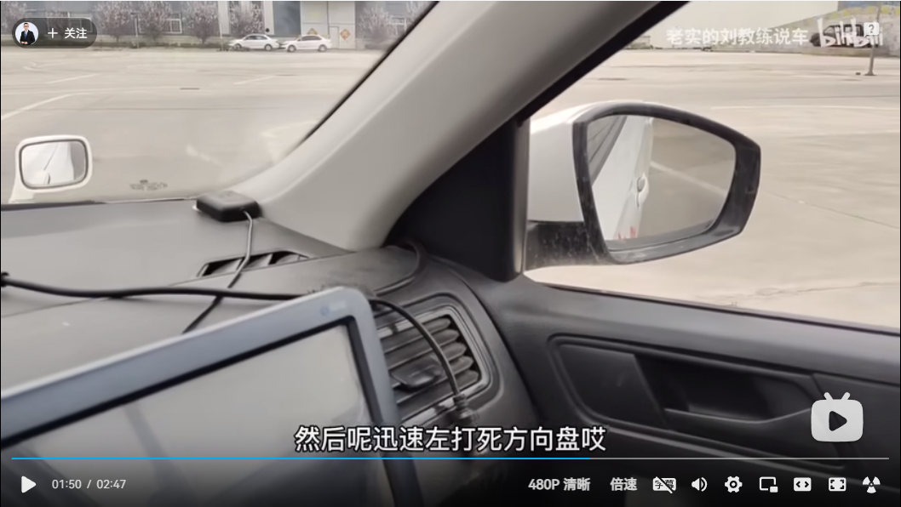
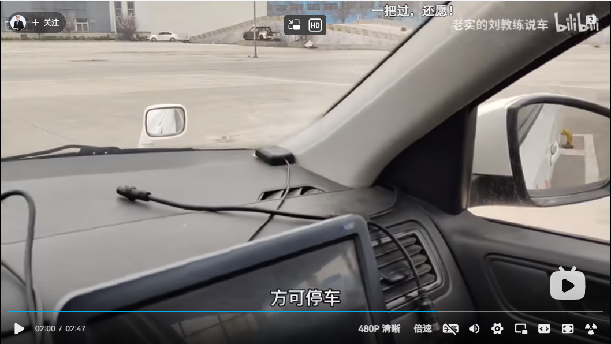
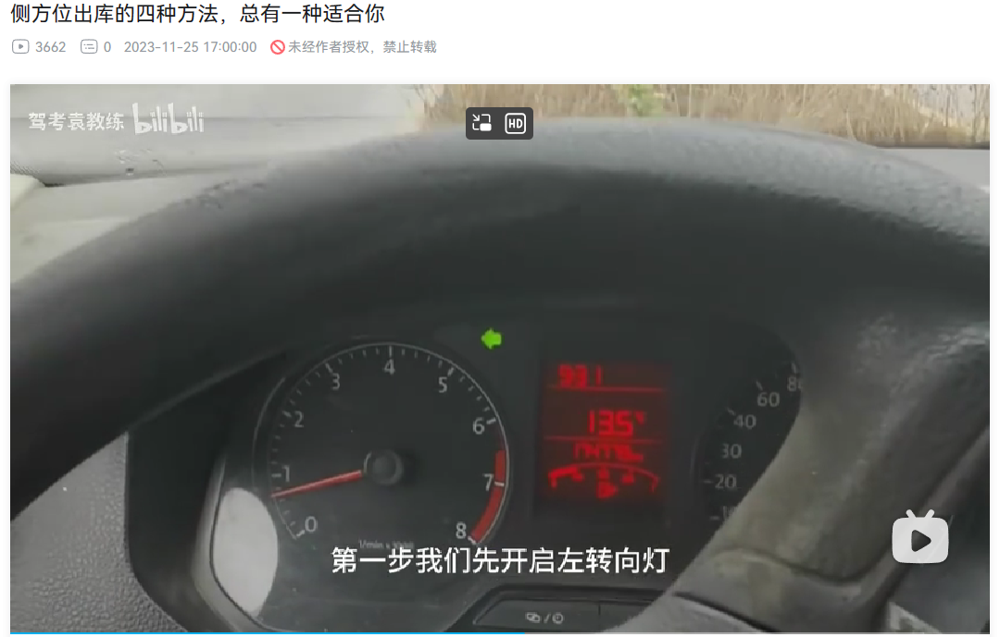
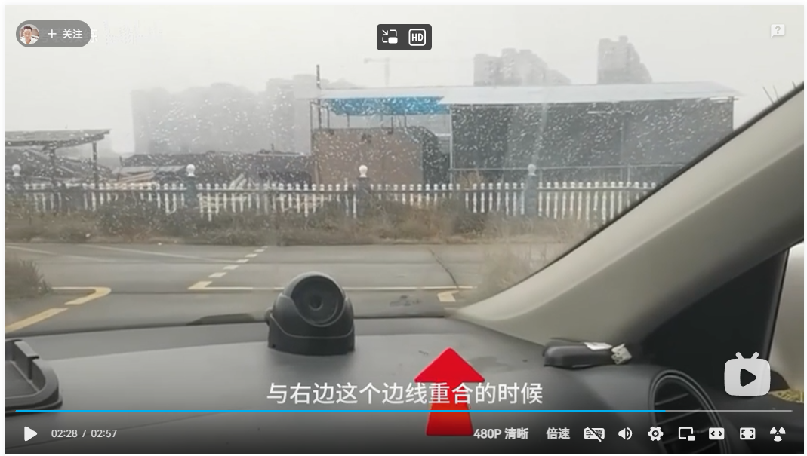

## 前言

今天练习了前几天学的内容以及学了侧方位停车。

## 侧方位停车

- 观察左后视镜，能看到镜脚中黄线两指宽，稳定一直往前走，观察右后视镜，一旦看到前库脚就停车；

- 挂倒挡，向右打一圈，马上观察左后视镜，能看到完整的第二根虚线后马上回正；

- 观察右后视镜，当前车门把手的中间与黄线相碰时，马上左打满方向盘，并观察右后视镜，当车身摆正时停车；

- 挂一档，打左转向灯，当前窗的右窗脚与边线相碰时马上回正方向盘并继续向右打一圈，车身摆正后回正方向盘。

参考：

- [驾考科二侧方位停车，详细教学_哔哩哔哩_bilibili](https://www.bilibili.com/video/BV1sY4y1T7nq/?spm_id_from=333.337.search-card.all.click&vd_source=081641abeed94aff322f0473e2c1773d) （能看到完整的第二根虚线时马上回正）
- [科目二侧方位停车，第一视角教学，所有点位清晰可见_哔哩哔哩_bilibili](https://www.bilibili.com/video/BV1KR4y1c7oD/?spm_id_from=333.337.search-card.all.click&vd_source=081641abeed94aff322f0473e2c1773d)  (右后视镜，前门把手与黄线相碰时，立即左打满方向盘)
- [侧方位出库的四种方法，总有一种适合你_哔哩哔哩_bilibili](https://www.bilibili.com/video/BV14M411f78r/?spm_id_from=333.337.search-card.all.click&vd_source=081641abeed94aff322f0473e2c1773d)（2:29 挡风玻璃的右下角与边线重合的时候马上回正方向盘并继续又打一圈）
- [科目二侧方停车，基础点位和操作方法，怎么看准左打满这个点？_哔哩哔哩_bilibili](https://www.bilibili.com/video/BV1z34y1q7w7/?spm_id_from=333.337.search-card.all.click&vd_source=081641abeed94aff322f0473e2c1773d)

## 赔礼道歉

在练完车后，[[Day05|边道歉边把烟递给教练]]，感觉道歉的话语不太对，“反正，我也不抽烟“，现在回想起来不太对。不管怎么说，教练最后收了，也算是首次给他人赔礼道歉了。不过现在脸皮好像厚了很多，一点都不感觉尴尬。好像现在的观点确实变了，我送不送是我的事，他收不收是他的事，有点像《被讨厌的勇气》中的课题分离。