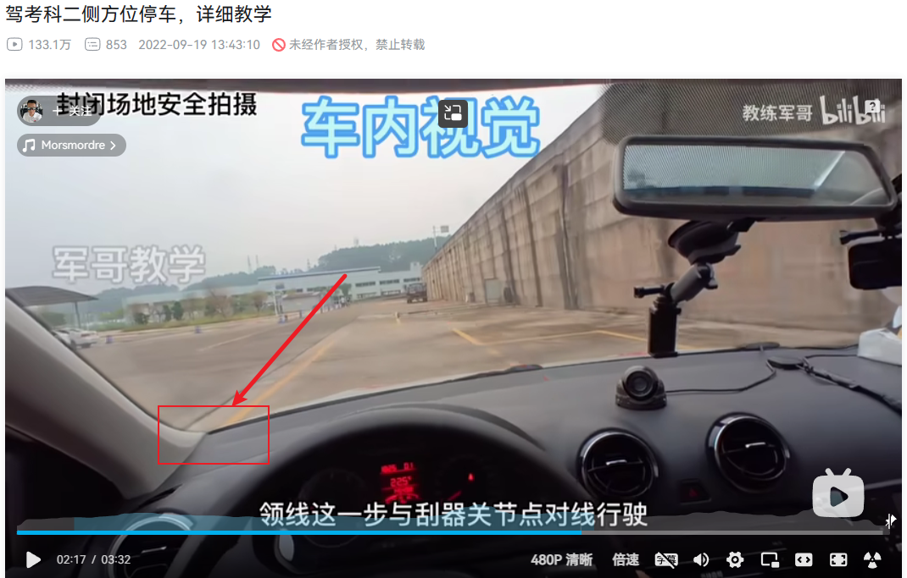
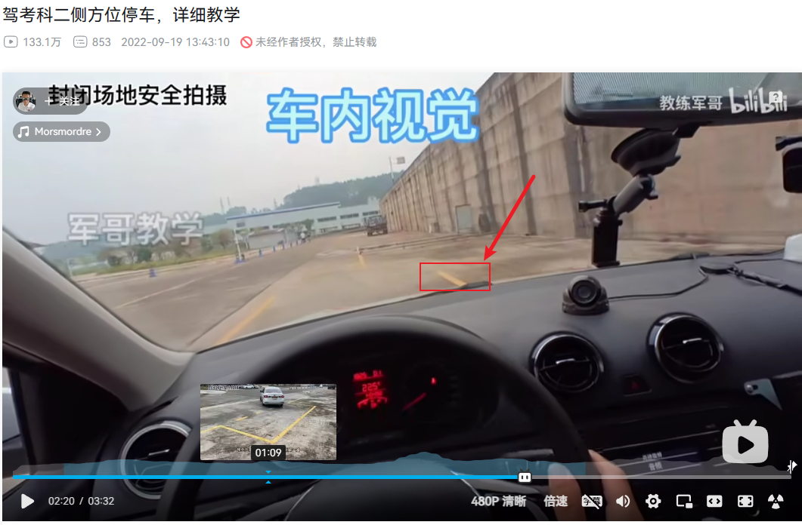
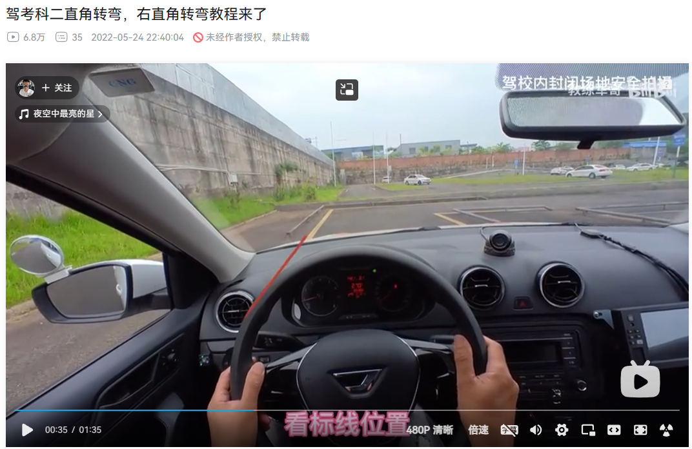
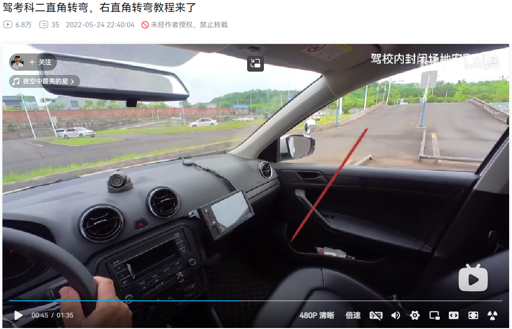

## 前言

五月五号的时候叫教练帮我预约科目二的考试，本来是打算预约五月十五号考试的，因为我觉得十五对于我来说是个幸运的数字，但是教练说预约到二十号，教练这么做是有原因的，刚好有两个周末，考前可以练四次，所以就听教练的了，希望那天有个好天气吧。

## 练车

今天下午两点就出发了，两点半才上车，我一开始以为要两个小时，可能会迟到，没想到三点四十多就到了，车上的时间一个小时十分钟就够了。提前到了也没有直接去找教练，约好的是四点半，就在附近找了个阴凉的地方，等到了四点二十多才进了训练场。

一开始教练在车上，帮我复习了一下之前学过的内容，跑了两圈之后，教练就下车了，我一个人在车上练了几圈。前几天把所有点位都截图截下来了，加上教练在旁边指导，很快就记起来了。不过有几个地方需要格外注意：

- 侧方位停车，引车时，左侧车窗要贴着黄线的内侧（左边的窗脚沿着左边的黄线），边走边调整，差不多时，观察右后视镜，看到库脚马上停车，超过了也不要紧，倒车到库脚快消失的时候再右打一圈。不过需要注意的是，中途不能停车，切记。

左窗左线：

右前线消失：

如果库脚出现时未及时停车，那么先不着急右打一圈方向盘，而是换倒挡，等到库脚快消失时右打一圈方向盘：

- 侧方位停车，[[Day06#侧方位停车|左后视镜能完全看到第二根黄线时，左打一圈回正，而不是左打死]]；
- 侧方位停车，当右车把手的中间碰到黄线时，立刻左打死，直到车身与黄线平行时停车，没有平行前别停车，否则前轮有可能还未入库；
- 曲线行驶，[[Day04#曲线行驶|黄线左镜脚消失时，右打一圈回正，等右黄线出现时才是右打一圈加九十度]]；
- 直角转弯，引车时，黄线距离左侧窗脚一掌宽的位置，**等到车门把手最后一个尖角过了白色实线一半的位置后立刻右打死方向盘**，不是之之前记的位置，这里要纠正过来；

黄线在在车窗内一掌宽的位置：

右打死方向盘：

参考：[驾考科二直角转弯，右直角转弯教程来了_哔哩哔哩_bilibili](https://www.bilibili.com/video/BV1GY4y1L7nz/?spm_id_from=333.337.search-card.all.click&vd_source=081641abeed94aff322f0473e2c1773d)

- [[Day04#坡道定点|坡道定点]]，一定要找准半联动的点，今天在练车时有两次都熄火了，要是考试的时候熄火了就直接寄。

现在已经能够控制车速了，发现车速慢，点位对了，基本上都没问题。

除此之外，一次练车练一个小时差不多就够了，时间越久，左脚越累，离合控制地就越差，精神也比较涣散，所以出错的可能性也越大。
