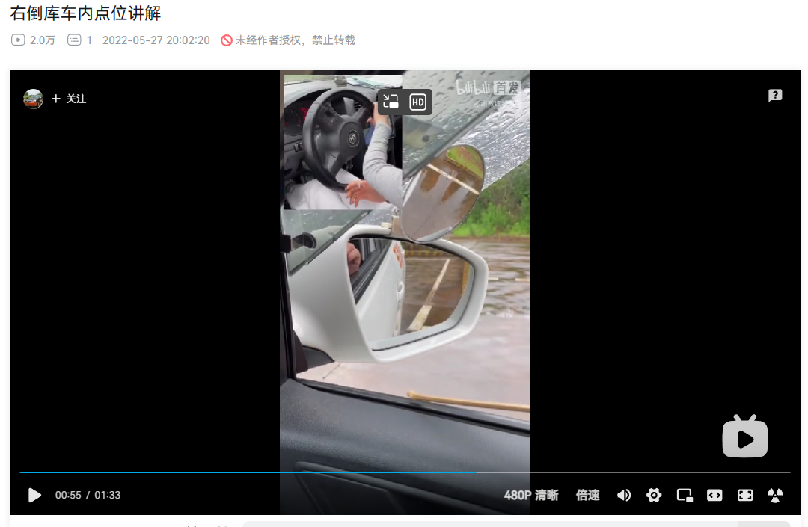

## 前言

今天上午去了面试，下午1点钟跟着教练去了练车。今天主要学的倒车入库，包括左倒车入库，右倒车入库。

## 左倒车入库

当自己的肩膀在第一根虚线和第二根虚线之间，左打一圈半（这里应该错了，应该是一圈加九十度）方向盘，直到虚线和方向盘对准之后停车，挂倒挡。倒车直到车尾遮住第一个库脚时左打满方向盘，继续倒车，直到车尾过了最后一根虚线之后回半圈。继续倒车并观察右后视镜，看到库脚出来的时候，回正方向盘（这里只要转一圈即可，前面在最后一根虚线的时候回了半圈）。再观察左右后视镜，看看车身是否和库线平行。如果观察右后视镜，发现是后窄前宽，说明车尾是往右偏的，车尾往那边偏就举哪只手，例如这次是右偏，就把右手举到十二点，并继续往后倒，当车身与库线平行的时候，方向盘回正，继续倒车并观察左后视镜，直到左后视镜与库线平行的时候停车。

- 当自己的肩膀在第一根虚线和第二根虚线之间时，左打一圈加九十度方向盘；

- 直到虚线和方向盘对准之后停车，挂倒挡；

- 观察左后视镜，倒车时保持方向盘不动，直到车尾遮住库脚时，左打满方向盘；

- 继续倒车，直到车尾过了最后一根虚线之后回半圈（教练教的是最后一根虚线剩下三分之一的时候回半圈，就按照教练教的操作）。

- 继续倒车并观察右后视镜，看到库脚出来的时候，回正方向盘（这里只要转一圈即可，前面在最后一根虚线的时候回了半圈）。再观察左右后视镜，看看车身是否和库线平行。

- 如果观察右后视镜，发现是后窄前宽，说明车尾是往右偏的，车尾往那边偏就举哪只手，例如这次是右偏，就把右手举到十二点，并继续往后倒，当车身与库线平行的时候，方向盘回正；

- 继续倒车并观察左后视镜，直到左后视镜与库线平行的时候停车。

参考：[科目二倒车入库，左倒库基础点位操作，适合新手学员练习，车内视角。_哔哩哔哩_bilibili](https://www.bilibili.com/video/BV1wX4y1P7cp/?spm_id_from=333.337.search-card.all.click&vd_source=081641abeed94aff322f0473e2c1773d)

## 右倒车入库

首先是出库，挂一档，松刹车，慢慢松离合器，直到车身震动为止，脚跟靠住车底，慢慢前进，直到引擎盖遮住第一条黄色实线，马上右打满方向盘。

车头转过来之后，马上回正。挂倒挡，观察右视镜，看车身是否和右边的一条黑线平行，如果不平行，打方向盘使之平行，倒车的时候快一点，到了快靠近一条实线的时候停车，挂空挡，挂一档，调整方向盘，让方向盘的中心对准前方第三条虚线的中心，调整完之后，一直往前开，直到方向盘对准实线之后，挂空挡，挂倒挡，倒车，直到左视镜离实线有三指宽的位置右打满方向盘，观察右视镜，直到车尾遮住最后一根虚线的一半，左交叉打方向盘，继续倒车，直到看不到库脚时，右交叉方向盘，继续倒车，直到看到后库脚时，回正方向盘，观察左右视镜，那边偏了就往反方向打方向盘，继续倒车，直到左视镜离实线有两指宽的地方停车。

- 一直往前开，直到方向盘对准实线之后，挂空挡，挂倒挡，倒车；

- 直到左视镜离实线有三指宽的位置右打满方向盘；

- 观察右视镜，直到车尾遮住最后一根虚线的一半，左交叉打方向盘；

- 继续倒车，直到看不到库脚时，右交叉方向盘；

- 继续倒车，观察左后视镜，直到看到后库脚时，回正方向盘；

- 观察左右视镜，那边偏了就往反方向打方向盘，继续倒车，直到左视镜离实线有两指宽的地方停车。

参考：

- [右倒库简易教学，怎么判断库角距离，只记住这个点位就够了_哔哩哔哩_bilibili](https://www.bilibili.com/video/BV1Y5411K7Sa/?spm_id_from=333.337.search-card.all.click&vd_source=081641abeed94aff322f0473e2c1773d)
- [科目二倒车入库，右倒库详细讲解。_哔哩哔哩_bilibili](https://www.bilibili.com/video/BV1GW4y1k7G1/?spm_id_from=333.337.search-card.all.click&vd_source=081641abeed94aff322f0473e2c1773d)
- [右倒库车内点位讲解_哔哩哔哩_bilibili](https://www.bilibili.com/video/BV1Ur4y1s7VL/?spm_id_from=333.337.search-card.all.click&vd_source=081641abeed94aff322f0473e2c1773d)