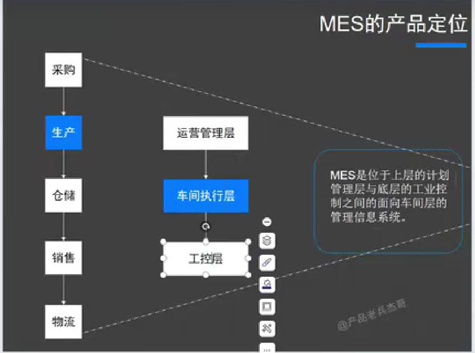

## 前言

## 工作内容

- a. 智能制造专案推动
- b. 流程梳理，通过系统化推动业务转型 
- c. MES 系统方案规划及导入推动 
- d. 自动化设备与 MES 系统对接评估 
- e. 工业 APP 需求分析与导入推动

### MES 系统是什么？

MES 是 Manufacturing Execution System（[制造执行系统](https://www.zhihu.com/search?q=%E5%88%B6%E9%80%A0%E6%89%A7%E8%A1%8C%E7%B3%BB%E7%BB%9F&search_source=Entity&hybrid_search_source=Entity&hybrid_search_extra=%7B%22sourceType%22%3A%22answer%22%2C%22sourceId%22%3A3317766699%7D)）的简称，是一套面向制造企业车间执行层的生产信息化管理系统，负责承接ERP系统下达的生产计划，与ERP关系密切。MES能通过信息传递，做到生产追溯、质量信息管理、生产报工、设备数据采集等功能，实现对从订单下达到产品完成的整个生产过程进行优化管理。

总的来说MES就是： 根据ERP系统传来的订单，生成生产计划，该计划包含了该产品所涉及到的原材料，然后再向WMS也就是仓储，调出生产的原材料，根据生产计划，标准的确定每个工序需要多少人，每次投入多少材料，需要多少工序，良品率多少，等等。。最后核算出成本，反馈于ERP汇入总账。

这期间所衍生的其他项：例如生产报表，品检报表，工序计划表，等等一系列表，都是为了上面那些工作服务的

  参考：
  
1. [五分钟让你清楚什么是MES - 知乎 (zhihu.com)](https://zhuanlan.zhihu.com/p/84475833)
2. [什么是 MES 系统？| IBM](https://www.ibm.com/cn-zh/topics/mes-system)
3. [(41 封私信 / 79 条消息) 制造执行系统（MES）的核心功能是什么? - 知乎 (zhihu.com)](https://www.zhihu.com/question/19755470)
4. [小白入门MES - 知乎 (zhihu.com)](https://zhuanlan.zhihu.com/p/408450525)
5. [(41 封私信 / 79 条消息) 想成为一名MES系统的项目经理，小白一名该如何下手学习？ - 知乎 (zhihu.com)](https://www.zhihu.com/question/46780908)

什么是 MES 系统？
要成为一名 MES 系统的项目经理，该学习哪些内容？

## MES 系统和 ERP 系统本质上有什么不同

- MES 系统更专注车间生产过程的管理与控制，包括生产调度、工序管理、质量管理等，是针对制造业中的生产过程管理；
- ERP 系统更关注的是企业级的生产规划和管理，涵盖财务、人力资源、采购等方面，是企业级的生产管理工具。

ERP 系统和企业的运营息息相关，而MES系统则更关注于生产过程的管理、监控与变化。

[富士康该不该去？去的话该怎么选集团？ - 知乎 (zhihu.com)](https://zhuanlan.zhihu.com/p/487323141)

## MES 系统入门

参考：[MES系统产品经理，从0-1入门，只需2小时|工业互联网|生产制造供应链_哔哩哔哩_bilibili](https://www.bilibili.com/video/BV1FC4y1X7ac/?spm_id_from=333.337.search-card.all.click&vd_source=081641abeed94aff322f0473e2c1773d)

### MES 专注生产问题

- 什么时候生产
- 在哪生产
- 谁生产
- 生产多少
- 怎样生产
- 生产什么
- 生产得怎么样
- ...

### MES 的产品定位

MES 是位于上层的计划管理层与底层的工业控制之间的面向车间层的信息管理系统。

### MES 的涉及范围

人机料法环。

法：方法，工艺。