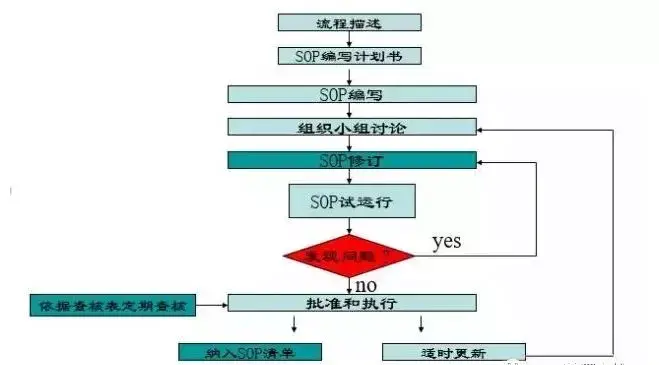

## 招聘要求
[深圳市金威源科技股份有限公司招聘要求：](https://jobs.zhaopin.com/CC120010680J40541029810.htm?refcode=4019&srccode=401901&preactionid=847ffbe3-3e71-403b-b45a-674a9468683c)

SOP：

1、工作方法的设计和改善、  
2、操作标准时间及物料标准用量的设订、制程、  
3、品质分析与管制、  
4、工厂布置、工业安全作业、  
5、工作评价与奖工制度的设立、  
6、事务流程的改善、系统或制度的设计

任职资格：

1、高中以上学历  
2、乐于学习、能吃苦耐劳

我感觉我都符合，第一点，高中及以上学历，我的学历是本科。第二点乐于学习，通过自学转行当了程序员；吃苦耐劳，我是从农村出来的。

## 什么是 sop

**什么是SOP？**

Standard Operation Procedure

所谓SOP，是 Standard Operation Procedure三个单词中首字母的大写 ，即标准作业程序。

是以文件的形式描述作业员在生产作业过程中的操作步骤和应遵守的事项；

是作业员的作业指导书；是检验员用于指导工作的依据。
  
“制造”就是以规定的成本、规定的工时、生产出品质均匀、符合规格的产品。要达到上述目的，如果制造现场之作业如工序的前后次序随意变更，或作业方法或作业条件随人而异有所改变的话，一定无法生产出符合上述目的的产品。  

因此，**必须对作业流程、作业方法、作业条件加以规定并贯彻执行，使之标准化。这就是SOP的作用。**

将企业积累下来的技术、经验记录在标准文件中,以免因技术人员的流动而使技术流失；

使操作人员经过短期培训，快速掌握较为先进合理的操作技术；

根据作业标准，易于追查不良品产生的原因；

树立良好的生产形象，取得客户信赖与满意；

实现生产管理规范化、生产流程条理化、标准化、形象化、简单化；

是企业最基本、最有效的管理工具和技术资料。

## 编写流程

## **SOP六要素**

### **物料名称及数量**

在生产前须确认好本工位所需的物料和准备的物料是否一致、数量是否正确，物料是否经过IQC检验。当全部确认无误后方能上线生产。

  

生产过程中绝不接受不良品，绝不生产不良品，绝不传递不良品。

### **工装夹具**

每天上班前对夹具进行校准检查，确认工装夹具是否能够正常使用。

### **设备名称及参数**

设备操作工必须经培训合格后方能上岗操作机器，在设备开启前先仔细阅读设备使用说明书及设备各参数的设定值，然后按照使用说明书对机器进行操作，且确定设定的各参数值与要求的参数值相同。

### **作业步骤**

操作步骤是SOP内容中的重点，必须简洁、明了，让人一看就懂，一看就知道怎么操作。SOP需要达到的效果是一个新人一来就可以独立操作且产品质量合格，这也是SOP的最高境界。

### **人员配置**

SOP中各工位须确定人员，这样可以避免每天上班还得需要班组长对人员进行分配。这样每天上线前员工知道自己要做什么准备，并且可以让他们更熟练本工位工作。工位定员的话既可以节约时间，又可以保证质量。

### **安全因素**

任何操作都有可能导致产品的质量问题，所以我们在SOP中必须包含操作的注意事项、检查项目和一些人员安全须知。

## 参考

[干货 | 一份标准作业流程SOP详解，附流程图绘制规范，不愁不会画！ - 知乎 (zhihu.com)](https://zhuanlan.zhihu.com/p/33435199)