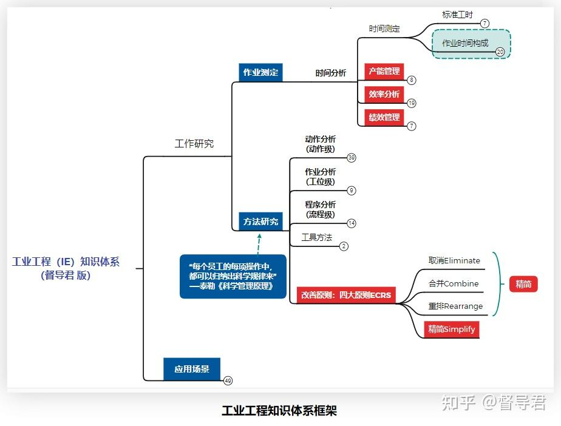
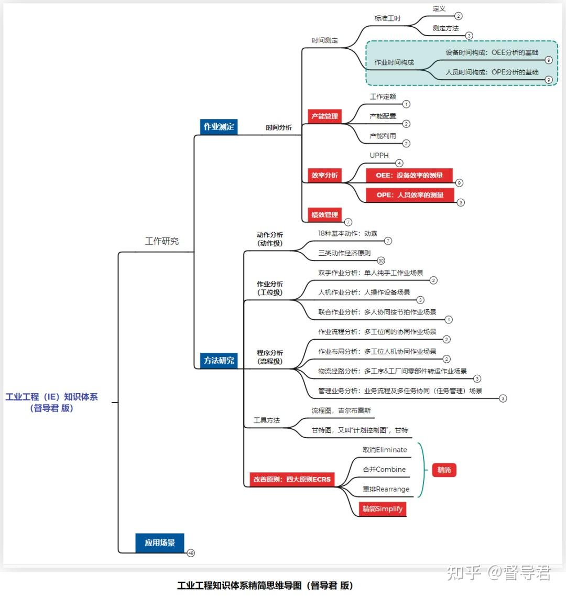
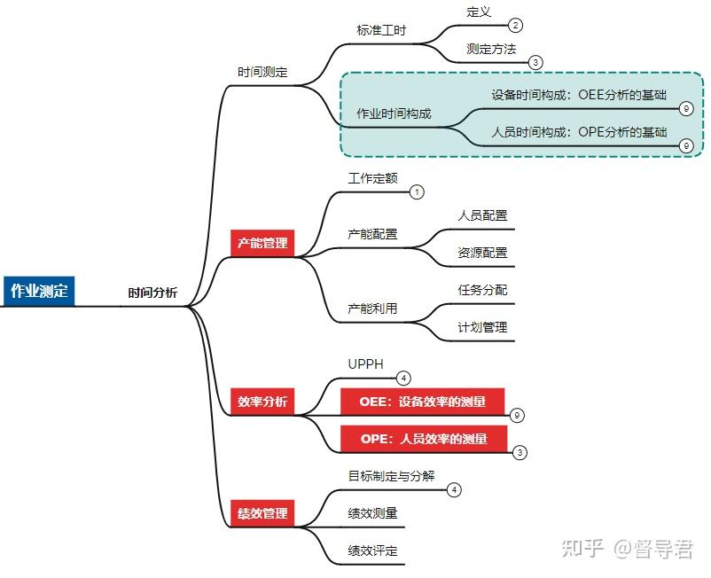
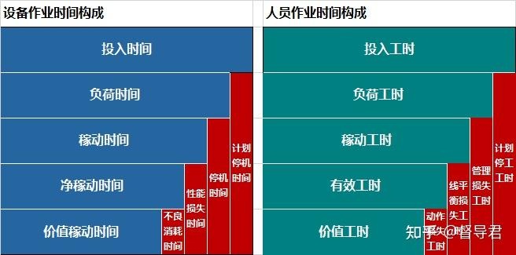
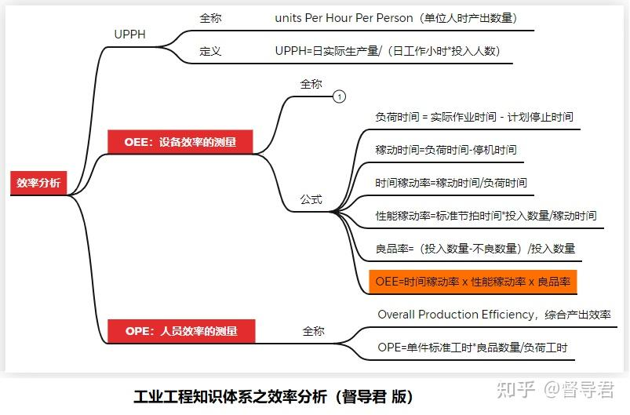
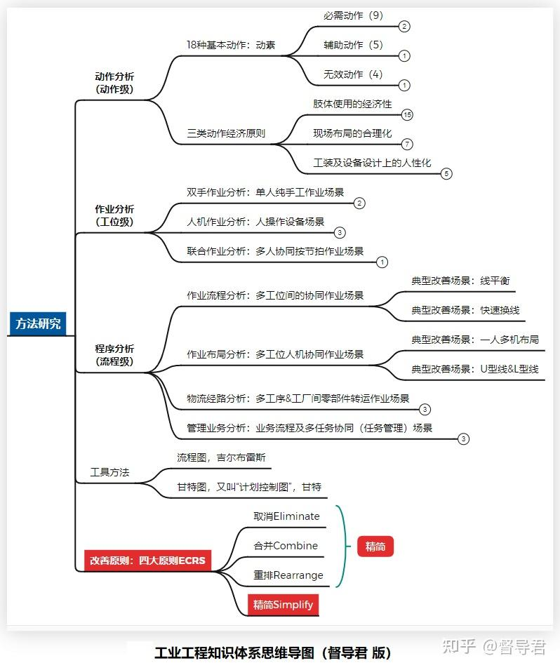
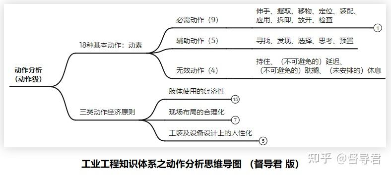
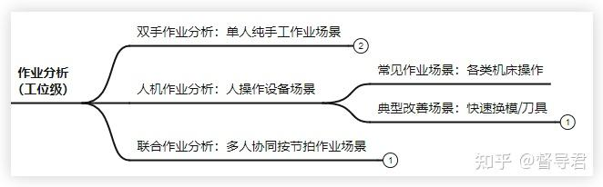
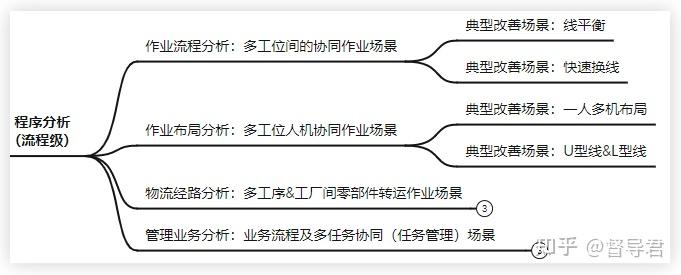
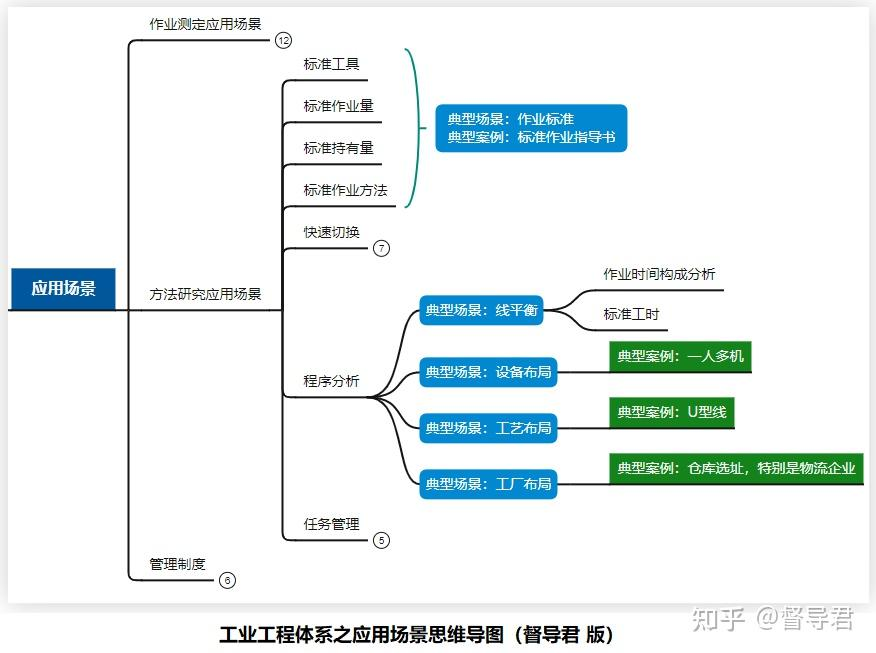

创造绩效是管理者的使命，而提升生产效率这一关键绩效则是**「生产管理者」**的使命。

无数生产管理同行终日惶惶都在为效率如何提升而发愁，从小鲜肉熬成了大叔，苦苦探索效率提升的九阳神功。

工业工程（IE, Industrial Engineering）正是效率提升的九阳神功，是提升生产效率的系统性指导方法。

它是从泰勒的管理实践中总结开创的以**自然科学的试验方法、理性地分析及精确地衡量为核心方法**的专门学科，是生产管理者非常重要的一课。

这是一门实践课，其方法都是直接从实践经验中总结而来。实际上，无论是否上过这一课，生产管理者都或多或少地实践着这门课的方法和原则，从这个角度讲，这也是生产管理者每天都要做的日课。

## **传统IE知识体系框架**

IE是一项综合性的应用知识体系，这些知识体系围绕着解决现场问题而不断丰富、完善，其中一些专业技术在后来的发展中成为专门的学科，这让一些新人反而弄不清楚工业工程到底是什么、解决什么问题的。

今天，我尽量以精简地结构拆解传统IE的知识体系，并结合应用场景来帮助大家理解，下图即是子支折叠后的传统IE知识体系结构概貌。

从解决问题的角度，传统的工业工程所做的**工作研究**主要分两个方面：**作业测定**和**方法研究。**

### **1、作业测定**

作业测定（也即时间研究）是最基础的工作，它从两个维度做对时间做了测定：

一是，从**作业标准化**的角度测定**标准工时**

一旦测定，这个标准就成为所有生产管理相关人员协作和推进工作的基准。现场管理人员就要努力通过选拔和培训将作业员的技能达到这个标准，而产能配置、计划管理、库存及周期管理等相关人员的工作也是基于这个标准。

现在这些工作都已IT化到企业资源计划管理系统中，标准工时是产能管理、计划管理以及这些流程IT化之后的自动执行、智能分析和决策的基础。其准确性直接影响到管理工作的绩效：计划及交付的准时性、周期的长短、存库量的大小等。

二是，从**人和资源作业时间有效性**的角度测定**作业时间构成**

因为性质不同，作业时间构成的测定将人和资源的作业时间分别做了定义及分析，对应着人的效率指标OPE和设备的效率指标OEE。

作业时间的构成分为有效时间和无效时间，其中，有效时间即是贡献产出的产能，无效时间则是损失，是分析和改善的重点。

相对于标准工时，生产管理相关人员的日常工作更多是围绕无效时间（或无效动作）的改善来展开的。为了针对性地分析和改善，测定中还将无效时间做了进一步的细分，比如线平衡的损失、设备异常停机等时间损失。

标准工时和作业时间构成的测定作为基础工作支撑了生产管理的各个方面的业务推进，比如产能管理、效率分析和改善以及效率改善的绩效衡量和评价等工作。

### **2、方法研究**

方法研究对作业步骤从**微观**的作业动作到**宏观**的整个作业流程分层次进行研究和指导主要可分为三个层次：

1）、**作业「动作级」的动作分析**，如左右手的动作分解及优化；

2）、**作业「工位级」的作业分析**，如用电批紧固螺钉、操作铣床等作业；

3）、**作业「流程级」的程序分析**，如线平衡、U型线、设备布局、工厂选址等。

无论是在哪个层次上，作业改善方法和原则的本质是：

**要么是从作业动作上区分有效动作和无效动作，要么是从作业时间上区分有效时间和无效时间。在此基础上，减少无效动作并精减必要动作，以及减损失时间从而提升人和资源的时间利用率。**

这正是时间分析和动作分析的主要目的，也是工业工程的本质。理解了这一点，就理解了工业工程中**方法研究**的核心。

理解了上面这几句话，再看下面思维导图的逻辑结构就明白多了。

大家平时找资料看，会觉得名目繁杂、概念众多，从**作业测定（时间分析）**和**方法研究（作业分析）**两个方面进行梳理和归纳，就有条理了。

## **一、作业测定（时间分析）**

**作业测定，即是常说的时间分析，**包括是时间测定、效率分析、产能管理、（效率改善的）绩效管理。

时间测定为产能管理、效率分析与改善、（效率改善的）绩效管理等工作做准备。

### **1、时间测定**

管理大师彼得.德鲁克讲“你如果无法测量它，就无法管理它”。

对于效率的管理，清晰地定义并精确地测定时间构成即为了有序地推进效率改善。

时间研究中，两项最基础的工作是**测定标准工时**及测量**作业时间构成**的各个时间因素。

**1）标准工时，**是这些概念中大家最基础也最熟悉的一个，是产能及效率管理的基础，是人力及设备资源配置、作业分配、产能分析与规划、计划管理、绩效评价等各项与生产交付任务的管理最直接相关的管理基础工作，同时也是人员效率的OPE和设备效率的OEE等**效率分析**的基础工作。

**2）作业时间构成**，是定义人员及设备的有效时间和无效时间的各项时间构成项，纯人力作业与设备操作类的损失原因差异较大，所以分别定义，分别分析。

以**设备作业时间**的构成来说明：

- 总的**投入时间**分解为负荷时间和计划停机时间，以识别有计划、有安排的停机，如中休吃饭及换班时间等；
- 而**负荷时间**又分解为稼动时间和异常停机时间，以识别计划外的停机，如设备故障损失时间等；
- **稼动时间**又分解为净稼动时间和性能损失时间，以区分设备性能未发挥到最大的损失时间等；
- **净稼动时间**又分解为价值稼动时间和不良消耗时间，以区分不良品的生产及返工的损失时间等。  

稼动时间：负荷时间减掉换模、换刀具、故障、调整等的时间。

其中**价值稼动时间**是真正有效创造产能的作业时间，这部分时间在总投入时间占比越高，实际效率就越高。

分类测定这些时间构成项的主要目的是分类分析效率现状和损失的原因，显然，原因不同，改善对策及责任单位也是不同的。

比如**计划停机时间**，指的是中休、吃饭、换班等时间，这是有计划地安排停机的时间。

（1）对于**低值设备操作类岗位**，其损失时间可以通过增加设备来弥补产能损失以及平衡人力成本，这类时间就没有作为浪费来管理。

（2）而对于**高价值的设备**（如价值上亿的光刻机）则要降低到最小，最好是24小时不停才能平衡综合成本，宁可多投入一些人力也是划算的，比如三班人力连续倒班。

这类损失要不要降到0，而并不是为了追求时间上的零星损失，而是这需要根据实际情况精确地计算才能做到最佳地平衡人力的投入成本和产能收益之间的综合收益，显然，这正是测定这些时间损失的意义。

同时，把计划停机与计划外的异常停机区分开，也是为了更好地管理计划外停机，如被动的异常停机时间。

另外，人员作业时间构成则与设备作业时间构成相似，因为产生原因及对策不同，所以要分别测定。

### **2、效率分析及改善**

效率分析是时间研究的一项重点工作，基本内容在展开后的思维导图中，如下图所示：

泰勒将自然科学中的**试验方法**和**量化分析**引入管理领域是一个重大的思维意识上的转变，是管理工作科学性的体现。

**效率分析**即是在前述**时间测定**的基础上将人和资源的效率水平进行衡量，分别对应两个效率指标：**衡量设备综合效率的OEE**和**衡量人员综合效率的OPE**。

量化分析有着重要意义，识别改善空间、分类寻找改善对策、验证措施的有效性、评价改善绩效以激励员工持续改善，特别是通过跨周期（年、月）的持续对比推进持续改善。

在精益生产持续推进的今天，浪费和无效的动作越来越少，改善空间持续减少的情况，量化分析可以在更精益的方向上指导改善。

### **3、（效率改善的）绩效管理**

分类是为了分别制定对策以推进改善，提升效率。设备工程师、IE工程师、生产管理人员等分别负责各类原因项的改善，措施落实后客观公正地评价效果就十分有必要。

一方面，评估一下措施是否有效，效果不理想就需要重新分析并重新制定对策；

另方面，各个改善团队的努力程度不同，分别进行评价，以有效地激励也十分有必要，不能亏待努力改善的人，也不能便宜了没有做出真正改善的人，否则，改善的积极性就不会提高，士气低落的原因主要在此。

这即是效率改善方面的绩效管理，包括目标制定、绩效测量、绩效评定等工作，效率类目标往往是生产部门KPI的关键构成，合理地分解作业时间构成、分别测定以有效地对绩效进行管理是非常重要的。

从管理的角度讲，对损失时间进行分解可以更高效地推进改善，不仅仅是是因为这样做能更准确地分析原因，更包括将不同的对策落地分解到对应的责任单位。

通常，**把事有条有理地梳理清楚是很容易的，推进一个由各个业务单位组成的大团队来改善则是更困难的。**

事实上，在执行层面，**分解抽象的任务给技术和管理人员比组长分派具体任务给一线员工及做好线平衡要困难的多**。

只是技术和管理人员的作业内容不具体，也没有摆到流水线上让大家一眼就看到谁快谁慢，这是彼得.德鲁克所讲的知识工作者的效率问题。

从这个意义上讲，分解时间构成主要目的不只是像泰勒做的金属切屑试验那样寻找技术上的最佳标准，还是解决管理上的分工与协作的问题。

但遗憾的是，它却被当作没有什么技术含量的技术问题来看待，而并没有得到充分重视和应用。这是后话。

### **4、产能管理**

时间测定是产能管理的基础。

因为有损失时间，就不能简单地只用标准工时来做产能计算而不考虑各项损失时间，基于这样产能核算来配置资源，会因资源不足而无法按时完成生产任务。

又因为损失时间是可以改善的，是变动的，所以也不能将各项损失时间摊在标准工时中，需要分解出来并在计算产能考虑在内，这样核算产能并配置人力和设备资源才能更高效地支撑任务分配和计划管理。

这很容易理解（但并不意味在实际运用中就能很好地达成共识）。

### **5、小结**

可以看出，生产管理过程中，时间测定对效率分析、绩效管理、产能管理等都有着重要作用，系统地掌握时间分析的知识体系和方法是系统推进效率提升的必要基础。

## **二、方法研究**

**方法研究，是**解决现场问题的方法，在效率分析的基础上做改善，提升作业效率。

有了精确的分析才能精益求益地持续改善，才能消除所有浪费。

从改善对象（也就是作业内容）的角度，IE的**方法研究**总结了从**任务动作级**的**动作分析**、到**工位级**的**作业分析**，再到**作业流级**的**流程分析等**三个颗粒度的改善方法。

这三个层次的分析不仅由细到粗地分层指导现场改善，还分别对应组长、主管及高阶主管人员的管辖范围，有助于在效率改善的实践中各司其职、分层推进，这很科学，也很实用。

### **1、ECRS原则**

无论是动作分析、作业分析还是程序分析，改善的基本原则都是**ECRS四原则：取消、合并、重排和精简**。

新问题来了：哪些要取消、哪些要合并、怎么重排、怎么精简呢？

这的确是个问题，请随着本文理解和前面所讲（红字标注）的**改善的本质**，问题就迎刃而解了。

对于动作分析，IE先驱们总结了**三类动作节约的指导原则**，以指导动作改善。

同时，就像时间分析中对时间的构成做分解一样，IE专家对于作业过程分别在三个层次（动作、作业、程序）上做了精细的分解，我们简要举例进行说明。

### **2、动作分析**

动作分析的本质是将作业动作分解到最小单位，并分类判断其价值，取消无价值的动作并尽量精简有价值的动作。

动作分析是是颗粒度最小的作业过程，吉尔布雷斯夫妇将作业动作分解为18个基本动作，称为动素。并将这18个动素分为三类：

1）必需动作（9个）：伸手、握取、**移物**、定位、装配、应用、拆卸、放开、检查；

2）辅助动作（5个）：**寻找**、发现、选择、思考、预置；

3）无效动作（4个）：**持住**、（不可避免的）延迟、（不可避免的）耽搁、（未安排的）休息。

分解到这个层次并如此分类之后，哪些要取消就很清楚了，无效动作和辅助动作都应该努力取消，取消不了的（包括必需动作）看哪些动作可以通过重新排序以合并，或是通过改变方法或设计工具以进行简化。

**取消和简化**的例子比较多，我们以上面红字的几个动作举例说明：

**移物：**属必需动作，是否可以通过缩短距离、增加传送装置、AGV小车缩短距离，虽然没有**取消**但**简化**了作业。

**寻找：**属辅助动作，通过做好5S（区域划分、定置及标识），**取消**或**简化**作业。

**持住：**属无效动作，通过工装、冶具可以代替手持以达到**取消**的目的，这类场景非常多。

对**重排和合并**则通常需要同时做时间分析和动作分析，重复的、连贯的、物理空间连续的作业内容应该尽量顺序执行，有助于提高效率。

另外，小学课本中的一篇课文数学家华罗庚的《统筹方法》中讲的泡茶案例就关于重排及合并的典型案例，大家可重新理解一下。

生产作业过程案例是非常多的，边分析、边应用、边理解就能做到融会贯通。

### **3、作业分析及程序分析**

作业分析主要有三类：**双手作业分析**、**人机作业分析**、**联合作业分析**，分别对应纯手工作业场景、设备操作作业场景以及单工位多人共同协作的复杂场景。

程序分析主要四类场景：**作业流程分析**、**作业布局分析**、**物流经路分析**、**管理业务流程分析**等。

场景不同影响效率的因素不同，所以，需要分别分析。

特别强调，无论是作业分析还是程序分析，其本质与动作分析一样，都是**通过分解作业流程识别动作浪费和时间损失，并做相应的改善。**

可以看出，**作业测定**和**方法研究**分别对应效率管理的**分析**和**改善，相辅相成，自成体系，**这很科学，也很实用。

## **三、应用场景**

工业工程相关的术语和概念非常多，在学习和理解工业工程知识的时候，要区分清概念的维度和层次。

特别是要区分清楚哪些是作业过程分析的**抽象方法（及术语概念）**、哪些是具体一些的**业务场景，**哪些是更具体的**改善案例**。

作业研究的**方法及术语**即是前文讲述的时间分析和作业方法相关的标准工时、作业时间构成、动作分析、作业分析、程序分析等术语。

**业务场景**，则是指的现场的一个业务现场的某个作业场景，比如流水线正常作业场景对应**线平衡**分析，而**换线**作业过程则对应**换线**分析的改善场景。

**改善案例**，则是比业务场景更具体的改善案例，如对于**工艺布局**这个业务场景，**L型线、U型线、回型线**等则是一些具体的案例。

另外，对于换线（模）的业务场景，**内部时间和外部时间**指的是研究方法上的**术语和概念，**著名的**F1赛车快速更换轮胎及油箱**即是具体的案例**。**

梳理清楚工业工程的知识体系架构及术语概念之间的层次关系，就很容易理解工业工程的知识和方法，在工作中多用多练，就能日渐熟练、得心应手。

## **四、总结**

工业工程是一门实践学科，随着企业规模的扩大以及工业技术自动化、智能化的发展，工业工程的研究领域逐渐发展出大量新学科，如人因工程、价值工程、计划管理及企业资源计划等，甚至与大量的相关学科相互交叉，如质量管理、统筹学、工程设计等。

工业工程的基本概念并不是深奥难解，只是术语概念较多，容易搞混。为了便于理解工业工程（IE）知识体系的全貌，掌握关键方法，我建议大家从传统工业工程（IE)的时间研究和方法研究入手学习及梳经验。

本文帮助大家从这个两个维度做了梳理，如果看完后还没有理解，特别是该如何推进作业分析和改善，请记录文中的这句话：

无论是在哪个层次上，**作业改善方法和原则的本质是，要么是从作业动作上区分有效动作和无效动作，要么是从作业时间上区分有效时间和无效时间。在此基础上，减少无效动作并精减必要动作，以及减损失时间从而提升人和资源的时间利用率。**

工业工程是生产管理者的必修课，强烈建议大家：

**收藏**并**转发**，以备后用。