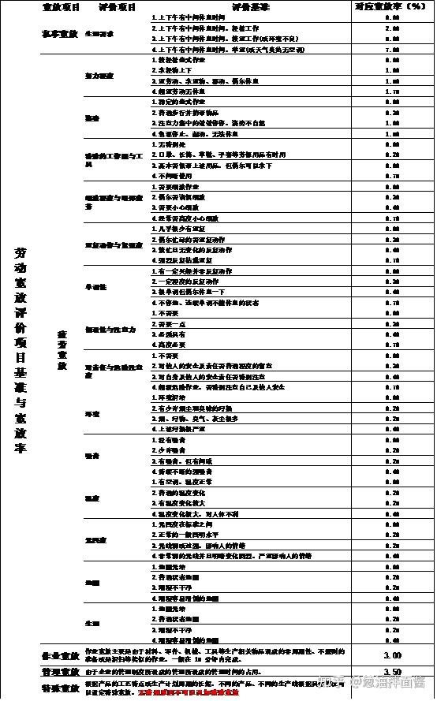

关于工时，算是IE在加入一个企业最开始接触的一份日常工作了。同时因为工时在很多人看来是相对较为简单的，所以很多人一开始是不够重视，导致在进行工时测量的实际操作时，遇到很多问题，导致测量的时间不准。但是工时得出来的数据，很多情况下是IE用来分析问题的一个很关键的数据来源，所以，为了降低新IE对工时测量的难度，给到大家一份相对较完整的工时测量步骤。我称之为工时测量八步法

## **步骤一：熟悉作业流程**

我认为作为一个工厂的IE，第一个步骤就是需要花费一定的时间熟练掌握工厂的产品作业流程，这是做好所有其他工作的基础。

产品作业流程的了解包括三点：了解产品生产的主要流程、了解产品生产的重点站位、了解产品生产完成后的每一步走向。

1、产品作业流程：就是产品生产时第一步走什么，第二步做什么......，只有完全了解每一个产品每一步是怎么做的，才不会再后续工时测量时出现漏测与重复测量的情况

2、产品重点站位：了解产品生产时，那一些站位的生产是关键步骤，包括生产的关键步骤、核心部件等等。这些站位将会成为后续工时测量的重点关注对象

3、生产完成后的产品流向：这一步其实就是了解在某些步骤完成后，产品是入库，还是检测或者直接到下一个制程，这样对于某些工序较长的产品在后续工时测量时，能够做到合理的追溯。

## **步骤二：了解作业SOP**

这一步说简单也简单，说难也难。就是在产线上实际实践标准作业指导书，一个目的是掌握更加细节的产品制作，另一个也是为了熟悉制作后，在后续测量工时的时候，避免员工故意放慢速度而不被发现，确保工时测定的准确性。

## **步骤三：确定工时研究方法**

常见的工时研究方法有三种：秒表时间研究、PTS(预定动作时间标准法）和视频分析。而如何选择对应的工时研究方法，一定程度上决定了工时的准确性和测量的难易程度。一般来说分为五点，可以作为我们选择合适方案的标准：

1. 人工作业是否较多

2. 工艺变化是否较多

3. 经验作业是否较多

4. SOP是否准确

5. 单工位作业时长是否较长（超过1H）

其中，秒表时间研究基本适合所有的方法，也是相对准确性较高的；PTS 适合工艺变化基本成熟不变，经验作业较少且SOP准确的，即标准化程度较高的作业；视频分析适合单位时间较长，经验作业较多和SOP不太准确的。

之所以这样定位，能够让测量工时起到事半功倍的效果。

## **步骤四：作业分解**

作业分解其实就是将步骤一和步骤二所学习了解到的作业进行细分，分解成一个个更加详细的作业单元，这样能够更容易观测，将分解的所有项次测完时间加起来，就是整个作业流程的时间。

分解时需要注意的是：

1. 单元之间界限要清楚，最好有容易辨识的节点，这样测时间的时候根据辨识节点进行循环测量，更不易出错

2. 各个单元时间长短适中，太长会出现注意力丢失导致测量失败，太短会不容易测量。一般选择0.5~3min为好，如果更短，建议取消此单元重新划分

3. 人工操作单元与机器操作分开，机器时间更容易测量且不宜出现波动，因此分开会保证人工作业测量波动表现明显。

4. 物料搬运时间单独区分，搬运会收到测量时车间布局等影响，因此分开测量能让人员操作时间更准确

## **步骤五：测量**

第五步就是正式开始测量了，测量的时候根据作业难度和实际作业时员工状态进行确认，如果作业难度较低，测量波动较小的话可以少测量几组；如果作业难度较高，或者波动较大，则需要多测几组。

同时测量的时候，备注出目前作业人员工作状态，是专注、兴奋、还是疲惫，这是后续确认宽放的依据

## **步骤六：数据整理**

数据整理就是学校所学到的对相关数据进行汇总，汇总时注意剔除相关异常数据，但是最少需要保留5组合格数据。如果数据间差异在10%以上，一般会认为数据存在异常，但是本来相关测试单元时间较长，则建议数据波动不超过20%

## **步骤七：确定宽放与评比系数**

宽放的确认其实就是学校学到的相关宽放，此处就省略细节。

同时需要注意的是，一些公司一般只会放置疲劳宽放，相关的私事宽放与延迟宽放会很少使用，所以在设置宽放时，确认这些宽放是否需要，并且选择合适的宽放率。

评比系数需要长时间的摸索，在前期学习流程和SOP的时候就需要感受不一样员工的作业速度，根据相关速度在后续的测量时记录当时的感受，最后在定义的时候进行确认。

此处给到相关的两张表供参考：

## **步骤八：确定标准时间**

标准时间=观测时间*评定系数*（1+宽放率）

以上就是工时测量的八个步骤，希望对大家有用。