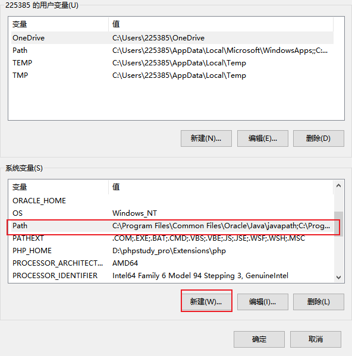
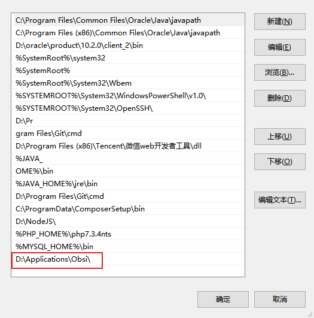
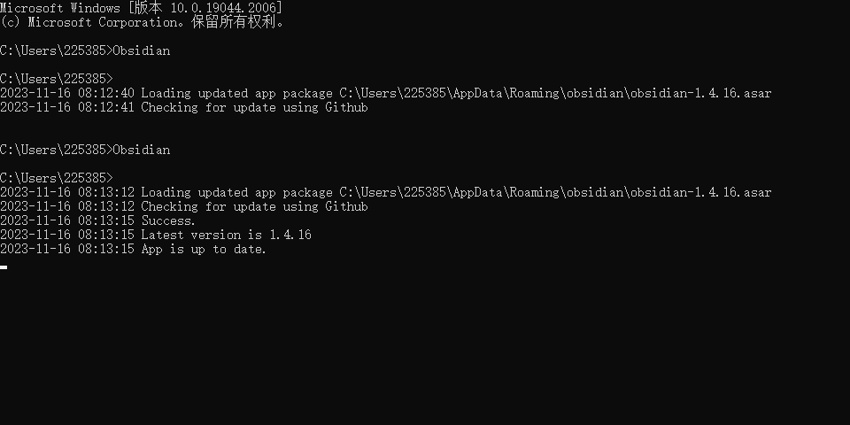
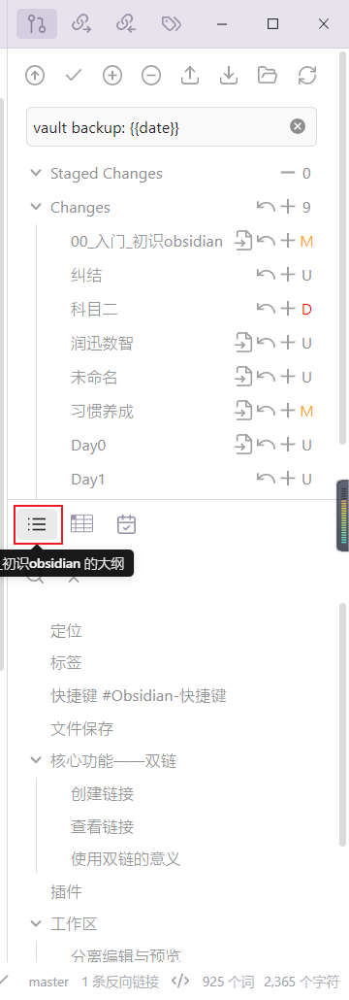

## 定位

知识库管理工具

## 标签

在需要打标签的内容后面输入一个空格加上“#标签名”

例如，`测试 #测试打标签`

## 快捷键 #Obsidian-快捷键

| 序号 | 快捷键   | 描述               | 是否自定义 |
| ---- | -------- | ------------------ | ---------- |
| 1    | ctrl + N | 新建文件           | 否         |
| 2    | ctrl + o | 快速切换           | 否         |
| 3    | ctrl + E | 切换预览和编辑模式 | 否           |

## 文件保存

## 核心功能——双链

可以建立笔记与笔记之间的关系

### 创建链接

- 链接到文章：\[\[文章名称\]\]
- 链接到某个标题：\[\[文章名称#段落名称\]\]
- 链接到文本块：\[\[文章名称#^文本块id\]\]
- 链接别名：\[\[文章名称#^文本块id|自定义id\]\]

### 查看链接

- 前置条件，开启“开启预览”核心插件；
- ctrl + 鼠标悬停到链接上；
- 显示内容：在链接前加上“!”，例如 `![[test#^memo20230926|测试]]`。

### 使用双链的意义

建立知识网络，增强知识的联系。

## 插件

obsidian 对图片的支持非常不友好，在文档中嵌入图片后是无法点击放大的，只能修改图片的大小，非常不方便，所以只能借助第三方插件来增强图片的体验，在网上找了一会儿，发现 `image toolkit` 插件刚好满足了我的需求。

tagFolder

[Obsidian 插件：TagFolder 通过标签方式组织管理笔记 (pkmer.cn)](https://pkmer.cn/Pkmer-Docs/10-obsidian/obsidian%E7%A4%BE%E5%8C%BA%E6%8F%92%E4%BB%B6/obsidian-tagfolder/)

## 工作区

- 保存工作区；
- 查看工作区；
- 加载工作区。

![[00_work_space.png|800]]

### 分离编辑与预览

1. 在设置 -> 编辑器中找到默认编辑模式，选择“码源模式”；
2. 在编辑区域的右上角找到“...”，找到“左右分屏”并点击此选项；
3. 在分屏页面点击“预览模式”；
4. 保存工作区。

## 快速切换

文件之间的切换

## 工作流

[我的 Obsidian 工作流：模板+QuickAdd+Dataview 快速创建和自动索引 - 少数派 (sspai.com)](https://sspai.com/post/68350)

## 笔记索引
1. [[Obs＃19] Obsidian 快速建立索引笔记的方法 (CC字幕)_哔哩哔哩_bilibili](https://www.bilibili.com/video/BV1Kb4y117Ux/?vd_source=081641abeed94aff322f0473e2c1773d)
2. [obsidian插件之dataview入门 - 知乎 (zhihu.com)](https://zhuanlan.zhihu.com/p/409253101)
3. [Obsidian 插件之 Dataview - 知乎 (zhihu.com)](https://zhuanlan.zhihu.com/p/373623264)
4. [obsidian插件dataview官方文档翻译 - 知乎 (zhihu.com)](https://zhuanlan.zhihu.com/p/393550306)

## 主题设置

之前一直存在一个问题，就是在记笔记的时候，明明没有到一行的结尾，一旦输入的内容超过一定的字数就会换行。这虽然不是 bug, 但用起来非常不舒服，如鲠在喉。一开始我以为是设置了工作区，即分为两栏，一栏编写，一栏预览，限制了一行输入的字数。但是今天在折腾主题的时候才发现问题的根源，其实是主题默认设置了一行的宽度，可以通过设置->第三方插件->minimal theme settings-> normal line width查看，默认的是40，我删掉这个值后就正常了。

## 模板

[也许是B站最全面的Obsidian公开课 ！【课时5 使用Ob的技巧】顶级知识管理神器、双链笔记先驱——OB保姆级教程_哔哩哔哩_bilibili](https://www.bilibili.com/video/BV1MF411W7eD/?spm_id_from=333.788&vd_source=081641abeed94aff322f0473e2c1773d)

## 利用 CMD 打开 Obsidian

1. 设置环境变量 #环境变量

2. 打开 cmd，输入 Obsidian，即可打开 Obsidian；

参考：[如何用cmd命令行打开某个电脑程序-百度经验 (baidu.com)](https://jingyan.baidu.com/article/67508eb4892734dcca1ce4ee.html)

## 管理右侧边栏

目前，我的 Obsidian 右侧边栏是上下分栏的，如下图所示：

实现这样的效果也很简单，拖动图标即可。例如红框中的大纲图标，想要大纲在上栏显示，就拖到上栏中。