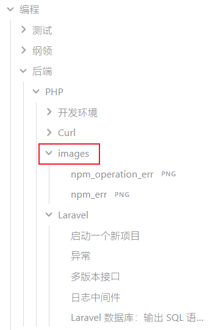

## 前言

记笔记，对于每个接受过教育的人应该都不陌生。在受教育的过程中，遇到比较重要的内容，都会记录下来，防止遗忘，或者说等下次忘记了的时候，可以通过阅读笔记回忆起所记的内容。在学生时代，记笔记的方式就是把内容记到纸质媒介上，例如书和笔记本上。虽然这种方式是学生时代记笔记的最优解，但是缺点非常明显：

- **查找麻烦**，当笔记的数量足够多的时候，时间一长，要找到相应的笔记非常难；
- **没有关联**，笔记与笔记之间是孤立的，是线性的（其实所有传统记笔记的方式都有这个缺点，这也是使用 obsidian 做笔记的一个非常重要的原因）；
- **容易丢失**， 如果把笔记记到书上，当进入下一个阶段的学习的时候，例如从初中升到高中，初中的课本就基本不用了，记录到初中课本上的笔记就几乎成了死数据；如果记录到笔记本上，当一本笔记本记满了的时候，这本笔记本里面的笔记也几乎不会再看了；
- **不易携带**，这几乎是所有纸质媒介的缺点。

之前也尝试过换一种记笔记的方式，就是以 markdown 的格式书写笔记，然后把笔记推送到 github 上托管。虽然这种方式在一定程度上弥补了传统手写笔记的缺点，即查找、丢失和携带性的问题，但是还存在一个致命的问题，**就是笔记与笔记是孤立的**，最后自己都忘记了自己做过哪些笔记。

除此之外，**之前没有养成管理笔记或者说管理自己知识库的概念**，只是单纯的记录，最终的效果也一般。

我正在使用的 obsidian 就解决了笔记孤立的问题：

- **笔记与笔记之间可以建立起双链，从而构成一个网络笔记**；
- 整个笔记库可以看成是 mysql 一样的数据库，可以通过语句查询出自己想要的内容，**即可以在笔记中产生新的数据，为管理知识提供了可能。**

我们记笔记的目的是什么？是为了对抗遗忘。但是忘记了回过头来看记过的笔记，如果笔记时孤立的话，在一定程度上确实能够起到一定的效果，但是还是常看常忘。一种规律只看同一个例子，最后只会过拟合。**更好的做法是一个规律看多个不同的例子，这样才能建立起网络，能够更加牢固的记住这个规律，而 obsidian 就提供了这个可能，不管是打标签，还是使用双链，都可以建立起笔记与笔记之间的联系，即使用 obsidian 能够更加高效地掌握规律。**

## 笔记的分类

笔记大致可以分为五类：

- **灵光一闪**，也称之为闪念笔记，记录一些自己的灵感或者说突如其来的想法；
- **收集素材**，用于收集学习材料，这些笔记都存放在集锦这个文件夹中；
- **学习笔记**，这个没什么好说的，大多数笔记都是学习笔记；
- **经验记录**，记录经历某件事的经验，例如笔试经验，相亲经验等，希冀未来在类似的事情上表现地更好；
- **Inbox**：一时不知道该放到那个文件夹中的笔记，就先放到 Inbox 文件夹中，避免因为纠结来纠结去最后忘记了需要记录内容的问题。

## 工作流设计

- 一个主题建一个文件夹，我称之为“根主题”；
- 一个主题有若干个子主题，可能会一直分下去，直到不能再分为止，不能再分的主题我称之为“叶子主题”；
- 为每个子主题创建一个文件夹，在叶子主题层建一个images 文件夹，用于保存每个叶子主题笔记中的图片，每个叶子主题文件夹中保存与之对应的笔记；
- 在根主题文件夹中创建一个 README 文件，用于介绍这个文件夹存储什么样的内容；
- 如果是学习新东西的笔记，就需要记录理论，**还需要记录实践的过程。之前只重理论而轻实践，导致“夹生饭”，学的东西多但能用的东西少。**

示例如下：

### 文件夹结构

编程是“根主题”，测试、纲领、后端等是第二层子主题，后端又有 PHP 等第三层子主题，开发环境、Curl、Laravel 就是“叶子主题“，在”叶子主题“同层创建 images 文件夹，保存同层所有”叶子主题“的图片，**避免在每个”叶子主题”中创建一个 images 文件的现象。**

### README 文件

以“集锦”这个根主题的 README 为例：
![[集锦/ReadMe|ReadMe]]

### 笔记内容

以炒猪肉的笔记为例：
![[00_炒猪肉]]

## 参考

[玩转 Obsidian 01：打造知识循环利器 - 少数派 (sspai.com)](https://sspai.com/post/62414)