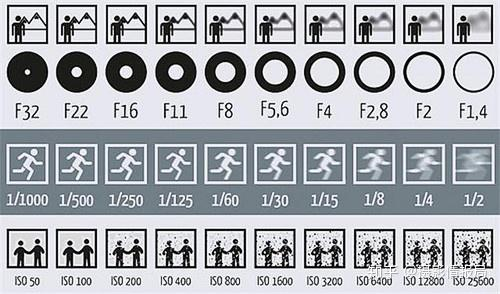
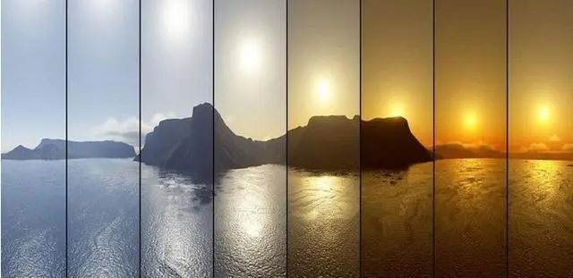
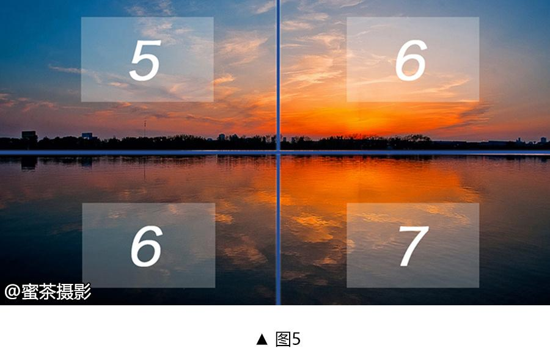

# 曝光

## 曝光三要素

- 光圈
- 快门
- 感光度

参考：[光圈、快门、感光度，弄懂摄影基本算入门了 - 知乎 (zhihu.com)](https://zhuanlan.zhihu.com/p/134166476)

### 光圈

光圈控制进光量和景深：
- 进光量：光圈值越小，光圈越大，进光量越多，图片越亮；光圈值越大，光圈越小，进光量越少，图片越暗；
- 景深：光圈值越小，光圈越大，景深越浅，背景越模糊；光圈值越大，光圈越小，景深越深，背景越清晰；

### 快门

快门控制光线进入相机与否和进入时长

快门影响曝光和物体形态
- 曝光：在光圈相同的情况下，**快门速度越慢，光线进入相机时间越长，光量越多，照片越亮；快门速度越快，光线进入相机时间约短，光量越少，照片越暗。**
- 形态：在拍摄运动物体时，想要达到什么样的效果？是得到的是定格画面还是运动轨迹？高速快门能将运动拍清晰，也就是将运动物体定格下来；慢速快门则能将运动物体拍出运动轨迹，比如：光轨、丝状瀑布等等。

### 感光度

感光度用于控制相机对光的敏感程度，感光度越高，感光元件对光线的敏感度越强；感光度越低，感光元件对光线的敏感度越低。

感光度影响曝光和画质
- 曝光：感光度越高，相机感光元件对光线敏感程度越强，照片越亮；感光度越低，相机感光元件对光线敏感程度越弱，照片越暗；
- 画质：感光度越高，信噪比越低，画质就越差。说直白点就是感光度越高，照片的画质就会越差。

# 白平衡

参考：[白平衡不是没有用，只是你还不会用 - 知乎 (zhihu.com)](https://zhuanlan.zhihu.com/p/102357752)

**白平衡是相机的一个工具，也是我们在平时设置的一个参数，作用是保持白色的平衡，意思是不管在什么颜色环境光下，白色都可以显示出白色。**

## 色温是衡量环境中光线颜色的指标

网上一大堆用物理方式讲解了色温，讲了一大堆最后还是不知道什么叫色温。我是这么理解的，环境中存在着很多不同颜色的光，而**色温就是帮我们衡量环境中偏红（黄）色光和偏蓝色光数量多少的标准，色温的单位是K。**

- 色温值越低，光线中的红色光比较多，（早晨傍晚温度比较低，天空是呈现红的是）；
- 色温值越高，环境中的蓝色光比较多（中午温度比较高，天空是蓝色的）。怎么记不重要，关键在拍摄中可以清晰的记得住，然后灵活运用。

1、自动白平衡模式的范围大体在是在3000K—8000K之间；

2、钨丝灯光线的色温是3000K左右；

3、荧光灯光线的色温是4200K左右；

4、日光的色温是5300K左右；

5、闪光灯光线的色温是5600左右；

6、阴天光线的色温是6000K左右；

7、阴影光线的色温是7500K左右。

**这些选项对应的数字越高，其实就是告诉相机现在环境中，蓝色光线数量比较多，相机会补偿更多的红色光，反之数字越低，告诉相机现在环境中，红色光数量比较多，相机会补偿更多的蓝色光。**

## 使用

关于白平衡的正确使用，无非就三种不同情况：

- 第一种是纠正环境色光给照片带来的影响；
- 第二种是给照片增加更多的蓝色光，或者给照片增加更多的红色光；
- 第三种是保留环境色光中的本来颜色光。

### 实例一，纠正色光

**将白平衡设置成拍摄环境的色温值，照片就可以拍摄出正常的颜色**。比如在台灯下，色温值大概4200K，设置白平衡4200K，拍摄出来就是纸巾原本的白色。

### 实例二，如何将天空拍的更蓝

将蓝天拍的更蓝，应该增加更多的蓝色光，**就可以在白平衡上设置低的色温，欺骗相机目前在红色光比较多的环境下拍摄，这样相机就可以补偿更多的蓝色光**，拍摄出来的照片自然就会更蓝。

### 实例三，拍摄霞光万丈的日出日落

日出日落中红色光比较多，想让照片拍摄出来表现出霞光万丈的感觉，**就可以在白平衡设置上，设置比较高的色温值，这样就可以欺骗相机，让相机误以为拍摄环境蓝色光比较多，相机就会补更多的红色光**，这样就可以拍出霞光万丈的日出日落。

### 实例四，不增加不减少颜色光

这一个案例是如何拍摄到眼睛所见情形。比如在暖黄光下拍摄到的就是暖黄光下的场景，黄色光还是被拍摄下来。这种情况下，就将白平衡的色温值设置5500K，这样相机就不会多补偿蓝色光或者红色光，**拍到的画面就是和肉眼所见颜色一样的场景。**

# 测光

参考：
1. [什么是测光? - 知乎 (zhihu.com)](https://zhuanlan.zhihu.com/p/30787064)
2. [在摄影中，什么是测光，又该怎样正确地测光呢？ - 知乎 (zhihu.com)](https://www.zhihu.com/question/24290985/answer/27514071)

顾名思义测光就是相机对光线的侦测。 #是什么

相机会根据侦测到的光线明暗情况，设置参数，拍出它认为“明暗合适”的照片。 #原理

**人眼可以自动调节进光量，而相机却做不到**。所以，这个光，我们要接收多少呢？进多了，照片会过曝；进少了，照片会欠曝。这时，我们就需要测光了。 #抛出问题

## 测光模式 #分类

以尼康相机为例：
- 矩阵测光（评价测光）
- 中央重点测光
	- 中央重点：相机以画框中心为主（60%），以四周为辅（40%）来进行测光。
	- 局部测光：只取画框中心一个圆圈中的光线作为测光依据。
- 点测光：只取画框中中央一个很小部分的光作为测光依据。

## 使用场景

- 点测光适用于光线明暗对比大的场景，比如拍夕阳、日出、逆光人像等。

# 构图

# 思维模板

- 这个东西是什么？
- 原理是什么？
- 是为了解决什么样的问题？
- 这个东西的分类；
- 使用场景；
- 具体的例子。