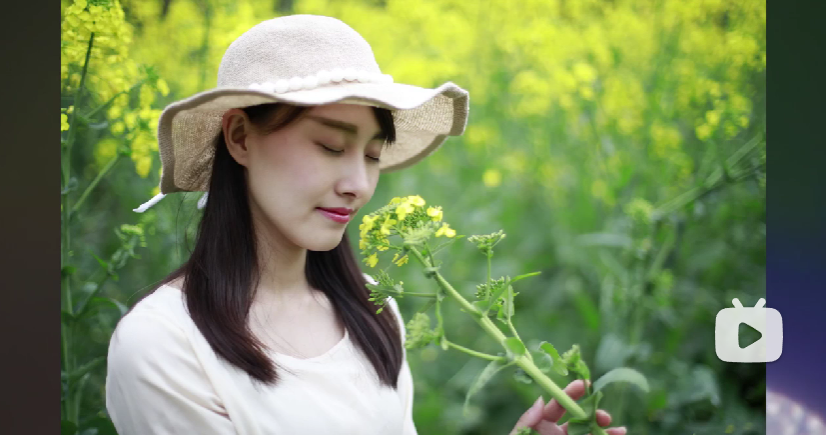

## 前言

初一去宝华寺玩的时候看到了一片油菜花田，真的好看，拍人像肯定很合适。本来打算和她拍的，但是自己有一部分原因，没有直接带她去，而是问了她的意见，她也有一部分原因，她对什么都不感兴趣，就没拍成。

后面和我们去油菜田里拍了几张照片，但是效果一般。今天回想起这件事，应该是没使用拍摄技巧，只是用了尼康的自动模式拍，导致拍出的照片普普通通。

## 技巧

- 油菜花作为背景：大面积油菜花只能作为背景，要在若干个元素中找一个主体，主体可以是模特也可以是小蜜蜂；
- 着装颜色：选择着装应该注意色彩的对比，红、蓝、白、浅色系最佳；
- 画面应该比较亮一点：阴天时拍照应适当调高曝光值，画面较亮符合春光主题；
- 合理使用小道具：合理使用小道具可以增加画面的活泼感，如帽子、围巾、相机等；
- 合理选择拍照姿势：走动、左右看、仰望、低头、跳、坐等都是不错的选择；
- 多角度拍摄：尝试多角度拍摄人物，不要统一正面拍摄，让模特看天看地都可以。

## 示例

## 参考

[教会你怎么拍春天油菜花人像_哔哩哔哩_bilibili](https://www.bilibili.com/video/BV1uC4y1x79W/?vd_source=081641abeed94aff322f0473e2c1773d)