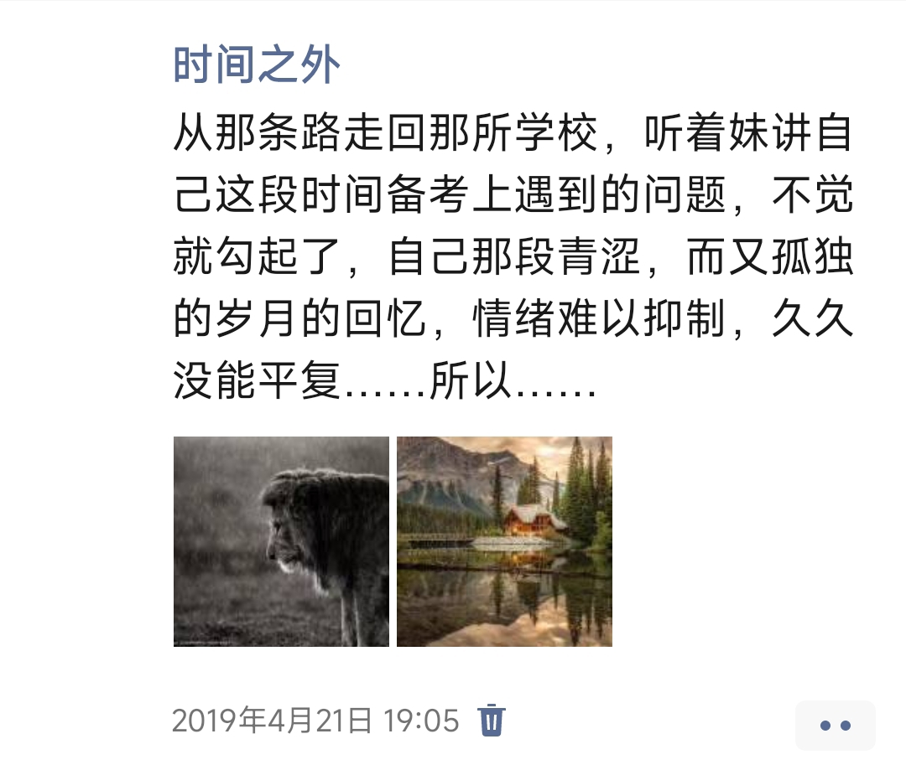
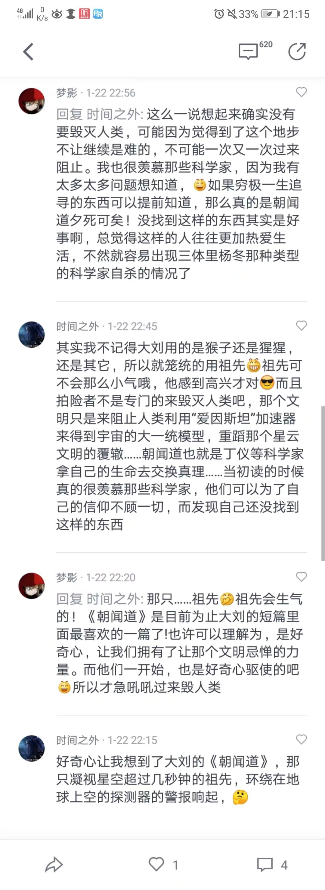
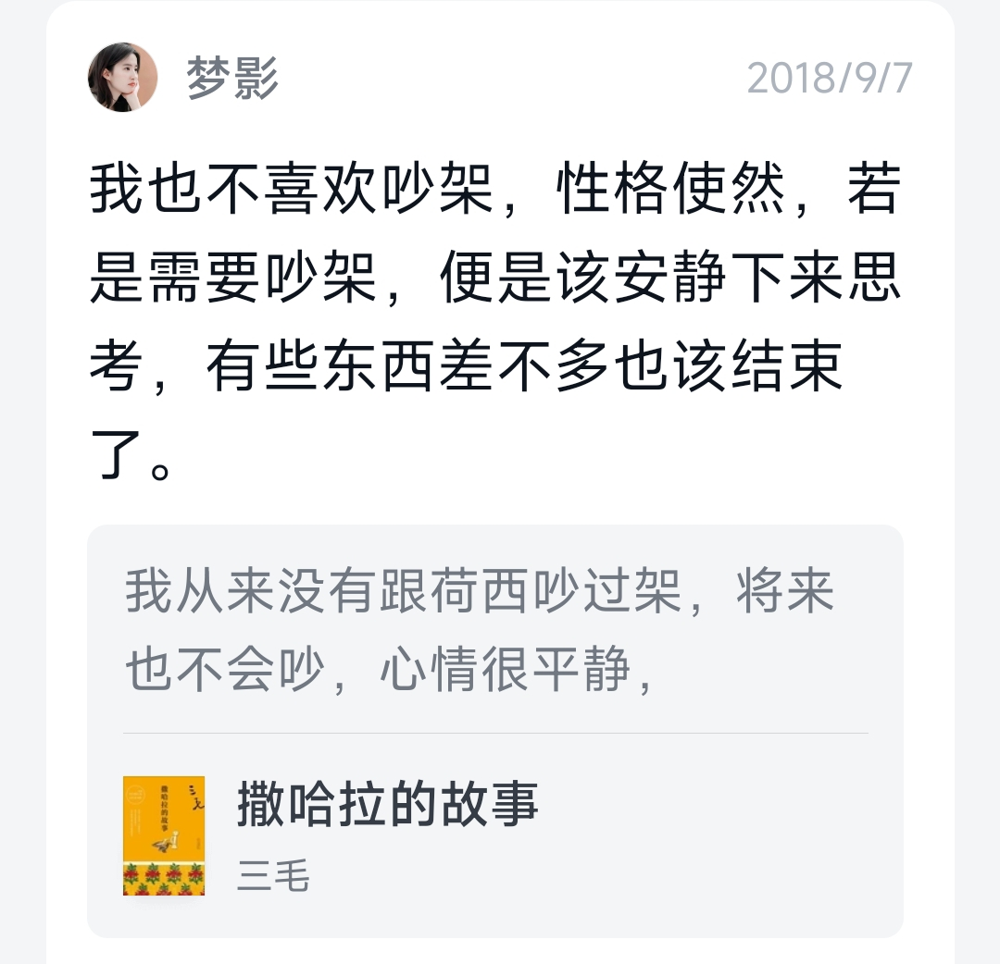

## 前言

昨天晚上12点就躺下了，但是一闭上眼，那次失败的经历就浮现在我的脑海，这一个月每天晚上都是这样，所以前段时间我就一直刷微信视频号，直到刷累了为止，才关手机睡觉。这段时间基本上都是12点之后，有时甚至是一两点、三四点才会睡着。以前几乎很少熬夜，也很少这么晚睡觉。熬夜真的很影响第二天的状态，每天都能感觉到眼睛很痛，而且自制力变得越来越差，只想通过搞笑的、碎片化的短视频来获得些许快感。

这些天我一直在想为什么会在那天因为她在宝华寺不理我，有空就拿出手机来玩而生气，最终导致这件事结束的？

一开始我知道自己错了，但是[[第十一章_应对自身的非理性#自我中心思维是一种思维方式|内心是抵抗承认自己错了的]]。我刚回深圳的那几天晚上，一直在知乎上搜索：

- 相亲对象和我有一搭没一搭聊天
- 相亲对象对我一点都不感兴趣
- 做错事很愧疚怎么办

昨天晚上思考了很久，回忆起自己成长路上的点点滴滴，才意识到在性格形成的初期自己过得如此的不幸，即初中阶段被霸凌过，高中的时候得过抑郁症。以前只知道自己过得非常不开心，还不知道霸凌和抑郁症的概念，后面了解这些概念之后，发现自己的经历和这些概念是相符的。如果用一种颜色来描述我的高中阶段，那就是灰色。从我19年发的一条朋友圈也能看的出来，配图非常阴郁：

现在想想，我能活到现在也不容易。一方面自己每次都选择逃避，一中考完，我就把班级的QQ群退了，高考完被大学录取后就把班群设置为消息免打扰，我会删掉一切能勾起那些不开心的回忆的东西，或者把那些东西放在最不起眼的地方。 

## 压抑的一生

梦影，微信读书的书友，是唯一一个曾经我想全方面了解的女性。她也是个科幻迷，关于好奇心，关于大刘《朝闻道》的讨论我现在还保留着：

她也喜欢读书：

我和她的性格很像：

曾有段时间，有一种特别强烈的，想要她联系方式的冲动。后来想想还是算了，犹抱琵琶半遮面，留有想象的空间，互不打扰更好。我现在没那么喜欢科幻，也很少再想到她，只不过偶尔打开微信读书的时候，会看看她每周的读书时长和逛逛她的个人主页，仅此而已。

## 结论

- 我这次不踩坑，不经历严重的失败，不能控制自己的情绪，将来还会犯类似的、甚至更严重的错误，这是必然的，只不过这次伤了一个好姑娘的心，这一点我永远也无法原谅自己，这件事就像肉中的刺一样，会时不时的刺痛着自己的神经，但我也不知道该如何弥补这个错误；
- 不管愿不愿意承认，她自身条件确实不错，确实配得上一个更高、更帅、更有钱的男性，而不是我；
- 我对结婚的意愿也不是特别的强烈，早在2023年，我就想过我的基因真的有必要传承下去吗？有必要让我的后代继承我的矮，继承我的穷，继承我的丑吗？我这一辈子已经过得这么悲催了，真的有必要让我的后代再经历一次吗？而且我在我这压抑的26年的人生中，我从未获得过爱他人的能力，我想，在我的余生里，我也不会有这种能力。对我亲近的人好，更多的一种责任、一份义务、一个习惯，而不是爱。所以就算我未来有可能步入婚姻，我对我的另一半也会是如此，我不知道这样对她是否公平；
- 自己的思维方式存在着[[第十一章_应对自身的非理性#不成功的自我中心思维|严重的缺陷]]，这应该是导致这次相亲失败最深层次的原因。说实话，要不是这次惨痛的失败，我也不会摆烂，不会想着先把驾照拿到手，也不会有这么多充裕的时间在图书馆里闲逛，也不会在闲逛的时候看到《批判性思维工具》这本书，不看这本书也不会意识到自己身上存在着的巨大缺陷。正是我现有的、存在严重缺陷的思维方式，让我一步步地朝着自卑、压抑、内向的性格上发展，而这种性格又进一步地让我没有自信，没有自信就害怕失败，所以在连续三次收到冷淡的反馈之后，选择了结束。

即使失败了，也不要去想着证明自己，越想证明自己就越会让自己变得拧巴。

20230317
龙岗图书馆（吉华街道分馆）