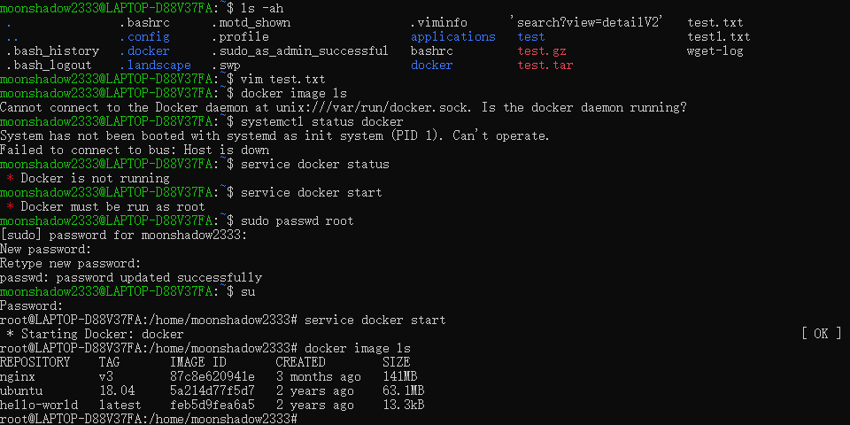
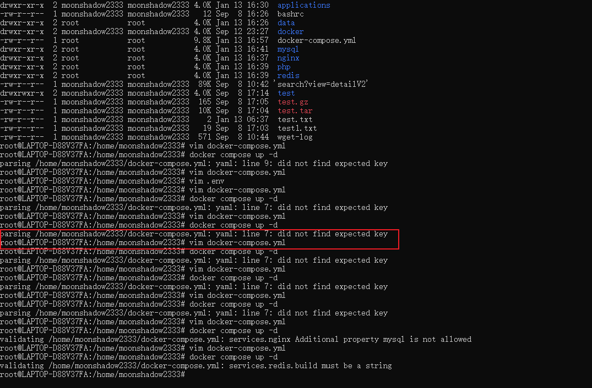
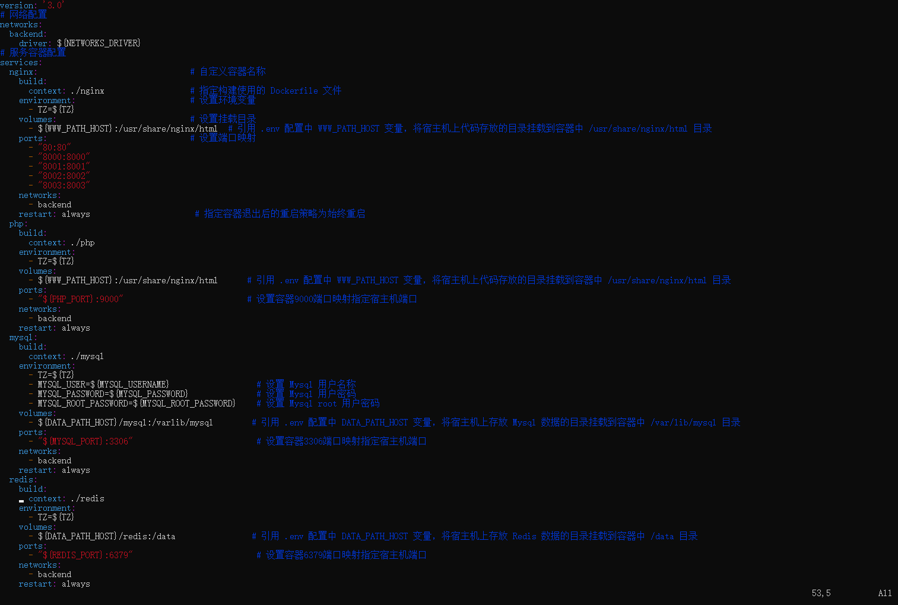
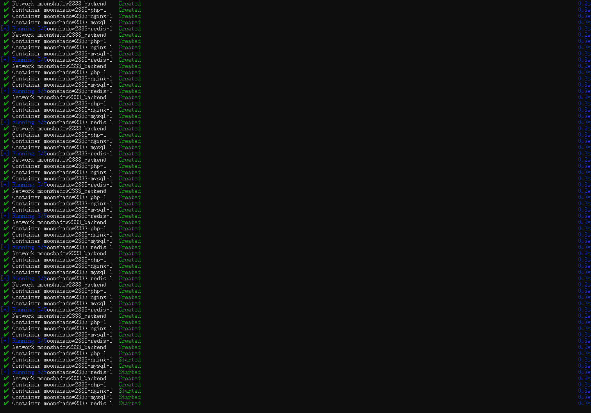

## 前言

前面我们已经[[安装 docker|安装好了docker]]，现在我们可以使用 docker 了。

上一次使用 docker 已经是好久之前的事了，现在打开 ubuntu 想练习 docker，发现全然不记得之前学过的内容，所以这篇笔记就是记录一些比较常用的命令，方便后续查看。

## 常用命令

| 序号 | 命令                  | 描述                 | 注意                                                               |
| ---- | --------------------- | -------------------- | ------------------------------------------------------------------ |
| 1    | service docker start  | 启动docker服务       | docker 服务只有root用户才可以启动，一般情况下会在命令的前面加上 su |
| 2    | service docker status | 查看docker服务的状态 | 无                                                                 |
| 3    | su                    | 切换root用户         | 使用此命令后需要输入密码，123456                                   |
| 4    | docker image ls       | 列出镜像             |                                                                    |
| 5    | docker run            | 启动容器             |                                                                    |
| 6    | docker ps             | 查看正在运行的容器   |                                                                    |

## bug

空格问题，bug 如下，

参考 [did not find expected key -腾讯云开发者社区-腾讯云 (tencent.com)](https://cloud.tencent.com/developer/article/1478263)

空两格

成功

## 疑问

| 序号 | 问题描述                                 | 解决状态 | 参考                                                                                                                                                                           |
| ---- | ---------------------------------------- | -------- | ------------------------------------------------------------------------------------------------------------------------------------------------------------------------------ |
| 1    | 什么是将docker的容器目录挂载到宿主机目录 | 是       | 将容器产生的数据同步到宿主机上([(89 封私信 / 80 条消息) 如何将docker目录挂载到宿主机上？ - 知乎 (zhihu.com)](https://www.zhihu.com/question/448270264))                                                                                                                                       |
| 2    | 什么是容器目录                           | 是       | [Docker 教程——理解 Docker 镜像和容器的存储路径 (freecodecamp.org)](https://www.freecodecamp.org/chinese/news/where-are-docker-images-stored-docker-container-paths-explained/) |
| 3    | wsl2 和 windows 如何交互                 | 是       | 参考12步搞定WSL 2，安装、交互、迁移、VSCode远程调试应有尽有-腾讯云开发者社区-腾讯云 (tencent.com)](https://cloud.tencent.com/developer/article/1886058)                        |
| 4    | wsl2 存储位置                            | 是       | 在资源管理器中输入 `\wsl$`                                                                                                                                                    |
| 5    | vscode remote wsl 无法保存文件           | 是       | 使用 `chown -R moonshadow2333 /home/moonshadow2333/www` 命令                                                                                                                                                                               |

## 参考

[使用 Dockerfile 定制镜像 · Docker -- 从入门到实践 (docker-practice.github.io)](https://docker-practice.github.io/zh-cn/image/build.html)
[docker 灵活的构建 php 环境 - 小辉先生 - 博客园 (cnblogs.com)](https://www.cnblogs.com/Mr-xiaohui/p/16247311.html)
[docker-compose搭建php环境 | PHP 技术论坛 (learnku.com)](https://learnku.com/articles/64751)
[Docker 教程——理解 Docker 镜像和容器的存储路径 (freecodecamp.org)](https://www.freecodecamp.org/chinese/news/where-are-docker-images-stored-docker-container-paths-explained/)
[12步搞定WSL 2，安装、交互、迁移、VSCode远程调试应有尽有-腾讯云开发者社区-腾讯云 (tencent.com)](https://cloud.tencent.com/developer/article/1886058)
[docker compose 配置文件 .yml 全面指南 - 知乎 (zhihu.com)](https://zhuanlan.zhihu.com/p/387840381)
[How to run Laravel with Docker Compose on Ubuntu v22.04 - LogRocket Blog](https://blog.logrocket.com/how-to-run-laravel-docker-compose-ubuntu-v22-04/)
[Docker Playground](https://labs.play-with-docker.com/p/ct66vniim2rg00e0fjr0)