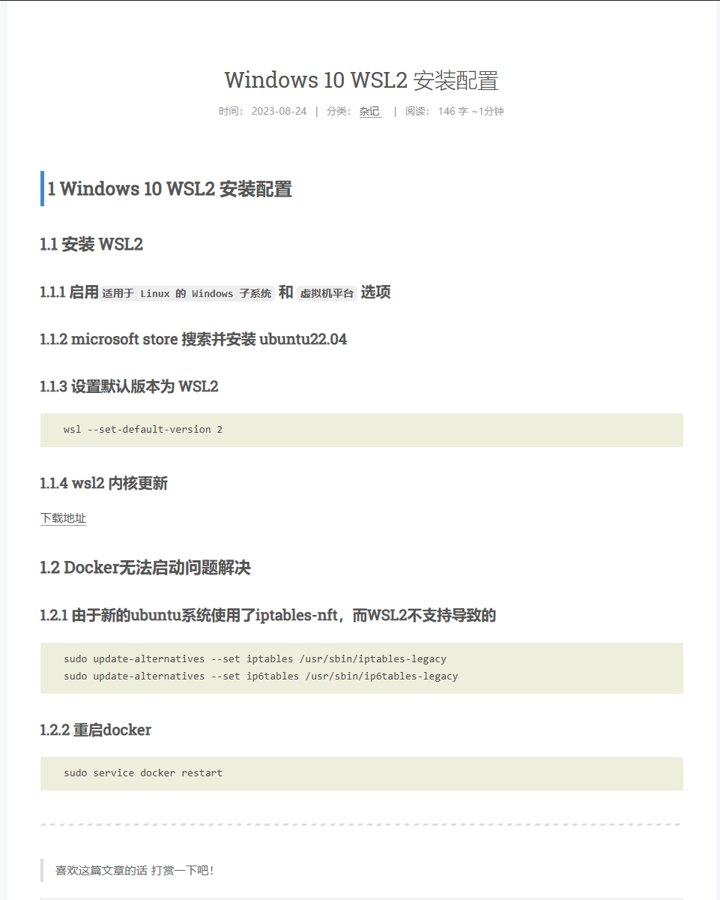

在我的电脑上安装 docker 时费了一番周折，我按照别人的教程一步步操作，教程中的 docker 运行起来了，可是在我的环境中却没有。而且我拿着报错，去互联网上找答案，网上众说纷纭，有的给出了问题的解决方案，有的说在 windows 的 wsl 中的 ubuntu 无法使用 docker。我尝试了网上大部分的方法，但是都是以失败告终，让我怀疑在windows 的 ubuntu中使用 docker 的可行性。

如果网上没有现成的解决方法，就只能去问有经验的前辈了，于是在 laravel 的论坛上提了[Ubuntu20.04 安装 docker 失败，报 Is the docker daemon running 错误](https://learnku.com/laravel/t/83568) 这个问题。从大佬们的回复中我知道了：
1. 在windows 的 ubuntu中使用 docker 是可行的；
2. 提供了一种可行的解决方法；

我按照上图的教程操作，但是还是不行，出现了另外一个问题，我现在忘了具体问题是什么，但是最后我通过
[Command "wsl --set-default-version 2" doesn't change version of WSL · microsoft/WSL · Discussion #6505 · GitHub](https://github.com/microsoft/WSL/discussions/6505)这篇文章解决了该问题。

这也进一步加强了我学习英语的动力，简中互联网搜出来的文章千篇一律，当然也不是一无是处，懂英文就能够将自己的视野不局限于国内，而是可以向全世界的人借鉴经验。说实话，那天晚上我搞到很晚，差点就要放弃了，如果不是搜到了这篇文章，并解决了这个问题，我可能就真的放弃了，因为真的完全没有头绪，自己都不知道问题在哪，只能大海捞针，而且还不知道有没有针。