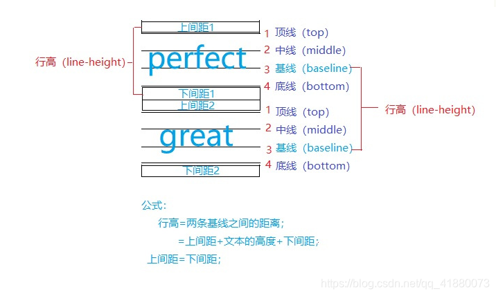

---
aliases:
  - CSS
  - 文本
date: 2025-03-30
---

# 目录

```dataviewjs
const startHeadinglevel = 2;
const file = app.workspace.getActiveFile();
const { headings } = app.metadataCache.getFileCache(file);
 
// 全列表的形式
const raws = headings.filter(row => row.heading != "目录").map( p => {
    let repeatCount = Math.max((p.level - startHeadinglevel) * 4, 0);
    let spacesPrefix = ' '.repeat( repeatCount + 4 );
    let listSign = repeatCount > 0 ? '- ' : '';
    let linkText = `[[#${p.heading}]]`;
    let headingList = (p.level < startHeadinglevel) ? `- ${linkText}` : `${spacesPrefix}- ${linkText}`;
    return headingList;
  }
)
 
let result = raws.join('\n');
// 添加行距
dv.container.style.lineHeight = "1.5em";
dv.paragraph(result)
```

# line-height



## 应用

### 垂直居中

盒子的高度和行高保持一致即可实现垂直居中。

```css
.container {
	width: 100px;
	height: 200px;
	line-height: 200px
}
```

> [!note] 参考资料
> [你经常用的line-height使内容垂直居中，你真的懂它的原理吗？_lineheight垂直居中-CSDN博客](https://blog.csdn.net/qq_41880073/article/details/115025963)