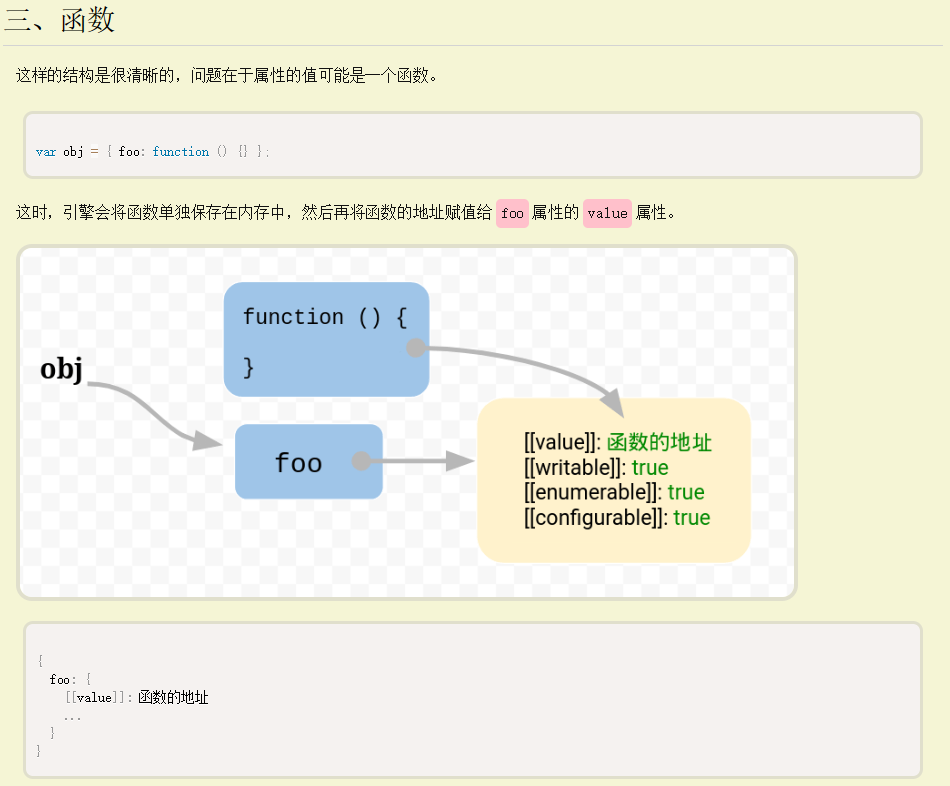

## 前言

通常创建对象来表示真实世界中的实体，如用户和订单等：

```JS
let user = {
  name: "John",
  age: 30
};
```

并且，在现实世界中，用户可以进行 **操作**：从购物车中挑选某物、登录和注销等。

在 JavaScript 中，行为（action）由属性中的函数来表示。

## 方法示例

让 user  对象说 hello ：

```JS
let user = {
  name: "John",
  age: 30
};

user.sayHi = function() {
  alert("Hello!");
};

user.sayHi(); // Hello!
```

**这里我们使用函数表达式创建了一个函数，并将其指定给对象的 `user.sayHi` 属性**。

随后我们像这样 `user.sayHi()` 调用它。用户现在可以说话了！

作为对象属性的函数被称为 **方法**。

所以，在这我们得到了 `user` 对象的 `sayHi` 方法。

当然，我们也可以使用预先声明的函数作为方法，就像这样：

```JS
let user = {
  // ...
};

// 首先，声明函数
function sayHi() {
  alert("Hello!");
}

// 然后将其作为一个方法添加
user.sayHi = sayHi;

user.sayHi(); // Hello!
```

### 方法简写

在对象字面量中，有一种更短的（声明）方法的语法：

```JS
// 这些对象作用一样

user = {
  sayHi: function() {
    alert("Hello");
  }
};

// 方法简写看起来更好，对吧？
let user = {
  sayHi() { // 与 "sayHi: function(){...}" 一样
    alert("Hello");
  }
};
```

如上所示，我们可以省略 `"function"`，只写 `sayHi()`。

说实话，这种表示法还是有些不同。在对象继承方面有一些细微的差别（稍后将会介绍），但目前它们并不重要。在几乎所有的情况下，更短的语法是首选的。

## 方法中的 this

通常，对象方法需要访问对象中存储的信息才能完成其工作。

例如，`user.sayHi()` 中的代码可能需要用到 `user` 的 name 属性。

**为了访问该对象，方法中可以使用 `this` 关键字。**

`this` 的值就是在点之前的这个对象，即调用该方法的对象。

举个例子：

```JS
let user = {
  name: "John",
  age: 30,

  sayHi() {
    // "this" 指的是“当前的对象”
    alert(this.name);
  }

};

user.sayHi(); // John
```

在这里 `user.sayHi()` 执行过程中，`this` 的值是 `user`。

技术上讲，也可以在不使用 `this` 的情况下，通过外部变量名来引用它：

```JS
let user = {
  name: "John",
  age: 30,

  sayHi() {
    alert(user.name); // "user" 替代 "this"
  }

};
```

……但这样的代码是不可靠的。如果我们决定将 `user` 复制给另一个变量，例如 `admin = user`，并赋另外的值给 `user`，那么它将访问到错误的对象。

下面这个示例证实了这一点：

```JS
let user = {
  name: "John",
  age: 30,

  sayHi() {
    alert( user.name ); // 导致错误
  }

};


let admin = user;
user = null; // 重写让其更明显

admin.sayHi(); // TypeError: Cannot read property 'name' of null
```

如果我们在 `alert` 中以 `this.name` 替换 `user.name`，那么代码就会正常运行。

## this 不受限制

在 JavaScript 中，`this` 关键字与其他大多数编程语言中的不同。**JavaScript 中的 `this` 可以用于任何函数，即使它不是对象的方法**。

下面这样的代码没有语法错误：

```JS
function sayHi() {
  alert( this.name );
}
```

`this` 的值是在代码运行时计算出来的，它取决于代码上下文。

例如，这里相同的函数被分配给两个不同的对象，在调用中有着不同的 “this” 值：

```JS
let user = { name: "John" };
let admin = { name: "Admin" };

function sayHi() {
  alert( this.name );
}

// 在两个对象中使用相同的函数
user.f = sayHi;
admin.f = sayHi;

// 这两个调用有不同的 this 值
// 函数内部的 "this" 是“点符号前面”的那个对象
user.f(); // John（this == user）
admin.f(); // Admin（this == admin）

admin['f'](); // Admin（使用点符号或方括号语法来访问这个方法，都没有关系。）
```

这个规则很简单：如果 `obj.f()` 被调用了，则 `this` 在 `f` 函数调用期间是 `obj`。所以在上面的例子中 this 先是 `user`，之后是 `admin`。

**在 JavaScript 中，`this` 是“自由”的，它的值是在调用时计算出来的，它的值并不取决于方法声明的位置，而是取决于在“点符号前”的是什么对象**。

## 箭头函数没有自己的 this

箭头函数有些特别：它们没有自己的 `this`。如果我们在这样的函数中引用 `this`，`this` 值取决于外部“正常的”函数。

举个例子，这里的 `arrow()` 使用的 `this` 来自于外部的 `user.sayHi()` 方法：

```js
let user = {
  firstName: "Ilya",
  sayHi() {
    let arrow = () => alert(this.firstName);
    arrow();
  }
};

user.sayHi(); // Ilya
```

这是箭头函数的一个特性，当我们并不想要一个独立的 `this`，反而想从外部上下文中获取时，它很有用。在后面的 [深入理解箭头函数](https://zh.javascript.info/arrow-functions) 一章中，我们将深入介绍箭头函数。

## 总结

- 存储在对象属性中的函数被称为“方法”。
- 方法允许对象进行像 `object.doSomething()` 这样的“操作”。
- 方法可以将对象引用为 `this`。

`this` 的值是在程序运行时得到的。

- 一个函数在声明时，可能就使用了 `this`，但是这个 `this` 只有在函数被调用时才会有值。
- 可以在对象之间复制函数。
- 以“方法”的语法调用函数时：`object.method()`，调用过程中的 `this` 值是 `object`。

请注意箭头函数有些特别：它们没有 `this`。在箭头函数内部访问到的 `this` 都是从外部获取的。

## 实践

### 创建一个计算器

#### 问题描述
创建一个有三个方法的 `calculator` 对象：

- `read()` 提示输入两个值，并将其保存为对象属性，属性名分别为 `a` 和 `b`。
- `sum()` 返回保存的值的和。
- `mul()` 将保存的值相乘并返回计算结果。

```JS
let calculator = {
  // ……你的代码……
};

calculator.read();
alert( calculator.sum() );
alert( calculator.mul() );
```

#### 解答

```JS
let calculator = {
	// ……你的代码……
	read() {
		this.a = +prompt('a?', 0);
		this.b = +prompt('b?', 0);
	},
	sum() {
		return this.a + this.b;
	},
	mul() {
		return this.a * this.b;
	}
};

calculator.read();
alert(calculator.sum());
alert(calculator.mul());
```

### 链式调用

#### 问题描述

有一个可以上下移动的 `ladder` 对象：

```JS
let ladder = {
  step: 0,
  up() {
    this.step++;
  },
  down() {
    this.step--;
  },
  showStep: function() { // 显示当前的 step
    alert( this.step );
  }
};
```

现在，如果我们要按顺序执行几次调用，可以这样做：

```JS
ladder.up();
ladder.up();
ladder.down();
ladder.showStep(); // 1
ladder.down();
ladder.showStep(); // 0
```

修改 `up`，`down` 和 `showStep` 的代码，让调用可以链接，就像这样：

```JS
ladder.up().up().down().showStep().down().showStep(); // 展示 1，然后 0
```

#### 解答

```JS
let ladder = {
  step: 0,
  up() {
    this.step++;
    return this;
  },
  down() {
    this.step--;
    return this;
  },
  showStep: function() { // 显示当前的 step
    alert( this.step );
    return this;
  }
};
```

## 参考

[对象方法，"this" (javascript.info)](https://zh.javascript.info/object-methods)
[JavaScript 的 this 原理 - 阮一峰的网络日志 (ruanyifeng.com)](https://www.ruanyifeng.com/blog/2018/06/javascript-this.html)

现在问题就来了，由于函数可以在不同的运行环境执行，所以需要有一种机制，能够在函数体内部获得当前的运行环境（context）。所以，`this`就出现了，它的设计目的就是在函数体内部，指代函数当前的运行环境。

**这时，引擎会将函数单独保存在内存中，然后再将函数的地址赋值给`foo`属性的`value`属性**。

