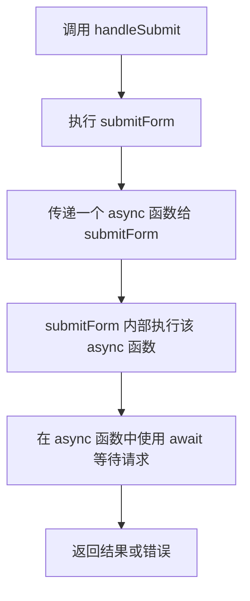

---
aliases:
  - Vue
date: 2025-05-02
---

# 目录

```dataviewjs
const startHeadinglevel = 2;
const file = app.workspace.getActiveFile();
const { headings } = app.metadataCache.getFileCache(file);
 
// 全列表的形式
const raws = headings.filter(row => row.heading != "目录").map( p => {
    let repeatCount = Math.max((p.level - startHeadinglevel) * 4, 0);
    let spacesPrefix = ' '.repeat( repeatCount + 4 );
    let listSign = repeatCount > 0 ? '- ' : '';
    let linkText = `[[#${p.heading}]]`;
    let headingList = (p.level < startHeadinglevel) ? `- ${linkText}` : `${spacesPrefix}- ${linkText}`;
    return headingList;
  }
)
 
let result = raws.join('\n');
// 添加行距
dv.container.style.lineHeight = "1.5em";
dv.paragraph(result)
```


组合式 API (Composition API) 是 Vue 3 的核心特性之一，它提供了一种更灵活、更高效的代码组织方式，尤其适合复杂组件的开发。以下是通俗易懂的解释：

---

# 一、为什么要用组合式 API？
## 传统选项式 API 的痛点
在 Vue 2 的**选项式 API**（Options API）中，代码需要分散在 `data`、`methods`、`computed` 等不同选项中：
```javascript
export default {
  data() { return { count: 0 } },          // 数据
  methods: { increment() { this.count++ } }, // 方法
  mounted() { console.log('组件加载完毕') }  // 生命周期
}
```
**问题**：当组件复杂时，相关逻辑被拆分到不同区域，代码难以阅读和维护。

---

# 二、组合式 API 的核心思想
将**同一功能的代码集中在一起**（比如数据 + 方法 + 计算属性），而不是分散在不同选项中。

---

# 三、核心用法
## 1. `setup()` 函数
组合式 API 的入口函数，替代了 `data`、`methods` 等选项：
```javascript
import { ref, onMounted } from 'vue';

export default {
  setup() {
    // 数据（替代 data）
    const count = ref(0);

    // 方法（替代 methods）
    const increment = () => { count.value++ };

    // 生命周期（替代 mounted）
    onMounted(() => {
      console.log('组件加载完毕');
    });

    // 返回模板可用的数据和方法
    return { count, increment };
  }
}
```

## 2. 响应式工具
- **`ref`**：创建基本类型响应式数据（如数字、字符串）
- **`reactive`**：创建对象类型响应式数据
- **`computed`**：创建计算属性
- **`watch`**：监听数据变化

---

# 四、优势对比

| 场景               | 选项式 API                          | 组合式 API                          |
|--------------------|------------------------------------|-------------------------------------|
| **代码组织**        | 按选项分类（data/methods/mounted） | 按功能聚合（数据 + 方法 + 生命周期） |
| **逻辑复用**        | Mixins（易命名冲突）               | 自定义函数（无冲突）                |
| **TypeScript 支持** | 较弱                               | 更友好                              |
| **复杂组件**        | 代码分散，难维护                   | 逻辑集中，易维护                    |

---

# 五、实际案例：复用逻辑
## 1. 封装一个计数器逻辑
```javascript
// useCounter.js（自定义组合函数）
import { ref } from 'vue';

export function useCounter(initialValue = 0) {
  const count = ref(initialValue);
  const increment = () => { count.value++ };
  return { count, increment };
}
```

## 2. 在组件中使用
```javascript
// Component.vue
import { useCounter } from './useCounter';

export default {
  setup() {
    const { count, increment } = useCounter(10); // 初始值 10
    return { count, increment };
  }
}
```

---

# 六、常见问题
## 1. 还能用选项式 API 吗？
**可以**！Vue 3 完全兼容选项式 API，两者可混合使用。

#### 2. 为什么要用 `ref` 和 `reactive`？
- `ref`：适合基本类型（自动通过 `.value` 访问）
- `reactive`：适合对象类型（直接访问属性）

---

# 七、总结
组合式 API 的本质是**将代码按功能（而非选项）组织**，解决了复杂组件中代码分散的问题，同时提供了更强大的逻辑复用能力。它尤其适合：
- 大型项目开发
- 需要复用的复杂逻辑
- TypeScript 项目

# 示例


这段代码是一个 **Vue 组合式函数（Composition API）**，用于封装表单提交的通用逻辑（表单验证、加载状态、错误处理、请求取消）。以下是逐层解析：

---

### 一、代码核心作用
1. **统一处理表单提交流程**  
   - 自动触发表单验证
   - 管理加载状态（`loading`）
   - 统一错误处理和提示
   - 组件卸载时自动取消未完成请求

2. **复用逻辑**  
   避免在每个表单组件中重复编写相同代码，保持代码整洁。

---

### 二、代码逐行解析
#### 1. 定义响应式数据
```javascript
const formRef = ref(null);       // 表单组件引用（如 Element Plus 的 el-form）
const loading = ref(false);      // 加载状态
let abortController;             // 请求取消控制器
```
- `formRef`: 绑定到模板中的表单组件，用于调用表单验证方法（如 `validate()`）。
- `loading`: 控制提交按钮的禁用状态或加载动画。
- `abortController`: 取消未完成的请求（如组件卸载时）。

---

#### 2. 表单提交函数 `submitForm`
```javascript
const submitForm = async (submitFn) => {
  try {
    await formRef.value.validate(); // 触发表单验证
    loading.value = true;           // 开始加载
    abortController = new AbortController();
    await submitFn({ signal: abortController.signal }); // 执行提交逻辑（如 axios 请求）
  } catch (error) {
    handleFormError(error);         // 统一错误处理
  } finally {
    loading.value = false;          // 结束加载
  }
};
```
- **流程**:  
  验证 → 加载 → 提交 → 结束加载/错误处理。
- **关键细节**:  
  - 将 `abortController.signal` 传递给 `submitFn`，使外部请求可被取消。
  - 无论成功或失败，`finally` 确保 `loading` 状态重置。

---

#### 3. 统一错误处理 `handleFormError`
```javascript
const handleFormError = (error) => {
  // if (axios.isCancel(error)) return; // 如果是取消的请求，不提示错误
  const message = error.response?.data?.message 
    || error.message 
    || '请求失败，请检查网络';
  ElMessage.error(message); // Element Plus 的错误提示组件
};
```
- **优先级**: 后端返回的错误消息 → JS 原生错误消息 → 默认兜底文案。
- **注释掉的代码**: 如果引入 Axios，可在此过滤取消请求的错误（避免显示无用提示）。

---

#### 4. 组件卸载时取消请求
```javascript
onBeforeUnmount(() => {
  abortController?.abort(); // 组件销毁时取消进行中的请求
});
```
- **作用**: 避免组件销毁后，请求继续返回并更新已销毁组件的状态，导致内存泄漏或错误。

---

#### 5. 暴露接口
```javascript
return { formRef, loading, submitForm };
```
- **组件使用方式**:  
  ```javascript
  // 组件内
  const { formRef, loading, submitForm } = useForm();
  const handleSubmit = () => {
    submitForm(({ signal }) => axios.post('/api', data, { signal }));
  };
  ```

---

### 三、为什么这样设计？
#### 1. 解决重复代码问题
- **传统问题**：每个表单组件都需要写验证、加载、错误处理，代码冗余。
- **本方案**：通过组合式函数抽象通用逻辑，保持组件简洁。

#### 2. 避免潜在 Bug
- **请求取消**：组件卸载时自动取消请求，防止更新已销毁组件。
- **统一错误提示**：所有表单错误以相同 UI 提示，提升用户体验一致性。

#### 3. 提升可维护性
- **修改一处，全局生效**：例如调整错误提示样式，只需修改 `handleFormError`。
- **TypeScript 友好**：明确输入输出类型，便于类型推断。

---

### 四、使用场景示例
```js
<template>
  <el-form ref="formRef" :model="form">
    <el-input v-model="form.name" />
    <el-button :loading="loading" @click="handleSubmit">提交</el-button>
  </el-form>
</template>

<script setup>
import { useForm } from './composables/useForm';
import axios from 'axios';

const { formRef, loading, submitForm } = useForm();
const form = ref({ name: '' });

const handleSubmit = () => {
  submitForm(async ({ signal }) => {
    await axios.post('/api/submit', form.value, { signal });
    ElMessage.success('提交成功！');
  });
};
</script>
```

---

### 总结
这段代码通过 **组合式 API** 实现了表单提交逻辑的高效复用，解决了以下问题：
- 表单验证、加载状态、错误处理的重复代码
- 潜在的内存泄漏（未取消的请求）
- 错误提示不一致

适合在中后台系统、包含大量表单的项目中推广使用。

# 双重 await


在 JavaScript 中，将 `async/await` 函数作为参数传递并在调用时再次使用 `await`，是一种 **组合异步操作** 的常见模式。你提供的代码本质上是 **对异步操作的二次封装**，目的是复用通用逻辑（如加载状态、错误处理等）。以下是对这种操作的详细解析：

---

### 一、代码结构解析
```javascript
const handleSubmit = () => {
  submitForm(async ({ signal }) => {  // 🔴 将 async 函数作为参数传递
    let re = await ins.post('/api/user', form, { signal });
    console.log(re);
  });
};
```

---

### 二、执行流程拆解


---

### 三、关键设计意图
#### 1. **逻辑分层与复用**
- **外层 (`submitForm`)**：处理通用逻辑（如表单验证、加载状态、错误拦截）
- **内层 (传入的 `async` 函数)**：处理具体业务请求（如调用 API）

#### 2. **控制权反转**
- 将具体业务逻辑（API 调用）作为参数传入，使 `submitForm` 可以灵活适配不同请求
- 通用逻辑（如 `loading` 状态）在 `submitForm` 内部统一管理

#### 3. **异步操作串联**
- 外层 `submitForm` 的 `await` 确保内部所有异步操作完成后再继续
- 内层 `await` 确保 API 请求完成后再处理结果

---

### 四、类比解释
想象一个「流水线工厂」：
- **`submitForm`** 是工厂的通用流水线（负责质量检查、包装）
- **传入的 `async` 函数** 是定制化生产线（生产特定产品）
- `await` 是流水线的「等待工位」，确保每道工序按顺序完成

---

### 五、完整代码示例
假设 `submitForm` 的实现如下：
```javascript
// useForm.js（组合式函数）
export function useForm() {
  const loading = ref(false);

  const submitForm = async (submitFn) => {
    try {
      loading.value = true;      // 🔴 通用逻辑：开启加载状态
      const result = await submitFn(); // 🔴 执行传入的异步函数
      return result;
    } catch (error) {
      console.error('提交失败:', error); // 🔴 通用错误处理
      throw error;
    } finally {
      loading.value = false;     // 🔴 通用逻辑：关闭加载状态
    }
  };

  return { loading, submitForm };
}
```

组件中的使用：
```javascript
// 组件代码
import { useForm } from './useForm';
import ins from '@/scripts/Request';

const { loading, submitForm } = useForm();

const handleSubmit = () => {
  submitForm(async () => {  // ✅ 将具体请求作为参数传入
    const response = await ins.post('/api/user', form);
    ElMessage.success('注册成功');
    return response.data;
  });
};
```

---

### 六、参数传递分析
在原始代码中，参数 `{ signal }` 的用途：
```javascript
submitForm(async ({ signal }) => {  // 🔴 解构出 signal
  await ins.post('/api/user', form, { signal });
});
```
- **`signal`** 通常来自 `AbortController`，用于取消请求
- **传递来源**：`submitForm` 内部创建并传递参数，例如：
  ```javascript
  const submitForm = async (submitFn) => {
    const controller = new AbortController();
    try {
      await submitFn({ signal: controller.signal }); // 🔴 传入 signal
    } finally {
      // 清理逻辑
    }
  };
  ```

---

### 七、为什么需要两层 `await`？
| 层级        | 作用                                                                 |
|------------|--------------------------------------------------------------------|
| **外层 `await`** | 确保整个提交流程（含加载状态、错误处理）等待业务逻辑完成                          |
| **内层 `await`** | 确保 API 请求完成后再执行后续操作（如 `console.log(re)`）                     |

---

### 八、潜在优化方向
1. **错误冒泡处理**  
   在内层函数中抛出错误，外层 `submitForm` 统一捕获：
   ```javascript
   submitForm(async () => {
     const res = await ins.post(...);
     if (res.code !== 200) throw new Error(res.message); // 内层抛出
   });
   ```

2. **参数标准化**  
   定义参数接口（如必须包含 `signal`）：
   ```typescript
   type SubmitOptions = { signal?: AbortSignal };
   type SubmitHandler = (options: SubmitOptions) => Promise<void>;
   ```

3. **取消请求集成**  
   在组件卸载时自动取消请求：
   ```javascript
   const controller = new AbortController();
   onBeforeUnmount(() => controller.abort());
   ```

---

### 总结
这种「异步函数作为参数 + 双重 await」的模式，本质是 **通过高阶函数实现关注点分离**，既能复用通用逻辑，又能保持业务代码的灵活性，非常适合表单提交、API 请求管理等场景。