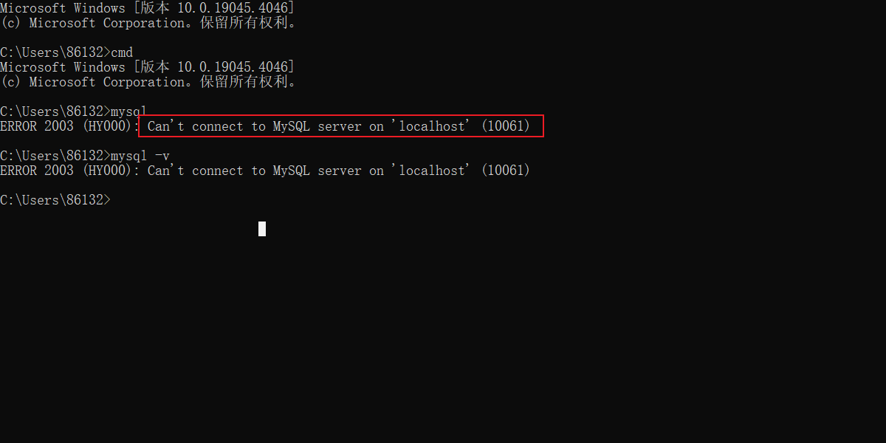
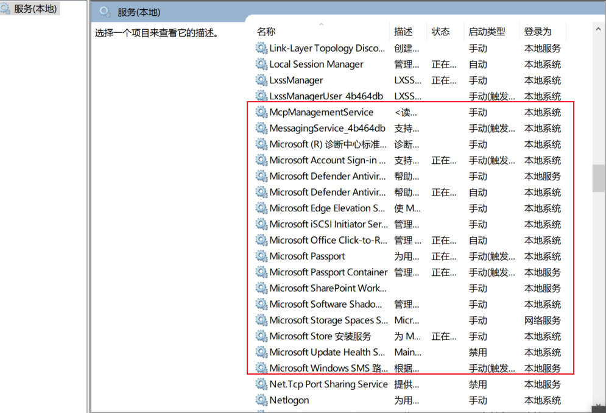

## 检查服务

## 异常

> Can't connect to MySQL server on 'localhost' (10061

检查计算机是否存在 MySQL 服务

Win + R 输入 services.msc
查看服务列表是否存在 MySQL

如果不存在则执行安装

如果存在则启动

> mysqld: Can't open shared library 'D:\phpstudy_pro\Extensions\MySQL5.7.26\lib\plugin\component_reference_cache.dll' (errno: 126 找不到指定的模块。)

参考：[mysqld: Can't open shared library 'D:\MYSQL\mysql-8.1.0-winx64\database\lib\plugin\component_reference_cache.dll' (errno: 126 找不到指定的模块。) - CSDN文库](https://wenku.csdn.net/answer/g9mpru62zq)
