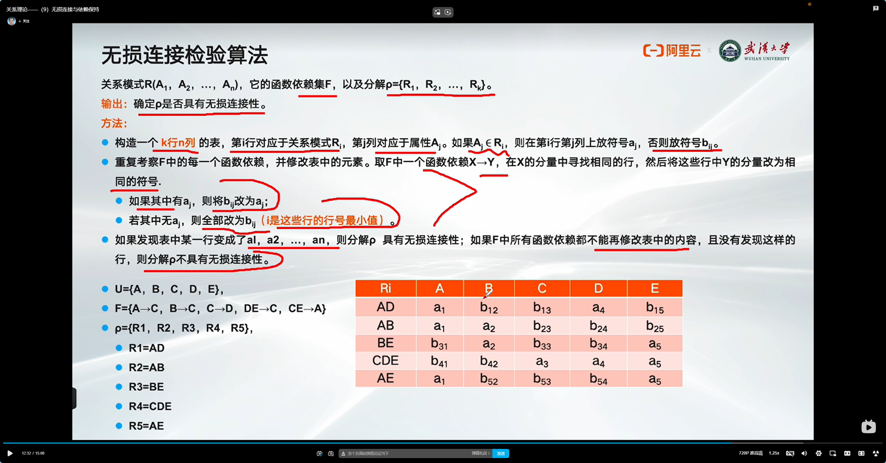
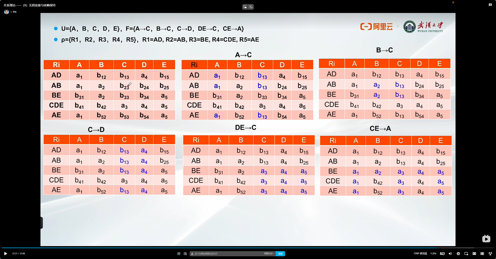

# 目录

```dataviewjs
const startHeadinglevel = 2;
const file = app.workspace.getActiveFile();
const { headings } = app.metadataCache.getFileCache(file);
 
// 全列表的形式
const raws = headings.filter(row => row.heading != "目录").map( p => {
    let repeatCount = Math.max((p.level - startHeadinglevel) * 4, 0);
    let spacesPrefix = ' '.repeat( repeatCount + 4 );
    let listSign = repeatCount > 0 ? '- ' : '';
    let linkText = `[[#${p.heading}]]`;
    let headingList = (p.level < startHeadinglevel) ? `- ${linkText}` : `${spacesPrefix}- ${linkText}`;
    return headingList;
  }
)
 
let result = raws.join('\n');
// 添加行距
dv.container.style.lineHeight = "1.5em";
dv.paragraph(result)
```

# 算法



# 例子



# 参考资料

[关系理论——（9）无损连接与依赖保持_哔哩哔哩_bilibili](https://www.bilibili.com/video/BV1RM4y1h7Qz/?spm_id_from=333.337.search-card.all.click&vd_source=081641abeed94aff322f0473e2c1773d)