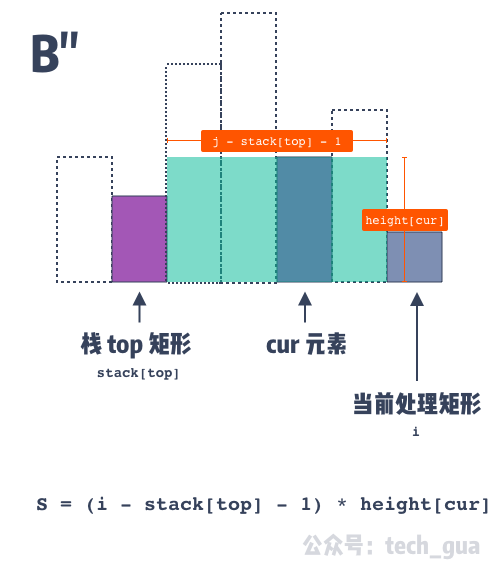

## 前言

单调栈顾名思义，就是具有单调性的栈，即栈中的元素具有单调递增或者单调递减的性质。

## 例子

### 最大矩形面积

> 给定 n 个非负整数，用来表示柱状图中各个柱子的高度。每个柱子彼此相邻，且宽度为 1 。求在该柱状图中，能够勾勒出来的矩形的最大面积。

**那么对于每一个柱子，求解它左右的第一个小于它的元素**。

```PHP

<?php

function largestRectangleArea($heights){
    $stack = [-1];
    $count = count($heights);
    $maxArea = 0;
    for($i=0;$i<$count;$i++){
        // 栈顶元素不等于 -1 并且当前柱子的高度比下标为栈顶的柱子的高度小则出栈。
        while(array_peek($stack) != -1 && $heights[$i] <= $heights[array_peek($stack)]){
	        // 先出栈
            $height = $heights[array_pop($stack)];
            // 此时栈顶元素是第一个比 $height 小的元素 
            $width  = $i - array_peek($stack) - 1;
            $maxArea = max($maxArea,$height * $width);
        }
        // 直到当前柱子的高度不比下标为栈顶的柱子的高度小，再将当前柱子的下标压入栈。
        array_push($stack,$i);
    }
    while(array_peek($stack) != -1){
        $height = $heights[array_pop($stack)];

        // 矩形的宽度。
        // 栈中存储的是柱子的下标。如果当前柱子的高度小于栈顶柱子的高度，那么矩形的宽度就为当前柱子的下标减去栈顶柱子的下标再减1。
        $width  = $count - array_peek($stack) -1;
        $maxArea = max($maxArea,$height *$width);
    }
    return $maxArea;
}

// 辅助函数，用于获取栈顶的元素，换句话说是获取数组的最后一个元素。
function array_peek(array $arr){
    return $arr[count($arr)-1];
}

$heights = [3,2,5,4,6,1,4,3];
$re = largestRectangleArea($heights);
echo $re; // 输出：12

```

- 向数组两侧各插入一个比全局最小值还小的数字已统一边界问题；
- 计算面积的部分，宽为 `$i - array_peek($stack) - 1`，表示的事中间区域，如下图所示：



参考：
- [最大矩形面积问题——单调栈法-CSDN博客](https://blog.csdn.net/symuamua/article/details/121736660)
### [接雨水](https://leetcode.cn/problems/trapping-rain-water/)

> 给定 `n` 个非负整数表示每个宽度为 `1` 的柱子的高度图，计算按此排列的柱子，下雨之后能接多少雨水。
> **输入：**height = [0,1,0,2,1,0,1,3,2,1,2,1]
**输出：**6

接雨水问题是最大矩形面积的镜像问题，即**对于每一个柱子，求解它左右的第一个大于它的元素**。

```PHP
<?php

class CatchRain {
    public function caRain ($rain) {
        $stack = [-1];
        $area = 0;
        for ($i = 0; $i < count($rain); $i ++) {
            // 如果当前元素大于栈顶元素出栈，否则入栈
            $cur = $rain[$i];
            echo 'i:'.$i.PHP_EOL;
            while ($this->peek($stack) != -1 && $cur > $rain[$this->peek($stack)]) {
                // 高 min()
                // var_dump($stack);
                $peek = array_pop($stack);
                echo 'peekIndex:'.$peek.PHP_EOL;
                $indexOfLeftEleGtPeek = $this->peek($stack);
                echo 'indexOfLeftEleGtPeek:'.$indexOfLeftEleGtPeek.PHP_EOL;
                $height = min($cur, $rain[$indexOfLeftEleGtPeek]) - $rain[$peek];
                echo 'height:'.$height.PHP_EOL;
                $area += ($i - $indexOfLeftEleGtPeek - 1) * $height > 0 ? ($i - $indexOfLeftEleGtPeek - 1) * $height : 0;
                echo 'Area:'.$area.PHP_EOL;
            }
            array_push($stack, $i);
        }
        return $area;
    }

    public function peek ($stack) {
        return $stack[count($stack) - 1];
    }

    public static function main () {
        $rain = [4, 3, 1, 0, 1, 2, 4];
        // $rain = [0,1,0,2,1,0,1,3,2,1,2,1];
        // $rain = [4,2,0,3,2,5];
        $res = (new CatchRain())->caRain($rain);
        echo $res;
    }
}

CatchRain::main();
```

### [中缀表达式转后缀表达式](https://www.geeksforgeeks.org/convert-infix-expression-to-postfix-expression/)

> Infix expression: The expression of the form “a operator b” (a + b) i.e., when an operator is in-between every pair of operands.  
Postfix expression: The expression of the form “a b operator” (ab+) i.e., When every pair of operands is followed by an operator.

例子：
 examples:
- Input: A + B * C + D, output: ABC*+D+;
- Input: ((A + B) – C * (D / E)) + F, output: AB+CDE/*-F+;

用一个栈维护操作符（+ - \* \/）。如果当前的操作符的优先级小于等于栈顶操作符的优先级，则出栈，否则入栈。

```PHP
<?php

  

/*

    后缀表达式

*/

  

 class infix2Postfix {

    public function convert ($infix) {

        $stack = [];

        $postfix = '';

        for ($i = 0; $i < strlen($infix); $i ++) {

            if ($this->isOperand($infix[$i])) {

                $postfix .= $infix[$i];

            } else {

                if ($infix[$i] == '(') {

                    array_push($stack, $infix[$i]);

                } elseif ($infix[$i] == ')') {

                    // 如果栈顶元素不是左括号就一直出栈

                    while ($this->peek($stack) != '(') {

                        $postfix .= array_pop($stack);

                    }

                    array_pop($stack);

                } else {

                    while (!empty($stack) && $this->getPrecedence($infix[$i]) <= $this->getPrecedence($this->peek($stack))) {

                        $postfix .= array_pop($stack);

                    }

                    array_push($stack, $infix[$i]);

                }

            }

        }

        while (!empty($stack)) {

            $postfix .= array_pop($stack);

        }

        return $postfix;

    }

  

    // 获取优先级

    public function getPrecedence ($operator) {

        // 暂时只考虑加减乘除

        if ($operator == '*' || $operator == '/') {

            return 2;

        } elseif ($operator == '+' || $operator == '-') {

            return 1;

        } else {

            return - 1;

        }

    }

    // 栈顶元素

    public function peek ($stack) {

        return $stack[count($stack) - 1];

    }

  

    // 是否是操作符

    public function isOperand ($char) {

        $pattern = '/[a-zA-Z0-9]/';

        return preg_match($pattern,$char);

    }

  

    public static function main () {

        // $infix = '((A+B)–C*(D/E))+F';

        $infix = '((A+B)-C*(D/E))+F';

        $res = (new infix2Postfix())->convert($infix);

        echo $res;

    }

 }

  

 infix2Postfix::main();
 // 输出：AB+CDE/*-F+
```