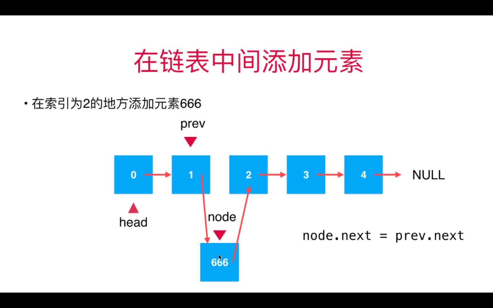
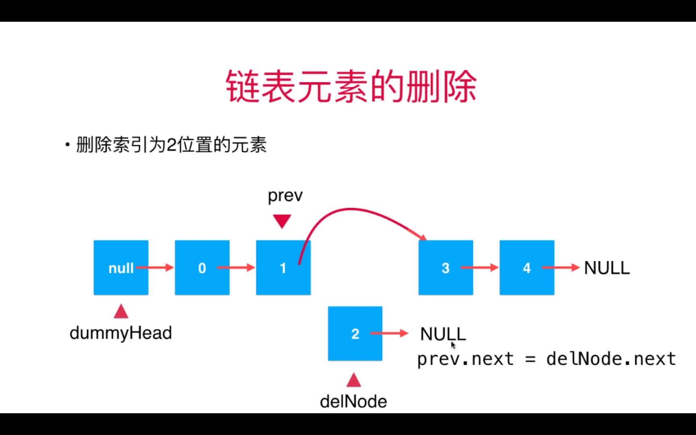
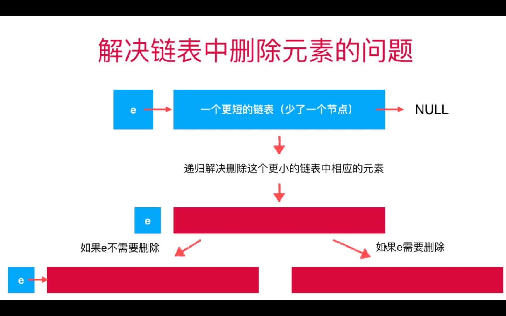
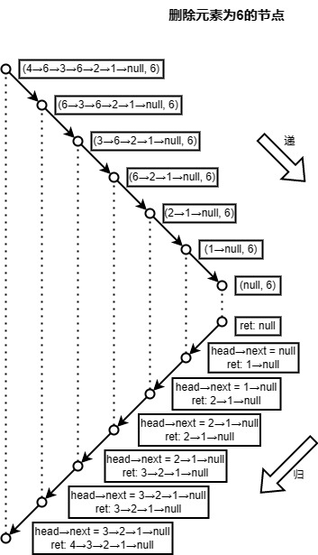
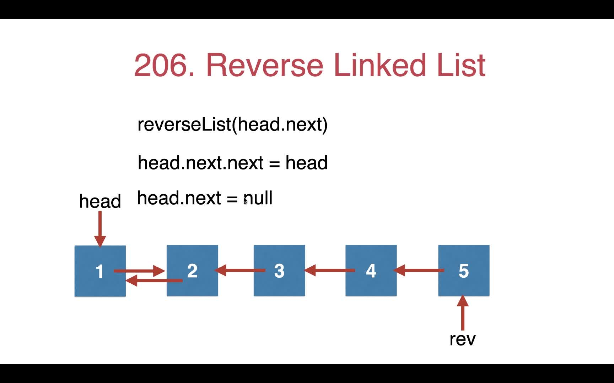
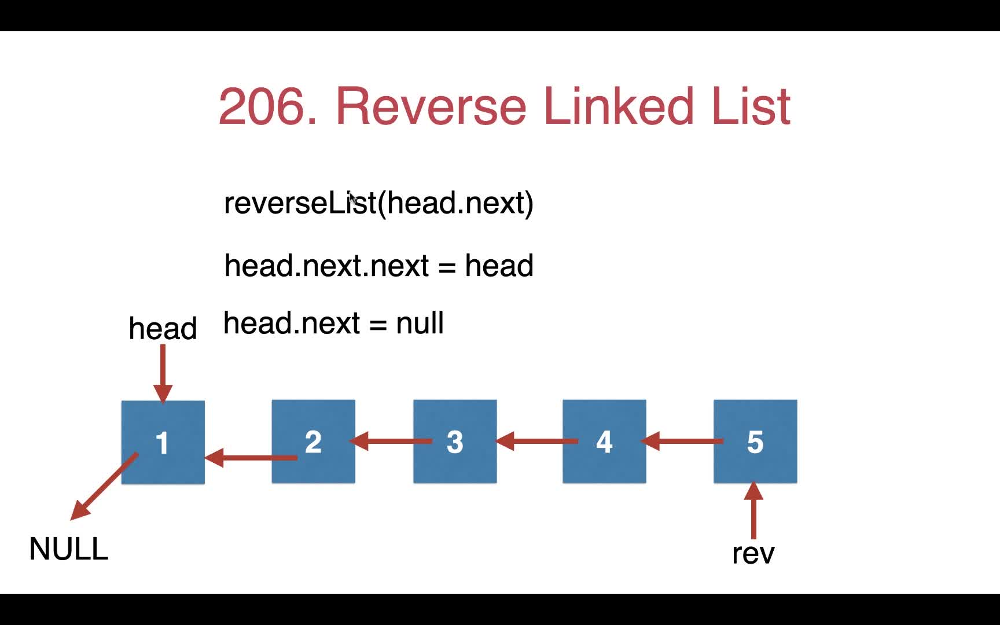

# 链表学习记录

## 一、什么是链表

动态的线性数据结构。


## 二、链表的增删改查

### （一）非递归实现

```PHP
<?php

class LinkedList
{
    // protected Node $head;
    protected Node $dummyHead; // 虚拟头结点
    private $size;

    public function __construct()
    {
        // $this->head = null;
        $this->dummyHead = new Node();
        $this->size = 0;
    }

    public function getSize(): int
    {
        return $this->size;
    }

    public function isEmpty(): bool
    {
        return $this->size == 0;
    }

    // 在链表头添加新的元素
    public function addFirst($e)
    {
        $this->add(0, $e);
    }

    // 在链表的 index (0-based) 位置添加新的元素 e
    public function add($index, $e)
    {
        // 判断 index 的合法性
        if ($index < 0 || $index > $this->size) {
            // 注意 index 可以取到 size 的，因为可以在最后一个节点添加元素
            throw new \Exception('Add failed. illegal index');
        }

        $prev = $this->dummyHead;
        for ($i = 0; $i < $index; $i++) {
            $prev = $prev->next;
        }
        // 顺序很重要
        $node = new Node($e);
        $node->next = $prev->next;
        $prev->next = $node;

        // 更优雅的写法
        // $prev->next = new Node($e, $prev->next);
        $this->size ++;
    }

    // 在链表末尾添加元素 e
    public function addLast($e)
    {
        $this->add($this->size, $e);
    }

    // 获得链表中第 index 个位置的元素：
    public function get($index)
    {
        if ($index < 0 && $index >= $this->size) {
            throw new \Exception('Get failed, Illeal index');
        }

        $cur = $this->dummyHead->next;
        for ($i = 0; $i < $index; $i++) {
            $cur = $cur->next;
        }
        return $cur->e;
    }

    // 获得链表的第一个元素
    public function getFrist()
    {
        return $this->get(0);
    }

    // 获得链表的最后一个元素
    public function getLast()
    {
        return $this->get($this->size - 1);
    }

    // 修改链表的第 index 个位置的元素
    public function set($index, $e)
    {
        if ($index < 0 && $index >= $this->size) {
            throw new \Exception('Set failed, Illeal index');
        }

        $cur = $this->dummyHead->next;
        for ($i = 0; $i < $index; $i++) {
            $cur = $cur->next;
        }
        $cur->e = $e;
    }

    // 查找链表中是否存在元素 e
    public function contains($e)
    {
        $cur = $this->dummyHead->next;
        while ($cur != null) {
            if ($e == $cur->e) {
                return true;
            }
            $cur = $cur->next;
        }
        return false;
    }

    // 从链表中删除第 index 个元素，并返回删除元素的值
    public function remove($index)
    {
        if ($index < 0 || $index >= $this->size) {
            throw new \Exception('Delete failed, illegal index');
        }
        $prev = $this->dummyHead;
        for ($i = 0; $i < $index; $i++) {
            $prev = $prev->next;
        }

        $retNode = $prev->next;
        $prev->next = $retNode->next;
        $retNode->next = NULL;
        $this->size--;

        return $retNode->e;
    }

    // 从链表中删除第一个元素，返回删除元素
    public function removeFirst()
    {
        return $this->remove(0);
    }

    // 从链表中删除最后一个元素，返回删除元素
    public function removeLast()
    {
        return $this->remove($this->size - 1);
    }

    public function toString()
    {
        $cur = $this->dummyHead->next;
        $ret = '';
        while ($cur != null) {
            $ret .= $cur->e . '->';
            $cur = $cur->next;
        }
        $ret .= 'NULL';
        return $ret;
    }
}

class Node
{
    public $e;
    public $next;

    public function __construct($e = null, $next = null)
    {
        $this->e = $e;
        $this->next = $next;
    }
}
```

#### 1. 虚拟头结点（dummy head）

为什么要使用虚拟头结点？详情参考 [链表问题：虚拟节点dummy](https://zhuanlan.zhihu.com/p/143111832)

> 因为头结点的上一个节点不存在，很多对于其他节点，需要用上上一个节点的操作对头结点就不适合，因此，就需要单独考虑头结点。

虚拟头结点的目的就是消除头结点的特殊性，把头结点当做一个普通的节点来处理。即在头结点的前面加上了一个虚拟头结点。

#### 2. 增删

在链表中间添加和删除元素的关键：**找到要添加或删除的节点的前一个节点**。

增加元素示意图：


删除元素示意图：


这也是用虚拟头结点的原因：假如想要在头结点增加一个元素或者删除头结点，那么就需要找到头结点的前一个节点，但是头结点前面是没有节点的，比较常见的做法是分情况讨论；更好的做法是使用虚拟头结点这种技巧，把头结点也当做普通元素来处理，最终也不会对结果产生影响，避免了分类讨论。

值得一提的是，在增加或删除元素时遍历链表时，是**从虚拟头结点开始遍历的**，而非链表的第一个元素开始，代码如下：

```PHP
// 在链表的 index (0-based) 位置添加新的元素 e
public function add($index, $e)
{
    ...
    // 从 dummyHead 开始遍历
    $prev = $this->dummyHead;
    for ($i = 0; $i < $index; $i++) {
        $prev = $prev->next;
    }

    $node = new Node($e);
    $node->next = $prev->next;
    $prev->next = $node;
    $this->size ++;
}

// 从链表中删除第 index 个元素，并返回删除元素的值
public function remove($index)
{
    ...
    // 从 dummyHead 开始遍历
    $prev = $this->dummyHead;
    for ($i = 0; $i < $index; $i++) {
        $prev = $prev->next;
    }

    $retNode = $prev->next;
    $prev->next = $retNode->next;
    $retNode->next = NULL;
    $this->size--;
    return $retNode->e;
}
```

为什么要从 `dummyHead` 开始遍历呢？就不得不再提一遍增加或者删除元素的重点了：找到要添加或删除的节点的**前一个节点**，即我们要找到的前一个节点而非目标节点。

举个例子，在链表 `L` 中位置为 2 的地方添加一个节点 6，链表 `L` 如下：

|index|0|1|2|3|4|5|next|
|----|----|----|----|----|----|----|----|
|val|1|2|3|4|5|6|null|

现在在头结点前面加上一个虚拟头结点：

|index|dummyHead|0|1|2|3|4|5|next|
|----|----|----|----|----|----|----|----|----|
|val|null|1|2|3|4|5|6|null|

遍历的目标节点是 `L[1]`。

```PHP
dummyHead -> next = L[0]
L[0] -> next      = L[1]
```

两次就找到了目标节点的前一个节点，和待添加的位置 2 统一。

#### 3. 改查

遍历找到目标节点即可。但是与增删有些许不同，改查并不是从 dummyHead 开始遍历，而是从**链表的头结点开始**。

举个例子，获取 `L` 中索引为 2 的元素的值，`L` 链表如下：

|index|0|1|2|3|4|5|next|
|----|----|----|----|----|----|----|----|
|val|1|2|3|4|5|6|null|

如果从 `dummyHead` 开始遍历，循环两次，找到的是 `L[1]` 这个元素，那么如果是从头结点开始遍历，那么遍历两次就可以找到目标元素了。

```PHP
L[0] -> next = L[1];
L[1] -> next = L[2];
```

查和改的代码如下：

```PHP
// 修改链表的第 index 个位置的元素
public function set($index, $e)
{
    ...
    // 从头结点开始遍历
    $cur = $this->dummyHead->next;
    for ($i = 0; $i < $index; $i++) {
        $cur = $cur->next;
    }
    $cur->e = $e;
}

// 获得链表中第 index 个位置的元素：
public function get($index)
{
    ...
    // 从头结点开始遍历
    $cur = $this->dummyHead->next;
    for ($i = 0; $i < $index; $i++) {
        $cur = $cur->next;
    }
    return $cur->e;
}
```

## 三、递归删除链表中指定元素

问题描述：给定单向链表的头指针和一个要删除的节点的值，定义一个函数删除该节点；返回删除后的链表的头节点。详情参考 [剑指 Offer 18. 删除链表的节点](https://leetcode.cn/problems/shan-chu-lian-biao-de-jie-dian-lcof/)。

解题思路：利用链表天然的递归性。



> 递归蕴含的思想其实是数学归纳法：为了求解问题`p(n)`，首先解决基础情形 `p(1)`，然后假定 `p(n-1)` 已经解决，在此基础上若 `p(n)`得解，那所有问题均得解。

参考代码如下：
```PHP
<?php
class RemoveElements{
    public function removeEles($head, $e)
    {
        if ($head == null) {
            return null;
        }
        $head->next = $this->removeEles($head->next, 6);
        return $head->val == $e ? $head->next : $head;
    }

    public static function main()
    {
        $arr = [4, 6, 3, 6, 2, 1];
        $head = new ListNode($arr);
        dump($head);

        $ret = (new RemoveElements())->removeEles($head, 6, 0);
        dump($ret);
    }
}

class ListNode
{
    public $val;
    public $next;
    public function __construct($x)
    {
        if (is_int($x)) {
            $this->val = $x;
        } elseif (is_array($x)) {
            if ($x == null || count($x) == 0) {
                throw new \Exception("arr cannot be empty");
            }

            $this->val = $x[0];
            $cur = $this;
            for ($i = 1; $i < count($x); $i ++) {
                $cur->next = new ListNode($x[$i]);
                $cur = $cur->next;
            }
        }
    }

    public function __toString()
    {
        $str = '';
        $cur = $this;
        while ($cur != null) {
            $str .= "{$cur->val}->";
            $cur = $cur->next;
        }
        $str .= 'NULL';
        return $str;
    }
}
```

测试：

```PHP
<?php
$solution = new RemoveElements();
$solution->main();

/*
    结果：
    4->6->3->6->2->1->NULL
    4->3->2->1->NULL
*/
```

一种可视化的，可快速得到递归结果的手段：



## 四、翻转链表

第一版：

```PHP
public function reverseList($head)
    {
        if ($head->next == null) {
            return $head;
        }
        $reversedList = $this->reverseList($head->next);
        $head->next = null;
        $tail = $reversedList;
        while ($tail->next != null) {
            $tail = $tail->next;
        }
        $tail->next = $head;
        return $reversedList;
    }
```

改进：

```PHP
<?php
/**
 * Definition for a singly-linked list.
 * class ListNode {
 *     public $val = 0;
 *     public $next = null;
 *     function __construct($val) { $this->val = $val; }
 * }
 */
class Solution {

    /**
     * @param ListNode $head
     * @return ListNode
     */
    function reverseList($head) {
        if ($head->next == null) {
            return $head;
        }
        $reversedList = $this->reverseList($head->next);
        $head->next->next = $head;
        $head->next = null;
        return $reversedList;
    }
}
```

第一版是我用了三个小时自己想出来的，虽然用的时间有点久，但是自己独立解决了这个问题，还是有点小成就感的。

回顾这个过程，感觉是可以用更短的时间解决这个问题的，花的时间比较久的地方是在思考如何用递归得到的结果构建出最终的结果。

举个例子，翻转链表 `L`。链表 `L` ：`1->2->3->4->5->null`。

把链表 `L` 看成头结点 `1` 后面接了一个更短的链表 `L1`：`2->3->4->5->null`，翻转 `L1` 得到的结果是 `5->4->3->2->null`。现在的问题是如何把链表 `L` 的头结点 `1` 和递归得到的结果 `L1`（`5->4->3->2->null`）组合起来得到最终的结果。

一开始我放了一个错误，即把 `L1` 头结点的下一个节点指向 `L` 的头结点，导致一直无法得到正确的答案，正确的做法是**把 `L1` 的尾结点指向 `L` 的头结点**。

错误的代码：

```PHP
public function reverseList($head)
{
    if ($head->next == null) {
        return $head;
    }
    $reversedList = $this->reverseListWrong($head->next);
    $head->next = null;
    $reversedList->next = $head;
    return $reversedList;
}
/*
    测试：1->2->3->4->5->null
    结果：
    5->1->NULL
*/ 

```

正确的代码：

```PHP
public function reverseList($head)
{
    ...
    $reversedList = $this->reverseList($head->next);
    $head->next = null;
    $tail = $reversedList;
    while ($tail->next != null) {
        $tail = $tail->next;
    }
    $tail->next = $head;
    return $reversedList;
}
```

虽然用循环就能找到链表 `L1` 的尾结点，但是还有更好更简洁的方法。

**链表 `L1` 的尾结点就是链表 `L` 头结点的下一个结点**。即可以通过链表 `L` 头结点的下一个结点找到链表 `L1` 的尾结点，再让链表 `L1` 尾结点的下一个结点指向链表 `L` 的头结点。

改进后的代码如下：

```PHP
function reverseList($head) {
    ...
    $reversedList = $this->reverseList($head->next);
    $head->next->next = $head;
    $head->next = null;
    return $reversedList;
}
```

过程：



需要继续深入学习的内容：

- 引用
- 指针
- 递归
