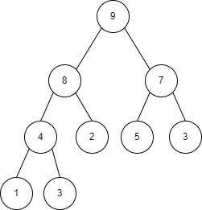
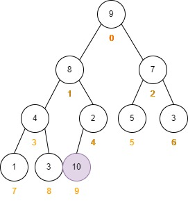
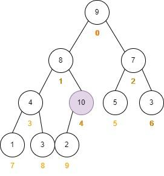
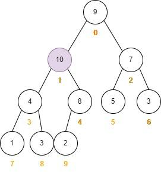
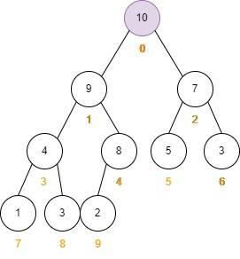
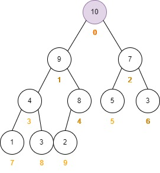
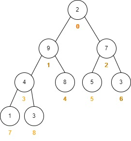
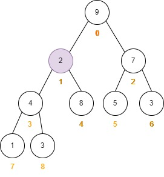
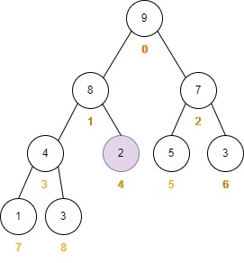

## 性质

以最大堆为例：

1. **完全二叉树**；
2. 父节点的值不小于左右子节点的值。

因为二叉堆具备完全二叉树的性质，所以可以用数组来存储二叉堆。

以开头图中的二叉堆保存在数组中：

|index|0|1|2|3|4|5|6|7|8|
|--|--|--|--|--|--|--|--|--|--|
|value|9|8|7|4|2|5|3|1|3|

如果把二叉堆存储到数组中，那么该如何表现层级关系呢？

- 通过当前索引 k 获取父节点的索引，父节点的索引为 (k - 1) / 2；
- 通过当前索引 k 获取左孩子的索引，左孩子的索引为 2 * k + 1；
- 通过当前索引 k 获取右孩子的索引，右孩子的索引为 2 * k + 2。

具体的推导过程暂且不表，如果有疑惑，可以用几个例子实验一下。

## 上浮与下沉

### 元素上浮（自底向上）

以最大堆为例，在下图的堆中增加一个值为 10 的节点。


需要注意的是，增加节点后**需要维持堆的性质**。

要维持堆的第一个性质，即二叉堆是一个完成二叉树的性质，值为 10 的节点只能加在索引为 4，值为 2 的左子节点：



现在虽然满足了完全二叉树的性质，**但是不满足父节点的值不小于左右子节点的值**，图中索引为 4 的节点是索引为 9 的节点的父节点，但是父节点小于子节点，不符合最大二叉堆的性质。

要维持堆的第二个性质，新增的节点需要“上浮”，即比较新增节点的值与其父节点的值：

- 如果新增节点的值大于其父节点的值，交换新增节点和父节点的值；
- 再比较交换后的父节点与父节点的父节点；
- 重复上述步骤，直到遇到根节点或者“子”节点的值小于等于“父”节点的值。




伪代码：
```PHP
while (k > 0 && data.get(parent(k)) < data.get(k)) {
	swap($k, parent(k));
	k = parent(k);
}

// 注：parent(k) 用于获取父节点的索引
```

### 元素下沉（自顶向下）

元素“下沉”出现在删除根元素的时候。

步骤：

- 根元素与最后一个元素交换，此时根元素的值就是最后一个元素的值，最后一个元素的值就是根元素的值；
- 删除最后一个元素；
- 根元素下沉（交换后，根元素的值是原来堆中最后一个元素的值，无法保证此时根节点的值不小于左右子节点的值，所以需要维持堆的第二点性质）：
	- 比较左右子孩子的值；
	- 比较根元素的值与左右子孩子中较大的值：
		- 如果根元素的值大，则无需下沉；
		- 如果孩子的值大，互相交换值，继续比较孩子与孙子之间的值，直到 k 越界或者孩子的值比孙子的大。
	
以删除下图堆中根节点为例：

根节点与最后一个节点交换：

删除最后一个节点：



参考代码：	 
```PHP
protected function siftDown($k)
{
    while ($this->leftChild($k) < $this->getSize()) {
        $j = $this->leftChild($k);
        if ($j + 1 < $this->getSize() && $this->data->get($j + 1) > $this->data->get($j)) {
            $j = $this->rightChild($k);
        }
        // $data[$j] 是 leftChild 和 rightChild 中的最大值

        if ($this->data->get($k) >= $this->data->get($j)) {
            break;
        }

        $this->data->swap($k, $j);
        $k = $j;
    }
}
```

### 完整代码

```PHP
<?php

class MaxHeap
{
    public $data;
    public function __construct()
    {
        $this->data = new DynamicArray();
    }

    public function getSize()
    {
        // return count($this->data);
        return $this->data->getSize();
    }

    public function isEmpty()
    {
        return $this->data->isEmpty();
        // return empty($this->data);
    }

    // 一个索引所表示的元素父亲节点的索引
    public function parent($index)
    {
        if ($index == 0) {
            throw new \Exception("index-0 doesn't have parent.");
        }

        return ($index - 1) / 2;
    }

    public function leftChild($index)
    {
        return $index * 2 + 1;
    }

    public function rightChild($index)
    {
        return $index * 2 + 2;
    }

    public function add($e)
    {
        $this->data->addLast($e);
        $this->siftUp($this->getSize() - 1);
    }

    protected function siftUp($k)
    {
        while ($k > 0 && $this->data->get($this->parent($k)) < $this->data->get($k)) {
            $this->data->swap($k, $this->parent($k));
            $k = $this->parent($k);
        }
    }

    // 堆中最大的元素
    public function findMax()
    {
        if ($this->getSize() == 0) {
            throw new \Exception('Cannot findMax when heap is empty');
        }

        return $this->data->get(0);
    }

    // 取出堆中最大元素
    public function extractMax()
    {
        $res = $this->findMax();
        $this->data->swap(0, $this->getSize() - 1);
        $this->data->removeLast();
        $this->siftDown(0);
        return $res;
    }

    protected function siftDown($k)
    {
        while ($this->leftChild($k) < $this->getSize()) {
            $j = $this->leftChild($k);
            if ($j + 1 < $this->getSize() && $this->data->get($j + 1) > $this->data->get($j)) {
                $j = $this->rightChild($k);
            }
            // $data[$j] 是 leftChild 和 rightChild 中的最大值

            if ($this->data->get($k) >= $this->data->get($j)) {
                break;
            }

            $this->data->swap($k, $j);
            $k = $j;
        }
    }

    public function heapify($arr)
    {
        $this->data->setArray($arr);
        for ($i = $this->parent($this->getSize() - 1); $i >= 0; $i--) {
            $this->siftDown($i);
        }
    }
}

class DynamicArray
{
    private $size;
    private $data;
    private $capacity;

    public function __construct($capacity = 10, $data = [])
    {
        $this->capacity = $capacity;
        $this->size = 0;
        $this->data = $data;
    }

    public function setArray($arr)
    {
        for ($i = 0; $i < count($arr); $i ++) {
            $this->data[$i] = $arr[$i];
        }
        $this->size = count($arr);
    }

    // 获取数组中元素的个数；
    public function getSize()
    {
        return $this->size;
    }

    // 在数组的末尾添加一个元素
    public function addLast($e)
    {
        $this->add($this->size, $e);
    }

    // 在数组的第一个位置添加元素
    public function addFirst($e)
    {
        $this->add(0, $e);
    }

    // 判断数组是否为空
    public function isEmpty()
    {
        return $this->size == 0;
    }

    // 获取数组的容量
    public function getCapacity()
    {
        return $this->capacity;
    }

    public function getData()
    {
        return $this->data;
    }

    // 在任意位置添加元素
    public function add(int $index, $e)
    {
        if ($index < 0 || $index > $this->size) {
            throw new Exception('AddLast failed, index is not illegal.');
        }

        if ($this->size == $this->capacity) {
            $this->resize($this->capacity * 2);
        }

        for ($i = count($this->data) - 1; $i >= $index; $i--) {
            $this->data[$i + 1] = $this->data[$i];
        }
        $this->data[$index] = $e;
        $this->size++;
    }

    // 通过索引查找某个元素
    public function get(int $index)
    {
        if ($index < 0 || $index > $this->size) {
            throw new Exception('illegal index.');
        }
        return $this->data[$index];
    }

    public function getLast()
    {
        return $this->get($this->size - 1);
    }

    public function getFirst()
    {
        return $this->get(0);
    }

    // 通过索引修改某个元素的值
    public function set(int $index, $e)
    {
        if ($index < 0 || $index > $this->size) {
            throw new Exception('illegal index.');
        }
        $this->data[$index] = $e;
    }

    // 查找某个值，如果存在则返回 true 否则返回 false；
    public function contains($e)
    {
        for ($i = 0; $i < $this->size; $i++) {
            if ($this->data[$i] == $e) {
                return true;
            }
        }
        return false;
    }

    // 查找某个值，如果存在则返回该值对应的索引，否则返回 - 1；
    public function find($e)
    {
        for ($i = 0; $i < $this->size; $i++) {
            if ($this->data[$i] == $e) {
                return $i;
            }
        }
        return -1;
    }

    // 删除元素
    public function remove(int $index)
    {
        if ($index < 0 || $index >= $this->size) {
            throw new Exception('illegal index.');
        }
        
        $re = $this->data[$index];
        for ($i = $index; $i + 1 < $this->size; $i++) {
            $this->data[$i] = $this->data[$i + 1];
        }

        $this->size--;

        if ($this->size == floor($this->capacity / 4) && floor($this->capacity / 2) != 0) {
            $this->resize(floor($this->capacity / 2));
        }
        return $re;
    }

    // 删除第一个元素
    public function removeFirst()
    {
        return $this->remove(0);
    }

    // 删除最后一个元素
    public function removeLast()
    {
        return $this->remove($this->size - 1);
    }

    public function resize($newCapacity)
    {
        $newData = [];
        for ($i = 0; $i < $this->size; $i++) {
            $newData[$i] = $this->data[$i];
        }
        $this->capacity = $newCapacity;
        $this->data = $newData;
    }

    public function swap($i, $j)
    {
        if ($i < 0 || $i > $this->getSize() - 1 || $j < 0 || $j > $this->getSize() - 1) {
            throw new \Exception('invalid index');
        }
        $temp = $this->data[$i];
        $this->data[$i] = $this->data[$j];
        $this->data[$j] = $temp;
    }
}
```

## 应用

优先队列

top K 问题