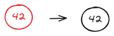
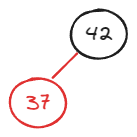
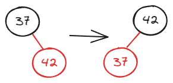
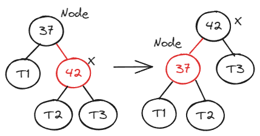
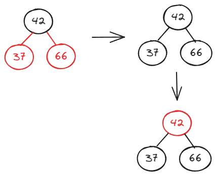
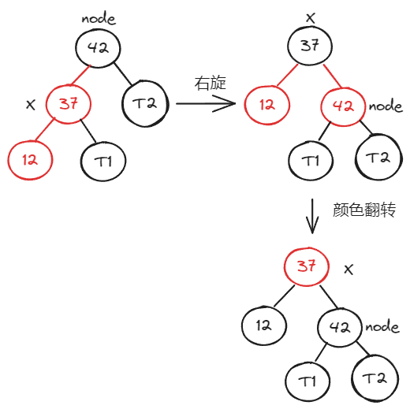

## 定义

1. 红黑树的节点要么是黑色的要么是红色的；
2. 红黑树的根节点一定是黑色的；
3. 红黑树的叶子节点都是黑色的；
4. 如果红黑树中一个节点是红色的，那么他的孩子节点都是黑色的；
5. 从任意一个节点到叶子节点，经过的黑节点是一样的。（红黑树是保持“黑平衡”的二叉树）

## 子过程

### 左旋转

红黑树中添加元素
- 红黑树本身是空的，直接添加上去
- 添加到左右子树都为空的黑节点上
	- 如果添加的是左孩子，直接添加上去
	- 如果添加的是右孩子，此时需要**左旋转**

向空树中添加元素，默认添加的是红节点，但是要保持红黑树的根节点是黑色的性质，所以需要将红节点变成黑节点。



添加到左右子树都为空的黑节点上，如果添加到左孩子上，直接添加上去即可。例如，向根节点 42 添加节点 37，如下图所示：



如果添加到右孩子上，则需要左旋转。例如，向根节点 37 添加节点 42，如下图所示：



左旋更一般的情况：



伪代码如下：

```PHP
Node.right = X.left;
X.left = Node;
X.color = Node.color;
Node.color = RED;
```

需要注意的是，左旋转是一个子过程，在左旋转的过程中可能会出现连续两个红节点的情况，在左旋后会把新的子树的根，也就是 X 这个节点传回去，传回去之后还需要进行更多的处理。

### 颜色翻转

向节点为 42、37 的红黑树添加节点 66，类似于 2-3 树中的三节点添加元素。

添加完节点 66 后，根节点 42 的左右孩子都是红色的，而在红黑树中，红节点可以理解为该节点和父亲节点是融合在一起的，换句话说，37,42,66 组成的树可以看做 2-3 树中临时四节点。而在 2-3 数中，临时的四节点拆分成三个二节点组成的子树，即 37，66 变为黑色，除此之外子树的根节点需要向上融合，即子树的根节点 42 要变为红色：



### 右旋转

向节点为 42、37 的红黑树添加节点 12，类似于 2-3 树中的三节点添加元素。

伪代码

```PHP
node.left = T1;
x.right = node;
x.color = node.color;
node.color = RED; // 12 37 42 对应 2-3 树中临时的四节点，所以需要让 42 也就是 node 的颜色变为红色，表示 node 和 node 的父亲节点融合
```

还需要颜色翻转：


