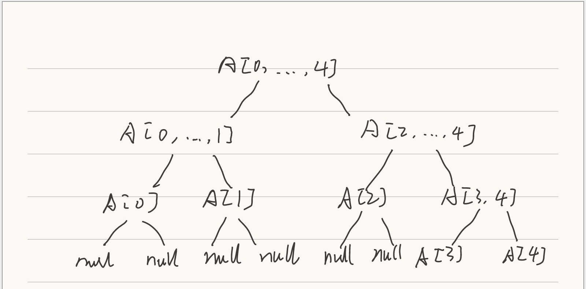
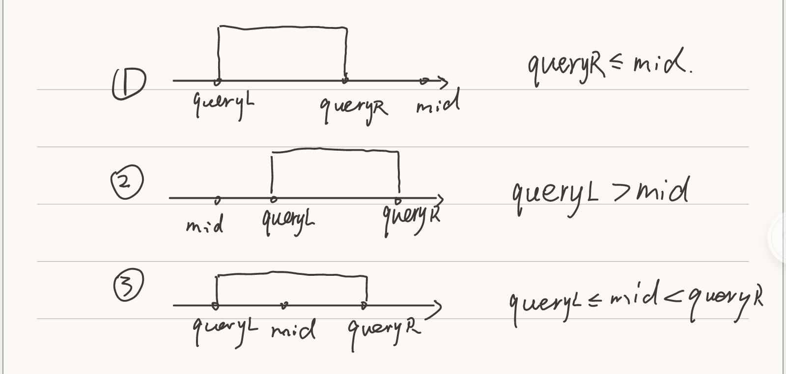
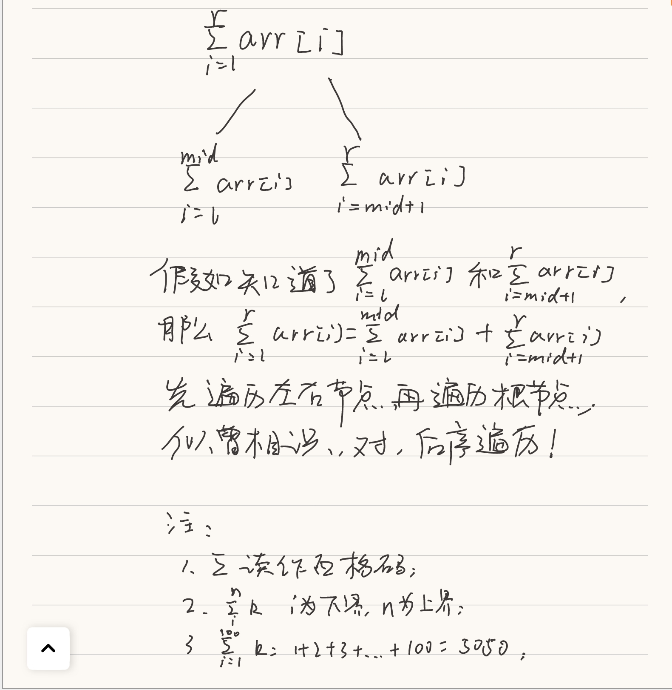

# 线段树

线段树用来解决什么样的问题？
区间查询！即查询一个区间[i, j]的最大值，最小值或者区间数字和。
实质：基于区间的统计查询，主要涉及更新和查询的操作。

抽象：
对于给定区间，更新区间中一个元素或者一个区间的值；查询一个区间[i, j]的最大值、最小值、或者q区间数字之和。

## 线段树的性质

- 线段树不是完全二叉树；
- 线段树是平衡二叉树（可以用数组存储）；
- 线段树可以看做满二叉树；
- 如果区间有 n 个元素，用数组表示线段树需要多少空间？需要 4n 的空间。（如果线段树不考虑添加元素，即区间估- 固定，使用 4n 的静态空间即可，当然 PHP 不用考虑数组空间的问题）



## 接口

|序号|返回值类型|名称|描述|
|----|----|----|----|
|1|int|query(\$queryL, \$queryR)|查找区间[queryL, queryR]中元素的和|
|2|void|set(\$index, \$e)|通过键更新传入的数据的值，并更新线段树|
|3|int|getSize()|获取传入数据的大小|
|4|int|get(\$index)|通过键获取传入数据的值|

## query 接口



## 后序遍历

三种情况：

1. queryR <= mid;
2. queryL > mid;
3. queryL <= mid < queryR;

注意：查询方法的递归终止条件是：`l==queryL && r==queryR`。

实现查询方法的参数：

- treeIndex 确定是哪个节点；
- l、r 确定节点的数据范围；
- queryL 和 queryR 确定查询的范围。



## 代码

```PHP
<?php

class SegmentTree
{
    private $data;
    private $tree;

    public function __construct($arr)
    {
        for ($i = 0; $i < count($arr); $i ++) {
            $this->data[$i] = $arr[$i];
        }
        $this->tree = array_fill(0, 4 * count($arr), 'null');
        $this->buildSegmentTree(0, 0, count($this->data) - 1);
    }

    // 在 treeIndex 的位置创建表示区间 [l,...,r] 的线段树
    public function buildSegmentTree($treeIndex, $l, $r)
    {
        if ($l == $r) {
            $this->tree[$treeIndex] = $this->data[$l];
            return;
        }

        $leftTreeIndex = $this->leftChild($treeIndex);
        $rightTreeIndex = $this->rightChild($treeIndex);

        $mid = floor(($l + $r) / 2);
        $this->buildSegmentTree($leftTreeIndex, $l, $mid);
        $this->buildSegmentTree($rightTreeIndex, $mid + 1, $r);
        $this->tree[$treeIndex] = $this->tree[$leftTreeIndex] + $this->tree[$rightTreeIndex];
    }

    public function query($queryL, $queryR)
    {
        if ($queryL < 0 || $queryL >= count($this->data) || $queryR < 0 || $queryR >= count($this->data) || $queryL > $queryR) {
            throw new Exception('Index is illegal');
        }
        return $this->implementsQuery(0, 0, count($this->data) - 1, $queryL, $queryR);
    }

    public function implementsQuery($treeIndex, $l, $r, $queryL, $queryR)
    {
        if ($l == $queryL && $r == $queryR) {
            return $this->tree[$treeIndex];
        }

        $mid = floor(($l + $r) / 2);
        $leftTreeIndex = $this->leftChild($treeIndex);
        $rightTreeIndex = $this->rightChild($treeIndex);

        if ($queryL >= $mid + 1) {
            return $this->implementsQuery($rightTreeIndex, $mid + 1, $r, $queryL, $queryR);
        } elseif ($queryR <= $mid) {
            return $this->implementsQuery($leftTreeIndex, $l, $mid, $queryL, $queryR);
        }

        $leftResult = $this->implementsQuery($leftTreeIndex, $l, $mid, $queryL, $mid);
        $rightResult = $this->implementsQuery($rightTreeIndex, $mid + 1, $r, $mid + 1, $queryR);
        return $leftResult + $rightResult;
    }

    public function set($index, $e)
    {
        if ($index < 0 || $index >= count($this->data)) {
            throw new Exception("Index is Illegal");
        }
        $this->data[$index] = $e;
        $this->implementsSet(0, 0, count($this->data) - 1, $index, $e);
    }

    public function implementsSet ($treeIndex, $l, $r, $index, $e)
    {
        if ($l == $r) {
            $this->tree[$treeIndex] = $e;
            return;
        }

        $mid = floor(($l + $r) / 2);
        $leftTreeIndex = $this->leftChild($treeIndex);
        $rightTreeIndex = $this->rightChild($treeIndex);
        if ($index <= $mid) {
            $this->implementsSet($leftTreeIndex, $l, $mid, $index, $e);
        } else {
            $this->implementsSet($rightTreeIndex, $mid + 1, $r, $index, $e);
        }
        $this->tree[$treeIndex] = $this->tree[$leftTreeIndex] + $this->tree[$rightTreeIndex];
    }

    public function get($index)
    {
        if ($index >= count($this->data) || $index < 0) {
            throw new Exception('illegal index');
        }
        return $this->data[$index];
    }

    public function getSize()
    {
        return count($this->data);
    }

    public function leftChild($index)
    {
        return 2 * $index + 1;
    }

    public function rightChild($index)
    {
        return 2 * $index + 2;
    }

    public function __toString()
    {
        return '['.trim(implode(', ', $this->tree), ', ').']';
    }
}


$arr = [-2, 0, 3, -5, 2, -1];
$segTree = new SegmentTree($arr);
// echo $segTree;

echo $segTree->query(0, 1).PHP_EOL;
$segTree->set(0,-3);
echo $segTree->query(0, 1);
// echo $segTree->query(2, 5);
// echo $segTree->query(0, 5);
```
