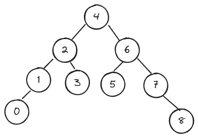
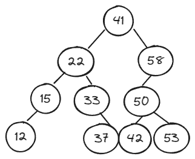
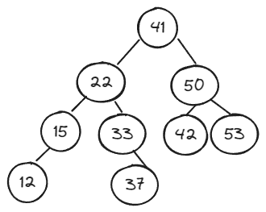
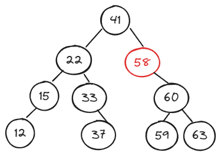
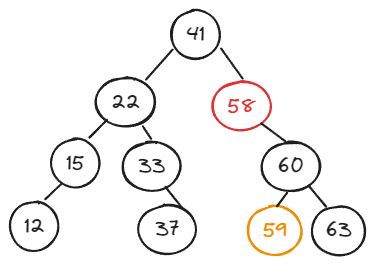
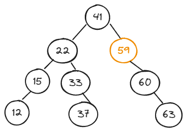

## 二分搜索树的删除

待删除节点：

1. 左子树为空，右子树不为空；
2. 左子树不为空，右子树为空；
3. 左右子树都为空。

两个辅助方法：

1. 删除最小值，找到以 Node 为根节点的二分搜索树的最小值；
2. 删除最大值，找到以 Node 为根节点的二分搜索树的最大值。

删除最大值，以下图二分搜索树为例。下图中二分搜索树的最大值为 58，且只有左子树。

当删除最大值后，待删除节点的左子树取代它的位置，如下图所示：

删除任意节点的值：

- 左右子树都不为空的情况；
- **找到比待删除节点大的最小值，即待删除节点右子树的最小节点**，此节点也被称为后继节点；
- 用这个节点顶替待删除节点的位置。

以下图的二分搜索树为例，删除值为 58 的节点：

找到待删除节点右子树的最小值，在上图的二分搜索树中，删除的是值为 58 的节点，那么要找的就是值为 59 的节点，并用值为 59 的节点取代值为 58 的节点。

后继节点：

结果：

