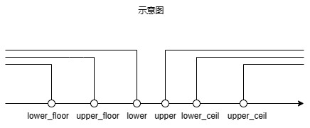
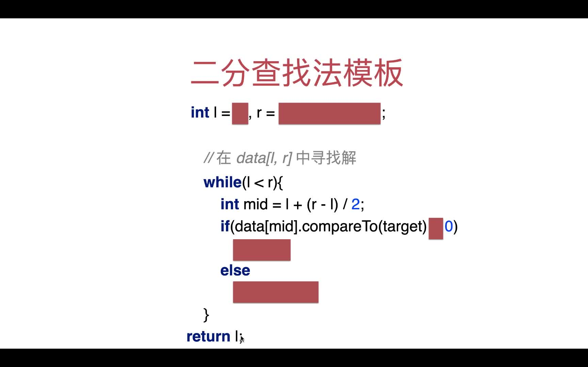

# 二分查找

二分查找算法本身不难，这一章的重点不在二分查找算法本身，而是如何写出正确的代码。

关键字：清晰、严谨

定义不同的循环不变量，或者不一样的函数语义都会导致代码不一样。

## 二分查找法的两种实现方式

定义两种不同的循环不变量来实现二分查找法：

第一种，也是比较常见的一种：**在 data[l,...,r] 范围内查找 target**。注意，data 的区间范围是左闭右闭。

```PHP
public function search($nums, $target)
{
    // 在 data[l,...,r] 范围内查找
    $l = 0;
    $r = count($nums) - 1;

    while ($l <= $r) {
        $mid = floor(($l + $r) / 2);
        if ($target == $nums[$mid]) {
            return $mid;
        }
        if ($target < $nums[$mid]) {
            $r = $mid - 1;
        } else {
            $l = $mid + 1;
        }
    }
    return -1;
}
```

第二种，**在 data[l,...,r) 的范围中寻找 target**。注意，data 的区间范围是左闭右开。

```PHP
public function search($nums, $target)
{
    // 定义循环不变量
    // arr[l, r) 的范围中寻找 target
    $l = 0;
    $r = count($nums);

    while ($l < $r) {       // 注意这里是 l < r 而 l <= r
        $mid = floor(($l + $r) / 2);
        if ($target == $nums[$mid]) {
            return $mid;
        }
        if ($target < $nums[$mid]) {
            $r = $mid;      // 继续在 data[l, mid) 范围里寻找
        } else {
            $l = $mid + 1;  // 继续在 data[mid + 1, r) 范围里寻找
        }
    }
    return -1;
}
```

对比代码可以看出，循环不变量不一样：

- 参数的初始值不一样；
- 循环的终止条件不一样；
- 循环体也不一样，换句话说，维护参数的方法不一样。

从这个例子也可以看出，实现算法的手段有很多，定义不一样的循环不变量，代码也会不一样。

那么该如何根据循环不变量写出正确的代码呢？

- 严谨的定义；
- 清晰的语义。

需要知道每个参数的具体含义，循环不变量是什么，在循环中该如何维护这些参数，函数的语义，即：

- 循环不变量；
- 参数定义；
- 参数的初始值；
- 终止条件；
- 如何维护参数。

## 二分查找法的变式

二分查找法的变式主要分为两类六种：

- 查找比 target 大的最小值
  - upper：查找比 target 大的最小值，例如在数组 arr [1, 1, 3, 3, 5, 5, 7, 7] 中查找比 1 大的最小值，这个最小值是 3，故返回的值是 3 对应的索引 2;
  - upper_ceil
    - 如果数组中存在 target，返回最大索引；例如在数组 arr [1, 1, 3, 3, 5, 5, 7, 7] 中查找 3，数组中存在 3，返回的是**最大的索引 3** 而不是 2;
    - 如果数组不存在 target，返回 upper；例如在数组 arr [1, 1, 3, 3, 5, 5, 7, 7] 中查找 2，数组中没有 2，故返回的是比 2 大的最小的元素对应的索引，比 2 大的最小的元素为 3，对应的索引是 2，故返回的是 2.
  - lower_ceil
    - **求解大于等于 target 的最小索引**；例如在数组 arr [1, 1, 3, 3, 5, 5, 7, 7] 中查找 3，数组中存在 3，返回的是**最小的索引 2** 而不是 3;
- 查找比 target 小的最大值
  - lower：比 target 小的最大值；例如在数组 arr [1, 1, 3, 3, 5, 5, 7, 7] 中查找比 5 小的最大值，这个最大值是 3，故返回的值是 3 对应的索引 3;
  - lower_floor
    - 如果数组中存在 target，则返回最小索引；例如在数组 arr [1, 1, 3, 3, 5, 5, 7, 7] 中查找 3，数组中存在 3，返回的是**最小的索引 2** 而不是 3;
    - 如果数组中不存在 target，返回 lower；例如在数组 arr [1, 1, 3, 3, 5, 5, 7, 7] 中查找 4，数组中不存在 4，返回的是比 4 小的最大值对应的索引，这个最大值是 3，对应的索引是 3，故返回的是 3;
  - upper_floor
    - 如果数组中存在 target，返回最大索引；
    - 如果数组中不存在 target，返回 lower。
    - 用一句话总结，求解的就是**小于等于 target 的最大索引**；例如在数组 arr [1, 1, 3, 3, 5, 5, 7, 7] 中查找 3，数组中存在 3，返回的是**最大的索引 3** 而不是 2;



Upper 代码如下：

```PHP
<?php

class BS
{
    // 二分查找法的变式
    public function upper($arr, $target)
    {
        $l = 0;
        $r = count($arr);
        $i = 1;
        echo '调用 upper 方法：'.PHP_EOL;
        while ($l < $r) {
            $mid = floor(($l + $r) / 2);
            echo sprintf("第 %d 轮循环，初始搜索范围[%d, %d], mid = %d, arr[mid] = %d, ", $i, $l, $r, $mid, $arr[$mid]);
            if ($target >= $arr[$mid]) {
                $l = $mid + 1;
            } else {
                $r = $mid;
            }
            echo sprintf("下轮循环的搜索范围[%d, %d] ", $l, $r).PHP_EOL;
            $i ++;
        }
        return $l;
    }

    public function upperCeil($arr, $target)
    {
        // 如果数组中存在元素，返回最大索引，如果数组中不存在元素，返回 upper。
        // 先找到比 target 的最小值对应的索引 u，如果 u-1 对应的元素等于 target，则返回 u - 1，否则返回 u。
        echo '调用 upperCeil 方法：'.PHP_EOL;
        $u = $this->upper($arr, $target);
        if ($u - 1 >= 0 && $arr[$u - 1] == $target) {
            return $u - 1;
        }
        return $u;
    }

    public function lowerCeil($arr, $target)
    {
        // 查找大于等于 target 的最小索引
        $l = 0;
        $r = count($arr);
        $i = 0;
        echo '调用 lowerCeil 方法：'.PHP_EOL;
        while ($l < $r) {
            $mid = floor(($l + $r) / 2);
            echo sprintf("第 %d 轮循环，初始搜索范围[%d, %d], mid = %d, arr[mid] = %d, ", $i, $l, $r, $mid, $arr[$mid]);
            if ($target > $arr[$mid]) {
                $l = $mid + 1;
            } else {
                $r = $mid;
            }
            echo sprintf("下轮循环的搜索范围[%d, %d] ", $l, $r).PHP_EOL;
            $i ++;
        }
        return $l;
    }

    public function myUpper($arr, $target)
    {
        // 不带调试代码的 upper 方法
        $l = 0;
        $r = count($arr);
        while ($l < $r) {
            $mid = floor(($l + $r) / 2);
            if ($target >= $arr[$mid]) {
                $l = $mid + 1;
            } else {
                $r = $mid;
            }
        }
        return $l;
    }

    public function myLowerCeil($arr, $target){
        // 不带调试代码的 lowerCeil 方法
        $l = 0;
        $r = count($arr);
        while ($l < $r) {
            $mid = floor(($l + $r) / 2);
            if ($target > $arr[$mid]) {
                // 与 upper 方法相比，不同之处在于这里没有等于号
                $l = $mid + 1;
            } else {
                $r = $mid;
            }
        }
        return $l;
    }

    public static function Main()
    {
        $arr = [1, 1, 3, 3, 5, 5, 7, 7];
        $bs = new BS();
        $arrStr = '['.implode(', ', $arr).']';
        $target = 3;
        $index = $bs->upper($arr, $target);
        echo sprintf("在数组 %s 中比 %d 大的最小值对应的索引是 %d，其值为：%d。", $arrStr,$target, $index, $arr[$index]).PHP_EOL;

        echo PHP_EOL;

        $index = $bs->upperCeil($arr, $target);
        echo sprintf("在数组 %s 中比 %d 大的最小值对应的大索引是 %d，其值为：%d。", $arrStr,$target, $index, $arr[$index]).PHP_EOL;

        echo PHP_EOL;

        $index = $bs->lowerCeil($arr, $target);
        echo sprintf("在数组 %s 中比 %d 大的最小值对应的小索引是 %d，其值为：%d。", $arrStr,$target, $index, $arr[$index]).PHP_EOL;
    }
}

BS::Main();
```

输出如下：

```PHP
调用 upper 方法：
第 1 轮循环，初始搜索范围[0, 8], mid = 4, arr[mid] = 5, 下轮循环的搜索范围[0, 4] 
第 2 轮循环，初始搜索范围[0, 4], mid = 2, arr[mid] = 3, 下轮循环的搜索范围[3, 4] 
第 3 轮循环，初始搜索范围[3, 4], mid = 3, arr[mid] = 3, 下轮循环的搜索范围[4, 4] 
在数组 [1, 1, 3, 3, 5, 5, 7, 7] 中比 3 大的最小值对应的索引是 4，其值为：5。

调用 upperCeil 方法：
调用 upper 方法：
第 1 轮循环，初始搜索范围[0, 8], mid = 4, arr[mid] = 5, 下轮循环的搜索范围[0, 4] 
第 2 轮循环，初始搜索范围[0, 4], mid = 2, arr[mid] = 3, 下轮循环的搜索范围[3, 4] 
第 3 轮循环，初始搜索范围[3, 4], mid = 3, arr[mid] = 3, 下轮循环的搜索范围[4, 4] 
在数组 [1, 1, 3, 3, 5, 5, 7, 7] 中比 3 大的最小值对应的大索引是 3，其值为：3。

调用 lowerCeil 方法：
第 0 轮循环，初始搜索范围[0, 8], mid = 4, arr[mid] = 5, 下轮循环的搜索范围[0, 4] 
第 1 轮循环，初始搜索范围[0, 4], mid = 2, arr[mid] = 3, 下轮循环的搜索范围[0, 2] 
第 2 轮循环，初始搜索范围[0, 2], mid = 1, arr[mid] = 1, 下轮循环的搜索范围[2, 2] 
在数组 [1, 1, 3, 3, 5, 5, 7, 7] 中比 3 大的最小值对应的小索引是 2，其值为：3。
```

Lower 代码如下：

```PHP
<?php

class BS
{
    public function lower($arr, $target)
    {
        // 比 target 小的最大值
        // 在 arr[l, r] 中找
        $l = -1;
        $r = count($arr) - 1;
        $i = 0;
        echo '调用 lower 方法：'.PHP_EOL;
        while ($l < $r) {
            $mid = ceil(($l + $r) / 2);
            echo sprintf("第 %d 轮循环，初始搜索范围[%d, %d], mid = %d, arr[mid] = %d, ", $i, 
            $l, $r, $mid, $arr[$mid]);
            if ($target <= $arr[$mid]) {
                // 比 target 大的元素直接舍弃
                $r = $mid - 1;
            } else {
                $l = $mid;
            }
            echo sprintf("下轮循环的搜索范围[%d, %d] ", $l, $r).PHP_EOL;
            $i ++;
        }
        return $l;
    }

    public function lowerFloor($arr, $target)
    {
        echo '调用 lowerFloor 方法：'.PHP_EOL;

        /*
            如果数组中存在target，则返回最小索引
            如果数组中不存在 target，返回 lower
        */
        $lower = $this->lower($arr, $target);
        if ($lower + 1 < count($arr) && $arr[$lower + 1] == $target) {
            return $lower + 1;
        }
        return $lower;
    }

    public function upperFloor($arr, $target)
    {
        /*
            如果数组中存在 target，返回最大索引；
            如果数组中不存在 target，返回 lower。
        */ 
        $l = -1;
        $r = count($arr) - 1;
        $i = 0;
        echo '调用 upperFloor 方法：'.PHP_EOL;
        while ($l < $r) {
            $mid = ceil(($l + $r) / 2);
            echo sprintf("第 %d 轮循环，初始搜索范围[%d, %d], mid = %d, arr[mid] = %d, ", $i, 
            $l, $r, $mid, $arr[$mid]);
            if ($target < $arr[$mid]) {
                // 比 target 大的元素直接舍弃
                $r = $mid - 1;
            } else {
                $l = $mid;
            }
            echo sprintf("下轮循环的搜索范围[%d, %d] ", $l, $r).PHP_EOL;
            $i ++;
        }
        return $l;
    }

    public function myLower($arr, $target)
    {
        // 不带调试代码的 lower 方法
        // 比 target 小的最大值
        // 在 arr[l, r] 中找
        $l = -1;
        $r = count($arr) - 1;
        while ($l < $r) {
            $mid = ceil(($l + $r) / 2);
            if ($target <= $arr[$mid]) {
                // 比 target 大的元素直接舍弃
                $r = $mid - 1;
            } else {
                $l = $mid;
            }
        }
        return $l;
    }

    public function MyLowerFloor($arr, $target)
    {
        // 不带调试代码的 MyLowerFloor 方法
        /*
            如果数组中存在target，则返回最小索引
            如果数组中不存在 target，返回 lower
        */
        $lower = $this->lower($arr, $target);
        if ($lower + 1 < count($arr) && $arr[$lower + 1] == $target) {
            return $lower + 1;
        }
        return $lower;
    }
    
    public function MyUpperFloor($arr, $target)
    {
        // 不带调试代码的 MyUpperFloor 方法
        /*
            如果数组中存在 target，返回最大索引；
            如果数组中不存在 target，返回 lower。
        */ 
        $l = -1;
        $r = count($arr) - 1;
        while ($l < $r) {
            $mid = ceil(($l + $r) / 2);
            if ($target < $arr[$mid]) {
                // 比 target 大的元素直接舍弃
                $r = $mid - 1;
            } else {
                $l = $mid;
            }
        }
        return $l;
    }

    public static function Main()
    {
        $arr = [1, 1, 3, 3, 5, 5, 7, 7];
        $bs = new BS();
        $arrStr = '['.implode(', ', $arr).']';
        $target = 3;
        $index = $bs->lower($arr, $target);
        echo sprintf("在数组 %s 中比 %d 大的最小值对应的索引是 %d，其值为：%d。", $arrStr, $target, $index, $arr[$index]).PHP_EOL;
        echo PHP_EOL;

        $index = $bs->lowerFloor($arr, $target);
        echo sprintf("在数组 %s 中比 %d 大的最小值对应的最小索引是 %d，其值为：%d。", $arrStr, $target, $index, $arr[$index]).PHP_EOL;
        echo PHP_EOL;

        $index = $bs->upperFloor($arr, $target);
        echo sprintf("在数组 %s 中比 %d 大的最小值对应的最大索引是 %d，其值为：%d。", $arrStr, $target, $index, $arr[$index]).PHP_EOL;
        echo PHP_EOL;
    }
}

BS::Main();
```

输出如下：

```PHP
调用 lower 方法：
第 0 轮循环，初始搜索范围[-1, 7], mid = 3, arr[mid] = 3, 下轮循环的搜索范围[-1, 2] 
第 1 轮循环，初始搜索范围[-1, 2], mid = 1, arr[mid] = 1, 下轮循环的搜索范围[1, 2] 
第 2 轮循环，初始搜索范围[1, 2], mid = 2, arr[mid] = 3, 下轮循环的搜索范围[1, 1] 
在数组 [1, 1, 3, 3, 5, 5, 7, 7] 中比 3 大的最小值对应的索引是 1，其值为：1。

调用 lowerFloor 方法：
调用 lower 方法：
第 0 轮循环，初始搜索范围[-1, 7], mid = 3, arr[mid] = 3, 下轮循环的搜索范围[-1, 2] 
第 1 轮循环，初始搜索范围[-1, 2], mid = 1, arr[mid] = 1, 下轮循环的搜索范围[1, 2] 
第 2 轮循环，初始搜索范围[1, 2], mid = 2, arr[mid] = 3, 下轮循环的搜索范围[1, 1] 
在数组 [1, 1, 3, 3, 5, 5, 7, 7] 中比 3 大的最小值对应的最小索引是 2，其值为：3。

调用 upperFloor 方法：
第 0 轮循环，初始搜索范围[-1, 7], mid = 3, arr[mid] = 3, 下轮循环的搜索范围[3, 7] 
第 1 轮循环，初始搜索范围[3, 7], mid = 5, arr[mid] = 5, 下轮循环的搜索范围[3, 4] 
第 2 轮循环，初始搜索范围[3, 4], mid = 4, arr[mid] = 5, 下轮循环的搜索范围[3, 3] 
在数组 [1, 1, 3, 3, 5, 5, 7, 7] 中比 3 大的最小值对应的最大索引是 3，其值为：3。
```

### 注意

为了保证解在搜索范围中：

- 在 upper 中，l 的初始值为 0，**r 的初始值为 count(arr)**，而不是 count(arr) - 1；
- 在 lower 中，**l 的初始值为 -1**，而不是 0，r 的初始值为 count(arr) - 1；

在 lower 中，为了保证能够收敛到 l == r，应该向上取整，而不是向下取整，即 mid = ceil((l + r) / 2)。

### 代码模板

