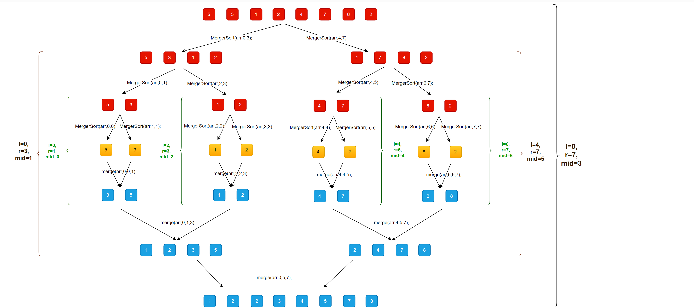

# 归并排序算法学习记录

## 简介

> 归并排序(Merge sort)，是创建在归并操作上的一种有效的排序算法，其时间复杂度为O(N*logN)。该算法是采用分治法（Divide and Conquer）的一个非常典型的应用，且各层分治递归可以同时进行。

归并排序算法使用了分而治之的思想：

- 分：在数组的中间位置，将数组一分为二，将原数组排序的问题转换为排序两个子数组的问题；
- 治：直到子数组的长度为 1 时，开始向上合并，不断地将两个已经排序了的子数组归并成一个有序数组，直至归并至得到原数组的解。

## 实现思路

1. 递归：
   1. 计算中点的位置 `mid`，将数组一分为二，并对这两个子数组递归处理，即 `mergeSort(arr, l, mid)`；`mergeSort(arr, mid+1, r)`；
   2. 直到 `l >= r` 时停止递归。

2. 合并
    1. 暂存 `arr` 中区间 `[l, r]` 的元素到临时数组中；
    2. 合并左右子数组：
        - 循环遍历临时数组 `temp`；
        - 用 `i` 和 `j` 分别指向左右子数组的第一个元素，用 `k` 指向原数组中 `l` 的位置；
        - 当 `i` 大于左子数组的右边界时，说明左子数组的元素已经归并完成，因此添加 `temp[j - l]`，并执行 `j++`；
        - 当 `j` 大于右子数组的右边界时，说明右子数组的元素已经归并完成，因此添加 `temp[i - l]`，并执行 `i++`；
        - 当 `temp[i - l]` <= `temp[j - l]` 时，添加 `temp[i - l]`，并执行 `i++`；
        - 否则添加 `temp[j - l]`，并执行 `j++`；

需要注意的是：

- **临时数组 temp 的索引是从 0 到 `r - l` 的**；
- **在循环遍历临时数组时，应该先判断 i 和 j 是否出界，再判断 i 和 j 所指向的元素哪个大**。

## 例子

对数组 [5 , 3, 1, 2, 4, 7, 8, 2] 进行归并排序的过程：



## 归并

已知两个有序数组 `arr1` 和 `arr2` 分别为 `[1, 2, 4]`、`[3, 5]`，如何把这两个有序数组归并成一个有序数组？

```PHP
<?php
function mergeSortedArr($arr1, $arr2)
{
    $arr = [];
    $len1 = count($arr1);
    $len2 = count($arr2);
    $len = $len1 + $len2;
    $k = $i = $j = 0;

    while($k < $len) {
        if ($i >= $len1 ) {
            $arr[] = $arr2[$j];
            $j ++;
        } elseif ($j >= $len2) {
            $arr[] = $arr1[$i];
            $i++;
        } elseif ($arr1[$i] <= $arr2[$j]) {
            $arr[] = $arr1[$i];
            $i ++;
        } elseif ($arr1[$i] > $arr2[$j]) {
            $arr[] = $arr2[$j];
            $j ++;
        }
        $k ++;
    }
    return $arr;
}
```

已知一个数组在区间 `[0, mid]` 和 `[mid+1, len - 1]` 都是有序的，其中 `len` 为数组的长度，即 `len` = `count(arr)`； `mid` 为数组的中间位置，即 `mid` = `floor(len / 2)`。例如数组 arr 为 `[1, 2, 4, 3, 5]`，其中 `mid` 和 `len` 的值分别为：

- `len` = `count(arr)` = 5;
- `mid` = `floor(5 / 2)` = 2;

可以看出数组 `arr` 在区间 `[0, 2]` 是有序的，即子数组 `[1, 2, 4]` 是有序的，在区间 `[3, 4]` 是有序的，即子数组 `[3, 5]` 是有序的。问如何把 `arr` 变成一个有序的数组？

```PHP
<?php
function merge($arr, $l, $mid, $r)
{
    $temp = copyOfRange($arr, $l, $r + 1);
    $i = $l;
    $j = $mid + 1;
    for ($k = $l; $k <= $r; $k++) {
        if ($i > $mid) {
            $arr[$k] = $temp[$j - $l];
            $j ++;
        } elseif ($j > $r) {
            $arr[$k] = $temp[$i - $l];
            $i ++;
        } elseif ($temp[$i - $l] <= $temp[$j - $l]) {
            $arr[$k] = $temp[$i - $l];
            $i ++;
        } else {
            $arr[$k] = $temp[$j - $l];
            $j ++;
        }
    }
    return $arr;
}

function copyOfRange($arr, $l, $r)
{
    $temp = [];
    for ($i = $l; $i < $r; $i++) {
        $temp[] = $arr[$i];
    }
    return $temp;
}
```

## 代码

```PHP
<?php

class MergeSort
{
    public function sort(&$arr)
    {
        $this->implementSort($arr, 0, count($arr) - 1);
    }

    protected function implementSort(&$arr, $l, $r)
    {
        if ($l >= $r) {
            return;
        }
        $mid = floor(($l + $r)/2);
        $this->implementSort($arr, $l, $mid);
        $this->implementSort($arr, $mid+1, $r);
        $this->merge($arr, $l, $mid, $r);
    }

    protected function merge(&$arr, $l, $mid, $r)
    {
        $temp = $this->copyOfRange($arr, $l, $r + 1);
        $i = $l;
        $j = $mid + 1;
        for ($k = $l; $k <= $r; $k++) {
            if ($i > $mid) {
                $arr[$k] = $temp[$j - $l];
                $j ++;
            } elseif ($j > $r) {
                $arr[$k] = $temp[$i - $l];
                $i ++;
            } elseif ($temp[$i - $l] <= $temp[$j - $l]) {
                $arr[$k] = $temp[$i - $l];
                $i ++;
            } else {
                $arr[$k] = $temp[$j - $l];
                $j ++;
            }
        }
    }

    protected function copyOfRange($arr, $l, $r)
    {
        $temp = [];
        for ($i = $l; $i < $r; $i++) {
            $temp[] = $arr[$i];
        }
        return $temp;
    }
}
```

## 优化

- 优化1：判断是否需要 merge；
- 优化2：对小规模数据使用插入排序；
- 优化3：只创建一个临时空间。

## 自底向上

以后有时间再回来补上。

## 变式

[剑指 Offer 51. 数组中的逆序对](https://leetcode.cn/problems/shu-zu-zhong-de-ni-xu-dui-lcof/)：

> 在数组中的两个数字，如果前面一个数字大于后面的数字，则这两个数字组成一个逆序对。输入一个数组，求出这个数组中的逆序对的总数。

示例：

```PHP
输入: [7,5,6,4]
输出: 5
```

限制：

```PHP
0 <= 数组长度 <= 50000
```

这道题是逆序排序的变式，它不直接考逆序排序怎么写，而是考察解题人对逆序排序过程的熟悉程度。

## 参考

1. [【算法】排序算法之归并排序](https://zhuanlan.zhihu.com/p/124356219)
2. [「排序算法」归并排序](https://leetcode.cn/circle/article/zeM9YK/)