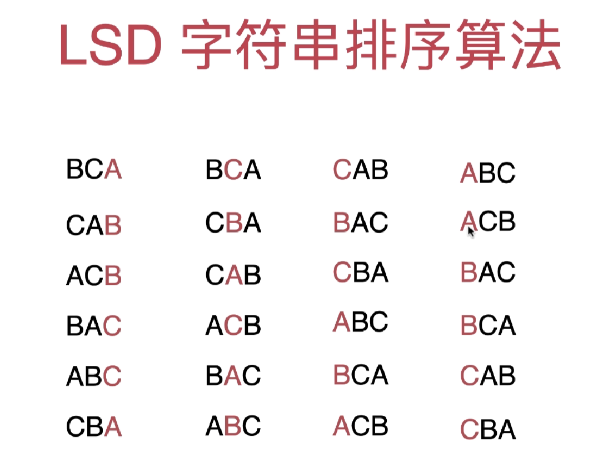

## 实现思路

首先根据最后一位字符进行排序，对于相等的字符，保留原来的相对位置，完成第一轮排序；

第二轮排序是建立在第一轮的顺序排序；

第三轮排序则是建立在第二轮的顺序排序；

以此类推。

每轮排序都保持了相同的性质，即按照这一轮的大小顺序排序，但是对于相同的字符，则是保留上一轮的相对位置。

从最后一个字符到第一个字符，每个字符都按照这样的性质排序，最后既完成了排序又保证了稳定性。

## 特点

LSD 基数排序是稳定的。
