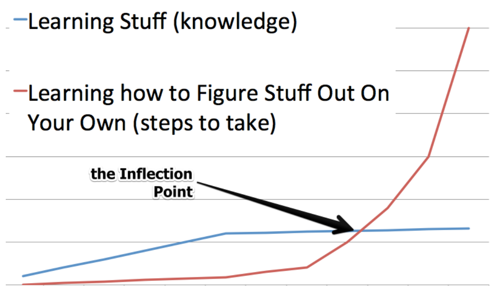
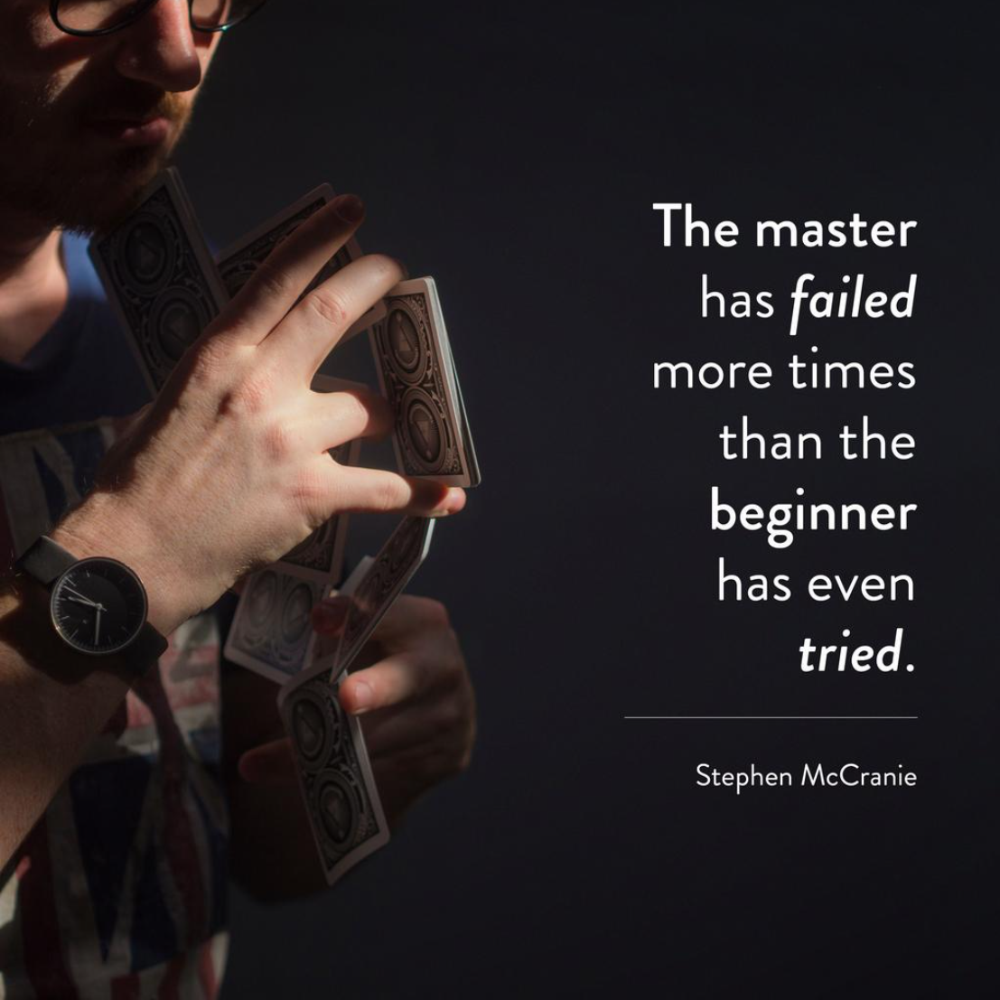

## 前言

工作的这半年，表现一直不是很好，组长推荐了这篇文章给我。我觉得这篇文章确实不错，所以想分享给大家。虽然别人已经翻译过了这篇文章，但是自己还是翻译了一遍，这样映象会更深刻。如果英语还不错，就尽量看英文原文吧。。

## 作者

这篇文章的作者是 `Firehose` 的首席技术官兼联合创始人 Ken Mazaika。此前，他是 WHERE.com（被PayPal收购）的技术主管，也是波士顿PayPal/eBay开发团队的成员。

`Firehose` 是国外的一家培训机构，后文经常出现，在此说明一下。

## 正文

在你学编程的时候，有一瞬间一切都变得不同了。在 `Firehose`，我们习惯称之为*编程的拐点*。这个阶段之后，作为一个开发者，你操作的方式将会大相径庭。（这句话翻译的不太好，先保证连贯性，以后有时间再改）**建立拐点**是在编程的过程中变得独立的过程，直到不需要他人手把手教的境地。这个过程可能会是一段糟糕的经历，但是一旦你过了拐点，它是难以置信地鼓舞人心。

蓝色线条代表学习具体知识的曲线，红色线条代表学习独立解决问题的曲线，两个线条相交的地方就是拐点。

在 `Firehose`，我们的目标不仅仅是教你 `Ruby`、如何构建 `web` 应用，或者如何编写测试。虽然我们确实教你这些技能以及其他的内容，**但是我们主要的目标是加速学生通过拐点，这样他们就能获得解决任何他们遇到的问题的能力**。我们坚信，有能力独自解决问题是一种宝贵的技能，并且这种教学的方式将会把你带到更远的地方而不是简单地学习如何构建一大堆应用。

## 教程阶段(3~8周)

当你刚开始学习编程的时候，有非常多你不知道的信息。这些信息被称为*特定领域的知识*。例如：需要知道在 `ruby` 中如何实现循环，或者如何利用 `Ruby on Rails` 从数据库中获取数据。特定领域的知识是依赖于特定编程环境下的特殊约定。

成为独立开发者的第一步是学会完成特定的任务。通过做特定的任务，将分散的知识点串起来，当你能够精通该项任务的时候，就能形成特定的模式来解决类似的问题。一旦你精通了特定的任务，如何把碎片拼在一起的轮廓将会变得清晰起来。随着不断的练习，你会发现特定的的模式，并且一开始一些迷惑以及陌生的东西最终变得习以为常。

## 对于刚开始的学生，最需要获取的技能是关注细节

当阅读文档或者教程之类的材料时，注重细节是重要的。哪怕是最细微的错别字或者拼写错误，都会导致报错或者出现 `bug`。一开始，看报错是一段沮丧的经历，但它却是在学习过程中至关重要的一步。在这个阶段，处理报错和问题会教你最重要的编程技能之一：面向细节编程。

**`Debug` 报错是非常重要的**。事实上，报错是编程的一部分，它们呈现在菜鸟和大师的面前是一样的，唯一的区别在于，经验越多，根据报错修复 `bug` 所花的时间就越少。原因如下：

- 随着不断地练习，你将会快速地学习如何读报错并且获取与问题有关的细节。一开始你看报错的时候，理解这些报错代表什么含义会花一些时间。但是在看了成百上千条报错后（是的，你将会看数百条的报错），你将能够定位问题所在以及确定解决问题所需的相关详细信息。
- 起初，你可能每看到一个报错都会向他人寻求帮助。随着不断地练习，你将会发现，仔细检查自己的代码和用谷歌搜索问题，可以降低向他人寻求帮助的频率。
  
在教程阶段，你将按部就班按照说明一步一步的做。起初，你会发现很难跟上教程的步伐并且报错时常发生。随着不断地练习，你将会培养 `debug` 以及更加关注小细节的能力，并且进步会越来越来越快。在结束教程阶段时，你会注意到能够以更快的速度编写代码。

在这个点上，有些人感到自信，体现在他们抛弃了之前的训练方式，并在没有系统化指导下开始着手构建一些东西，以及他们很乐意深入探索未知。其他一些学生则是寻找更多的教程，试图从中获取更多特定领域的知识，以达到“完全理解”的境地。不幸的是，教程只能把你带到这里，真正的信心来自于努力解决一个你没有任何思绪的问题，并自己找到解决方案。

## 编程小秘密是

你永远不会知道解决所有问题需要知道的一切。在编程的旅程中，你可能想象自己最终学会了你需要学习的一切并做好了开发的准备。然而，这一刻永远不会发生。

编程需要终身学习。经验丰富的软件工程师努力寻求未解问题的解决方案，因为在这个过程中他们有机会学到更多。如果你发现自己在等待那一刻，你终于觉得你知道了关于编码的一切，你必须清醒地认识到，你等待的这一天将永远不会到来。不要沮丧，相反，这是一件美妙的事情。

**准备好进入编程之旅下一阶段的契机：**

- 你已经看了足够多的报错，并且这些报错再也吓不到你了。相反，你知道如何解码他们代表什么含义并且知道在代码中找到问题所在；
- 你已经精通用谷歌搜索解决方案。当你在新增一个功能或者看到了一个迷惑的报错时，你知道该搜索哪些关键字去找到你需要的信息；
- 你能够重用你其他应用中的某些代码和模式，而不是每次都根据指导手册一步一步操作。

## 拐点阶段（保持良好的心态：2~4周）

拐点阶段是学习编程诸多阶段中最沮丧的阶段之一，但是在某种意义上来说，它又是唯一重要的阶段。拐点出现在当你逐渐停止使用教程，开始独立解决问题的时候。

有时候，你会觉得你还没有准备好应对这个阶段，想回到用确切的大纲来构建东西的时候。不要成为这种心态的牺牲品。之所以有如此强的挫败感，主要是因为：

## 在拐点阶段，你的编码速度是上一个阶段的 1/20 到 1/10

你开始质疑自己，想知道自己能否成为一个程序员。没有安全感、自我怀疑在这个阶段非常普遍。

尽管你觉得学习和做完事情的速度慢了很多，但实际上，你在实现一些最重要的事情。当你在特定领域的知识足够丰富的时候, 你正在学习的一切都是关于程序知识的。

程序知识是在编程路上教会自己未知东西的能力。当你需要实现新的功能时，你应该在谷歌搜索哪些内容？此时此刻，当你有太多的东西想要完成的时候，你会感觉自己在黑暗中。学习如何靠自己在黑暗中找到光是至关重要的，因为你永远不会知道一切，所以你需要有能力教会自己如何解决手头上的问题。

大多数人不会意识到，为了学会编程，你需要学习特定领域的知识和程序知识。

## 在余生中，每天都要尝试走出自己的舒适圈

一些软件工程师一旦立足后，就会留在他们的舒适圈中。这类程序员被称为保守程序员——这不是你应该努力成为的。相反，你应该每天要努力突破自己的极限。程序员离职最常见的原因是因为“这份工作已经没有挑战性了，因为我已经解决了所有有意思的问题”。

你应当寻找超出当前能力范围的问题，而不是在你的舒适区内编程。这也是组建和拓展你技能的唯一方法。

用一位正在经历拐点的 `Firehose` 学员的话说：
> 我感觉我仍然在深渊。我只是更加坦然地接受这是我必须去的地方。

## 在网页开发中，实际上有两个一起出现的拐点

**网页开发拐点**是当你能够构建任何数据库驱动的应用的点。这意味着有能力构建一个多页面的应用。网页开发者称这为“精通 CRUD”。在这个阶段，你应该也能够通过 `Github` 上的文档或者博客集成任何第三方库。

**算法与数据结构拐点**是更深层次的拐点，但是实际上它更重要。克服了这一点的人除了掌握编程的基础知识并具有解决复杂编码挑战的深度知识外，还将掌握他们正在使用的编程语言。

征服了算法和数据结构拐点的人将能够：

- 可以写出排序算法；
- 实现翻转链表；
- 理解和可以利用栈、队列、树写出程序；
- 利用递归或者迭代的方式写出程序。

总之，一旦你通过了这个拐点，你就会掌握数据操作，并将理解你的代码决策对性能的影响。传统的计算机科学学位专注于让学生通过算法和数据结构拐点。许多大学使用业内通常不使用的编程语言来教授这一点，例如 `Scheme`，`Racket` 或 `LISP`。

**在大多数技术面试中，面试官会假设你已经通过了Web开发拐点，因为这更容易做到，并将他们的问题集中在评估你在算法和数据结构方面的技能上**。这些问题通常集中在我们上面提到的话题上：排序算法、反转链表以及使用堆栈、队列和树。

**一旦开发者通过了网页开发拐点和数据结构与算法拐点，他们拿到了编程王国的钥匙。**
这些开发人员将能够解决两者相交的挑战：需要在高级Web应用程序上下文中构建的复杂算法。这是专业网页开发者每天做的事情中的核心。

## 拐点的后果

当你第一次听到拐点最大的后果的时候，可能会觉得有点反直觉。深呼吸：
**当学习编程的时候，从长远来看，特定领域的知识并不重要。**
是的，我并不是在开玩笑，它真的一点都不重要。一旦你通过了拐点，这些概念在一两周，甚至几天的教程学习后，就可以自然而然的转换。

真正重要的是：

- 你已经牢牢掌握了一种网页开发框架；
- 你已牢牢掌握了用任何语言实现复杂的算法。

**招聘经理希望开发人员具有扎实的 Web 开发和算法技能。**

当我在 `PayPal` 工作的时候，我的团队招聘了一个初级 `Rails` 开发者，他没有没有任何 `Rails` 开发经验的经验，但是他已经用 `Python`，`LISP`，`Perl` 写过很多代码。在几天之内，他就造成了很大的影响。几周之内，造成了巨大的影响。他很快就被提拔为技术团队负责人，并且是我参与过的最好的招聘决定之一。

**不要担心技术栈**。很多人会说，“AngularJS 这些天非常火热”，“JavaScript 处于上升的趋势”，或者“现在最流行的是......”我对此的反应是：“那又怎样？”当你正在学习如何学习编程的时候，你唯一的目标应该是找到拐点并且通过它。一旦你这样做了，学习新的、热门的语言将根本不是一项艰巨的任务。

**变得独立**。在没有任何指南的情况下，有能力学习新的编程技能意味着你不再需要等其他人的帮助。这意味着你需要学的大部分内容，你可以在网上查找，并阅读各种各样的材料。

这并不意味着你立刻“知道”了一切，而是仅仅意味着选择一切是“可解决的，”所以本质上，你是不可阻挡的。

## 在拐点阶段，你会培养的技能

作为一个软件开发者，最好的参考材料就是自己之前写过的类似的代码。当真正理解了之前写过的代码，回忆这些代码的细节就不需要花费太多的时间与精力。
当开发一个新功能的时候，需要问自己的第一个问题是：“之前有没有开发过类似的东西”。
如果开发过，就去找到并逐行浏览这段代码。向自己解释这是做什么的，并问自己：“现在能否用相同的方法实现这个功能？”

**视频并不是学习特定领域知识的好材料**，因为需要大量的时间来观看它们。假设你想集成谷歌地图的 `API`，一旦你集成过一次，打开 `GitHub`，复制粘贴代码到新项目所花的时间可能不到一分钟。另一方面，视频通常需要 10-30 分钟才能重新观看。

## 尽可能高效通过拐点的策略

因为在学习编程的过程中通过拐点是最重要的部分，所以你必须让自己尽可能顺利的越过这个阶段。
这意味着你应该在教程阶段就开始准备，并且在这段时间里保持正确的心态。

**在阅读结构化材料的过程中暂停一下，给自己一些挑战**：

- **对于教程中的每一节，尝试做一些教程范围之外的事情**。如果教程中提供了“挑战”或者“自主的”内容，就把它们全部做完。解决没有指导的挑战将会给你重要的，在没有指引的情况下做事情的经历。
- **尝试尽可能地少使用教程**。在 `Firehose`，我们经常引导学生了解如何集成某些 `Gem` 或使用提供的文档执行操作。对学生来说，他们主要根据程序文档操作，教学材料仅作为备查，而不是单纯的依赖教学材料按部就班的学习。**注意，文档会将阅读者视为已经跨越了拐点的开发者**。习惯阅读和跟随 `Github` 上的文档在你一个人的时候将会助你一臂之力。
- 关注本质和重复练习。了解如何执行常见操作，例如从头开始启动应用程序、将新应用程序推送到 `GitHub` 和 `Heroku`，以及尽早构建数据库迁移。

**冲过拐点可能会非常有挑战性**。以下是一些帮助你通过拐点的建议：

- 认识到这是一个困难的过程并且不要给自己太大的压力，设置合理的预期。不要把通过教程阶段的“神级”速度同自己学习东西时的“蜗速”做比较。记住你在学习很多东西，但是在这个阶段，你正在学习一种全新的、独自解决新问题的技能。
- 如果你的自信若有如无，认识到你的感受是完全正常的，并继续前进。如果你还是在苦苦挣扎，就去尝试跟最近通过拐点的人沟通。他们有能力站在你的位置上并向你保证你现在所经历的只是暂时的。**持续学习，但是不要过度**。在这个阶段，认识到你一天最多六个小时可以保持高效学习的状态。在极度疲惫的状态下工作只会延长构建拐点的时间。

在这个阶段获得信心的最好方式是克服你的任何疑虑。你的情绪可能像坐过山车。有时，你会觉得斗志满满，但是在同一个问题上苦苦挣扎了 15 个小时后，感觉相反是很常见的。

不知道某件事是否需要 5 分钟或 5 小时可能会令人沮丧，但每次你完成并成功实现新功能时，这种成功后的喜悦所带来的自信将是你所需要的一切。在没有任何帮助的情况下解决了一些难题后，你会沉迷于在舒适区之外建造东西的感觉。

## 如何知道已经通过了拐点

拐点过程的最后阶段是接受。接受软件开发是一个持续不断学习的过程。接受你已经成功学会一切的感觉仅仅意味着你应该开始考虑解决更复杂的问题。

## 生词

- empowering: Something that is empowering makes you more confident and makes you feel that you are in control of your life;
- dirty (little) secret: Information that is could cause a great deal of harm if revealed or discovered.
- squared away: Being prepared or ready for business or tasks at hand.
- phase out of: To remove someone or something from some status, situation, mode, or role very gradually or in increments. In this usage, a noun or pronoun is used between "phase" and "out of."
- Despite the fact that: A very useful phrase for fluency and articulacy is the fact that. This can be used to add a clause in a sentence where the grammar forces you to use a noun, for example, after linking words such as despite or in spite of, which are both followed by a noun.
- grand scheme: The complete, coherent, long-term scope of something. Typically used in the phrase "in the grand scheme of things."
- in the grand of things: In the long term; in the complete picture of something.
- have a (good/solid/sound/etc.) grasp of/on (something): To have a firm, clear understanding or determination of something.
- Don’t sweat the stack: Don't worry or stress about it.
- set (someone or oneself) up for (something):
- give someone a leg up: If you give a person or an organization a leg up, you do something to help them achieve success.

## 参考

[英文原文](http://blog.thefirehoseproject.com/posts/learn-to-code-and-be-self-reliant/)
[The Key To Accelerating Your Coding Skills 中文翻译](https://www.jianshu.com/p/8806de7a7597)
[打通编程的任督二脉【The Key To Accelerating Your Coding Skills】](https://www.jianshu.com/p/13ce0039a308)
[empowering](https://dictionary.cambridge.org/dictionary/english/empowering)
[broad strokes](https://idioms.thefreedictionary.com/broad+strokes)
[dirty secret](https://idioms.thefreedictionary.com/dirty+secret)
[squared away](https://www.onsecrethunt.com/why-do-people-say-squared-away/)
[phase out of](https://idioms.thefreedictionary.com/phase+out+of#:~:text=phase%20out%20of%20%28something%29%201.%20To%20remove%20someone,pronoun%20is%20used%20between%20%22phase%22%20and%20%22out%20of.%22)
[Despite the fact that](https://www.londonschool.com/blog/despite-the-fact-that/)
[grand scheme](https://idioms.thefreedictionary.com/grand+scheme#:~:text=grand%20scheme%20The%20complete%2C%20coherent%2C%20long-term%20scope%20of,will%20matter%20in%20the%20grand%20scheme%20of%20things.)
[have a (good/solid/sound/etc.) grasp of/on (something)](https://idioms.thefreedictionary.com/have+a+grasp+on#:~:text=have%20a%20%28good%2Fsolid%2Fsound%2Fetc.%29%20grasp%20of%2Fon%20%28something%29%20To%20have,as%20you%27ll%20be%20tested%20on%20it%20next%20week.)
[Don’t sweat the stack.](https://idioms.thefreedictionary.com/don%27t+sweat+it)
[give someone a leg up](https://idioms.thefreedictionary.com/give+someone+a+leg+up#:~:text=give%20%28one%29%20a%20leg%20up%201.%20To%20provide,in%20any%20subject%20they%20are%20having%20difficulty%20with.)
[from scratch](https://www.definitions.net/definition/from%20scratch)