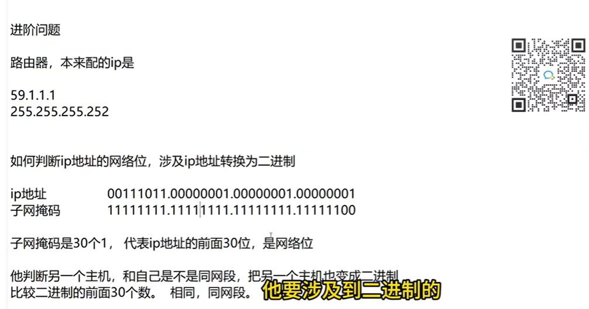

---
aliases:
  - ip
  - 网络
date: 2024-12-17
---

# 什么是 IP

ip 地址就像现实世界中的地址，可以标识网络中的一个节点，数据就是通过它来找到目的地。

标识电脑在网络中的位置

## IP 地址格式

是一个点分十进制表示的，32 位的地址

192.168.10.1 换算成二进制 32 位的二进制

## 子网掩码

确定网络位

身份证号码，如果身份证发到聊天框，可以迅速知道，有没有老乡

身份证前 6 位，代表所在的地区

ip  地址，某些数字，代表这个主机所在的网段，前面的某些数字，叫网络位

两台电脑，通过比较，IP 地址前面的这些数字，是否相同，判断是否同网段

192.168.10.1
255.255.255.0 决定，网络位是 IP 地址前面的哪些数字，进而可以判断，另外一个电脑是否同网段

为什么要知道其他人是否和自己同网段？

## 默认网关

网络设备（路由器、三层交换机、防火墙），用于帮助在不同网段的用户来转发数据

## 实验

- 同网段的主机（设备）怎么配通：用交换机组建一个同网段的局域网，不需要网关用交换机组建一个同网段的局域网，不需要网关
- 不同网段的主机（设备）怎么配通：用路由器，组件一个不同网段的局域网，路由器充当两个网段的网关

## DNS

能通过网址访问目标

# 网卡

- 有线网卡
- 无线网卡

## IP 地址

- IP 地址
- 子网掩码
- 默认网关
- DNS 服务器

# 参考资料

> [!note] 参考资料
> [60分钟彻底搞懂IP地址丨子网掩码丨默认网关丨DNS概念及IP地址实际规划配置案例，作为网络工程师必须要会的基础网络技术！建议收藏吃灰！_哔哩哔哩_bilibili](https://www.bilibili.com/video/BV1EH4y1w7f4/?spm_id_from=333.337.search-card.all.click&vd_source=081641abeed94aff322f0473e2c1773d)