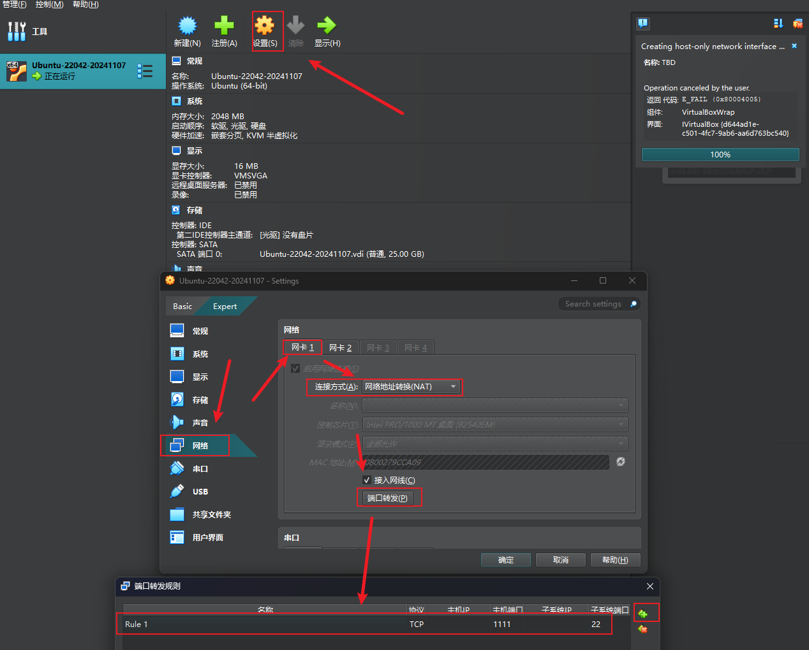

---
aliases:
  - VirtualBox
date: 2024-11-04
---

# 安装 Ubuntu

用户名：Moonshadow
账号：moonshadow2333 （忘记设置的时候不能大写，绷不住了）
密码：qw123456789

## 以 SSH 方式登录 Linux

Powershell 以SSH 方式登录 Linux 系统参考 [Linux——本机终端SSH连接VirtualBox中的Linux虚拟机 - 怪猫佐良 - 博客园](https://www.cnblogs.com/oddcat/articles/9676817.html)

命令行：

```
ssh -l moonshadow2333 -p 1111 127.0.0.1
```

# 安装 Zabbix

`zabbix`是一个基于WEB界面的提供分布式系统监视以及网络监视功能的企业级的开源解决方案。

`zabbix`能监视各种网络参数，保证服务器系统的安全运营；并提供灵活的通知机制以让系统管理员快速定位/解决存在的各种问题。

`zabbix`由2部分构成，`zabbix server`与可选组件`zabbix agent`。

`zabbix server`可以通过`SNMP`，`zabbix agent`，`ping`，端口监视等方法提供对远程服务器/网络状态的监视，数据收集等功能，它可以运行在Linux，Ubuntu，Solaris，HP-UX，AIX，Free BSD，Open BSD，OS X等平台上。

`zabbix agent`需要安装在被监视的目标服务器上，它主要完成对硬件信息或与操作系统有关的内存，CPU等信息的收集。

`zabbix server`可以单独监视远程服务器的服务状态；同时也可以与`zabbix agent`配合，可以轮询`zabbix agent`主动接收监视数据（agent方式），同时还可被动接收`zabbix agent`发送的数据（trapping方式）。  
另外`zabbix server`还支持SNMP (v1,v2)，可以与SNMP软件(例如：net-snmp)等配合使用。

## 官方安装方式

选择 Ubuntu 版本、数据库类型、服务器类型，文档（[Download and install Zabbix 7.0 LTS for Ubuntu 22.04 (Jammy), MySQL, Nginx](https://www.zabbix.com/download?zabbix=7.0&os_distribution=ubuntu&os_version=22.04&components=server_frontend_agent&db=mysql&ws=nginx)）中会自动生成安装 zabbix 的命令行，复制粘贴即可。

```
# systemctl restart zabbix-server zabbix-agent nginx php8.1-fpm  
# systemctl enable zabbix-server zabbix-agent nginx php8.1-fpm
```

## 安装报错

Can't connect to local MySQL server through socket '/var/run/mysqld/mysqld.sock'

>[!note] 参考资料
[亲测有效，解决Can 't connect to local MySQL server through socket '/tmp/mysql.sock '(2) ";_can't connect to local mysql server-CSDN博客](https://blog.csdn.net/hjf161105/article/details/78850658)
[zabbix 与 MySQL 的bug -- Can‘t connect to local MySQL server through socket ‘/tmp/mysql.sock‘_connection to database 'zabbix' failed: [2002] can-CSDN博客](https://blog.csdn.net/qq_65380630/article/details/136586364)
[在Ubuntu上如何检查MySQL是否已安装|极客笔记](https://deepinout.com/mysql/mysql-questions/928_mysql_how_can_i_check_if_mysql_is_installed_on_ubuntu.html)
[ubuntu Failed to start mysql.service: Unit mysql.service not found._mob64ca12f2c96c的技术博客_51CTO博客](https://blog.51cto.com/u_16213441/7129822)
[installation fails: Can't connect to local MySQL server through socket - ZABBIX Forums](https://www.zabbix.com/forum/zabbix-help/426093-installation-fails-can-t-connect-to-local-mysql-server-through-socket)
[04-Ubuntu20.04配置最新的Mysql8.0数据库_哔哩哔哩_bilibili](https://www.bilibili.com/video/BV1DV411P7mz/?spm_id_from=333.337.search-card.all.click&vd_source=081641abeed94aff322f0473e2c1773d)

找了这么多资料，最终还是通过下面的资料解决了问题：

> [!note]
> [installation fails: Can't connect to local MySQL server through socket - ZABBIX Forums](https://www.zabbix.com/forum/zabbix-help/426093-installation-fails-can-t-connect-to-local-mysql-server-through-socket)
> [04-Ubuntu20.04配置最新的Mysql8.0数据库_哔哩哔哩_bilibili](https://www.bilibili.com/video/BV1DV411P7mz/?spm_id_from=333.337.search-card.all.click&vd_source=081641abeed94aff322f0473e2c1773d)
> [MySQL auth_socket 验证插件的工作原理 - the_blog - SegmentFault 思否](https://segmentfault.com/a/1190000039860881)
> [【究极详细版】Ubuntu安装配置MySQL_ubuntu配置mysql-CSDN博客](https://blog.csdn.net/LogosTR_/article/details/125602116)

dpkg -l | grep mysql-server

MySQL 用户和密码

用户名：root
密码：qw123456789

zabbix@localhost
password

| user             | password    |
| ---------------- | ----------- |
| root             | qw123456789 |
| zabbix@localhost | password            |


---

大致整理一下解决这个问题的流程：

1. 在这个 [installation fails: Can't connect to local MySQL server through socket - ZABBIX Forums](https://www.zabbix.com/forum/zabbix-help/426093-installation-fails-can-t-connect-to-local-mysql-server-through-socket)  帖子中找到了问题的关键：

> Please install MySQL server. If you use the official Zabbix package, you may use a remote MySQL server, so the MySQL server will not be installed locally automatically.

在官方的 Zabbix 包中，使用的时远程的 MySQL 服务器，所以需要在本地手动安装 MySQL 服务器。

2. 随后在 B 站上找了一个在 Ubuntu 上安装 MySQL 的教程视频（还好先看了这个视频，不然后续安装完登录时不知道咋搞，不知道 root 的密码，或者说根本就不可能知道）

2.1 安装 MySQL 的命令：

```Linux
sudo apt update # 更新软件包列表索引
sudo apt install mysql-server # 安装 MySQL
mysql --version # 查看 MySQL 版本
service mysql status # 查看服务状态
```
2.2 检查服务 OK 后，登录 MySQL，配置 MySQL 密码
MySQL 默认给我们创建了一个用户以及分配了一个随机密码，那么该如何找到这个随机密码呢，使用：

```Linux
sudo cat /etc/mysql/debian.cnf
mysql -u debian-sys-maint -p
```

查看 root  用户授权方式

```mysql
select user,plugin from user;
```

默认是 auth_socket 验证（需后续探索一下）

将授权方式改为 mysql_native_password，刷新权限，并且修改 root 用户密码

```mysql
update user set plugin='mysql_native_password' where user='root';
flush privileges;
alter user 'root'@'localhost' identified by 'qw123456789';
exit
mysql -u root -p
```


Ubuntu 查看已安装的软件包

```
dpkg --list
```

登录成功说明问题已解决

# 虚拟机下访问 Zabbix

[虚拟机下zabbix如何访问 | PingCode智库](https://docs.pingcode.com/baike/2768688)
[VirtualBox配置双网卡实现宿主机和虚拟机相互访问及网络互通 - 知乎](https://zhuanlan.zhihu.com/p/458822186)
[virtualBox虚拟机之间网络互通设置_虚拟机怎么改通用-CSDN博客](https://blog.csdn.net/corner2030/article/details/127926454)

## 虚拟机和宿主机网络互通

在解决完 MySQL 安装的问题之后，按照文档，开启了对应的服务：

```
systemctl restart zabbix-server zabbix-agent nginx php8.1-fpm  
systemctl enable zabbix-server zabbix-agent nginx php8.1-fpm
```

接下了就遇到了一个新的难题，即宿主机该如何访问虚拟机中的服务，经过了一上午的折腾之后，总算 ping 通了虚拟机中服务器的 IP。

这个问题其实是配置网卡的问题。

Virtualbox 的网卡类型有三种（[虚拟机的网络设置_哔哩哔哩_bilibili](https://www.bilibili.com/video/BV1vi421k7JZ?spm_id_from=333.788.recommend_more_video.-1&vd_source=081641abeed94aff322f0473e2c1773d)）：


| 网络模式         | NAT            | 桥接网络 | 仅主机 |
| ---------------- | -------------- | -------- | ------ |
| 虚拟机 -> 宿主机 | 是             | 是       | 否     |
| 宿主机 -> 虚拟机 | 否（端口转发） | 是       | 是     |
| 虚拟机 -> 虚拟机 | 否             | 是       | 是     |
| 虚拟机 -> 互联网 | 是             | 是       | 否       |

一开始为了使用 SSH 连接虚拟机，设置了 NAT 模式以及端口转发，但是这种模式只能让虚拟机访问宿主机和互联网，主机无法访问虚拟机，也就无法访问虚拟机中 zabbix。

搞清楚这个原因之后，于是就去网上搜索配置网卡的内容。最早是想把虚拟机的网络类型配置为桥接网络，从上表也可以看出桥接网络的适配性是最强的，但是后面没配成功，反而导致了 SSH 连不上虚拟机，以及在虚拟机中 ping 不通宿主机的问题。

最终还是决定配置双网卡来解决这个问题，即使用 NAT + Host-only 模式（仅主机），按照 [VirtualBox配置双网卡实现宿主机和虚拟机相互访问及网络互通 - 知乎](https://zhuanlan.zhihu.com/p/458822186) 以及 [记VirtualBox+Ubuntu20.4网络配置（网络互通） -\ _天青色烟雨 - 博客园](https://www.cnblogs.com/azure-rain/p/17674917.html) 这两篇文章的指引，成功地实现了虚拟机和宿主机互通：

- 配置前先关机


- 设置网卡 1 为 NAT 模式：



- 设置网卡 2 为 Host-Only 模式


- 运行虚拟机
- 使用 ip addr 查看所有网卡（不管有没有在使用）


- 配置 Host-Only 网卡

```vim
sudo vim /etc/netplan/50-cloud-init.yaml
```

修改配置文件

```yaml
network:
    ethernets:
        # NAT
        enp0s3:
            dhcp4: true
        # Host-only
        enp0s8:
            dhcp4: false
            addresses: [192.168.56.101/24]
    version: 2
```

执行以下命令使配置文件生效：

```text
 sudo netplan generate
 sudo netplan apply
```

在执行 `sudo netplan apply` 时报错：

```
WARNING:root:Cannot call Open sSwitch: ovsdb-server service is not running
```

在这篇 [【ubuntu-22.04】系统配置之 netplan 网络配置_netplan routes-CSDN博客](https://blog.csdn.net/u014163493/article/details/136381786) 博客中提到，虽然报错了，但是网络配置已经成功且生效，所以作者并未去处理这个问题。

我在宿主机中试了一下，确实生效了，已经可以成功 ping 通虚拟机，大功告成！

### 文件备份

```yaml
network:
    ethernets:
        enp0s3:
            dhcp4: true
    version: 2
```

# 启动 Zabbix 项目

[十、nginx+zabbix（入门）_zabbix nginx-CSDN博客](https://blog.csdn.net/Anthonyyyy/article/details/123448458)
[zabbix_4.0部署篇之使用nginx实现web前端-阿里云开发者社区](https://developer.aliyun.com/article/1095950)


## Nginx 以及 Zabbix 课程

[04.静态站点部署_哔哩哔哩_bilibili](https://www.bilibili.com/video/BV1mz4y1n7PQ?spm_id_from=333.788.player.switch&vd_source=081641abeed94aff322f0473e2c1773d&p=4)
[5.2.京峰教育Linux云计算之zabbix监控(二)_哔哩哔哩_bilibili](https://www.bilibili.com/video/BV1NL4y1z7hz?spm_id_from=333.788.videopod.episodes&vd_source=081641abeed94aff322f0473e2c1773d&p=2)


```
/etc/nginx/nginx.conf
/etc/zabbix/nginx.conf
```

查看 nginx 版本信息 `nginx -V`

```
nginx version: nginx/1.18.0 (Ubuntu)
built with OpenSSL 3.0.2 15 Mar 2022
TLS SNI support enabled
configure arguments: --with-cc-opt='-g -O2 -ffile-prefix-map=/build/nginx-dSlJVq/nginx-1.18.0=. -flto=auto -ffat-lto-objects -flto=auto -ffat-lto-objects -fstack-protector-strong -Wformat -Werror=format-security -fPIC -Wdate-time -D_FORTIFY_SOURCE=2' --with-ld-opt='-Wl,-Bsymbolic-functions -flto=auto -ffat-lto-objects -flto=auto -Wl,-z,relro -Wl,-z,now -fPIC' --prefix=/usr/share/nginx --conf-path=/etc/nginx/nginx.conf --http-log-path=/var/log/nginx/access.log --error-log-path=/var/log/nginx/error.log --lock-path=/var/lock/nginx.lock --pid-path=/run/nginx.pid --modules-path=/usr/lib/nginx/modules --http-client-body-temp-path=/var/lib/nginx/body --http-fastcgi-temp-path=/var/lib/nginx/fastcgi --http-proxy-temp-path=/var/lib/nginx/proxy --http-scgi-temp-path=/var/lib/nginx/scgi --http-uwsgi-temp-path=/var/lib/nginx/uwsgi --with-compat --with-debug --with-pcre-jit --with-http_ssl_module --with-http_stub_status_module --with-http_realip_module --with-http_auth_request_module --with-http_v2_module --with-http_dav_module --with-http_slice_module --with-threads --add-dynamic-module=/build/nginx-dSlJVq/nginx-1.18.0/debian/modules/http-geoip2 --with-http_addition_module --with-http_gunzip_module --with-http_gzip_static_module --with-http_sub_module
moonshadow2333@mylinux:/etc/nginx$ cd /usr/share/nginx
```

- config 位置：`--conf-path=/etc/nginx/nginx.conf`
- 默认 HTML 页面 `--prefix=/usr/share/nginx`

Nginx服务器，修改html 文件后页面不更新生效

## 问题记录 

```
[Installation](http://192.168.56.101:8080/setup.php)
```

20241110 今天上午其实已经解决了[[00安装与配置#虚拟机和宿主机网络互通|宿主机访问虚拟机的问题]]，但是我不知道该如何启动 zabbix 项目或者说打开 zabbix 的后台。我在浏览器中访问 192.168.56.101 这个 IP，页面上显示的是 Nginx 的欢迎页，在网上找了很多资料，但是并没有类似问题的答案。

怎么办呢，只能扩大范围，从如何启动 zabbix 服务到，如何启动一个 PHP 项目：

后面了解到只要启动了 PHP 服务、Nginx 服务，基本上都没问题。问题肯定不在 PHP 服务，那么问题只能是出在 Nginx 服务上。

后面找了 [04.静态站点部署_哔哩哔哩_bilibili](https://www.bilibili.com/video/BV1mz4y1n7PQ?spm_id_from=333.788.player.switch&vd_source=081641abeed94aff322f0473e2c1773d&p=4) 课程，在修改配置文件时，发现怎么刷新页面都不变，于是打开网络检查，才发现如果只输入 `192.168.56.101`，默认访问的是 80 端口的服务，随后我在 IP 后面加上 8080 端口后就有 zabbix 后台的页面了。

后面按照 [十、nginx+zabbix（入门）_zabbix nginx-CSDN博客](https://blog.csdn.net/Anthonyyyy/article/details/123448458) 这篇博客，成功登录了后台，大功告成！

折腾了两天总算把 zabbix 安装好并成功运行，不容易啊，之前也没在服务器上折腾过项目，所以磕磕绊绊，但好在功夫不负有心人，总算搞定了，接下来就是学习怎么用这个 zabbix，万里长城迈出了第一步！

# 参考资料

> [!note] 参考资料
> [超详细VirtualBox7安装教程，安装在D盘步骤，以及报错：Invalid installation directory解决办法-CSDN博客](https://blog.csdn.net/qiujicai/article/details/139854495)
> [一网打尽，一文讲通虚拟机VirtualBox及Linux使用 - 知乎](https://zhuanlan.zhihu.com/p/344198263)
> [再议 VirtualBox 与 VMware 对比，VirtualBox 没有你想的那么不堪](https://dev.leiyanhui.com/c/vm-platform-selection/) 选 VB 还是 VM？
> [【 Powershell中以SSH方式登录 Linux 系统】\_powershell ssh到linux-CSDN博客](https://blog.csdn.net/yushengheni/article/details/125503909)
> [Linux——本机终端SSH连接VirtualBox中的Linux虚拟机 - 怪猫佐良 - 博客园](https://www.cnblogs.com/oddcat/articles/9676817.html)
> [zabbix介绍和服务端部署+web界面安装 - 我爱吃芹菜~ - 博客园](https://www.cnblogs.com/leixixi/p/14630300.html)