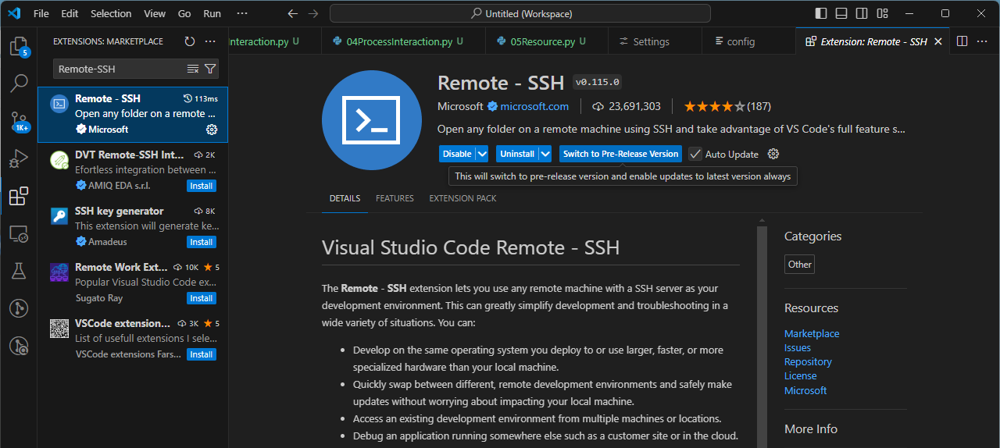
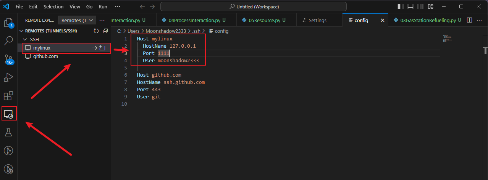
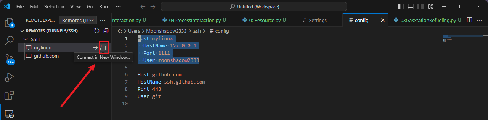
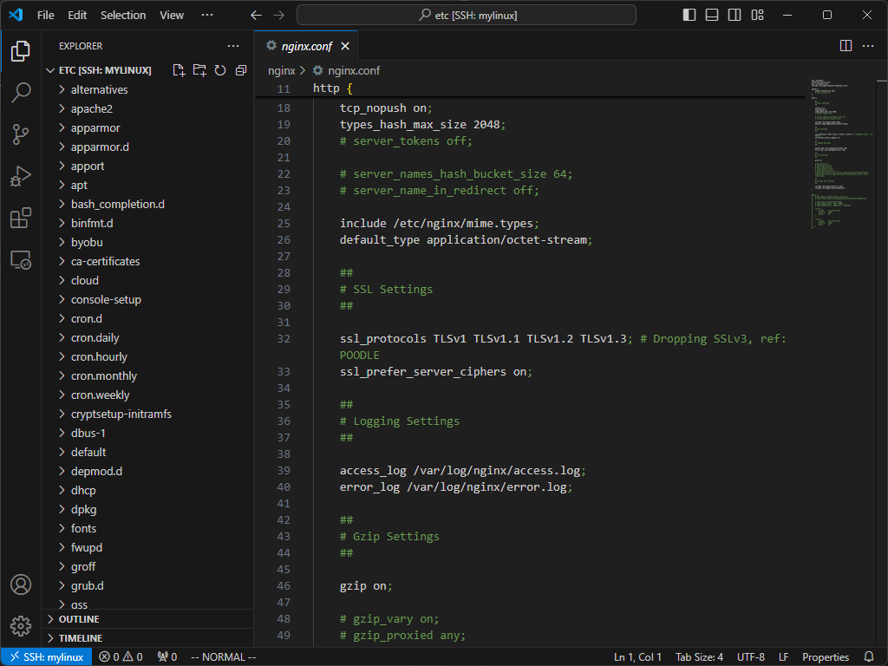

---
aliases:
  - Vscode
  - 远程连接
  - Ubuntu
date: 2024-11-12
---

# 安装插件

在 Vscode 中安装 Remote-SSH 插件



# 配置 config

成功安装插件之后，左边栏上会有一个电脑的图标，点击图标，会出现 SSH 的栏位，点击加号添加远程连接的配置：



这里需要注意的是，host 和 User 需要和 Ubuntu 中的一一对应，即要和 moonshadow2333@mylinux 一一对应：

```
Host mylinux

  HostName 127.0.0.1

  Port 1111

  User moonshadow2333
```

其次 HostName 和端口与设置的[[00安装与配置#虚拟机和宿主机网络互通|网卡]]有关。

隐约觉得这个配置最终组装成的命令行就是：

```
ssh -l moonshadow2333 -p 1111 127.0.0.1
```

# 使用



# 成功




# 参考资料

> [!note] 参考资料
> [VS Code通过SSH连接Ubuntu进行远程开发，让老电脑起死回生，在局域网中做代码服务器_哔哩哔哩_bilibili](https://www.bilibili.com/video/BV15D4y177Ko/?spm_id_from=333.337.search-card.all.click&vd_source=081641abeed94aff322f0473e2c1773d)