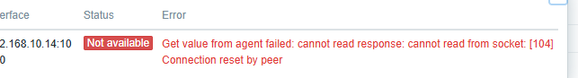

---
aliases:
  - Linux
  - 命令
date: 2024-11-12
---

# 服务

查看服务端口号

[Ubuntu 查看服务及其对应的端口号_乌班图 查看端口 所在服务-CSDN博客](https://blog.csdn.net/noricky/article/details/80032180)

```
sudo netstat -ap | grep zabbix_agent
```

查看服务是否启动

```
systemctl status zabbix-agent
```

# 查看端口号

```
netstat -tuln
```

# windows 系统安装 zabbix-agent 与配置

默认安装路径：`C:\Program Files\Zabbix Agent`

[Zabbix监控配置（二）——监控Windows主机_zabbix 监控win2012主机-CSDN博客](https://blog.csdn.net/xiaochenwj1995/article/details/103424052)

查看服务是否开启：

```
netstat -ano | findstr 10050
```

## 启动或关闭 zabbix_agentd 服务报错

提示：

```
zabbix_agentd.exe [21584]: ERROR: cannot connect to Service Manage
```

[zabbix 启动报cannot connect to Service Manager: [0x00000005]解决方法-CSDN博客](https://blog.csdn.net/u014609263/article/details/98873077)

权限不足，打开 CMD 时应该以管理员的身份运行

## zabbix-server 报错

在 windows 配置好 zabbix agent 之后，报错：



```
 zabbix Get value from agent failed: cannot read from socket: [104] Connection reset by peer
```

在这篇 [zabbix Get value from agent failed: cannot read from socket: [104] Connection reset by peer_get value from agent failed: cannot read response:-CSDN博客](https://blog.csdn.net/ethnicitybeta/article/details/131728390) 博客中了解到可以在 `C:\Program Files\Zabbix Agent\zabbix_agentd.log` 文件中查看具体的报错内容：

```
 10040:20241113:222117.020 failed to accept an incoming connection: connection from "192.168.10.14" rejected, allowed hosts: "192.168.56.101"
```

- from "192.168.10.14" rejected
- allowed hosts: "192.168.56.101"

我以为虚拟机的 IP 是 192.168.56.101，所以 server IP 配置的就是 192.168.56.101，实际上还是本机的 IP 192.168.10.14，修改 zabbix_agentd.conf 配置文件：

```
### Option: Server
#	List of comma delimited IP addresses, optionally in CIDR notation, or DNS names of Zabbix servers and Zabbix proxies.
#	Incoming connections will be accepted only from the hosts listed here.
#	If IPv6 support is enabled then '127.0.0.1', '::127.0.0.1', '::ffff:127.0.0.1' are treated equally and '::/0' will allow any IPv4 or IPv6 address.
#	'0.0.0.0/0' can be used to allow any IPv4 address.
#	Example: Server=127.0.0.1,192.168.1.0/24,::1,2001:db8::/32,zabbix.domain
#
# Mandatory: yes, if StartAgents is not explicitly set to 0
# Default:
# Server=

Server=192.168.10.14
```

重新启动 zabbix_agentd.exe：

```
zabbix_agentd.exe --stop
zabbix_agentd.exe --start
netstat -ano | findstr 10050
```

注意：打开 CMD 时需要以管理员的身份运行。

# 无法连接 10051

```
 Unable to connect to [127.0.0.1]:10051 [cannot connect to [[127.0.0.1]:10051]: connection error (POLLERR)]
```

离谱，发现虚拟机无法 Ping 通宿主机，遂重启，重启之后就 OK 了。

也不知道为什么突然就 ping 不通了！