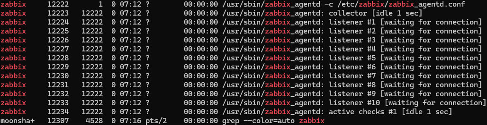
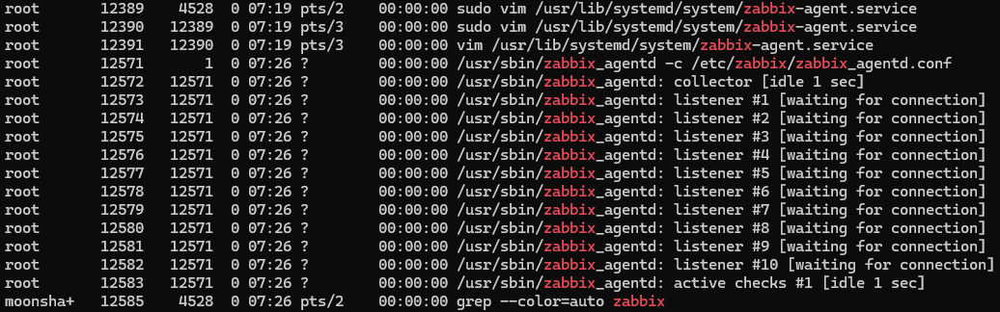

---
aliases:
  - zabbix
date: 2024-11-21
---

# 修改配置

Linux 系统中的 config 和 Windows 中的一致，区别在于位置不同，Linux 系统中 zabbix-agent 配置的文件路径：

```
/etc/zabbix/zabbix_agentd.conf
```

将 UnsafeUserParameters 前面的注释删掉，并且将其值设置为 1：

```
UnsafeUserParameters=1 #默认为 0
```

# 新增自定义配置文件

## 新增文件的指令

```
touch filename.extention
```

> [!note] 参考资料
> [Ubuntu新用户必看：轻松上手，高效创建与管理文件夹指南 - 云原生实践](https://www.oryoy.com/news/ubuntu-xin-yong-hu-bi-kan-qing-song-shang-shou-gao-xiao-chuang-jian-yu-guan-li-wen-jian-jia-zhi-nan.html)

## 新增自定义配置文件

```
/etc/zabbix/zabbix_agentd.d/dir_size.conf
```

值具体如下：

```
UserParameter=dir.size,/home/moonshadow2333/testDir/dir_size.sh
find /home/moonshadow2333/testDir -type f -print | wc -l
```

## 新增统计目录大小脚本

新增 dir_size.sh 的脚本，具体路径如下所示：

```
/home/moonshadow2333/testDir/dir_size.sh
```

脚本如下：

```
#!/bin/bash

du -m /home/moonshadow2333/testDir | tail -n 1 | awk '{print $1}'
```

测试执行脚本，在 testDir 目录下：

```
sh dir_size.sh
```

> [!note] 参考资料
> [执行.sh文件（shell脚本）的几种方式_执行sh-CSDN博客](https://blog.csdn.net/admin123404/article/details/115707774)

## 重启 zabbix-agent

```
sudo systemctl restart zabbix-agent
```

## 加权

zabbix 是普通用户，无权限访问

>[!note] 参考资料
>[Linux chmod 命令 | 菜鸟教程](https://www.runoob.com/linux/linux-comm-chmod.html)
>[脚本执行权限——chmod +x、chmod -x-CSDN博客](https://blog.csdn.net/thlzjfefe/article/details/135065242)
>[文件夹修改777权限之后还是出现permission denied - Ubuntu中文论坛](https://forum.ubuntu.com.cn/viewtopic.php?t=467805)

## 测试

执行命令行：

```
zabbix_get -s 192.168.56.101 -k dir.size
```

### 提示 Permission denied

执行上面的命令行后提示 Permission denied：

```
sh: 1: /home/moonshadow2333/testDir/dir_size.sh: Permission denied
```

这个和文件的访问权限有关，随后我修改了这个文件的权限：

```
chmod o+x /home/moonshadow2333/testDir
-rwxrwxr-x 1 moonshadow2333 moonshadow2333 155 Nov 24 02:11 dir_size.sh
```

还是报相同的错误，于是我就思考能不能记录这个文件的访问记录，看看是 zabbix_get 这条命令行是以哪个用户身份去访问的，于是就了解到了 auditd 这个包可以实现这个功能。

> [!note] 参考资料
> [ubuntu20.04 Auditd使用教程（监控所有用户命令输入记录，包括常用命令、运行脚本、pip安装、apt安装等）（操作监控、输入监控、命令监控、操作日志、命令日志、history命令）失败了_ubuntu auditd-CSDN博客](https://blog.csdn.net/Dontla/article/details/135076915)
> [使用auditd监控Linux文件访问 - IT Coding Man](https://www.itcodingman.com/auditd_monitor_file_access/)
> [[步骤] 文件或目录的监控 （audit 版） – Eternal Center](https://eternalcenter.com/monitor-directory-file-audit/)
> [使用audit工具常规命令监控系统访问文件 - 简书](https://www.jianshu.com/p/d6b7547682cd)重要

### auditd 的安装与使用

#### 安装命令行

```
sudo apt-get update
sudo apt-get install auditd audispd-plugins
```

#### 配置 auditd

```
sudo vim /etc/audit/auditd.conf
```

修改配置后重启服务：

```
sudo systemctl restart auditd
```

#### 监控某个文件

```
-a exit,always -S unlink -S unlinkat -S rmdir -S rename -S renameat -F path=/home/moonshadow2333/testDir/dir_size.sh
```

- auditctl工具添加规则  
    auditctl添加的规则每次audit服务重启后就消失了。

```cpp
auditctl -l //查看当前生效的audit规则
auditctl -w /home/moonshadow2333/testDir -p wxra // 参数-w对某个文件、目录进行监控，-p后面跟着是规则 w 写入 r 读 x 执行 a修改属性
auditctl -W /home/moonshadow2333/testDir //参数-W对某个文件、目录取消监控
```

zabbix_get -s 192.168.56.101 -k dir.size
zabbix_get -s 192.168.56.101 -k system.cpu.util

- ausearch 查找规则监控的结果  
    正常情况下audit启动后会出现大量的监控日志，可以使用ausearch 对日志进行过滤只显示感兴趣的项目

tail /var/log/audit/audit.log

ausearch -f dir_size.sh

[Zabbix-解决agent执行脚本，提示“权限不够”问题_zabbix agent 以一种访问权限不允许的方式访问套接字的程序-CSDN博客](https://blog.csdn.net/weixin_39027047/article/details/120562770)

```
sudo systemctl stop zabbix-agent
sudo systemctl start zabbix-agent
```


### 问题解决

> [!note] 参考资料
> [项目采坑日志——zabbix agent执行脚本，提示 Permission denied_zabbix permission denied-CSDN博客](https://blog.csdn.net/wangwei021933/article/details/126970105)

最终通过搜索 `zabbix permission denied` 关键字，找到了 `[项目采坑日志——zabbix agent执行脚本，提示 Permission denied_zabbix permission denied-CSDN博客](https://blog.csdn.net/wangwei021933/article/details/126970105)` 这篇博客，按照博客中提到的方法解决了这个问题。

#### 问题分析

字面意思是执行这个脚本没有权限。

我们知道 zabbix 服务端通过使用客户端的 zabbix agent 完成监控。

提示 Permission denied，基本上可以认为 agent 没有相应的权限执行 `.sh` 脚本。

#### 解决方法

1. 查看 agent 端 zabbix 服务的权限，如果不是 root 则需要将其提升至 root 权限；
2. 修改 agent 配置文件，修改 AllowRoot=1；
3. 修改 agent.service 配置文件中用户的值，将其改为 root。

##### 查看权限

```
ps -ef | grep zabbix
```



可以看到都是 zabbix 用户的权限。

##### 修改 zabbx_agentd.conf

默认的路径：`/etc/zabbix/zabbix_agentd.conf`，只要将默认的 [[config]] 中的 AllowRoot 的值修改为 1 即可，如下所示：

```
### Option: AllowRoot
#       Allow the agent to run as 'root'. If disabled and the agent is started by 'root', the agent
#       will try to switch to the user specified by the User configuration option instead.
#       Has no effect if started under a regular user.
#       0 - do not allow
#       1 - allow
#
# Mandatory: no
# Default:
AllowRoot=1
```

##### 修改 zabbix-agent.service

默认的路径：`/usr/lib/systemd/system/zabbix-agent.service`。

默认的配置文件如下：

```config
[Unit]
Description=Zabbix Agent
After=syslog.target
After=network.target

[Service]
Environment="CONFFILE=/etc/zabbix/zabbix_agentd.conf"
EnvironmentFile=-/etc/default/zabbix-agent
Type=forking
Restart=on-failure
PIDFile=/run/zabbix/zabbix_agentd.pid
KillMode=control-group
ExecStart=/usr/sbin/zabbix_agentd -c $CONFFILE
ExecStop=/bin/sh -c '[ -n "$1" ] && kill -s TERM "$1"' -- "$MAINPID"
RestartSec=10s
User=zabbix
Group=zabbix

[Install]
WantedBy=multi-user.target
```

只要将 `User` 和 `Group` 的值修改为 root 即可：

```
...
User=root
Group=root
...
```

##### 重启 zabbix_agent.service

```
sudo systemctl restart zabbix-agent.service
```

报错：

```
Warning: The unit file, source configuration file or drop-ins of zabbix-agent.service changed on disk. Run 'systemctl daemon-reload' to reload units.
moonshadow2333@mylinux:/usr/lib/systemd/system$ systemctl daemon-reload
```

执行报错中提示的命令：

```
sudo systemctl daemon-reload
```

再次查看权限：

```
ps -ef | grep zabbix
```



最后再执行测试脚本：

```
zabbix_get -s 192.168.56.101 -k dir.size
```

返回 `2333`，OK 成功！