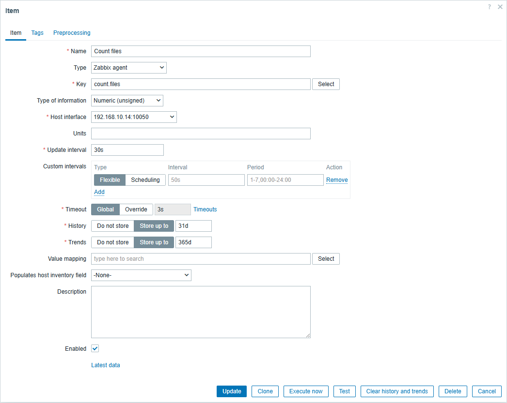

---
aliases:
  - zabbix
  - zabbix_agent
  - agent
  - 监控
date: 2024-11-19
---

# windows 系统安装 zabbix-agent 与配置

Windows 安装 zabbix-agent 方法参考 [Zabbix监控配置（二）——监控Windows主机_zabbix 监控win2012主机-CSDN博客](https://blog.csdn.net/xiaochenwj1995/article/details/103424052) 这篇博客。

## 默认安装路径

默认安装路径：`C:\Program Files\Zabbix Agent`

## 启动与停止

以管理员身份运行 CMD

```
cd C:\Program Files\Zabbix Agent
zabbix_agentd.exe --start
zabbix_agentd.exe --stop
```

> [!note] 参考资料
> [在Windows上启动ZabbixAgent_windows 重启 zabbix agent-CSDN博客](https://blog.csdn.net/weixin_29477879/article/details/52183631)

## 查看服务是否开启：

```
netstat -ano | findstr 10050
```

## 问题记录

### 启动或关闭 zabbix_agentd 服务报错

提示：

```
zabbix_agentd.exe [21584]: ERROR: cannot connect to Service Manage
```

[zabbix 启动报cannot connect to Service Manager: [0x00000005]解决方法-CSDN博客](https://blog.csdn.net/u014609263/article/details/98873077)

权限不足，打开 CMD 时应该以管理员的身份运行

### zabbix-server 报错

在 windows 配置好 zabbix agent 之后，报错：


```
 zabbix Get value from agent failed: cannot read from socket: [104] Connection reset by peer
```

在这篇 [zabbix Get value from agent failed: cannot read from socket: [104] Connection reset by peer_get value from agent failed: cannot read response:-CSDN博客](https://blog.csdn.net/ethnicitybeta/article/details/131728390) 博客中了解到可以在 `C:\Program Files\Zabbix Agent\zabbix_agentd.log` 文件中查看具体的报错内容：

```
 10040:20241113:222117.020 failed to accept an incoming connection: connection from "192.168.10.14" rejected, allowed hosts: "192.168.56.101"
```

- from "192.168.10.14" rejected
- allowed hosts: "192.168.56.101"

我以为虚拟机的 IP 是 192.168.56.101，所以 server IP 配置的就是 192.168.56.101，实际上还是本机的 IP 192.168.10.14，修改 zabbix_agentd.conf 配置文件：

```
### Option: Server
#	List of comma delimited IP addresses, optionally in CIDR notation, or DNS names of Zabbix servers and Zabbix proxies.
#	Incoming connections will be accepted only from the hosts listed here.
#	If IPv6 support is enabled then '127.0.0.1', '::127.0.0.1', '::ffff:127.0.0.1' are treated equally and '::/0' will allow any IPv4 or IPv6 address.
#	'0.0.0.0/0' can be used to allow any IPv4 address.
#	Example: Server=127.0.0.1,192.168.1.0/24,::1,2001:db8::/32,zabbix.domain
#
# Mandatory: yes, if StartAgents is not explicitly set to 0
# Default:
# Server=

Server=192.168.10.14
```

重新启动 zabbix_agentd.exe：

```
zabbix_agentd.exe --stop
zabbix_agentd.exe --start
netstat -ano | findstr 10050
```

注意：打开 CMD 时需要以管理员的身份运行。

### 无法连接 10051

```
 Unable to connect to [127.0.0.1]:10051 [cannot connect to [[127.0.0.1]:10051]: connection error (POLLERR)]
```

离谱，发现虚拟机无法 Ping 通宿主机，遂重启，重启之后就 OK 了。

也不知道为什么突然就 ping 不通了！

#  监控指定目录下文件数量

## 自定义监控参数

修改[[config|配置文件]]：

```
UnsafeUserParameters=1 #默认为 0
```

## 添加自定义监控参数

以统计 txt 文件数量为例，且不递归统计：

```
UserParameter=count.files,dir "D:/00Apps/13Zabbix/ZabbixTest" | find /C ".txt"
```

这行代码应该放在哪？

[[config|默认配置文件]]中有一个 Include 的配置：

```
### Option: Include
#	You may include individual files in the configuration file.
#
# Mandatory: no
# Default:
# Include=
Include=C:\Program Files\Zabbix Agent\zabbix_agentd.d\

# Include=c:\zabbix\zabbix_agentd.userparams.conf
# Include=c:\zabbix\zabbix_agentd.conf.d\
# Include=c:\zabbix\zabbix_agentd.conf.d\*.conf
```

在配置文件中包含单独的文件，可以把自定义的配置独立出来，上面的这行代码就放在 `C:\Program Files\Zabbix Agent\zabbix_agentd.d\myconf.conf` 文件中。

> [!note] 参考资料
> [使用cmd或PowerShell计算文件夹中的文件数量 - 花开富贵。 - 博客园](https://www.cnblogs.com/yy0901/p/18103960)

## 配置监控项及触发器

> [!note] 参考资料
> [zabbix自定义脚本监测windows服务器指定目录下文件数量，并设置告警及图形_zabbix自定义监控windows文件夹每日新增文件数量-CSDN博客](https://blog.csdn.net/PlatoWG/article/details/84629352)

### 检查是否可以获取数据

```
zabbix_get -s 192.168.10.14 -k count.files
```

#### 提示 zabbix_get not found

```
Command 'zabbix_get' not found, but can be installed with:
sudo apt install zabbix-proxy-mysql    # version 1:5.0.17+dfsg-1, or
sudo apt install zabbix-proxy-pgsql    # version 1:5.0.17+dfsg-1
sudo apt install zabbix-proxy-sqlite3  # version 1:5.0.17+dfsg-1
sudo apt install zabbix-server-mysql   # version 1:5.0.17+dfsg-1
sudo apt install zabbix-server-pgsql   # version 1:5.0.17+dfsg-1
```

#### 安装 zabbix-get

```
sudo apt install zabbix-get
```

> [!note] 参考资料
> [Ubuntu 安装 zabbix-get，Command 'zabbix_get' not found 解决办法 - 简书](https://www.jianshu.com/p/73111feaa488)

#### ZBX_NOTSUPPORTED

再次执行，提示：

```
ZBX_NOTSUPPORTED: Unsupported item key.
```

修改后需要重启

### 增加监控项



### 增加触发器

5 分钟内文件数量超过 4 则告警，告警发出后，1 分钟内检测到文件恢复至 3 则恢复告警

```
{V-LGDZSRV-GA01:count.files.max(5m)}>4
{V-LGDZSRV-GA01:count.files.min(1m)}=4
```